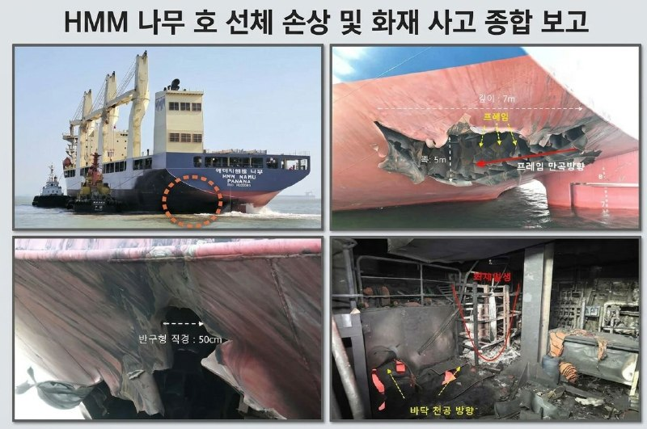
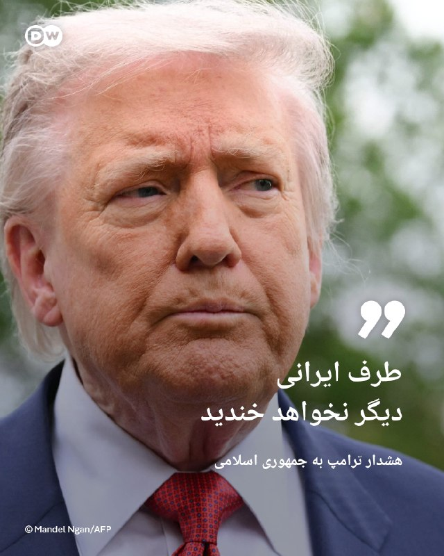
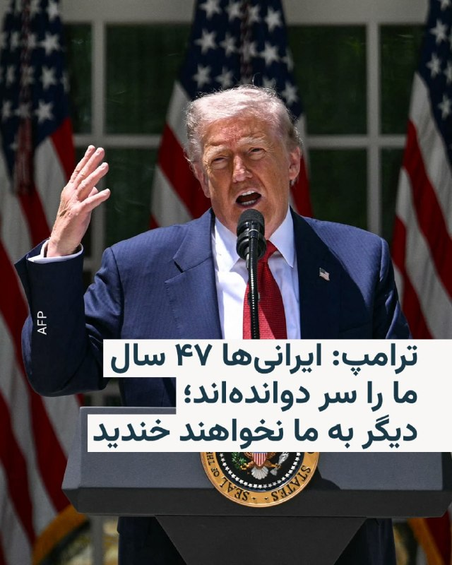
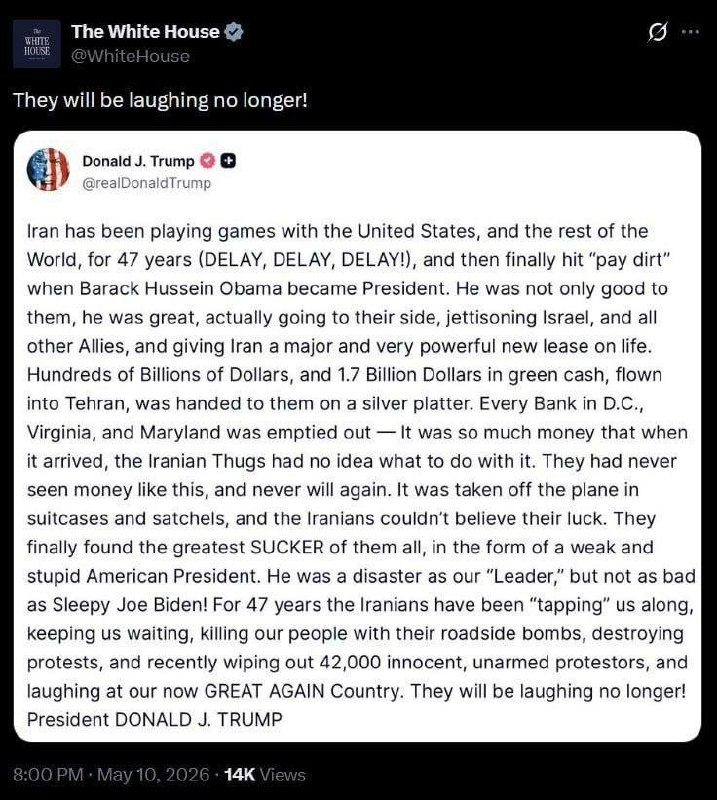
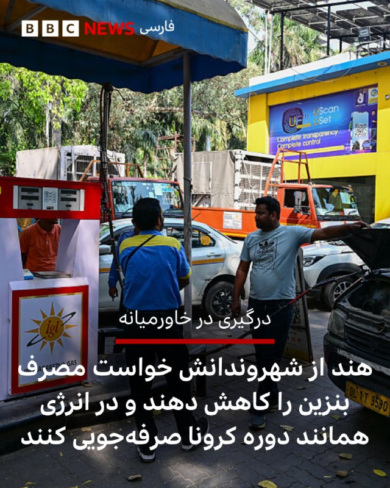

# خواننده تلگرام

<!-- TOP_NAV START -->

<a href="https://github.com/ProAlit/aio-downloader/blob/main/telegram/content/archive_1.md" style="display:inline-block; padding:6px 12px; margin:0 4px; background-color:#2ea44f; color:white; text-decoration:none; border-radius:4px; font-weight:bold;">صفحه بعد</a>

<!-- TOP_NAV END -->

<!-- MSG START -->

---
📅 بروزرسانی: 1405/02/20 22:33
---

## VahidOOnLine — post 239368

  

سخنگوی کاخ سفید اعلام کرد که دونالد ترامپ شامگاه چهارشنبه وارد پکن می‌شود.

همزمان رویترز به نقل از یک مقام ارشد آمریکایی نوشت دونالد ترامپ و شی جین‌پینگ رهبران آمریکا و چین، در دیدار پیش‌روی خود، احتمالا درباره «حمایت چین از ایران و روسیه» گفت‌وگو خواهند کرد.
‌🏁 🇬🇧 IranintlTV

🤖 @VahidOOnLine

## mwarmonitor — post 8844

🔴پیشنهاد ایران به آمریکا برای پایان دادن به جنگ، به نقل از المیادین: پایان دادن به محاصره آزادی صادرات نفت آتش‌بس در لبنان لغو تحریم‌های آمریکا کنترل ایران بر تنگه هرمز آزادسازی (رفع مسدودی) دارایی‌های ایران 📝 چای قلیون تعارف نکن @mwarmonitor

## mwarmonitor — post 8843

🔴پیشنهاد ایران به آمریکا برای پایان دادن به جنگ، به نقل از المیادین:

پایان دادن به محاصره

آزادی صادرات نفت

آتش‌بس در لبنان

لغو تحریم‌های آمریکا

کنترل ایران بر تنگه هرمز

آزادسازی (رفع مسدودی) دارایی‌های ایران

📝 چای قلیون تعارف نکن

@mwarmonitor

## mwarmonitor — post 8842

  

🔴«تصاویر از حمله ایران در تنگه هرمز: این‌گونه اصابت به کشتی باری کره‌ای HMM NAMU دیده می‌شود؛ کشتی‌ای که هفته گذشته توسط سپاه پاسداران انقلاب اسلامی ایران و با استفاده از دو «شیء پرنده» مورد حمله قرار گرفت. در کره جنوبی ارزیابی می‌شود که این‌ها پهپاد بوده‌اند، نه موشک‌های کروز، که به‌صورت پیاپی اصابت کرده‌اند.

🔸محل‌های اصابت: برخورد به مخزن تعادل عقب (مخزن آب برای حفظ پایداری کشتی)، اصابت به بخش عقبیِ سمت چپ کشتی به عرض ۵ متر و نفوذ ۷ متری به داخل بدنه، و همچنین اصابت به اتاق ماشین که منجر به آتش‌سوزی داخلی شد.

🔸این کشتی در آب‌های امارات متحده عربی مورد حمله قرار گرفت و پس از آن‌که دیگر قابلیت دریانوردی نداشت، به یدک کشیده شده و به یک کشتی‌سازی تعمیراتی در دبی منتقل شد. در زمان حادثه ۲۴ نفر خدمه در کشتی حضور داشتند که شش نفر از آنان کره‌ای بودند.»

@mwarmonitor

## IranIntlTV — post 336522

  <a href="https://t.me/IranintlTV/336522" target="_blank">📎 Download file</a>

🎧نسخه صوتی تیتراول با نیوشا صارمی: تاکید همزمان نتانیاهو و ترامپ به تمام نشدن جنگ ایران و احتمال ادامه حملات
@iranintlTV

## IranIntlTV — post 336521

  

سخنگوی کاخ سفید اعلام کرد که دونالد ترامپ شامگاه چهارشنبه وارد پکن می‌شود.

همزمان رویترز به نقل از یک مقام ارشد آمریکایی نوشت دونالد ترامپ و شی جین‌پینگ رهبران آمریکا و چین، در دیدار پیش‌روی خود، احتمالا درباره «حمایت چین از ایران و روسیه» گفت‌وگو خواهند کرد.
https://iranintl.com/202605100945

## Shin_Persian — post 5940

  

Shin ✓ @hey_itsmyturn
Sun, 10 May 2026 18:54:28 UTC

1854Z
AA activity in Andimeshk,
Khuzestan Province, #Iran

فارسی

۱۸۵۴ زولو (۲۲:۲۴ به وقت تهران)
فعالیت پدافند هوایی در اندیمشک،
استان خوزستان، #Iran

𝕏 · @shin_persian

## FarsiVOA — post 217368

🔺مایک والتز: ذخایر ارزی خارجی جمهوری اسلامی «نزدیک به صفر» است

◾️مایک والتز، سفیر ایالات متحده در سازمان ملل متحد روز یکشنبه ۲۰ اردیبهشت در مصاحبه با فاکس‌نیوز گفت نمی‌تواند گزارش‌های روز یکشنبه حمله پهپادی جمهوری اسلامی به یک کشتی تحت مالکیت نهاد آمریکایی را تائید یا رد کند.

⬇️ بیشتر بخوانید:

https://ir.voanews.com/a/economic-hostage-taking-iranian-regime-strait-of-hormuz-mike-waltz/8148519.html

## DW_Farsi — post 124538

  

🔶هشدار ترامپ به جمهوری اسلامی: طرف ایرانی دیگر نخواهد خندید

دونالد ترامپ، رئیس جمهور آمریکا، ایران را به "۴۷ سال بازی دادن و خندیدن به آمریکا برای دهه‌ها" متهم کرد. اما گفت که "به زودی این کار متوقف خواهد شد".

ترامپ در شبکه اجتماعی متعلق به خودش "تروث سوشال "نوشت: «ایران ۴۷ سال است که با ایالات متحده و بقیه جهان بازی می‌کند (تاخیر، تاخیر، تاخیر!).»

او همچنین تهران را به خندیدن به آمریکا که "اکنون دوباره با عظمت شده است" متهم کرد و افزود: «آنها دیگر نخواهند خندید!»

رئیس جمهور آمریکا ضمن انتقاد تند از موضع باراک اوباما، رئیس جمهور پیشین ایالات متحده، نسبت به جمهوری اسلامی، او را متهم کرد که "اسرائیل و سایر متحدان را کنار گذاشت و به ایران یک زندگی جدید بزرگ و بسیار قدرتمند بخشید".

@dw_farsi

## RadioFarda — post 157038

  

🔸دونالد ترامپ روز یکشنبه ایران را متهم کرد که سال‌ها است با ایالات متحده «بازی کرده» و به آن «خندیده» اما تأکید کرد که دیگر اجازه نخواهد داد ایران به آمریکا «بخندد».

🔸رئیس‌جمهور آمریکا با انتشار پیامی در شبکه اجتماعی خود، تروث سوشال، بدون آن که به محتوای پاسخ ایران که ساعاتی پیش به پیشنهاد آمریکا برای توافق پایان جنگ داده شد اشاره کند، نوشت: «ایرانی‌ها ۴۷ سال است که ما را سر می‌دوانند، منتظر نگه می‌دارند، مردم ما را با بمب‌های کنار جاده‌ای می‌کشند، اعتراضات را سرکوب می‌کنند، و اخیراً ۴۲ هزار معترض بی‌گناه و غیرمسلح را از بین برده‌اند، و به کشوری که حالا دوباره عظمت یافته می‌خندند. اما دیگر نخواهند خندید!»

🔸او در ابتدای این بیانیه ایران را متهم کرد که «۴۷ سال است که با ایالات متحده و بقیه جهان بازی کرده است (تعویق، تعویق، تعویق!)».

🔸او در این پیام دولت‌های دموکرات باراک اوباما و جو بایدن را متهم کرد که میلیاردها دلار در اختیار حکومت ایران قرار دادند و به‌ویژه اوباما را «گنج واقعی» برای جمهوری اسلامی خواند.

@RadioFarda

## alonews — post 119140

  <a href="telegram/content/alonews_119140_1778439806.webm" target="_blank">🎬 Download video</a>

👈برنامه ترامپ در پکن شامل مراسم استقبال و دیدار دوجانبه با شی جین‌پینگ در صبح پنج‌شنبه است، که با یک ضیافت رسمی در عصر پنج‌شنبه دنبال می‌شود.

🔴 انتظار می‌رود ترامپ همچنین در بعدازظهر پنج‌شنبه از معبد بهشت بازدید کند.

🔴 در روز جمعه، این دو رهبر قرار است یک جلسه چای دوجانبه و ناهار کاری برگزار کنند قبل از اینکه ترامپ به واشنگتن بازگردد.

✅ @AloNews خبر جنگ

## alonews — post 119139

  <a href="telegram/content/alonews_119139_1778439806.webm" target="_blank">🎬 Download video</a>

👈امروز تو سوریه بعد 15 سال، اولین تراکنش‌ها رو با ویزا و مسترکارت انجام دادن.

🔴 افغانستان: اینترنت 5G تست و راه‌اندازی شد.

🔴 عراق: تلگرام رفع فیلتر شد.

🔴 ایران: قطعی اینترنت به یازدهمین هفته رسید و رکورد زد!

✅ @AloNews خبر جنگ

## alonews — post 119138

  <a href="telegram/content/alonews_119138_1778439807.webm" target="_blank">🎬 Download video</a>

👈ترامپ : ایران ۴۷ ساله داره با آمریکا و بقیه دنیا بازی درمیاره و هی وقت‌کشی می‌کنه! 
🔴تا اینکه اوباما اومد. او فقط با ایران خوب نبود، خیلی هم بهشون حال داد، متحدای ما مثل اسرائیل رو ول کرد و به ایران یه فرصت بزرگ داد. 
🔴 اون ۱.۷ میلیارد دلار پول نقد هم با…

---
📅 بروزرسانی: 1405/02/20 22:23
---

## WithYashar — post 10877

یک ائتلاف مخفی شکل گرفته برای زمین زدن رژیم جمهوری اسلامی. خیلی از کشورها ملحق شدند ولی چیزی نمی گن. به زودی متوجه میشید.
@withyashar

## mwarmonitor — post 8841

«چاک شومرِ فلسطینی در حال استخدام اریک هولدر است؛ همان کسی که به دلیل تحویل دادن اسلحه به کارتل‌های مکزیکی در دولت باراک حسین اوباما مشهور است. او اکنون به عنوان بخشی از یک "گروه سلامت انتخابات" به رهبری دموکرات‌ها فعالیت خواهد کرد که بدون شک سعی در سرکوب رأی‌دهندگان جمهوری‌خواه و مداخله در انتخابات ما خواهند داشت. علاوه‌ بر این، مارک الیاس، وکیل افتضاحی با سوابق وحشتناک، نیز در این کار درگیر است. این همان فرد منزجرکننده‌ای است که مسئول پرونده جعلی روسیه از سوی یک کشور خارجی برای مداخله در انتخابات ۲۰۱۶ بود؛ انتخاباتی که من در آن به شکلی تاریخی پیروز شدم. دموکرات‌ها کاملاً از کنترل خارج شده‌اند و ما اجازه نخواهیم داد که سلامت انتخابات ما را تهدید کنند.
در طول انتخابات تاریخی من در سال ۲۰۲۴، زمانی که در تک‌تک ایالت‌های کلیدی پیروز شدم و با قاطعیت هم در آرای الکترال و هم در آرای مردمی با اختلاف زیاد برنده شدم، جمهوری‌خواهان یک "ارتش سلامت انتخابات" در هر ایالت داشتند تا از حرمت هر رأی قانونی پاسداری کنند. ما در سال ۲۰۲۶ نیز همین کار را تکرار خواهیم کرد، اما این بار بسیار بزرگ‌تر و قوی‌تر خواهد بود. همه آمریکایی‌ها باید با دادن رأی، صدای خود را به گوش برسانند. مطمئن باشید این انتخابات منصفانه خواهد بود!

رئیس‌جمهور دونالد جی. ترامپ»

@mwarmonitor

## IranIntlTV — post 336520

  <a href="telegram/content/IranIntlTV_336520_1778439209.mp4" target="_blank">🎬 Download video</a>

مهدی مهدوی‌آزاد در برنامه «چشم‌انداز» گفت: «یک جریان جنگ‌طلب دیوانه در حال پیش بردن مسیری است که هیچ نسبتی با واقعیت ندارد. در عمل، بخش بزرگی از توان و ساختارشان نابود شده، اما همچنان ادعای پیروزی و قدرت می‌کنند.»

او افزود: «به نظر می‌رسد در دل همان جریانی که پس از جنگ، مجتبی خامنه‌ای را در موقعیت قدرت قرار داد، گروهی تندروتر در حال قدرت گرفتن است؛ جریانی که جنگ را می‌خواهد طولانی‌تر کند و به‌دنبال نوعی "کودتا در کودتا" است.»
@iranintltv

## DW_Farsi — post 124537

  

🔶"دعوت از متخصصان ایرانی خارج از کشور" برای مرمت آثار باستانی خسارت‌دیده در جنگ

محسن فتحی، نماینده سنندج در مجلس شورای اسلامی و رئیس فراکسیون گردشگری، روز یکشنبه ۲۰ اردیبهشت (۱۰ مه) به خبرگزاری ایسنا گفت که بیش از ۱۴۰ بنای تاریخی از دوره هخامنشی تا دوران اسلامی در جریان جنگ آسیب دیده‌اند.

به گفته او، بسیاری از هتل‌ها، آژانس‌های مسافرتی و راهنمایان تور با کاهش شدید درآمد مواجه شده‌اند و در آستانه تعطیلی قرار دارند.

فتحی همچنین خبر داده که دولت ایران قصد دارد از ظرفیت متخصصان ایرانی مقیم خارج برای بازسازی این بناها استفاده کند. رئیس فراکسیون گردشگری چنین ایده‌ای را "یک فرصت برای همگرایی همه ایرانیان صرف‌نظر از محل سکونت‌شان، حول حفاظت از هویت ملی" نامیده است.

او در همین رابطه افزود: «رئیس‌ جمهور دستور فوری برای مرمت و بازسازی تمامی محوطه‌ها و ابنیه تاریخی آسیب‌دیده صادر کرده‌اند. علاوه بر این یک کمپین ملی و بین‌المللی بازسازی طراحی شده که بزودی اجرا خواهد شد.»

رئیس فراکسیون گردشگری همچنین از پیگیری صدمات واردشده به بناهای تاریخی "در دادگاه‌های بین‌المللی" خبر داده است.

@dw_farsi

## alonews — post 119137

  <a href="telegram/content/alonews_119137_1778439213.webm" target="_blank">🎬 Download video</a>

👈دفتر نخست‌وزیری اسرائیل گزارش داد بنیامین نتانیاهو و دونالد ترامپ بزودی با یکدیگر گفتگو خواهند کرد

✅ @AloNews خبر جنگ

## alonews — post 119136

  <a href="telegram/content/alonews_119136_1778439213.webm" target="_blank">🎬 Download video</a>

👈بلومبرگ: فقط یک ماه تا جیره‌بندی سوخت و بحران‌های امنیتی در جهان باقی مانده است!

✅ @AloNews خبر جنگ

## alonews — post 119135

  <a href="telegram/content/alonews_119135_1778439213.webm" target="_blank">🎬 Download video</a>

👈المیادین: تهران در نظر دارد گنجاندن آتش‌بس لبنان در پاسخ مذاکراتی خود را خط قرمز بداند و مفاهیم پیشنهادی را به تضمین‌هایی مرتبط با توقف تشدید در لبنان پیوند دهد

✅ @AloNews خبر جنگ

---
📅 بروزرسانی: 1405/02/20 22:12
---

## VahidOOnLine — post 239367

  

مصطفی نیلی، وکیل نرگس محمدی، برنده جایزه صلح نوبل و زندانی سیاسی، در ایکس نوشت: «امروز خانم نرگس محمدی با صدور دستور توقف حکم برای انجام درمان از بیمارستان زنجان خارج و با آمبولانس به بیمارستان پارس تهران منتقل و بستری شدند.»

او افزود: «صدور این دستور در پی نظر پزشکی قانونی مبنی بر لزوم پیگیری درمان خارج از زندان و زیر نظر تیم پزشکان ایشان به دلیل بیماری‌های متعدد است.»

پیشتر بنیاد نرگس محمدی اعلام کرد با وجود اعلام پزشکی قانونی استان زنجان درباره ضرورت تعلیق یک‌ماهه اجرای حکم محمدی برای درمان، مقام‌های قضایی از انتقال این فعال حقوق بشر و برنده جایزه صلح نوبل به بیمارستان جلوگیری می‌کنند و خانواده او وضعیتش را مرگ و زندگی توصیف کردند.
‌🏁 🇬🇧 IranintlTV

🤖 @VahidOOnLine

## WithYashar — post 10876

کاخ سفید: ترامپ چهارشنبه به چین می‌رود

کاخ سفید اعلام کرد سفر دونالد ترامپ به چین از روز چهارشنبه آغاز می‌شود.

بر اساس این گزارش، این سفر تا روز جمعه ادامه خواهد داشت.
@withyashar

## FoxNewsTwitter — post 341510

  

Fox News (Twitter/X)

JUST IN: President Trump rips Obama and Biden for their handling of Iran and vows that Tehran will be "laughing no longer" under his administration.

## IranIntlTV — post 336519

  

مصطفی نیلی، وکیل نرگس محمدی، برنده جایزه صلح نوبل و زندانی سیاسی، در ایکس نوشت: «امروز خانم نرگس محمدی با صدور دستور توقف حکم برای انجام درمان از بیمارستان زنجان خارج و با آمبولانس به بیمارستان پارس تهران منتقل و بستری شدند.»

او افزود: «صدور این دستور در پی نظر پزشکی قانونی مبنی بر لزوم پیگیری درمان خارج از زندان و زیر نظر تیم پزشکان ایشان به دلیل بیماری‌های متعدد است.»

پیشتر بنیاد نرگس محمدی اعلام کرد با وجود اعلام پزشکی قانونی استان زنجان درباره ضرورت تعلیق یک‌ماهه اجرای حکم محمدی برای درمان، مقام‌های قضایی از انتقال این فعال حقوق بشر و برنده جایزه صلح نوبل به بیمارستان جلوگیری می‌کنند و خانواده او وضعیتش را مرگ و زندگی توصیف کردند.
https://iranintl.com/202605100410

## DW_Farsi — post 124536

  <a href="telegram/content/DW_Farsi_124536_1778438561.mp4" target="_blank">🎬 Download video</a>

🎥نتانیاهو در گفت‌وگو با سی‌بی‌اس: "جنگ ایران هنوز تمام نشده است"

بنیامین نتانیاهو، نخست‌وزیر اسرائیل، در گفت‌وگو با شبکه سی‌بی‌اس گفت جنگ با جمهوری اسلامی ایران "تمام نشده" و تأکید کرد اورانیوم غنی‌شده باید از ایران خارج شود.

نتانیاهو گفت هنوز سایت‌های غنی‌سازی، موشک‌های بالستیک و گروه‌های نیابتی مورد حمایت جمهوری اسلامی پابرجا هستند و "کارهای زیادی" باقی مانده است. او درباره احتمال اقدام نظامی یا زمان پایان این روند توضیحی نداد، اما خروج اورانیوم از ایران را "مأموریتی بسیار مهم" توصیف کرد.

@dw_farsi

## Persian_Trend_Official — post 13849

  <a href="telegram/content/Persian_Trend_Official_13849_1778438563.webm" target="_blank">🎬 Download video</a>

💢گرفتار شدن پهپاد FPV حزب الله داخل توری محافظ اسرائیل ❗️

🫆:Tony

📌 @persian_trend_official
پرشین ترند | متفاوت‌ترین کانال نظامی

## IranianMinds — post 19915

🔴 گزارش‌ها از فعال شدن پدافند در دزفول، شمال استان خوزستان.

@IranianMinds

## IranianMinds — post 19914

🔴 بنیامین نتانیاهو :

ترامپ به ما گفت که برای گرفتن اورانیوم وارد ایران خواهند شد

@IranianMinds

## BBCPersian — post 280690

  

⭕️دونالد ترامپ، رئیس‌جمهور پیشین آمریکا، در پیامی تند ایران را متهم کرده است که ۴۷ سال با ایالات متحده و جهان «بازی کرده است.»

او ایران را به وقت‌کشی متهم کرد و نوشت «تاخیر، تاخیر، تاخیر.»

این اظهارات آقای ترامپ پس از آن مطرح می‌شود که پس از چند روز انتظار، ساعتی پیش منابع ایرانی از پاسخ ایران به پیشنهاد آمریکا خبر دادند و پاکستان میانجی مذاکرات گفت که این پیام را به آمریکا منتقل کرده است.

اکنون دونالد ترامپ نوشته است «به‌مدت ۴۷ سال، ایرانی‌ها ما را سر دوانده‌اند، ما را منتظر نگه داشته‌اند، مردم ما را با بمب‌های کنار جاده‌ای کشته‌اند، اعتراضات را سرکوب کرده‌اند و اخیرا هم ۴۲ هزار معترض بی‌گناه را از بین برده‌اند و به کشور ما که حالا دوباره عظیم شده است می‌خندند. آن‌ها دیگر نخواهند خندید.»

ترامپ همچنین با انتقاد شدید از اوباما، او را «ضعیف» توصیف کرده و گفته است که سیاست‌های او به ایران «فرصت تازه‌ای برای تقویت» داده است.

📸Bloomberg via Getty Images

https://bbc.in/4dfD9LE
@BBCPersian

## alonews — post 119134

  <a href="telegram/content/alonews_119134_1778438565.webm" target="_blank">🎬 Download video</a>

👈طبق گزارش CNN و با استناد به داده‌های Flightradar24، ایالات متحده از اوایل فوریه حداقل ۲۵ پرواز جمع‌آوری اطلاعات در نزدیکی سواحل کوبا انجام داده است که از هر دو نوع هواپیماهای سرنشین‌دار و پهپادها استفاده شده است.

🔴 بیشتر این ماموریت‌ها در نزدیکی هاوانا و سانتیاگو د کوبا انجام شده‌اند و برخی پروازها در فاصله ۴۰ مایلی از خط ساحلی کوبا فعالیت داشته‌اند

✅ @AloNews خبر جنگ

---
📅 بروزرسانی: 1405/02/20 22:03
---

## VahidOOnLine — post 239366

  <a href="telegram/content/VahidOOnLine_239366_1778438011.mp4" target="_blank">🎬 Download video</a>

پیتر ماگیار، رهبر حزب «تیسا»، پس از پیروزی در انتخابات آوریل با کسب بیش از ۵۳ درصد آرا، روز شنبه به‌عنوان نخست‌وزیر مجارستان سوگند یاد کرد و به ۱۶ سال حاکمیت ویکتور اوربان پایان داد.

در جریان مراسم تحلیف در میدان کوشوت، ژولت هگدوش، وزیر بهداشت آینده، با اجرای یک رقص پرانرژی در برابر هزاران نفر توجه‌ها را به خود جلب کرد و این حرکت را روی پله‌های ساختمان پارلمان نیز تکرار کرد.

او پیش‌تر نیز با همین حرکات در یک تجمع انتخاباتی در ماه آوریل خبرساز شده و در شبکه‌های اجتماعی لقب «سیاستمدار رقصنده» را گرفته بود.
‌🏁 🇬🇧 ManotoTV

🤖 @VahidOOnLine

## VahidOOnLine — post 239365

  <a href="telegram/content/VahidOOnLine_239365_1778438014.mp4" target="_blank">🎬 Download video</a>

‌
دونالد ترامپ، رئیس‌جمهوری آمریکا، در شبکه اجتماعی خود نوشت جمهوری اسلامی طی ۴۷ سال گذشته واشینگتن را «معطل نگه داشته» و به منافع آمریکا آسیب زده است.

او گفت: «در طول ۴۷ سال، ایرانی‌ها ما را معطل نگه داشته‌اند، ما را منتظر گذاشته‌اند، با بمب‌های کنار جاده‌ای افراد ما را کشته‌اند و اعتراضات را سرکوب کرده‌اند.»

ترامپ همچنین گفت جمهوری اسلامی «۴۲ هزار معترض بی‌گناه و بی‌سلاح را از بین برده» و به آمریکا «خندیده» است.

او در پایان افزود: «آن‌ها دیگر نخواهند خندید.»
‌🏁 🇬🇧 ManotoTV

🤖 @VahidOOnLine

## VahidOOnLine — post 239364

  <a href="telegram/content/VahidOOnLine_239364_1778438015.mp4" target="_blank">🎬 Download video</a>

امانوئل مکرون، رئیس‌جمهوری فرانسه، اعلام کرد هرگز موضوع استقرار نیروهای فرانسوی یا مشترک با بریتانیا در تنگه هرمز مطرح نبوده است.

مکرون در نشست خبری در نایروبی گفت چند روز پیش تصمیم گرفته ناو «شارل دوگل» و ناوچه‌های همراه آن را از مدیترانه شرقی به آن‌سوی تنگه باب‌المندب منتقل کند و افزود: «بحث استقرار مطرح نبوده، اما ما آماده‌ایم.»

او با تأکید بر اصل «آزادی کشتیرانی» گفت باید به هرگونه محاصره پایان داده شود و هر نوع عوارض یا محدودیت بر عبور کشتی‌ها رد شود.
‌🏁 🇬🇧 ManotoTV

🤖 @VahidOOnLine

## VahidOOnLine — post 239363

  

دونالد ترامپ در شبکه تروث سوشال نوشت جمهوری اسلامی ۴۷ سال با آمریکا و جهان بازی کرده و با تاخیر زمان خریده است و این روند با ریاست‌جمهوری باراک حسین اوباما به نتیجه رسید. او نوشت اوباما عملا در کنار جمهوری اسلامی ایستاد، اسرائیل و دیگر متحدان را کنار گذاشت و جان تازه‌ای به تهران داد.
ترامپ نوشت صدها میلیارد دلار و ۱.۷ میلیارد دلار پول نقد با هواپیما به تهران منتقل شد و بانک‌های واشینگتن دی سی، ویرجینیا و مریلند خالی شد. پول‌ها در چمدان‌ها منتقل شد و مقام‌های جمهوری اسلامی از حجم آن شگفت‌زده شدند.
او اوباما را رییس‌جمهوری ضعیف خواند و افزود جمهوری اسلامی طی ۴۷ سال با بمب‌های کنار جاده‌ای آمریکایی‌ها را کشته، اعتراضات را سرکوب کرده و اخیرا ۴۲ هزار معترض بی‌سلاح را از بین برده است. او نوشت جمهوری اسلامی به کشور ما که حالا دوباره عظمت یافته می‌خندد اما آن‌ها دیگر نخواهند خندید.
‌🏁 🇬🇧 IranintlTV

🤖 @VahidOOnLine

## DEJradio — post 4552

  <a href="telegram/content/DEJradio_4552_1778438016.webm" target="_blank">🎬 Download video</a>

🚨
⭕️ دونالد ترامپ، رئیس‌جمهوری ایالات متحده، شامگاه یکشنبه در پیامی در شبکۀ اجتماعی تروث سوشال نوشت جمهوری اسلامی ۴۷سال است که با آمریکا و جهان بازی کرده و با سیاست "تعویق، تعویق، تعویق" زمان خریده است. ترامپ نوشت این روند زمانی برای جمهوری اسلامی به نقطۀ طلایی رسید که باراک حسین اوباما رئیس‌جمهور شد. به نوشتۀ ترامپ، اوباما نه‌تنها با جمهوری اسلامی خوب رفتار کرد، بلکه در عمل به سوی آن‌ها رفت، اسرائیل و دیگر متحدان آمریکا را کنار گذاشت و به جمهوری اسلامی جان تازه‌ای بخشید.
ترامپ در ادامه نوشت صدها میلیارد دلار و همچنین ۱.۷میلیارد دلار پول نقد با هواپیما به تهران منتقل شد و روی سینی نقره‌ای در اختیار جمهوری اسلامی قرار گرفت. او افزود حجم پول آن‌قدر زیاد بود که به گفتۀ او، بانک‌های واشینگتن، ویرجینیا و مریلند خالی شدند و وقتی این پول‌ها به تهران رسید، اوباش جمهوری اسلامی نمی‌دانستند با آن چه کنند.
رئیس‌جمهوری آمریکا نوشت مقام‌های جمهوری اسلامی هرگز چنین پولی ندیده بودند و دیگر هم نخواهند دید. به نوشتۀ ترامپ، این پول‌ها با چمدان و کیف از هواپیما پایین آورده شد و جمهوری اسلامی از خوش‌شانسی خود باورش نمی‌شد. ترامپ نوشت جمهوری اسلامی سرانجام بزرگ‌ترین ساده‌لوح را در قالب یک رئیس‌جمهوری ضعیف و احمق آمریکایی پیدا کرده بود.
ترامپ در بخش دیگری از پیام خود، اوباما را برای رهبری آمریکا یک فاجعه خواند، اما افزود او به بدی جو بایدن نبود. رئیس‌جمهوری آمریکا نوشت جمهوری اسلامی طی ۴۷سال گذشته آمریکا را معطل کرده، این کشور را در انتظار نگه داشته، مردم آمریکا را با بمب‌های کنار جاده‌ای کشته، اعتراضات را نابود کرده و به‌تازگی ۴۲هزار معترض بی‌گناه و غیرمسلح را از میان برده است.
ترامپ در پایان نوشت جمهوری اسلامی به آمریکایی که اکنون دوباره عظمت خود را بازیافته می‌خندید، اما دیگر نخواهد خندید.

#دونالد_ترامپ #جمهوری_اسلامی
@DEJradio

## IranIntlTV — post 336518

  

دونالد ترامپ در شبکه تروث سوشال نوشت جمهوری اسلامی ۴۷ سال با آمریکا و جهان بازی کرده و با تاخیر زمان خریده است و این روند با ریاست‌جمهوری باراک حسین اوباما به نتیجه رسید. او نوشت اوباما عملا در کنار جمهوری اسلامی ایستاد، اسرائیل و دیگر متحدان را کنار گذاشت و جان تازه‌ای به تهران داد.
ترامپ نوشت صدها میلیارد دلار و ۱.۷ میلیارد دلار پول نقد با هواپیما به تهران منتقل شد و بانک‌های واشینگتن دی سی، ویرجینیا و مریلند خالی شد. پول‌ها در چمدان‌ها منتقل شد و مقام‌های جمهوری اسلامی از حجم آن شگفت‌زده شدند.
او اوباما را رییس‌جمهوری ضعیف خواند و افزود جمهوری اسلامی طی ۴۷ سال با بمب‌های کنار جاده‌ای آمریکایی‌ها را کشته، اعتراضات را سرکوب کرده و اخیرا ۴۲ هزار معترض بی‌سلاح را از بین برده است. او نوشت جمهوری اسلامی به کشور ما که حالا دوباره عظمت یافته می‌خندد اما آن‌ها دیگر نخواهند خندید.
https://iranintl.com/202605105882

## ManotoTV — post 105273

  <a href="telegram/content/ManotoTV_105273_1778438018.mp4" target="_blank">🎬 Download video</a>

پیتر ماگیار، رهبر حزب «تیسا»، پس از پیروزی در انتخابات آوریل با کسب بیش از ۵۳ درصد آرا، روز شنبه به‌عنوان نخست‌وزیر مجارستان سوگند یاد کرد و به ۱۶ سال حاکمیت ویکتور اوربان پایان داد.

در جریان مراسم تحلیف در میدان کوشوت، ژولت هگدوش، وزیر بهداشت آینده، با اجرای یک رقص پرانرژی در برابر هزاران نفر توجه‌ها را به خود جلب کرد و این حرکت را روی پله‌های ساختمان پارلمان نیز تکرار کرد.

او پیش‌تر نیز با همین حرکات در یک تجمع انتخاباتی در ماه آوریل خبرساز شده و در شبکه‌های اجتماعی لقب «سیاستمدار رقصنده» را گرفته بود.

## ManotoTV — post 105272

  <a href="telegram/content/ManotoTV_105272_1778438020.mp4" target="_blank">🎬 Download video</a>

‌
دونالد ترامپ، رئیس‌جمهوری آمریکا، در شبکه اجتماعی خود نوشت جمهوری اسلامی طی ۴۷ سال گذشته واشینگتن را «معطل نگه داشته» و به منافع آمریکا آسیب زده است.

او گفت: «در طول ۴۷ سال، ایرانی‌ها ما را معطل نگه داشته‌اند، ما را منتظر گذاشته‌اند، با بمب‌های کنار جاده‌ای افراد ما را کشته‌اند و اعتراضات را سرکوب کرده‌اند.»

ترامپ همچنین گفت جمهوری اسلامی «۴۲ هزار معترض بی‌گناه و بی‌سلاح را از بین برده» و به آمریکا «خندیده» است.

او در پایان افزود: «آن‌ها دیگر نخواهند خندید.»

## ManotoTV — post 105271

  <a href="telegram/content/ManotoTV_105271_1778438021.mp4" target="_blank">🎬 Download video</a>

امانوئل مکرون، رئیس‌جمهوری فرانسه، اعلام کرد هرگز موضوع استقرار نیروهای فرانسوی یا مشترک با بریتانیا در تنگه هرمز مطرح نبوده است.

مکرون در نشست خبری در نایروبی گفت چند روز پیش تصمیم گرفته ناو «شارل دوگل» و ناوچه‌های همراه آن را از مدیترانه شرقی به آن‌سوی تنگه باب‌المندب منتقل کند و افزود: «بحث استقرار مطرح نبوده، اما ما آماده‌ایم.»

او با تأکید بر اصل «آزادی کشتیرانی» گفت باید به هرگونه محاصره پایان داده شود و هر نوع عوارض یا محدودیت بر عبور کشتی‌ها رد شود.

## FarsiVOA — post 217367

🔺دونالد ترامپ: رژیم ایران ۴۷ سال است دنیا را به بازی گرفته‌‌است؛ دیگر به ما نخواهند خندید

دونالد ترامپ، رئیس جمهوری آمریکا روز یکشنبه ۲۰ اردیبهشت، در شبکه اجتماعی تروت‌سوشال نوشت: «۴۷ سال است که رژیم ایران، آمریکا و جهان را «به بازی گرفته‌ است» و آن‌ها را منتظر نگه داشته‌ و ۴۲هزار نفر از مردم بیگناه خود را نیز اخیرا کشته است.

⬇️ بیشتر بخوانید:

https://ir.voanews.com/a/trump-delay-iranian-regime/8148522.html

## DW_Farsi — post 124535

  

🔶مکرون: فرانسه قصد استقرار نیروی دریایی در تنگه هرمز را ندارد

امانوئل مکرون، رئیس جمهور فرانسه، روز یکشنبه ۱۰ مه (۲۰ اردیبهشت) گفت که فرانسه قصد استقرار نیروی دریایی در تنگه هرمز را ندارد بلکه یک مأموریت امنیتی "در هماهنگی با ایران" را در نظر داشته است.

مکرون در یک کنفرانس خبری در جریان سفر به نایروبی گفت به موضع خود مبنی بر مخالفت با محاصره از سوی هر دو طرف و "رد هرگونه عوارض" برای اطمینان از عبور کشتی‌ها از این آبراه استراتژیک پایبند است.

ایران روز یکشنبه هشدار داده بود که در برابر هرگونه استقرار نیروهای فرانسوی یا بریتانیایی در تنگه هرمز، "پاسخی فوری و قاطع" خواهد داد. این هشدار پس از آن مطرح شد که فرانسه و بریتانیا اعلام کردند شناورهای نظامی به منطقه اعزام می‌کنند.

مکرون گفت: «هیچ‌گاه صحبت از استقرار نیرو نبود، اما ما آماده‌ایم.»

@dw_farsi

## Persian_Trend_Official — post 13848

https://youtube.com/live/KXs-so7OROY?feature=share راس ساعت 20 به وقت تهران لایو آغاز میشه حتما تشریف بیارید چندتا اتفاق جالب رو میخوایم در موردش صحبت کنیم

## IranianMinds — post 19913

نمیدونم بخندم یا گریه کنم
کولر ‌12هزار دو هفته پیش قیمت کردم 80 میلیون
امروز رفتم بگیرم گفت شده 140 میلیون 😳😔
ترامپ بزنه زودتر کار اینارو تموم کنه
واقعا مردم عادی زیر این فشار ها داغون میشن
اینا تو حالت عادی نمیتونستن قیمت هارو کنترل کنند
الان که تو محاصره و جنگ هستند

## IranianMinds — post 19912

  

🔴 کاخ سفید اعلام کرد دونالد ترامپ چهارشنبه شب برای دیدار و نشست با شی جین‌پینگ وارد پکن خواهد

@IranianMinds

## Hranews — post 112871

صدور حکم اعدام برای یک متهم در مشهد

❗️
❗️
❗️
❗️
❗️ – یک متهم به قتل در مشهد توسط شعبه پنجم دادگاه کیفری یک استان خراسان رضوی به #اعدام محکوم شد.

ادامه مطلب

↘️
@hranews_bot تماس ✉️ -  @Hranews  کانال هرانا 🆑

## manototv — post 105273

  <a href="telegram/content/manototv_105273_1778438023.mp4" target="_blank">🎬 Download video</a>

پیتر ماگیار، رهبر حزب «تیسا»، پس از پیروزی در انتخابات آوریل با کسب بیش از ۵۳ درصد آرا، روز شنبه به‌عنوان نخست‌وزیر مجارستان سوگند یاد کرد و به ۱۶ سال حاکمیت ویکتور اوربان پایان داد.

در جریان مراسم تحلیف در میدان کوشوت، ژولت هگدوش، وزیر بهداشت آینده، با اجرای یک رقص پرانرژی در برابر هزاران نفر توجه‌ها را به خود جلب کرد و این حرکت را روی پله‌های ساختمان پارلمان نیز تکرار کرد.

او پیش‌تر نیز با همین حرکات در یک تجمع انتخاباتی در ماه آوریل خبرساز شده و در شبکه‌های اجتماعی لقب «سیاستمدار رقصنده» را گرفته بود.

## manototv — post 105272

  <a href="telegram/content/manototv_105272_1778438026.mp4" target="_blank">🎬 Download video</a>

‌
دونالد ترامپ، رئیس‌جمهوری آمریکا، در شبکه اجتماعی خود نوشت جمهوری اسلامی طی ۴۷ سال گذشته واشینگتن را «معطل نگه داشته» و به منافع آمریکا آسیب زده است.

او گفت: «در طول ۴۷ سال، ایرانی‌ها ما را معطل نگه داشته‌اند، ما را منتظر گذاشته‌اند، با بمب‌های کنار جاده‌ای افراد ما را کشته‌اند و اعتراضات را سرکوب کرده‌اند.»

ترامپ همچنین گفت جمهوری اسلامی «۴۲ هزار معترض بی‌گناه و بی‌سلاح را از بین برده» و به آمریکا «خندیده» است.

او در پایان افزود: «آن‌ها دیگر نخواهند خندید.»

## manototv — post 105271

  <a href="telegram/content/manototv_105271_1778438026.mp4" target="_blank">🎬 Download video</a>

امانوئل مکرون، رئیس‌جمهوری فرانسه، اعلام کرد هرگز موضوع استقرار نیروهای فرانسوی یا مشترک با بریتانیا در تنگه هرمز مطرح نبوده است.

مکرون در نشست خبری در نایروبی گفت چند روز پیش تصمیم گرفته ناو «شارل دوگل» و ناوچه‌های همراه آن را از مدیترانه شرقی به آن‌سوی تنگه باب‌المندب منتقل کند و افزود: «بحث استقرار مطرح نبوده، اما ما آماده‌ایم.»

او با تأکید بر اصل «آزادی کشتیرانی» گفت باید به هرگونه محاصره پایان داده شود و هر نوع عوارض یا محدودیت بر عبور کشتی‌ها رد شود.

## alonews — post 119133

  <a href="telegram/content/alonews_119133_1778438027.webm" target="_blank">🎬 Download video</a>

👈آای هیمتی:
افزایش نرخ دلار با توجه به جنگ منطقی بود

✅ @AloNews خبر جنگ

## alonews — post 119132

  <a href="telegram/content/alonews_119132_1778438027.mp4" target="_blank">🎬 Download video</a>

👈ماکرون درباره ایران: از همه می‌خواهم آرام و مسئولانه رفتار کنند. فکر می‌کنم تنش‌های کلامی بسیار زیاد است که همیشه به تشدید فیزیکی منجر می‌شود.

🔴و آسیب‌پذیرترین افراد روی کره زمین اولین قربانیان آن هستند، اما امروز همه ما قربانی آنچه اتفاق می‌افتد هستیم.

🔴شهروندان هم‌وطن ما در فرانسه نیز هر روز بهای این جنگی را می‌پردازند که ما نمی‌خواستیم.

✅ @AloNews خبر جنگ

---
📅 بروزرسانی: 1405/02/20 21:54
---

## VahidOOnLine — post 239362

  

♦️همزمان با ارسال پاسخ تهران به پیشنهاد صلح آمریکا، دونالد ترامپ، رئیس‌جمهوری این کشور، در پیامی در شبکه اجتماعی «تروث سوشال» نوشت جمهوری اسلامی طی ۴۷ سال گذشته ایالات متحده و جهان را «بازی داده» و با تاکتیک «تأخیر، تأخیر، تأخیر» از فشارها گریخته است.
ترامپ در این پیام با حمله به باراک اوباما، رئیس‌جمهوری پیشین آمریکا، نوشت تهران در دوران ریاست‌جمهوری او به «کامیابی و ثروت بادآورده» دست یافت و صدها میلیارد دلار به همراه ۱.۷ میلیارد دلار پول نقد از آمریکا دریافت کرد. ترامپ افزود، این پول نقد با هواپیما به تهران منتقل شد و مقام‌های جمهوری اسلامی «نمی‌دانستند با آن چه کنند.»
رئیس‌جمهوری آمریکا همچنین اوباما را «ضعیف و احمق» توصیف کرد و جو بایدن را نیز مورد انتقاد قرار داد.
ترامپ در پایان با یادآوری سرکوب اعتراضات دی ماه و کشتار «۴۲ هزار معترض بی‌گناه و غیرمسلح» جمهوری اسلامی را به کشتن نیروهای آمریکایی با بمب‌های کنار جاده‌ای متهم کرد.
او در پایان نوشت: «آن‌ها دیگر نخواهند خندید.»
‌🇸🇦 Indypersian

🤖 @VahidOOnLine

## WithYashar — post 10875

یک مقام جمهوری اسلامی به الجزیره گفت:

پاسخ تهران به پیشنهاد آمریکا مثبت و واقع‌بینانه بود. پاسخ ما بر پایان دادن به جنگ در کل منطقه، به ویژه در لبنان، و حل اختلافات با واشنگتن متمرکز است. پاسخ ایران شامل مذاکرات در مورد تنگه هرمز، برنامه هسته‌ای و لغو تحریم‌ها می‌شود. پاسخ ما بر لزوم وجود یک مکانیسم روشن و تضمین‌شده برای لغو همه تحریم‌ها و تضمین‌های بین‌المللی برای اجرای هرگونه توافق امضا شده با واشنگتن متمرکز است. پاسخ مثبت واشنگتن به پیشنهاد ما، مذاکرات را به سرعت پیش خواهد برد. اکنون انتخاب در دستان واشنگتن است.
@withyashar

## WithYashar — post 10874

به گزارش i24NEWS : نخست‌وزیر نتانیاهو در ساعت آینده با رئیس‌جمهور آمریکا ترامپ گفتگو خواهد کرد
@withyashar

## mwarmonitor — post 8840

🔴 یک مقام مسئول ایرانی به الجزیره:
پاسخ ما شامل مذاکره درباره تنگه هرمز و برنامه هسته‌ای و همچنین لغو کامل تحریم‌ها است.

@mwarmonitor

## mwarmonitor — post 8839

  

✈️دو فروند هواپیمای سوخت‌رسان هوایی نیروی هوایی آمریکا هم‌اکنون بر فراز عربستان سعودی در حال عملیات هستند و دو فروند دیگر نیز از تل‌آویو در مسیر حرکت به سوی خلیج فارس قرار دارند.

✈️همچنین یک فروند KC-135R از پایگاه خانیا به پرواز درآمده که احتمالاً در حال اسکورت یک فروند هواپیمای اطلاعات سیگنالی RC-135W (SIGINT) است.

🔴در همین حال، یک فروند هواپیمای E-11A BACN نیروی هوایی آمریکا نیز بر فراز عراق فعال است.

@mwarmonitor

## DEJradio — post 4551

  <a href="telegram/content/DEJradio_4551_1778437443.mp4" target="_blank">🎬 Download video</a>

🎥
🔺 ابوالفضل اقبالی کارشناس صداوسیمای جمهوری اسلامی ادعا کرده است موساد برای راه رفتن با تاپ و شلوار در میدان ولیعصر ساعتی ۳ دلار می‌دهد.

#موساد
@DEJradio

## FarsiVOA — post 217366

دونالد ترامپ، رئیس جمهوری ایالات متحده، در گفت‌وگویی اختصاصی با برنامه «فول مژر» به میزبانی شریل اتکیسون، گفت حکومت ایران از نظر نظامی «شکست خورده» است و توان بازسازی سریع ظرفیت‌های نظامی و هسته‌ای خود را ندارد.

آقای ترامپ در این مصاحبه که در کاخ سفید انجام شد، از تصمیم خود برای حمله به تأسیسات هسته‌ای رژیم ایران دفاع و تأکید کرد که ایالات متحده هرگز اجازه نخواهد داد این رژیم به سلاح هسته‌ای دست یابد.

رئیس جمهوری آمریکا در پاسخ به پرسشی درباره وضعیت جنگ با جمهوری اسلامی گفت: «آنها از نظر نظامی شکست خورده‌اند.» او افزود که رژیم ایران دیگر نیروی دریایی، نیروی هوایی، سامانه پدافندی یا راداری مؤثری ندارد، و بخش بزرگی از فرماندهان ارشد آن نیز از میان رفته‌اند.

گزارش کامل را در وب‌سایت صدای آمریکا بخوانید.

@FarsiVOA

## FarsiVOA — post 217365

از فشار آمریکا تا نگرانی جمهوری اسلامی؛ کابینه جدید عراق وارد مرحله‌ای حساس شد

## FarsiVOA — post 217364

از حجاب و ماهواره تا کولر آبی؛ چرا جمهوری اسلامی از شکست‌های گذشته عبرت نمی‌گیرد؟

## Persian_Trend_Official — post 13847

  <a href="telegram/content/Persian_Trend_Official_13847_1778437445.webm" target="_blank">🎬 Download video</a>

🔴 کاخ سفید جمله پایانی ترامپ درباره ایران را بازنشر کرد

💢« آن ها دیگر نخواهند خندید ‼️»

🫆:Tony

📌 @persian_trend_official
پرشین ترند | متفاوت‌ترین کانال نظامی

## Persian_Trend_Official — post 13846

🔴 رسانه عبری: نتانیاهو پس از دریافت پاسخ ایران با ترامپ تماس گرفت

💢شبکه ۱۴ اسرائیل گزارش داد بنیامین نتانیاهو جلسه‌ای با رهبران دروزی را متوقف کرده تا پس از دریافت پاسخ ایران، تماس تلفنی با دونالد ترامپ برقرار کند.

▪️جزئیاتی درباره محتوای پاسخ ایران یا محور گفت‌وگوی نتانیاهو و ترامپ منتشر نشده است/نایا

🫆:Tony

📌 @persian_trend_official
پرشین ترند | متفاوت‌ترین کانال نظامی

## RadioFarda — post 157037

  

🔸معاون رئیس‌جمهور ایران و رئیس سازمان بهینه‌سازی انرژی، با اشاره به وضعیت زیرساخت‌های کشور، اعلام کرد که برای عبور از شرایط کنونی، صرفه‌جویی در مصرف انرژی طی یک تا دو سال آینده اجتناب‌ناپذیر است.

🔸سقاب اصفهانی در گفت‌وگو با صداوسیمای جمهوری اسلامی افزود که هر فرد با کاهش روزانه یک تا یک‌ونیم لیتر مصرف بنزین می‌تواند به بهبود وضعیت کمک کند.

🔸این مقام دولتی همچنین با اشاره به آسیب‌های واردشده به زیرساخت‌ها در جریان جنگ میان اسرائیل، آمریکا و ایران، تأکید کرد که در کنار اقدامات مسئولان، مدیریت و کاهش مصرف انرژی نیز ضرورتی ناگزیر است.

@RadioFarda

## IranianMinds — post 19911

🔴 خبرگزاری i24news :

بنیامین نتانیاهو در ساعات آینده با ترامپ به صورت تلفنی گفتگو خواهد کرد!

@IranianMinds

## IranianMinds — post 19910

  

🔴 توییت کاخ سفید در مورد جمهوری اسلامی :

آنها دیگر نخواهند خندید !

@IranianMinds

## IranianMinds — post 19909

🔴کانال ۱۲ اسرائیل:

نخست‌وزیر بنیامین نتانیاهو و رئیس جمهور امریکا دونالد ترامپ، قرار است امشب با هم صحبت کنند.

@IranianMinds

## BBCPersian — post 280689

🔻نخست‌وزیر پاکستان می‌گوید رئیس ارتش این کشور او را در جریان پاسخ ایران به آمریکا قرار داده است

شهباز شریف، نخست‌وزیر پاکستان، گفته است که رئیس ارتش این کشور او را در جریان قرار داده که پاسخ ایران به پیشنهاد آمریکا دریافت شده است.

فیلد مارشال عاصم منیر، فرمانده ارتش پاکستان نقش اصلی را به عنوان میانجی مذاکرات ایران و آمریکا بر عهده داشته است.

شهباز شریف گفت که نمی‌تواند جزئیات بیشتری در این‌باره ارائه کند.

پیشتر گزارش شده بود که پاکستان این پیام را به آمریکا منتقل کرده است.

آقای شریف این اظهارات را در جریان سخنرانی خود در مراسمی به مناسبت نخستین سالگرد عملیات این کشور در درگیری سال ۲۰۲۵ بیان کرد.

https://bbc.in/4cZZtdg
@BBCPersian

## BBCPersian — post 280688

  

🔺نارندرا مودی، نخست‌وزیر هند، روز یکشنبه از مردم این کشور خواست در پی اختلال در عرضه بنزین و گازوئیل، مصرف این سوخت‌ها را کاهش دهند. با آغاز جنگ آمریکا و اسرائیل با ایران و اعمال کنترل ایران بر تنگه هرمز، عملا عرضه این سوخت‌ها با اختلال گسترده‌ای در آسیا مواجه شده و قیمت آن در جهان جهش یافته است.

هند از جمله معدود کشورهایی در منطقه است که قیمت سوخت را برای مصرف‌کنندگان داخلی افزایش نداده یا سهمیه‌بندی اعمال نکرده است. با این حال، پس از اختلال‌های ناشی از حملات آمریکا و اسرائیل به ایران و انسداد تقریبا کامل تنگه هرمز، قیمت گاز مایع (ال‌پی‌جی) به‌عنوان یکی از سوخت‌های اصلی پخت‌وپز در این کشور پرجمعیت افزایش یافته است.

آقای مودی در جمعی در ایالت تلانگانا گفت: «باید مصرف بنزین و گازوئیل را کاهش دهیم. در شهرهایی که مترو دارند، بهتر است از مترو استفاده کنیم. اگر مجبور به استفاده از خودرو هستیم، بهتر است با دیگران همسفر شویم.»

آقای مودی همچنین از مردم خواست طرح‌های صرفه‌جویی در مصرف انرژی که در دوران همه‌گیری کرونا اجرا می‌شد، دوباره از سر گرفته شود.

📸Getty Images

https://bbc.in/42pXNDS
@BBCPersian

## Dirty_Kids — post 389233

  

ترامپ شیر بی‌همتای خدا، در پستی درخشان و بسیار مهم در تروث سوشال که مشخصه از جواب روافض به آخرین پیشنهادش کاملاً ناامید شده، نوشته:

«روافض قحبه‌زاده ۴۷ ساله که آمریکا و کل دنیا رو بازی داده (فقط وقت‌کشی، وقت‌کشی و وقت‌کشی!).
اما در نهایت با روی کار آمدن باراک حسین اوبامای جاکش‌پدر، قرعه به نام‌شون افتاد و به نون و نوایی رسیدند. اوبامای قرمدنگ نه تنها با اون حرومیا‌ خوب بود، بلکه عالی رفتار کرد؛ رسماً به سمت این جاکش‌پدرا غش کرد، اسرائیل و بقیه متحدامون رو دور انداخت و فرصتی دوباره و بسیار قدرتمند برای زندگی به شیعه‌سانان هزارپدر رافضی بخشید.

صدها میلیارد دلار پول، به اضافه ۱.۷ میلیارد دلار نقد چمدونی، با هواپیما به تهران فرستادند و همه رو طبق طبق تقدیمشون کردند. تمام بانک‌های واشینگتن، ویرجینیا و مریلند رو خالی کردند، حجم پول اونقدر زیاد بود که وقتی رسید، قلچماق‌های روافض نمی‌دونستن با اون پول چی کار کنند.

روافض پدرقحبه هرگز چنین پولی به چشم ندیده بودند و د...

@Dirty_Kids 👻

## alonews — post 119131

  <a href="telegram/content/alonews_119131_1778437449.webm" target="_blank">🎬 Download video</a>

👈الجزیره به نقل از منبع ایرانی: پاسخ تهران به پیشنهادات آمریکایی‌ها واقع‌بینانه و مثبت بود

🔴پاسخ ما شامل مذاکرات در مورد تنگه هرمز، برنامه هسته‌ای و لغو کامل تحریم‌ها می‌شود

✅ @AloNews خبر جنگ

## alonews — post 119130

  <a href="telegram/content/alonews_119130_1778437449.webm" target="_blank">🎬 Download video</a>

👈کاخ سفید می‌گوید رئیس‌جمهور ترامپ چهارشنبه شب برای اجلاس با شی جین‌پینگ به پکن خواهد رسید

✅ @AloNews خبر جنگ

## alonews — post 119129

  <a href="telegram/content/alonews_119129_1778437449.webm" target="_blank">🎬 Download video</a>

👈زیردریایی هسته‌ای نوع "اوهایو" آمریکا وارد جبل‌الطارق شد

✅ @AloNews خبر جنگ

## alonews — post 119128

  <a href="telegram/content/alonews_119128_1778437449.webm" target="_blank">🎬 Download video</a>

👈حزب‌الله فیلمی از یک پهپاد FPV که یک تانک مرکاوا اسرائیلی را در رشف، جنوب لبنان، در اول مه هدف قرار داده است، منتشر کرد

✅ @AloNews خبر جنگ

---
📅 بروزرسانی: 1405/02/20 21:43
---

## VahidOOnLine — post 239361

♦️شهباز شریف، نخست‌وزیر پاکستان، روز یکشنبه حین سخنرانی در یک مراسم دولتی اعلام کرد جمهوری اسلامی پاسخ به پیشنهاد آمریکا برای پایان جنگ در منطقه را برای فیلد مارشال عاصم منیر ارسال کرده است.

نخست‌وزیر پاکستان گفت: «امروز همین حالا، فیلد مارشال به من می‌گفت که پاسخ ایران دریافت شده است. من نمی‌توانم اینجا وارد جزئیات بیشتر شوم.»

او همچنین از نقش مقام‌های پاکستانی در روند میانجیگری قدردانی کرد و افزود: «مایلم از تلاش‌های معاون نخست‌وزیر، اسحاق دار، تشکر و قدردانی کنم و به‌ویژه به فیلد مارشال سید عاصم منیر صمیمانه تبریک بگویم که شبانه‌روز خود را وقف این کار کرده است.»

پیش از این سخنان رسانه‌ها به نقل از مقام‌های پاکستانی و رسانه رسمی دولت از ارسال پاسخ تهران به واشنگتن خبر داده بودند.
‌🇸🇦 Indypersian

🤖 @VahidOOnLine

## VahidOOnLine — post 239360

  

دونالد ترامپ در شبکه تروث سوشال نوشت جمهوری اسلامی ۴۷ سال است با آمریکا و جهان بازی می‌کند. برای ۴۷ سال آن‌ها ما را معطل نگه داشته‌اند و مردم ما را با بمب‌های کنار جاده‌ای کشته‌اند.
او افزود: در اعتراضات اخیر ایران ۴۲ هزار معترض بی‌گناه و غیرمسلح کشته شده‌اند و جمهوری اسلامی به آمریکا که دوباره قدرتمند شده می‌خندد، اما دیگر نخواهند خندید.
‌🏁 🇬🇧 IranintlTV

🤖 @VahidOOnLine

## WithYashar — post 10873

  

🚨🚨🚨🚨🚨🚨🚨🚨
کاخ سفید هم پست ترامپ رو به اشتراک گذاشت و نوشت:

آنها دیگر نخواهند خندید!
@withyashar

## WithYashar — post 10872

تهدید شدید ترامپ به ایران در تروث :

ایران ۴۷ سال است که با ایالات متحده و بقیه جهان بازی کرده است — امروز و فردا کردن، تأخیر پشت تأخیر! — و سرانجام وقتی باراک حسین اوباما رئیس‌جمهور شد، به گنج رسید. او نه‌تنها با آنها خوب بود، بلکه فوق‌العاده رفتار کرد؛ عملاً به سمت آنها رفت، اسرائیل و همه متحدان دیگر را کنار گذاشت و به ایران یک فرصت تازه و بسیار قدرتمند برای ادامه حیات داد.

صدها میلیارد دلار، به‌همراه ۱.۷ میلیارد دلار پول نقد، با هواپیما به تهران فرستاده شد و مانند هدیه‌ای آماده تقدیم آنها گردید. تمام بانک‌های واشنگتن دی‌سی، ویرجینیا و مریلند خالی شدند — آن‌قدر پول بود که وقتی رسید، اراذل و اوباش ایرانی نمی‌دانستند با آن چه کار کنند. آنها هرگز چنین پولی ندیده بودند و دیگر هم نخواهند دید.

این پول‌ها در چمدان‌ها و کیف‌ها از هواپیما خارج شد و ایرانی‌ها از خوش‌شانسی خودشان شوکه شده بودند. آنها بالاخره بزرگ‌ترین ساده‌لوح تاریخ را پیدا کردند؛ در قالب یک رئیس‌جمهور ضعیف و احمق آمریکایی.

او به‌عنوان «رهبر» ما یک فاجعه بود، هرچند نه به بدی جو بایدن خواب‌آلود!

ایرانی‌ها ۴۷ سال است که ما را سر کار گذاشته‌اند، ما را منتظر نگه داشته‌اند، مردم ما را با بمب‌های کنار جاده‌ای کشته‌اند، اعتراضات را سرکوب کرده‌اند و اخیراً ۴۲ هزار معترض بی‌گناه و بی‌سلاح را از بین برده‌اند؛ و به کشوری که اکنون دوباره عظمت خود را به‌دست آورده می‌خندیدند.

اما دیگر نخواهند خندید!
@withyashar

## mwarmonitor — post 8838

شک نکنید بعد از خوندن جواب جمهوری اسلامی این متن نوشته

## VahidOnline — post 75386

  

پست تازه ترامپ پس از آن که جمهوری اسلامی گفت پاسخش را از طریق پاکستان ارسال کرده.
ترجمه ماشین:

ایران به مدت ۴۷ سال با ایالات متحده و بقیه جهان بازی کرده است؛ «تعویق، تعویق، تعویق!» و سرانجام وقتی باراک حسین اوباما رئیس‌جمهور شد، به گنج رسید. او نه‌تنها با آن‌ها خوب بود، بلکه عالی بود؛ عملاً به طرف آن‌ها رفت، اسرائیل و همه متحدان دیگر را کنار گذاشت و به ایران یک فرصت تازه، بزرگ و بسیار قدرتمند برای ادامه حیات داد.

صدها میلیارد دلار، و ۱.۷ میلیارد دلار پول نقد سبز، که با هواپیما به تهران منتقل شد، مثل هدیه‌ای روی سینی نقره به آن‌ها داده شد. همه بانک‌ها در واشنگتن دی‌سی، ویرجینیا و مریلند خالی شدند. آن‌قدر پول بود که وقتی رسید، اراذل ایرانی نمی‌دانستند با آن چه کار کنند. آن‌ها هرگز چنین پولی ندیده بودند و دیگر هم هرگز نخواهند دید. پول‌ها در چمدان‌ها و کیف‌ها از هواپیما پایین آورده شد و ایرانی‌ها نمی‌توانستند خوش‌شانسی خود را باور کنند.

آن‌ها بالاخره بزرگ‌ترین ساده‌لوحِ همه تاریخ را در قالب یک رئیس‌جمهور ضعیف و احمق آمریکایی پیدا کردند. او به‌عنوان «رهبر» ما یک فاجعه بود، اما نه به بدی جو بایدن خواب‌آلود!

ایرانی‌ها ۴۷ سال ما را سر دوانده‌اند، ما را منتظر نگه داشته‌اند، مردم ما را با بمب‌های کنار جاده‌ای خود کشته‌اند، اعتراضات را نابود کرده‌اند، و اخیراً ۴۲ هزار معترض بی‌گناه و غیرمسلح را از بین برده‌اند و به کشور ما که اکنون دوباره بزرگ شده است، خندیده‌اند. دیگر نخواهند خندید!

رئیس‌جمهور دونالد ج. ترامپ
realDonaldTrump

📡 @VahidOnline

## kianmeli1 — post 87332

  <a href="telegram/content/kianmeli1_87332_1778436831.mp4" target="_blank">🎬 Download video</a>

🔴ترامپ :

رهبران آن‌ها رفته‌اند، تیم A رفته، تیم B رفته و احتمالاً تیم C رفته است

ما با افرادی طرف هستیم که قدرتی خاص دارند. بسیار جالب است — آن‌ها توافق می‌کنند و سپس آن را نقض می‌کنند.
 https://t.me/kianmeli1

## kianmeli1 — post 87331

🔴به گزارش i24NEWS،
رئیس‌جمهور ترامپ و نخست‌وزیر نتانیاهو تا یک ساعت آینده با یکدیگر گفت‌وگو خواهند کرد.
https://t.me/kianmeli1

## kianmeli1 — post 87330

  

🔴کاخ سفید تأکید می‌کند:
آنها دیگر نخواهند خندید!
https://t.me/kianmeli1

## IranIntlTV — post 336517

  <a href="telegram/content/IranIntlTV_336517_1778436833.mp4" target="_blank">🎬 Download video</a>

رسانه‌های ایران خبر دادند پس از مسعود پزشکیان، فرمانده قرارگاه مرکزی خاتم‌الانبیا نیز با مجتبی خامنه‌ای دیدار کرده است.

همزمان وال‌استریت ژورنال گزارش داد جناح‌های تندرو که از روند مذاکرات با آمریکا ناراضی‌اند، خواستار اعلام موضع مستقیم رهبر جمهوری اسلامی هستند.

گفت‌وگو با جابر رجبی، تحلیل‌گر سیاسی
@iranintltv

## IranIntlTV — post 336516

  

دونالد ترامپ در شبکه تروث سوشال نوشت جمهوری اسلامی ۴۷ سال است با آمریکا و جهان بازی می‌کند. برای ۴۷ سال آن‌ها ما را معطل نگه داشته‌اند و مردم ما را با بمب‌های کنار جاده‌ای کشته‌اند.
او افزود: در اعتراضات اخیر ایران ۴۲ هزار معترض بی‌گناه و غیرمسلح کشته شده‌اند و جمهوری اسلامی به آمریکا که دوباره قدرتمند شده می‌خندد، اما دیگر نخواهند خندید.
https://iranintl.com/202605100236

## Shin_Persian — post 5939

  

Shin ✓ @hey_itsmyturn Sun, 10 May 2026 18:08:27 UTC President Trump @POTUS: "Iran has been playing games with the United States, and the rest of the World, for 47 years (DELAY, DELAY, DELAY!), and then finally hit “pay dirt” when Barack Hussein Obama became…

## Shin_Persian — post 5938

Shin ✓ @hey_itsmyturn
Sun, 10 May 2026 18:08:27 UTC

President Trump @POTUS:
"Iran has been playing games with the United States, and the rest of the World, for 47 years (DELAY, DELAY, DELAY!), and then finally hit “pay dirt” when Barack Hussein Obama became President. He was not only good to them, he was great, actually going to their side, jettisoning Israel, and all other Allies, and giving Iran a major and very powerful new lease on life. Hundreds of Billions of Dollars, and 1.7 Billion Dollars in green cash, flown into Tehran, was handed to them on a silver platter. Every Bank in D.C., Virginia, and Maryland was emptied out — It was so much money that when it arrived, the Iranian Thugs had no idea what to do with it. They had never seen money like this, and never will again. It was taken off the plane in suitcases and satchels, and the Iranians couldn’t believe their luck. They finally found the greatest SUCKER of them all, in the form of a weak and stupid American President. He was a disaster as our “Leader,” but not as bad as Sleepy Joe Biden! For 47 years the Iranians have been “tapping” us along, keeping us waiting, killing our people with their roadside bombs, destroying protests, and recently wiping out 42,000 innocent, unarmed protestors, and laughing at our now GREAT AGAIN Country. They will be laughing no longer! President DONALD J. TRUMP"

فارسی

رئیس‌جمهور ترامپ @POTUS:
«ایران به مدت ۴۷ سال در حال بازی دادن ایالات متحده و بقیه جهان بوده است (تأخیر، تأخیر، تأخیر!) و در نهایت زمانی که باراک حسین اوباما رئیس‌جمهور شد، به «گنج» دست یافتند. او نه تنها با آن‌ها خوب بود، بلکه عالی بود؛ در واقع به سمت آن‌ها رفت، اسرائیل و تمام متحدان دیگر را رها کرد و به ایران فرصت حیات مجدد، بزرگ و بسیار قدرتمندی بخشید. صدها میلیارد دلار، و ۱.۷ میلیارد دلار پول نقد سبز که به تهران پرواز داده شد، در سینی نقره به آن‌ها تقدیم گشت. تمام بانک‌ها در واشینگتن دی.سی، ویرجینیا و مریلند خالی شدند — آنقدر پول زیاد بود که وقتی رسید، اراذل و اوباش ایرانی هیچ ایده‌ای نداشتند با آن چه کنند. آن‌ها هرگز چنین پولی را ندیده بودند و دیگر هرگز نخواهند دید. پول‌ها با چمدان و کیف‌های دستی از هواپیما خارج شد و ایرانی‌ها نمی‌توانستند شانس خود را باور کنند. آن‌ها در نهایت بزرگ‌ترین «ساده‌لوح» تمام دوران را در قالب یک رئیس‌جمهور ضعیف و احمق آمریکایی پیدا کردند. او به عنوان «رهبر» ما یک فاجعه بود، اما نه به بدی جو بایدن خواب‌آلود! ۴۷ سال است که ایرانی‌ها ما را «معطل» کرده‌اند، ما را منتظر نگه داشته‌اند، مردم ما را با بمب‌های کنار جاده‌ای‌شان کشته‌اند، اعتراضات را سرکوب کرده‌اند و اخیراً ۴۲,۰۰۰ معترض بی‌گناه و غیرمسلح را نابود کرده‌اند و به کشور ما که اکنون «دوباره بزرگ شده»، خندیده‌اند. آن‌ها دیگر نخواهند خندید! رئیس‌جمهور دونالد جی. ترامپ»

𝕏 · @shin_persian

## Shin_Persian — post 5937

Shin ✓ @hey_itsmyturn
Sun, 10 May 2026 18:04:25 UTC

RUMINT:
PM @netanyahu on an "urgent call" with @POTUS.

فارسی

شایعات:
نخست‌وزیر نتانیاهو در یک «تماس اضطراری» با رئیس‌جمهور ایالات متحده (@POTUS).

𝕏 · @shin_persian

## FarsiVOA — post 217363

  

دونالد ترامپ، رئيس جمهوری آمریکا روز یکشنبه در پیامی نوشت: «۴۷ سال است که ایرانی‌ها (مقامات جمهوری اسلامی) ما را سر می‌دوانند، معطل نگه می‌دارند، با بمب‌های کنار جاده‌ای مردم ما را می‌کشند، اعتراضات را سرکوب می‌کنند و اخیراً ۴۲ هزار معترض بی‌گناه و غیرمسلح را از بین برده‌اند، و به کشوری که اکنون دوباره عظمت یافته است می‌خندند. دیگر نخواهند خندید!»

## BBCPersian — post 280687

🔻تحلیلگر هوش مصنوعی درباره دیپلماسی دیجیتال ایران در دوران جنگ: سواری گرفتن از الگوریتم، وقتی گارد مخاطب پایین است

✍️پویا قربانی
بی‌بی‌سی

فعالیت سفارتخانه‌‌های ایران در شبکه اجتماعی ایکس در پی جنگ آمریکا و اسرائیل با ایران مورد توجه میلیون‌ها مخاطب غیر ایرانی و همچنین کارشناسان تبلیغات جنگ قرار گرفته است.

این حساب‌ها که تا پیش از جنگ، اعلان‌های اداری برای شهروندان ایران و بیانیه‌‌های رسمی دیپلماتیک را بازنشر می‌‌کردند، در نبود دیگر صداهایی که در پی قطع اینترنت در ایران به بیرون راه نمی‌یابند، ناگهان جبهه‌ای گشودند که تا پیش از آن چندان از آن در جنگ نرم استفاده نشده بود.

📲ادامه مطلب را در لینک زیر بخوانید🔽

https://bbc.in/4f7SS1K
@BBCPersian

## alonews — post 119127

  <a href="telegram/content/alonews_119127_1778436836.webm" target="_blank">🎬 Download video</a>

🔴فوری / گزارش های از فعالیت پدافند در دزفول ، شمال استان خوزستان

✅ @AloNews خبر جنگ

## alonews — post 119126

  <a href="telegram/content/alonews_119126_1778436836.webm" target="_blank">🎬 Download video</a>

👈کاخ سفید تأکید می‌کند:
آنها دیگر نخواهند خندید!

✅ @AloNews خبر جنگ

---
📅 بروزرسانی: 1405/02/20 21:34
---

## VahidOOnLine — post 239359

  

امانوئل مکرون، رییس‌جمهوری فرانسه، در واکنش به هشدار تهران علیه ناوهای جنگی فرانسه و بریتانیا گفت: «هیچ مساله‌ای درباره استقرار [این ناوها] مطرح نیست.»

او درباره تنگه هرمز افزود: «آماده‌ایم به ماموریت بین‌المللی کمک کنیم.»

پیش‌تر کاظم غریب‌آبادی، معاون وزیر امور خارجه جمهوری اسلامی، در پیامی در شبکه اجتماعی ایکس با انتقاد از اعزام ناوهای نظامی فرانسه و بریتانیا به منطقه گفت تامین امنیت تنگه هرمز صرفا در اختیار جمهوری اسلامی است.

او افزود که تنگه هرمز «ملک مشاع قدرت‌های فرامنطقه‌ای» نیست و هرگونه حضور نظامی برای همراهی با «اقدامات آمریکا» در این آبراه با «پاسخ قاطع و فوری» روبه‌رو خواهد شد.
‌🏁 🇬🇧 IranintlTV

🤖 @VahidOOnLine

## VahidOOnLine — post 239358

  

♦️مایک والتز، سفیر آمریکا در سازمان ملل متحد، روز یکشنبه ۲۰ اردیبهشت ماه اعلام کرد واشنگتن پاسخ جمهوری اسلامی به پیشنهاد آمریکا را از طریق پاکستان دریافت کرده و اکنون در حال بررسی آن است.
والتز گفت: «ما پاسخ ایران را از طریق پاکستان دریافت کرده‌ایم و اکنون در حال بررسی آن هستیم.»
پیش‌تر مقام‌های پاکستانی و رسانه‌های دولتی ایران نیز تایید کرده بودند تهران پاسخ خود به پیشنهاد آمریکا برای پایان جنگ و آغاز مذاکرات را از طریق اسلام‌آباد ارسال کرده است.
‌🇸🇦 Indypersian

🤖 @VahidOOnLine

## WithYashar — post 10871

  <a href="telegram/content/WithYashar_10871_1778436290.mp4" target="_blank">🎬 Download video</a>

‏سخنرانی جعفر شریف‌امامی در مجلس شورای ملی ایران که در دهه ۵۰ انجام شده است و استارت ویرانی در حکومت پادشاهی ایران رو زد!
@withyashar

## WithYashar — post 10870

پاسخ وزیر انرژی آمریکا به سوال « آیا جنگ از نظر شما تمام شده است؟»

ادعای کریس رایت، وزیر انرژی آمریکا در مصاحبه با سی بی اس:
اهداف نظامی محقق شده‌اند اما پایان دادن به برنامه هسته‌ای ایران هنوز باید محقق شود.
به احتمال زیاد این مهم از طریق مذاکره محقق می‌شود، اما لزوماً اینگونه نخواهد شد.»
@withyashar

## WithYashar — post 10869

وبسایت آپارات در بیانیه‌ای از صدور رأی جدید دادگاه در پرونده شکایت صداوسیما خبر داد و نوشت: طی ۱۱ سال گذشته، آپارات با ۲۶ پرونده و شکایت از سوی سازمان صداوسیما مواجه بوده است؛ در حالی که ماهیت این سرویس، از ابتدا یک پلتفرم کاربرمحور برای انتشار محتوای کاربران بوده است.
در تازه‌ترین رأی صادرشده، روز گذشته مدیرعامل آپارات به پرداخت حدود ۳.۶ همت (۳۶۰۰ میلیارد) خسارت بابت انتشار محتوایی که توسط کاربران بر بستر این پلتفرم بارگذاری شده محکوم شده و دادگاه، مسئولیت این محتوا را متوجه پلتفرم دانسته است.
@withyashar

## WithYashar — post 10868

ترامپ در مورد ورود احتمالی بارون پسرش، به سیاست : شاید، اون مطمئناً فرد محبوبیه‌.

@withyashar

## WithYashar — post 10867

😂😂🙌🏾

## WithYashar — post 10866

تو واسه ما حاجی هستی چه بری چه نری کعبه
بروووو درستهههههه حاجیییی به امید آزادی ایران

## WithYashar — post 10865

حاج یاشار توکلی
حاجی جان، جان حاجی فدات بشه

## WithYashar — post 10864

## WithYashar — post 10863

## WithYashar — post 10861

## WithYashar — post 10860

## WithYashar — post 10859

  <a href="telegram/content/WithYashar_10859_1778436293.mp4" target="_blank">🎬 Download video</a>

WARROOM @withyashar

## WithYashar — post 10858

شرکت ایرفرانس در بیانیه‌ای اعلام کرد:
به‌دلیل شرایط امنیتی، پروازها به ، ریاض، تل‌آویو و بیروت تا ۲۰ می (۳۰ اردیبهشت) لغو شده است
@withyashar

## WithYashar — post 10857

  <a href="https://t.me/withyashar/10857" target="_blank">📎 Download file</a>

🌐 instagram.com/yashar

🌐 t.me/withyashar

## WithYashar — post 10856

این ویس عن رو که اینترنت داشتین گوش‌ بدید !!! 😾😾😾😾

## WithYashar — post 10855

  <a href="telegram/content/WithYashar_10855_1778436296.mp4" target="_blank">🎬 Download video</a>

@withyashar 💃🏼🕺🏻

## WithYashar — post 10854

مجری : چگونه تصور می‌کنید اورانیوم بسیار غنی‌شده از ایران خارج شود؟

نتانیاهو: شما وارد می‌شوید و آن را خارج می‌کنید. رئیس‌جمهور ترامپ به من گفته است، «می‌خواهم وارد آنجا شوم.»

من جدول زمانی برای آن نمی‌دهم، اما می‌گویم این یک مأموریت فوق‌العاده مهم است
@withyashar

## WithYashar — post 10853

  

ناوشکن «یو‌اس‌اس جان فین» در دریای عرب، پشت سر ناوشکن «یو‌اس‌اس میلیوس»، کشتی پشتیبانی «یو‌اس‌ان‌اس کارل براشر» و ناو هواپیمابر «یو‌اس‌اس جورج اچ. دبلیو. بوش» در حال حرکت است.

بیش از ۲۰ ناو جنگی آمریکا در حال اجرای محاصره علیه ایران هستند. نیروهای سنتکام ۶۱ کشتی تجاری را تغییر مسیر داده‌اند و برای اطمینان از اجرای این محاصره، ۴ شناور را از کار انداخته‌اند.
@withyashar

## WithYashar — post 10852

## WithYashar — post 10851

نتانیاهو: جنگ با ایران تمام نشده است زیرا هنوز اورانیوم غنی‌شده‌ای وجود دارد که باید از ایران خارج شود.
هنوز سایت‌های غنی‌سازی وجود دارند که باید برچیده شوند. هنوز گروه‌های نیابتی مورد حمایت ایران و موشک‌های بالستیکی که می‌خواهند تولید کنند، وجود دارند.

ما بخش زیادی از آن را تخریب کردیم، اما هنوز کارهایی برای انجام دادن وجود دارد.
@withyashar

## mwarmonitor — post 8837

ایران ۴۷ سال است که با ایالات متحده و بقیه جهان بازی می‌کند (تاخیر، تاخیر، تاخیر!) و در نهایت زمانی که باراک حسین اوباما رئیس‌جمهور شد، به «گنج» رسیدند. او نه‌تنها با آن‌ها خوب بود، بلکه عالی بود؛ در واقع به سمت آن‌ها رفت، اسرائیل و سایر متحدان را رها کرد…

## mwarmonitor — post 8836

نظامی - سیاسی pinned «ایران ۴۷ سال است که با ایالات متحده و بقیه جهان بازی می‌کند (تاخیر، تاخیر، تاخیر!) و در نهایت زمانی که باراک حسین اوباما رئیس‌جمهور شد، به «گنج» رسیدند. او نه‌تنها با آن‌ها خوب بود، بلکه عالی بود؛ در واقع به سمت آن‌ها رفت، اسرائیل و سایر متحدان را رها کرد…»

## mwarmonitor — post 8835

ایران ۴۷ سال است که با ایالات متحده و بقیه جهان بازی می‌کند (تاخیر، تاخیر، تاخیر!) و در نهایت زمانی که باراک حسین اوباما رئیس‌جمهور شد، به «گنج» رسیدند. او نه‌تنها با آن‌ها خوب بود، بلکه عالی بود؛ در واقع به سمت آن‌ها رفت، اسرائیل و سایر متحدان را رها کرد و به ایران فرصت تازه، بزرگ و بسیار قدرتمندی برای زندگی داد. صدها میلیارد دلار، و ۱.۷ میلیارد دلار پول نقد سبز که به تهران پرواز کرد، در یک سینی نقره به آن‌ها تقدیم شد. تمام بانک‌ها در دی.سی، ویرجینیا و مریلند خالی شدند — آنقدر پول زیاد بود که وقتی رسید، اراذل ایرانی نمی‌دانستند با آن چه کنند. آن‌ها هرگز چنین پولی را ندیده بودند و دیگر هرگز نخواهند دید. پول‌ها با چمدان و کیف از هواپیما خارج شد و ایرانی‌ها نمی‌توانستند شانس خود را باور کنند. آن‌ها بالاخره بزرگترین «ساده‌لوح» تمام دوران را در قالب یک رئیس‌جمهور ضعیف و احمق آمریکایی پیدا کردند. او به عنوان «رهبر» ما یک فاجعه بود، اما نه به بدی جو بایدن خواب‌آلود! ۴۷ سال است که ایرانی‌ها ما را «سرِ کار» گذاشته‌اند، ما را منتظر نگه داشته‌اند، مردم ما را با بمب‌های کنار جاده‌ای‌شان کشته‌اند، اعتراضات را سرکوب کرده‌اند و اخیراً ۴۲,۰۰۰ معترض بی‌گناه و غیرمسلح را از بین برده‌اند و به کشور ما که اکنون «دوباره عالی شده» می‌خندند. آن‌ها دیگر نخواهند خندید!

رئیس‌جمهور دونالد جی. ترامپ

@mwarmonitor

## kianmeli1 — post 87329

  

🔴ترامپ : ایران ۴۷ ساله داره با آمریکا و بقیه دنیا بازی درمیاره و هی وقت‌کشی می‌کنه!

تا اینکه اوباما اومد. او فقط با ایران خوب نبود، خیلی هم بهشون حال داد، متحدای ما مثل اسرائیل رو ول کرد و به ایران یه فرصت بزرگ داد.

اون ۱.۷ میلیارد دلار پول نقد هم با هواپیما فرستادن براشون، کلی پول هم در کل بهشون رسید

انقدر پول بود که خودشون هم موندن باهاش چیکار کنن! ایرانی‌ها قبلاً همچین چیزی ندیده بودن.

اون موقع عملاً احمق‌ترین معامله تاریخ رو انجام دادن، چون یه رئیس‌جمهور ضعیف و بی‌عرضه داشتیم. بعدش هم اوضاع از اونم بدتر شد با بایدن خواب‌آلود!
۴۷ ساله ایران داره ما رو اذیت می‌کنه، آدم‌هامونو می‌کشه، اعتراضات رو خراب می‌کنه و تو منطقه مشکل درست می‌کنه، ولی دیگه اون دوران تموم شده. دیگه نمی‌خندن!
https://t.me/kianmeli1

## IranIntlTV — post 336515

  <a href="telegram/content/IranIntlTV_336515_1778436300.mp4" target="_blank">🎬 Download video</a>

بنیامین نتانیاهو گفت جنگ با ایران تا زمان خارج شدن اورانیوم با غنای بالا و برچیده شدن تاسیسات غنی‌سازی پایان نخواهد یافت.

همزمان جمهوری اسلامی اعلام کرد پاسخ آخرین طرح پیشنهادی آمریکا برای پایان جنگ را به میانجی پاکستانی تحویل داده است.

گفت‌وگو با مسعود کاظمی، روزنامه‌نگار و مرضیه حسینی و اشکان صفایی، خبرنگاران ایران‌اینترنشنال
@iranintltv

## IranIntlTV — post 336514

  

امانوئل مکرون، رییس‌جمهوری فرانسه، در واکنش به هشدار تهران علیه ناوهای جنگی فرانسه و بریتانیا گفت: «هیچ مساله‌ای درباره استقرار [این ناوها] مطرح نیست.»

او درباره تنگه هرمز افزود: «آماده‌ایم به ماموریت بین‌المللی کمک کنیم.»

پیش‌تر کاظم غریب‌آبادی، معاون وزیر امور خارجه جمهوری اسلامی، در پیامی در شبکه اجتماعی ایکس با انتقاد از اعزام ناوهای نظامی فرانسه و بریتانیا به منطقه گفت تامین امنیت تنگه هرمز صرفا در اختیار جمهوری اسلامی است.

او افزود که تنگه هرمز «ملک مشاع قدرت‌های فرامنطقه‌ای» نیست و هرگونه حضور نظامی برای همراهی با «اقدامات آمریکا» در این آبراه با «پاسخ قاطع و فوری» روبه‌رو خواهد شد.
https://iranintl.com/202605105633

## Persian_Trend_Official — post 13845

«ایران ۴۷ سال است که با آمریکا و بقیه جهان بازی می‌کند؛ وقت‌کشی، وقت‌کشی، وقت‌کشی! و در نهایت وقتی باراک حسین اوباما رئیس‌جمهور شد، به گنج رسیدند. او نه‌تنها با آن‌ها خوب بود، بلکه عالی بود؛ عملاً در کنارشان قرار گرفت، اسرائیل و همه متحدان دیگر را کنار گذاشت و به ایران یک فرصت تازه و بسیار قدرتمند برای ادامه حیات داد.

صدها میلیارد دلار پول و همچنین ۱.۷ میلیارد دلار پول نقد، با هواپیما به تهران فرستاده شد و مثل هدیه‌ای آماده تقدیم آن‌ها شد. تمام بانک‌های واشنگتن، ویرجینیا و مریلند خالی شدند! آن‌قدر پول زیاد بود که وقتی رسید، اوباش ایرانی نمی‌دانستند با آن چه کنند. آن‌ها هرگز چنین پولی ندیده بودند و دیگر هم نخواهند دید.

پول‌ها داخل چمدان و کیف منتقل شد و ایرانی‌ها از خوش‌شانسی خودشان شوکه شده بودند. آن‌ها بالاخره بزرگ‌ترین ساده‌لوح ممکن را پیدا کردند؛ یک رئیس‌جمهور ضعیف و احمق آمریکایی.

او به‌عنوان رهبر ما یک فاجعه بود، البته نه به بدی جو خواب‌آلود بایدن!

ایرانی‌ها ۴۷ سال ما را سر دواندند، ما را منتظر نگه داشتند، مردم ما را با بمب‌های کنار جاده‌ای کشتند، اعتراضات را سرکوب کردند و اخیراً ۴۲ هزار معترض بی‌سلاح و بی‌گناه را از بین بردند؛ و به کشوری که حالا دوباره عظیم شده، می‌خندیدند.

اما دیگر نخواهند خندید!»

— دونالد ترامپ

## Persian_Trend_Official — post 13844

  

📷 Photo

## Persian_Trend_Official — post 13843

🔴 رسانه عبری: حماس در حال بازسازی توان نظامی خود در غزه است

💢شبکه ۱۳ اسرائیل گزارش داد سندی با طبقه‌بندی «فوق‌محرمانه» به مقامات سیاسی این کشور منتقل شده که شامل ارزیابی‌ها و هشدارهای جدی درباره بازسازی توان نظامی حماس در نوار غزه است.

💢بر اساس این گزارش، در این سند آمده است:

▪️ حماس در حال جمع‌آوری اطلاعات درباره نیروهای ارتش اسرائیل در غزه است
▪️ این گروه برای هر گردان، ده‌ها نیروی مسلح جدید جذب می‌کند
▪️ ماهانه صدها بمب کنار جاده‌ای، خمپاره و موشک ضدزره تولید می‌شود
▪️ آموزش‌های تئوری و عملی همچنان ادامه دارد؛ با وجود حضور ارتش اسرائیل در منطقه
▪️ از زمان آتش‌بس تاکنون ده‌ها یا حتی صدها رزمایش و تمرین وابسته به حماس انجام شده است
▪️ حماس در حال تعمیر و بهبود زیرساخت‌های موجود خود است، اما فعلاً تونل جدیدی حفر نمی‌کند

▪️این گزارش در شرایطی منتشر شده که ارتش اسرائیل همچنان عملیات‌های خود را در غزه ادامه می‌دهد و درباره بازگشت توان رزمی گروه‌های فلسطینی هشدار داده می‌شود.

🫆:Tony

📌 @persian_trend_official
پرشین ترند | متفاوت‌ترین کانال نظامی

## Persian_Trend_Official — post 13842

  <a href="telegram/content/Persian_Trend_Official_13842_1778436305.webm" target="_blank">🎬 Download video</a>

🔴 مکرون: فرانسه هرگز قصد اعزام نیرو به تنگه هرمز را نداشت

امانوئل مکرون، رئیس‌جمهور فرانسه، اعلام کرد پاریس «هرگز» قصد اعزام نیروهای دریایی به تنگه هرمز را نداشته و از یک رویکرد هماهنگ امنیتی با مشارکت ایران حمایت می‌کند.

مکرون در نشست خبری خود در نایروبی گفت:

▪️ فرانسه با هرگونه محاصره تنگه هرمز مخالف است؛ چه از سوی آمریکا و چه ایران
▪️ پاریس با دریافت عوارض برای عبور کشتی‌ها نیز مخالفت می‌کند
▪️ آزادی ناوبری باید حفظ شود

او این اظهارات را در واکنش به هشدار ایران درباره «پاسخ فوری و قاطع» به هرگونه استقرار نظامی فرانسه یا بریتانیا در تنگه هرمز مطرح کرد.

مکرون همچنین گفت:

▪️ فرانسه به همراه بریتانیا یک مأموریت مشترک دریایی تشکیل داده‌اند
▪️ حدود ۵۰ کشور و سازمان بین‌المللی در این طرح مشارکت دارند
▪️ هدف این مأموریت، بازگرداندن امنیت کشتیرانی با هماهنگی ایران، کشورهای منطقه و آمریکا است

رئیس‌جمهور فرانسه تأکید کرد:
«موضوع هرگز اعزام نیرو نبود، اما ما آماده هستیم.»

🫆:Tony

📌 @persian_trend_official
پرشین ترند | متفاوت‌ترین کانال نظامی

## IranianMinds — post 19908

🔴 پست جدید ترامپ : • «ایران ۴۷ ساله داره آمریکا و دنیا رو بازی میده؛ فقط وقت‌کشی، وقت‌کشی، وقت‌کشی!» • «وقتی اوباما رئیس‌جمهور شد، ایران بالاخره به گنج رسید.» • «اوباما نه‌تنها با ایران خوب بود، بلکه عملاً طرف ایران ایستاد و اسرائیل و متحدای آمریکا رو…

## IranianMinds — post 19907

  

🔴 پست جدید ترامپ :

• «ایران ۴۷ ساله داره آمریکا و دنیا رو بازی میده؛ فقط وقت‌کشی، وقت‌کشی، وقت‌کشی!»

• «وقتی اوباما رئیس‌جمهور شد، ایران بالاخره به گنج رسید.»

• «اوباما نه‌تنها با ایران خوب بود، بلکه عملاً طرف ایران ایستاد و اسرائیل و متحدای آمریکا رو کنار گذاشت.»

• «صدها میلیارد دلار به ایران داده شد؛ حتی ۱.۷ میلیارد دلار پول نقد با هواپیما به تهران فرستاده شد.»

• «ایرانی‌ها اون‌قدر پول دیده نبودن که نمی‌دونستن باهاش چیکار کنن.»

• «۴۷ ساله ما رو معطل کردن، نیروهای ما رو کشتن و به آمریکا خندیدن

ولی اونا دیگه نخواهند خندید !

@IranianMinds

## Hranews — post 112870

معوقات مزدی و اخراج کارگران شاغل در شرکت شایان صنعت

❗️
❗️
❗️
❗️
❗️ – حدود ۶۰ #کارگر شاغل در شرکت کلاچ‌سازی شایان صنعت واقع در جاده مخصوص کرج، در حالی توسط کارفرما از کار اخراج شده‌اند که حقوق فروردین‌ماه آنان نیز تاکنون به‌طور کامل تسویه نشده است.

ادامه مطلب

↘️
@hranews_bot تماس ✉️ -  @Hranews  کانال هرانا 🆑

## alonews — post 119125

  <a href="telegram/content/alonews_119125_1778436307.webm" target="_blank">🎬 Download video</a>

👈ترامپ : ایران ۴۷ ساله داره با آمریکا و بقیه دنیا بازی درمیاره و هی وقت‌کشی می‌کنه!

🔴تا اینکه اوباما اومد. او فقط با ایران خوب نبود، خیلی هم بهشون حال داد، متحدای ما مثل اسرائیل رو ول کرد و به ایران یه فرصت بزرگ داد.

🔴 اون ۱.۷ میلیارد دلار پول نقد هم با هواپیما فرستادن براشون، کلی پول هم در کل بهشون رسید

🔴 انقدر پول بود که خودشون هم موندن باهاش چیکار کنن! ایرانی‌ها قبلاً همچین چیزی ندیده بودن.

🔴 اون موقع عملاً احمق‌ترین معامله تاریخ رو انجام دادن، چون یه رئیس‌جمهور ضعیف و بی‌عرضه داشتیم. بعدش هم اوضاع از اونم بدتر شد با بایدن خواب‌آلود!

🔴۴۷ ساله ایران داره ما رو اذیت می‌کنه، آدم‌هامونو می‌کشه، اعتراضات رو خراب می‌کنه و تو منطقه مشکل درست می‌کنه، ولی دیگه اون دوران تموم شده. دیگه نمی‌خندن!

✅ @AloNews خبر جنگ

---
📅 بروزرسانی: 1405/02/20 21:24
---

## VahidOOnLine — post 239357

  

پادشاهی بحرین اعلام کرد که ادامه حملات «آشکار و گستاخانه» جمهوری اسلامی علیه امارات متحده عربی را به‌شدت محکوم می‌کند.

پیش‌تر نیز دبیرکل شورای همکاری خلیج‌فارس حملات جمهوری اسلامی به امارات متحده عربی و کویت را محکوم کرد و گفت که این اقدامات را «تجاوزکارانه و غیرقابل قبول» می‌داند.
‌🏁 🇬🇧 IranintlTV

🤖 @VahidOOnLine

## CNNfarsiCHANNEL — post 51273

  

ترامپ : هیچ هدف مهمی تو ایران باقی نمونده

💢 @CNNfarsiCHANNEL | Король

## CNNfarsiCHANNEL — post 51272

  

💢 به گزارش از نتبلاکس قطعی اینترنت به ۲۶۴ ساعت رسید:

قطعی اینترنت در ایران وارد دوازدهمین روز خود شده است؛ پس از گذشت ۲۶۴ ساعت، میزان اتصال به شبکه همچنان در سطح ۱ درصد از حد معمول قرار دارد.

در همین حال، سخنگوی رژیم، مشاهدات و گزارشها مبنی بر اعمال سیستم "فهرست سفید" (whitelisting) را تأیید کرده و اعلام داشته که تنها "افراد یا نهادهای مورد تأیید" اجازه دسترسی به اینترنت و حق اظهار نظر دارند.

💢 @CNNfarsiCHANNEL | MDZ

## CNNfarsiCHANNEL — post 51271

  <a href="telegram/content/CNNfarsiCHANNEL_51271_1778435677.mp4" target="_blank">🎬 Download video</a>

حملات پهپادی امشب به ایست بازرسی‼️

💢 @CNNfarsiCHANNEL | Король

## CNNfarsiCHANNEL — post 51270

  

ترامپ؛
ما که نمیخوایم زود ول کنیم و بریم درسته؟ باید کار رو کامل تموم کنیم.
طی ۱۱ روز گذشته ارتش ما تقریباً ایران رو نابود کرده ، ما نمیخوایم هر دو سال یه بار دوباره برگردیم و همین کار رو بكنيم.

چون یه روزی میرسه که من دیگه رئیس جمهور نیستم و شاید اون موقع به آدم ضعیف و بی عرضه مثل بعضی از رئیس جمهورهای قبلی سر کار بیاد.
قیمت نفت الان داره پایین میاد و باز هم پایین تر میاد.، ولی ما تا وقتی کار کامل تموم نشه نمیریم
خیلی سریع تموم میشه،وخیلی سريع ولی نمیتونیم مطمئن باشیم که در آینده همیشه رئیس جمهورهای کاربلد سر کار باشن

💢 @CNNfarsiCHANNEL | Король

## CNNfarsiCHANNEL — post 51269

  

🔴فوری | فاکسنیوز:

ایالات متحده در حال مشارکت با اسراییل در حملات علیه ایران است.

@CNNfarsiCHANNEL

## CNNfarsiCHANNEL — post 51268

🔴فوری | ترامپ:

🔸️ما تازه عملیات رزمی گسترده در ایران را آغاز کردهایم.

@CNNfarsiCHANNEL

## CNNfarsiCHANNEL — post 51267

🔴فوری | نیویورک تایمز به نقل از یک مقام آمریکایی:

🔸️حملات فعلی آمریکا بر دستگاه نظامی ایران متمرکز است.

@CNNfarsiCHANNEL

## CNNfarsiCHANNEL — post 51266

  

🔴تصویر اطلاعیهای که در سایتهای هک شده خبرگزاری های داخلی و دولتی ایران نشان داده میشود.

@CNNfarsiCHANNEL

## CNNfarsiCHANNEL — post 51265

🔴رادیو اسرائیل:

🔸️نتانیاهو تصمیم گرفته است نام حمله اسرائیل به ایران را به «غرش شیر» تغییر دهد.

@CNNfarsiCHANNEL

## CNNfarsiCHANNEL — post 51264

🔴فوری | کانال ۱۲ اسرائیل به نقل از یک منبع:

🔸️همه مقامات حکومت ایران هدف حمله هستند.

@CNNfarsiCHANNEL

## CNNfarsiCHANNEL — post 51263

🔴یک مقام آمریکایی به الجزیره:

🔸️حملات هوایی با هدف از بین بردن دستگاه امنیتی ایران انجام میشود

🔸️ حملات آمریکا و اسرائیل علیه ایران اهداف گسترده و ملموسی دارد

🔸️ما انتظار داریم حملات هوایی علیه ایران گسترده باشد

🔸️ما حملات هوایی گستردهای را علیه ایران از هوا و دریا آغاز میکنیم.

@CNNfarsiCHANNEL

## CNNfarsiCHANNEL — post 51262

🔴نیویورک تایمز، به نقل از مقامات آمریکایی:

🔸️ما انتظار داریم حمله به ایران بسیار گستردهتر از حملات ژوئن گذشته باشد.

🔸️دهها حمله توسط هواپیماهای آمریکایی از پایگاههای سراسر خاورمیانه و از یک ناو هواپیمابر انجام میشود.

@CNNfarsiCHANNEL

## CNNfarsiCHANNEL — post 51261

  <a href="telegram/content/CNNfarsiCHANNEL_51261_1778435680.mp4" target="_blank">🎬 Download video</a>

🔴گله موشکهای کروز شلیک شده توسط اسرائیل و آمریکا به سمت ایران در آسمان عراق مشاهده شدند.

@CNNfarsiCHANNEL

## CNNfarsiCHANNEL — post 51260

  <a href="telegram/content/CNNfarsiCHANNEL_51260_1778435683.mp4" target="_blank">🎬 Download video</a>

🔴فوری| لحظه حمله به بیت رهبری

@CNNfarsiCHANNEL

## CNNfarsiCHANNEL — post 51259

  

وضعیت گوشیم:

💢 @CNNfarsiCHANNEL | 𝓝𝓪𝓝𝓪

## CNNfarsiCHANNEL — post 51258

  

👀گزارش اولیه از تلاش برای ترور رئیسجمهور ایران، مسعود پزشکیان‼️

💢 @CNNfarsiCHANNEL | Король

## CNNfarsiCHANNEL — post 51257

طبق ادعای یک منبع ارشد اسرائیلی: تعداد زیادی ترور هدفمند در ایران انجام شده است. هر موشک یک داشت‼️‼️

💢 @CNNfarsiCHANNEL | Король

## CNNfarsiCHANNEL — post 51256

🚨چندین سکوی پهبادی سپاه پاسداران قبل از شلیک منهدم شدند.‼️‼️

💢 @CNNfarsiCHANNEL | 𝓝𝓪𝓝𝓪

## CNNfarsiCHANNEL — post 51255

💢 مراکز مورد هدف قرار گرفته در تهران

🔴وزارت اطلاعات
🔴وزارت دفاع
🔴بین رهبری
🔴آژانس انرژی اتمی
🔴پارچین

💢 @CNNfarsiCHANNEL | MDZ

## CNNfarsiCHANNEL — post 51254

💢 نیویورک تایمز:

تا دقایقی دیگر حملات ارتش امریکا نیز اغاز خواهد شد.‼️‼️

💢 @CNNfarsiCHANNEL | Noll

## IranIntlTV — post 336513

  

پادشاهی بحرین اعلام کرد که ادامه حملات «آشکار و گستاخانه» جمهوری اسلامی علیه امارات متحده عربی را به‌شدت محکوم می‌کند.

پیش‌تر نیز دبیرکل شورای همکاری خلیج‌فارس حملات جمهوری اسلامی به امارات متحده عربی و کویت را محکوم کرد و گفت که این اقدامات را «تجاوزکارانه و غیرقابل قبول» می‌داند.
https://iranintl.com/202605102416

## BBCPersian — post 280686

  <a href="telegram/content/BBCPersian_280686_1778435688.mp4" target="_blank">🎬 Download video</a>

ویدیوهایی که به دست بی‌بی‌سی رسیده تجمعات گروهی از مخالفان حکومت ایران در شهرهای واشنگتن دی‌سی در آمریکا، زوریخ در سوئیس، اوکلند در نیوزیلند، لاهه در هلند و کلن و هانوفر در آلمان را نشان می‌دهد.
 
حاضران در این تجمعات که اغلب تصاویری از رضا پهلوی و پرچم شیر و خورشید به همراه داشتند، خواستار توقف اعدام مخالفان و پایان قطعی اینترنت در ایران بودند و شعارهایی علیه حکومت ایران و در حمایت از ولیعهد سابق ایران سر می‌دادند.
 
حاضران در تجمع نیوزیلند هم که در مقابل ساختمان رادیو تلویزیون دولتی این کشور در اوکلند تجمع کردند، نسبت به عدم پوشش اعتراضات و نقض حقوق بشر در ایران در این رسانه معترض بودند.
 
با گذشت بیش از هفتاد روز از فرو رفتن ایران در تاریکی دیجیتال، حکومت ایران همچنان یکی از طولانی‌ترین قطعی‌های سراسری اینترنت را که تاکنون در جهان ثبت شده، ادامه می‌دهد.

@bbcpersian

## Dirty_Kids — post 389232

  

امروز با فراخوان شاهزاده، ایرانیای تمام کشورا اومدن بیرون و برای کشته‌ها، اینترنت و حکم اعدامیا فریاد زدن.

@Dirty_Kids 👻

## Dirty_Kids — post 389231

  <a href="telegram/content/Dirty_Kids_389231_1778435692.mp4" target="_blank">🎬 Download video</a>

خلاصه ایی از تجمعات شبانه عرزشیا

@Dirty_Kids 👻

## alonews — post 119123

  <a href="telegram/content/alonews_119123_1778435695.webm" target="_blank">🎬 Download video</a>

👈قطر: امنیت دریانوردی در آبراه‌های بین‌المللی رکن اصلی ثبات و امنیت است

🔴 وزارت امور خارجه قطر در بیانیه‌ای در واکنش به حمله به یک کشتی باری تجاری در آب‌های سرزمینی این کشور، تأکید کرد که امنیت دریانوردی در آبراه‌های بین‌المللی رکن اصلی ثبات و امنیت است

✅ @AloNews خبر جنگ

## alonews — post 119122

  <a href="telegram/content/alonews_119122_1778435695.webm" target="_blank">🎬 Download video</a>

👈العربیه به نقل از منابع عبری:نتانیاهو امشب با ترامپ تماس خواهد گرفت

✅ @AloNews خبر جنگ

## alonews — post 119121

  <a href="telegram/content/alonews_119121_1778435696.webm" target="_blank">🎬 Download video</a>

👈 غضنفری: آمریکا قصد تصرف جزایر جنوب را دارد/ آمریکایی‌ها می‌خواهند غنی‌سازی و موشکی و مقاومت را بگذاریم کنار، اورانیوم را تحویل دهیم و تنگه هرمز را هم باز کنیم

✅ @AloNews خبر جنگ

---
📅 بروزرسانی: 1405/02/20 21:13
---

## farsi_fox_news — post 89200

♦️ ادعاهای تکراری ترامپ: من نگفتم عملیات نظامی علیه ایران پایان یافته است، اما گفتم آنها شکست خورده‌اند

🔹 ایران از نظر نظامی شکست خورده است و شاید خودشان هم متوجه نباشند، اما فکر می‌کنم متوجه شده باشند.
🔹 این در حالی است که حتی نهادهای اطلاعاتی آمریکایی نیز این اظهارات را رد کرده‌اند و بر توانایی ایران برای پاسخ به تجاوزات نظامی تأکید نموده‌اند.
🌐 @farsi_fox_news

## farsi_fox_news — post 89199

♦️ ادعای ترامپ: ممکن است حملات را دو هفته ادامه دهیم/ بالاخره اورانیوم ایران را می‌گیریم، آن منطقه را زیر نظر داریم

🔹 نیروی فضایی ما مراقب هستند. اگر کسی به آن مکان نزدیک شود، ما متوجه خواهیم شد و آنها را منفجر خواهیم کرد.
🔹 ایران شکست خورده، اما این به معنای نابودی کامل آن نیست.
🔹 ممکن است اقدام نظامی علیه ایران را برای دو هفته دیگر ادامه دهیم و به هر یک از اهداف از پیش تعیین شده ضربه بزنیم.
🔹 ما اهداف مشخصی داشتیم که در ایران به دنبال تحقق آن‌ها بودیم و شاید حدود ۷۰ درصد از آن‌ها را انجام داده باشیم.
🔹 حتی اگر به اهداف باقی‌مانده در ایران ضربه نزنیم، باز هم سال‌ها زمان نیاز خواهد داشت تا بازسازی کند.
🔹 اگر ایران به سلاح هسته‌ای دست می‌یافت، از آن علیه اسرائیل و خاورمیانه استفاده می‌کرد.
🔹 چاره‌ای جز مداخله نظامی نداشتم، زیرا یقین داشتم که ایران در مسیر دستیابی به سلاح هسته‌ای قرار دارد.
🌐 @farsi_fox_news

## farsi_fox_news — post 89198

♦️ ترامپ: اگر سلیمانی را نکشته بودم، ایران کشور توانمندتری می‌بود

🔹 رئیس‌جمهور آمریکا دونالد ترامپ: من توافق هسته‌ای افتضاح در دوران باراک حسین اوباما را در دور اول ریاست‌جمهوری لغو کردم.
🔹 من سلیمانی را کشتم. خیلی مهم بود. اگر او را نمی‌کشتم، فکر می‌کنم ایران کشور متفاوتی می‌بود. ایران بسیار توانمندتر می‌شد.
🌐 @farsi_fox_news

## farsi_fox_news — post 89197

♦️ ترامپ: اگر سلیمانی را نکشته بودم، ایران کشور توانمندتری می‌بود

🔹 رئیس‌جمهور آمریکا دونالد ترامپ: من توافق هسته‌ای افتضاح در دوران باراک حسین اوباما را در دور اول ریاست‌جمهوری لغو کردم.
🔹 من سلیمانی را کشتم. خیلی مهم بود. اگر او را نمی‌کشتم، فکر می‌کنم ایران کشور متفاوتی می‌بود. ایران بسیار توانمندتر می‌شد.
🌐 @farsi_fox_news

## farsi_fox_news — post 89196

  <a href="telegram/content/farsi_fox_news_89196_1778435037.mp4" target="_blank">🎬 Download video</a>

♦️ ادعای ترامپ دربارهٔ پایش محل اورانیوم‌های ایران

🔹 من نهادی به‌نام «نیروی فضایی» ایجاد کردم و آن‌ها لحظه‌به‌لحظه آن‌جا را رصد می‌کنند.
🔹 اگر کسی وارد آن محدوده شود، آن‌ها می‌توانند نام، آدرس و مشخصات او را به ما بگویند.
🌐 @farsi_fox_news

## farsi_fox_news — post 89195

  <a href="telegram/content/farsi_fox_news_89195_1778435039.mp4" target="_blank">🎬 Download video</a>

♦️ نتانیاهو: جنگ با ایران تمام نشده است

🔹 هنوز مواد هسته‌ای و اورانیوم غنی‌شده‌ای وجود دارد که باید از ایران خارج شود.
🔹 هنوز سایت‌های غنی‌سازی‌ هستند که باید برچیده شوند. هنوز گروه‌های نیابتی وجود دارند که ایران از آن‌ها حمایت می‌کند.
🔹 همچنین موشک‌های بالستیکی وجود دارند که آن‌ها همچنان خواهان تولیدشان هستند.
🌐 @farsi_fox_news

## farsi_fox_news — post 89194

  

♦️ معاون دفتر پزشکیان: عقل حکم می‌کند نیروهای آمریکا زودتر به خانه‌ برگردند

🔹 طباطبایی: ‏امن‌ترین محل برای هر کسی خانه اوست. عقل حکم می‌کند زودتر به خانه‌هایشان برگردند.
🔹 تاریخ گواهی می‌دهد مردم ایران همان قدر که میهمان‌نواز و خون‌گرمند، در دفع متجاوز جدی و سختگیرند. چرا عاقل کند کاری که باز آرد پشیمانی؟
🌐 @farsi_fox_news

## farsi_fox_news — post 89193

  <a href="telegram/content/farsi_fox_news_89193_1778435041.mp4" target="_blank">🎬 Download video</a>

♦️ تمجید پوتین از شهید لاریجانی

🔹 رئیس جمهور روسیه:
🔹 آقای لاریجانی که متأسفانه درگذشت، نزد من آمد. واقعاً تأسف‌برانگیز است؛ او فردی بود که می‌شد گفت‌وگویی سازنده با او داشت، خوب گوش می‌داد و واکنش نشان می‌داد.
🔹 ما هم موضع خود را تغییر داده‌ایم و دیگر حاضر نیستیم این اورانیوم غنی‌شده را به جایی منتقل کنیم.
🌐 @farsi_fox_news

## farsi_fox_news — post 89192

ایرنا: پاسخ ایران به متن پیشنهادی آمریکا ارسال شد

🔹پاسخ جمهوری اسلامی ایران به آخرین متن پیشنهادی آمریکا برای خاتمه جنگ، امروز به میانجی پاکستانی ارسال شد.
@farsi_fox_news

## farsi_fox_news — post 89191

ادعای آلودگی نفتی در خارک واقعیت ندارد

مدیرعامل شرکت پایانه‌های نفتی ایران:

🔹طبق اعلام مرکز بین‌المللی «میمک» به نمایندگی از سازمان بین المللی دریانوردی هیچ‌گونه نشتی در زیرساخت‌ها، مخازن ذخیره‌سازی، سیستم‌های اندازه‌گیری، اسکله‌ها، خطوط لوله این منطقه و کشتی‌های در حال بارگیری وجود ندارد.

🔹افزون بر نظارت‌های ماهواره‌ای، در فرآیند عملیاتی پایانه، همه مراحل پهلودهی و بارگیری ازسوی همکارانمان از ابتدا تا انتها بررسی می‌شود تا از نبود وجود کوچک‌ترین نشتی اطمینان حاصل شود و به محض انتشار این اخبار، گروه‌های متخصص اچ‌اس‌ئی و اداره شیمیایی و آزمایشگاه، همه منطقه را پایش کردند اما حتی کوچکترین موردی یافت نشد.
🌐 @farsi_fox_news

## farsi_fox_news — post 89190

  <a href="telegram/content/farsi_fox_news_89190_1778435042.mp4" target="_blank">🎬 Download video</a>

✅ وقتی مجری من‌وتو اعتراف میکنه اسکل تشریف داره!
🌐 @farsi_fox_news

## farsi_fox_news — post 89189

امارات: با احتساب 2 پهپادی که امروز به مل شلیک شده، مجموع پهپادهای شلیک شده به سمت امارات به 2265 رسید!
🌐 @farsi_fox_news

## farsi_fox_news — post 89188

  

♦️ سخنگوی کمیسیون امنیت ملی: از امروز خویشتن‌داری ما تمام شد
🌐 @farsi_fox_news

## farsi_fox_news — post 89187

♦️ادعای وزارت دفاع امارات: حمله با دو پهپاد به امارات و مقابله با آن/انتخاب
🌐 @farsi_fox_news

## farsi_fox_news — post 89186

  

♦️ آخرین برگ کیم؛ ماشه‌ای که خودش شلیک می‌کند

🔹 در پی جنایات اخیر رژیم صهیونیستی و آمریکا در خاک ایران، کره شمالی قانون اساسی خود را برای انجام خودکار حمله اتمی در صورت ترور رهبر این کشور به روز کرد.
🔹 گزارش‌ رسانه‌ها همچون شبکه آمریکایی «فاکس‌نیوز» نشان می‌دهد که کره شمالی قانون اساسی خود را به‌ روز کرده است تا در صورت ترور رهبرش، کیم جونگ اون، یک حمله تلافی‌جویانه هسته‌ای را الزامی کند.
🔹 در بند به‌روز شده این قانون آمده است: «اگر سیستم فرماندهی و کنترل نیروهای هسته‌ای کشور بر اثر حملات نیروهای متخاصم در معرض خطر قرار گیرد... یک حمله هسته‌ای باید به‌طور خودکار و فوری آغاز شود.»
🌐 @farsi_fox_news

## farsi_fox_news — post 89185

  

♦️ عضو شورای شهر اصفهان: پس از تهران،اصفهان بیشترین آسیب را در جنگ رمضان دیده امااین موضوع درسطح ملی آن‌گونه که بایدمورد توجه قرار نگرفت
🌐 @farsi_fox_news

## farsi_fox_news — post 89184

  <a href="telegram/content/farsi_fox_news_89184_1778435046.mp4" target="_blank">🎬 Download video</a>

زیرگرفتن هواداران فوتبال در ترکیه

شب گذشته فردی با خودروی شخصی به‌صورت وحشیانه تماشاگران تیم فوتبال گالاتاسرای را هنگام جشن قهرمانی زیرگرفت.

طبق گزارش رسانهٔ ترکیه، درپی این اتفاق ۵ نفر مصدوم شد‌ند؛ فردی که تماشاگران را زیرگرفت نیز از محل حادثه فرار کرد.
🌐 @farsi_fox_news

## farsi_fox_news — post 89183

♦️ سخنگوی ارتش: F-۵ های عملیات کننده در کویت سالم به ایران بازگشتند

🔷 در روزهای آغازین جنگ که شدت درگیری‌ها بیشتر بود، نیروی هوایی با چندین سورتی پرواز، جنگنده‌های خود را به پایگاه‌های آمریکا در کویت، قطر و اربیل که مرکز ضد انقلاب و عناصر تجزیه‌طلب بود اعزام کرد
🔷 این عملیات‌ها با موفقیت انجام شد و هواپیماهای ما، چه در عراق و اربیل و چه در کویت، سالم به پایگاه‌های خود بازگشتند.
🔷جنگنده‌های اف-۵ ما هم سالم به کشور بازگشتند، اما هواپیماهای سوخو۲۴، پس از انجام عملیات و در راه بازگشت، مورد اصابت قرار گرفت. دلیل این امر، تقویت سامانه‌های پدافندی اسرائیل و آمریکا پس از گذشت چند روز از عملیات‌های قبلی بود.
🌐 @farsi_fox_news

## farsi_fox_news — post 89182

♦️ سخنگوی ارتش:

🔹 از این پس کشورهایی که از آمریکا در اعمال تحریم علیه جمهوری اسلامی ایران تبعیت کنند، حتماً در عبور از تنگه هرمز با مشکل مواجه می‌شوند.
🔹 تصور دشمن این بود که نیروهای مسلح در جنگ توان مقابله و انجام عملیات رزمی ندارند، اما تا روز ۴۰ جنگ، ما توان نظامی خود را حفظ کردیم، جنگ را به‌گونه‌ای هنرمندانه مدیریت کردیم و توانستیم مقاومت کنیم، عملیات تهاجمی و تدافعی انجام دهیم و دشمن مشاهده کرد که واقعاً نمی‌تواند این مقاومت را بشکند و در نهایت مجبور به آتش‌بس شد.
🌐 @farsi_fox_news

## farsi_fox_news — post 89181

♦️ نایب رئیس مجلس : ایران رسماً به چهارمین ابرقدرت جهان تبدیل شده است

🔹 حاجی بابایی :
🔹 امروز تنگه هرمز برای همیشه از آن ملت بزرگ ایران است و هیچ کشتی و نفتکشی بدون اجازه ایران از آنجا عبور نمی کند.
🔹 جلسه فوق‌العاده مجلس با موضوع بررسی گرانی‌های امروز برگزار می‌شود و با عوامل گرانی به عنوان حرکتی هماهنگ با آمریکا و رژیم صهیونی برخورد می‌شود.
🌐 @farsi_fox_news

## FoxNewsTwitter — post 341509

  <a href="telegram/content/FoxNewsTwitter_341509_1778435048.mp4" target="_blank">🎬 Download video</a>

Fox News (Twitter/X)

First Lady Melania Trump is wishing mothers across America a Happy Mother’s Day — with a special spotlight on military moms and the sacrifices they make.

“At the very heart of America’s strength lies the boundless love and quiet power of mothers.”

## FoxNewsTwitter — post 341508

  <a href="telegram/content/FoxNewsTwitter_341508_1778435050.mp4" target="_blank">🎬 Download video</a>

Fox News (Twitter/X)

A Michigan nursing home gets an unexpected visitor dashing through the halls.

Video shows a herd of deer gathered outside before one suddenly bolts inside — briefly getting stuck between wheelchairs as a staffer scrambles to open the doors.

The deer ran back outside and no injuries were reported. The nursing home even joked about the incident online, writing:

"Our ‘Jane Doe’ was safely discharged back to the Barry County woods. We pride ourselves on being welcoming... but this might be our most unexpected guest yet."

## FoxNewsTwitter — post 341507

  <a href="telegram/content/FoxNewsTwitter_341507_1778435052.mp4" target="_blank">🎬 Download video</a>

Fox News (Twitter/X)

Second Lady Usha Vance shares a heartfelt message in celebration of Mother's Day, as she and Vice President Vance look forward to the birth of their fourth child this summer.

"It's the greatest privilege of my life... Everything is just more exciting with my children around and everything is more meaningful."

## FoxNewsTwitter — post 341506

  <a href="telegram/content/FoxNewsTwitter_341506_1778435053.mp4" target="_blank">🎬 Download video</a>

Fox News (Twitter/X)

A motorcycle is seen dangling from a traffic light as bystanders capture the aftermath of a violent collision near Vancouver, Canada.

The motorcycle driver reportedly sustained serious but non-life threatening injuries and was transported to a hospital, while the vehicle driver did not get hurt.

## FoxNewsTwitter — post 341505

  <a href="telegram/content/FoxNewsTwitter_341505_1778435055.mp4" target="_blank">🎬 Download video</a>

Fox News (Twitter/X)

Newly released video gives an inside look at what the Artemis II crew saw as the hatch door swung open after splashing down to Earth following their historic moon mission.

Commander Reid Wiseman praised the team of Navy divers and medical personnel for the crew’s safe recovery:

“Watching the helicopter pass over their shoulders and hearing all the joy, it was as good as it gets.”

## FoxNewsTwitter — post 341504

  <a href="telegram/content/FoxNewsTwitter_341504_1778435057.mp4" target="_blank">🎬 Download video</a>

Fox News (Twitter/X)

"My ambition is to change this country."

AOC opens up about her political future after being asked whether she's considering running for president.

## FoxNewsTwitter — post 341503

  <a href="telegram/content/FoxNewsTwitter_341503_1778435059.mp4" target="_blank">🎬 Download video</a>

Fox News (Twitter/X)

Retired FBI profiler Jim Clemente says blood splatter on Nancy Guthrie's front porch shows she was still alive and coerced out of her home by a lone abductor — who isn't a "sophisticated criminal."

"He was sort of bumbling his way through this, and he made other mistakes, and I believe those mistakes will directly lead to his capture."

## FoxNewsTwitter — post 341502

  <a href="telegram/content/FoxNewsTwitter_341502_1778435061.mp4" target="_blank">🎬 Download video</a>

Fox News (Twitter/X)

.@MrsErikaKirk encourages young Americans to get married and raise families during her commencement address at Hillsdale College:

"To the men, you are called to provide, you are called to lead, to anchor your families in strength and consistency. To the women, you are called to nurture, to build, to shape lives with wisdom and endurance."

## FoxNewsTwitter — post 341501

  <a href="telegram/content/FoxNewsTwitter_341501_1778435062.mp4" target="_blank">🎬 Download video</a>

Fox News (Twitter/X)

RT @foxandfriends: Erika Kirk tells Hillsdale College grads to love their country and challenge their beliefs “like Charlie did,” while urging young men to marry young and take pride in providing for their families.

## FoxNewsTwitter — post 341500

  <a href="telegram/content/FoxNewsTwitter_341500_1778435063.mp4" target="_blank">🎬 Download video</a>

Fox News (Twitter/X)

JUST IN: At least 17 Americans are among the passengers being evacuated from the cruise ship linked to a deadly hantavirus outbreak.

The World Health Organization confirmed three people onboard died due to the outbreak.

## FoxNewsTwitter — post 341499

  

Fox News (Twitter/X)

The gloves are off.

UFC boss Dana White exposes the "rudest" celebrity he has ever met in his career — disgraced music mogul Sean "Diddy" Combs.

## FoxNewsTwitter — post 341498

  <a href="telegram/content/FoxNewsTwitter_341498_1778435066.mp4" target="_blank">🎬 Download video</a>

Fox News (Twitter/X)

.@MrsErikaKirk called on the graduating class of Hillsdale College to embrace her late husband Charlie Kirk's "blueprint" for life.

"God made us purposeful beings... Life is not defined by the abundance of options, but by the weight of the choices that you make within them."

## FoxNewsTwitter — post 341497

  <a href="telegram/content/FoxNewsTwitter_341497_1778435067.mp4" target="_blank">🎬 Download video</a>

Fox News (Twitter/X)

RT @Outkick: "Girls are being threatened."

A furious protester accuses Gavin Newsom of failing female athletes at trans athlete AB Hernandez's competition.
📹:@AlejandroAveela

## FoxNewsTwitter — post 341496

  

Fox News (Twitter/X)

A massive fire broke out at a plastic recycling factory in Henry County, Tennessee, prompting a shelter-in-place order and a large emergency response.

The cause of the fire has not yet been released, and it remains unclear whether there were any injuries or fatalities. Crews remain at the scene battling remaining flames.

## FoxNewsTwitter — post 341495

  <a href="telegram/content/FoxNewsTwitter_341495_1778435070.mp4" target="_blank">🎬 Download video</a>

Fox News (Twitter/X)

Spectators cheer as President Trump arrives to watch a LIV Golf tournament at Trump National Golf Club Washington D.C.

## FoxNewsTwitter — post 341494

  

Fox News (Twitter/X)

Legendary baseball manager Bobby Cox passed away at the age of 84.

Cox won 2,504 games, guided Atlanta to 14 straight division titles, and was inducted into the Baseball Hall of Fame in 2014.

## FoxNewsTwitter — post 341493

  

Fox News (Twitter/X)

WATCH LIVE: DHS Secretary Mullin holds a news conference https://twitter.com/i/broadcasts/1jxXgeRDaWvJZ

## FoxNewsTwitter — post 341492

  

Fox News (Twitter/X)

WATCH LIVE: Turning Point USA CEO Erika Kirk delivers commencement address
https://twitter.com/i/broadcasts/1lKQRvVonvkGE

## FoxNewsTwitter — post 341491

  <a href="telegram/content/FoxNewsTwitter_341491_1778435073.mp4" target="_blank">🎬 Download video</a>

Fox News (Twitter/X)

EXCLUSIVE: Pima County Sheriff Chris Nanos, who is leading the investigation into the suspected abduction of Nancy Guthrie, told FOX News Digital that the task force handling the case is making progress nearly 100 days after she vanished from her home in Arizona.

## FoxNewsTwitter — post 341490

  

Fox News (Twitter/X)

NEW: 6 states are now monitoring passengers — and others — who may have crossed paths with people aboard the cruise ship linked to the hantavirus outbreak.

Virginia, Georgia, California, Arizona, and Texas are tracking both passengers and potential contacts. New Jersey is monitoring individuals who may have interacted with someone from the ship.

The outbreak, which originated aboard the MV Hondius, has been linked to at least 3 deaths and 8 reported cases as of May 8, according to reports citing the World Health Organization.

## FarsiVOA — post 217362

اعتراض نماینده پارلمان بریتانیا به استارمر به دلیل «سکوت» در برابر «جنایات» جمهوری اسلامی

## DW_Farsi — post 124534

  

🔶حملات پهپادی جمهوری اسلامی به امارات، کویت و قطر

امارات متحده عربی، کویت و قطر از حملات پهپادی در روز یکشنبه ۱۰ مه (۲۰ اردیبهشت) به خاک خود خبر دادند که به ایران نسبت داده می‌شود. اینطور به نظر می‌رسد که تهران با وجود آتش‌بس شکننده، حملات خود را به برخی کشورهای منطقه از سر گرفته است.

وزارت دفاع امارات اعلام کرد ایران روز یکشنبه دو پهپاد به سمت این کشور شلیک کرده و "هر دو با موفقیت هدف قرار گرفته‌اند".

ایران هرگونه حمله به امارات متحده عربی در روزهای اخیر را تکذیب کرده اما هشدار داده است که امارات در صورت هرگونه اقدامی، "پاسخ کوبنده‌ای" دریافت خواهد کرد.

این حملات باعث شد امارات متحده عربی هفته گذشته به آموزش از راه دور برای مدارس روی آورد، اما مقامات روز یکشنبه اعلام کردند که آموزش حضوری از دوشنبه ۱۱ مه (۲۱ اردیبهشت) از سر گرفته خواهد شد.

ارتش کویت همچنین روز یکشنبه اعلام کرد که چندین پهپاد متخاصم را شناسایی و با آنها مقابله کرده است.

@dw_farsi

## DW_Farsi — post 124533

  

🔶تهدید غریب‌آبادی: حضور ناوهای فرانسوی و انگلیسی با پاسخ قاطع ایران مواجه خواهد شد

کاظم غریب‌آبادی، معاون حقوقی و بین‌الملل وزارت خارجه ایران، به ماموریت دریایی مشترک فرانسه و بریتانیا در تنگه هرمز و اعزام نیروی نظامی برای تامین امنیت دریایی در منطقه واکنش نشان داد.

او در پستی در شبکه اجتماعی ایکس نوشت: «هرگونه اعزام و استقرار ناوشکن‌های فرامنطقه‌ای در اطراف تنگه هرمز، با ادعای حفاظت از کشتیرانی، چیزی جز تشدید بحران در منطقه نیست.»

غریب‌آبادی ضمن هشدار به این کشورها برای خودداری از "پیچیده‌تر کردن اوضاع" نوشت: «حضور ناوهای فرانسوی و انگلیسی و یا هر کشور دیگری برای همراهی احتمالی با اقدامات غیرقانونی و خلاف حقوق بین الملل آمریکا در تنگه هرمز، با پاسخ قاطع و فوری نیروهای مسلح جمهوری اسلامی ایران مواجه خواهد شد.»

پیش از این در روز ۶ مه (۱۶ اردیبهشت) امانوئل مکرون، رئیس جمهور فرانسه، خبر داده بود که ارتش فرانسه در حال آماده‌سازی برای یک ماموریت احتمالی مشترک فرانسه و بریتانیا در تنگه هرمز است تا امنیت رفت‌وآمد کشتی‌ها در این آبراه بین‌المللی را دوباره برقرار کند.

@dw_farsi

## Persian_Trend_Official — post 13841

  <a href="https://t.me/persian_trend_official/13841" target="_blank">📎 Download file</a>

فایل صوتی لایو اول
نسخه کم حجم - 6.71 مگابایت

اتاق جنگ یکشنبه 20 اردیبهشت | افشای پایگاه مخفی اسرائیل در غرب عراق

📝 Nick

📌 @persian_trend_official
پرشین ترند | متفاوت‌ترین کانال نظامی

## BBCPersian — post 280685

🔻هشدار تند ایران به بریتانیا و فرانسه درباره استقرار نیرو در تنگه هرمز

ایران به فرانسه و بریتانیا هشدار داد که استقرار نیروهای این دو کشور در تنگه هرمز با واکنش فوری ایران مواجه خواهد شد.

در روزهای گذشته، فرانسه و بریتانیا از اعزام ناوشکن‌هایشان به مقصد تنگه هرمز خبر داده‌اند.

این کشورهای اروپایی می‌گویند که اعزام این نیروها با هدف مشارکت در یک ماموریت چندملیتی برای تامین امنیت کشتیرانی در تنگه هرمز است. این دو کشور می‌گویند آغاز این ماموریت پس از خاتمه جنگ خواهد بود.

در هفته‌های گذشته پس از آنکه ایران تنگه هرمز را بست، تنش‌ها بر سر امنیت این آبراه افزایش یافته است.

تهران پیش‌تر هم هشدار داده بود که هرگونه حضور نظامی خارجی در نزدیکی این آبراه را یک «اقدام خصمانه» تلقی خواهد کرد.

https://bbc.in/4ezglZx
@BBCPersian

## BBCPersian — post 280684

  

🔺امانوئل مکرون، رئیس‌جمهور فرانسه، روز یکشنبه گفت که کشورش «هرگز» درصدد استقرار نیروی دریایی در تنگه هرمز نبوده است، بلکه به‌دنبال یک ماموریت برای حفظ امنیت است که با ایران «هماهنگ شده باشد.»

او در یک کنفرانس خبری در نایروبی گفت که پس از هشدار ایران درباره «پاسخ قاطع و فوری» به هرگونه استقرار نیرو از سوی فرانسه یا بریتانیا در این آبراه راهبردی، همچنان بر این موضع خود تاکید دارد.

موضع مکرون پیش‌تر نیز بر انجام یک ماموریت «صرفا دفاعی» متمرکز بوده که مبتنی بر هماهنگی و کاهش تنش با ایران باشد و نه مشارکت در عملیات نظامی مستقیم در جریان درگیری‌ها.

ناوگروه شارل دوگل فرانسه در راه خلیج فارس است.

📸Reuters

https://bbc.in/49q6SAd
@BBCPersian

## alonews — post 119120

  <a href="telegram/content/alonews_119120_1778435078.webm" target="_blank">🎬 Download video</a>

👈عراق وجود پایگاه‌های نظامی اسرائیلی در خاک خود را تکذیب کرد

✅ @AloNews خبر جنگ

## alonews — post 119119

  <a href="telegram/content/alonews_119119_1778435078.webm" target="_blank">🎬 Download video</a>

👈ایندیپندنت: روابط چین با ایران، سفر ترامپ به پکن را پرتنش می‌کند

✅ @AloNews خبر جنگ

## alonews — post 119118

  <a href="telegram/content/alonews_119118_1778435078.mp4" target="_blank">🎬 Download video</a>

👈ولکر : آیا آمریکا به خاطر ترس از واکنش نظامی بیشتر ایران، از پروژه آزادی عقب کشید؟

🔴کریس رایت : آمریکا فقط موقتاً پروژه آزادی رو به خاطر نگرانی‌های ایران متوقف کرد

✅ @AloNews خبر جنگ

---
📅 بروزرسانی: 1405/02/20 21:03
---

## VahidOOnLine — post 239356

  

عبدالرضا رحمانی فضلی، سفیر جمهوری اسلامی در چین، گفت: هر توافق احتمالی باید با ضمانت قدرت‌های بزرگ همراه باشد و افزود پکن می‌تواند نقش ضامن هرگونه توافق را بر عهده گیرد.

او افزود: این توافق باید در شورای امنیت سازمان ملل نیز مطرح و تثبیت شود.
‌🏁 🇬🇧 IranintlTV

🤖 @VahidOOnLine

## pm_afshaa — post 90496

  <a href="telegram/content/pm_afshaa_90496_1778434419.webm" target="_blank">🎬 Download video</a>

🔴غریب‌آبادی، معاون عراقچی:
تامین امنیت تنگه هرمز صرفا در اختیار جمهوری اسلامیه.

💧 Rainbet.com the #1 Non-KYC Crypto Casino & Sportsbook @rainbetcom

😁 @Pm_Afshaa

## FarsiVOA — post 217361

بحران امنیت غذایی زیر سایه «آمارسازی» جمهوری اسلامی؛ گفت‌وگو با دالغا خاتین‌اوغلو

## FarsiVOA — post 217360

آیا دولت جمهوری اسلامی بحران‌ها را مدیریت می‌کند و یا فقط به مردم توصیه می‌کند؟

## FarsiVOA — post 217359

  <a href="telegram/content/FarsiVOA_217359_1778434420.mp4" target="_blank">🎬 Download video</a>

ارتش اسرائیل از ادامه حملات به انبارهای تسلیحات، سکوهای پرتاب موشک و ساختمان‌های نظامی حزب‌الله در جنوب لبنان خبر داد و گفت در طول روز یکشنبه بیش از ۲۰ زیرساخت این گروه تروریستی را هدف قرار داده است.

تنش در مرز اسرائیل و لبنان، با وجود آتش‌بس شکننده، همچنان ادامه دارد. در روزهای گذشته، ارتش اسرائیل چندین بار از حمله به مواضع حزب‌الله در جنوب لبنان خبر داده و رسانه‌های لبنانی نیز از حملات هوایی اسرائیل به چند منطقه در جنوب این کشور گزارش داده‌اند.

## DW_Farsi — post 124532

  

🔶ترامپ: در نهایت اورانیوم ایران را به دست خواهیم آورد

دونالد ترامپ، رئیس جمهور آمریکا، ابراز اطمینان کرده است که ایالات متحده "در مقطعی" اورانیوم غنی‌شده ایران را در اختیار خواهد گرفت.

او در مصاحبه‌ای در برنامه Full Measure (روایت کامل) به شریل اتکیسون، روزنامه‌نگار مستقل تلویزیونی گفت: «ما در مقطعی، هر زمان که بخواهیم، ​​به آن [اورانیوم غنی‌شده ایران] خواهیم رسید. ما آن را زیر نظر خواهیم داشت. ما آن را به خوبی زیر نظر داریم. اگر کسی به آن سایت نزدیک شود، ما از آن مطلع خواهیم شد و آن را منفجر خواهیم کرد.»

ترامپ همچنین در پاسخ به این سوال که آیا عملیات رزمی در ایران تمام شده است، گفت: «نه، من چنین چیزی نگفتم. من گفتم آن‌ها شکست خورده‌اند، اما این به آن معنا نیست که کارشان تمام شده است.»

او گفت در حملات آمریکا و اسرائیل طی جنگ اخیر "۷۰ درصد" اهداف مورد حمله قرار گرفتند و افزود: «ما اهداف دیگری هم داریم که احتمالاً می‌توانیم به آن‌ها حمله کنیم. اما حتی اگر این کار را نکنیم، سال‌ها طول می‌کشد تا آن‌ها دوباره بازسازی شوند.»

@dw_farsi

## Persian_Trend_Official — post 13840

  <a href="telegram/content/Persian_Trend_Official_13840_1778434422.mp4" target="_blank">🎬 Download video</a>

اشکان اسدیان، شهروند ایرانی از حضورش در محل حادثه و درگیری با ضارب در حمله تروریستی به یهودیان در لندن می‌گوید.

گفت‌وگوی رضا محدث، خبرنگار ایران‌اینترنشنال، با اشکان اسدیان، شاهد این حادثه

📝 Nick

📌 @persian_trend_official
پرشین ترند | متفاوت‌ترین کانال نظامی

## alonews — post 119117

  <a href="telegram/content/alonews_119117_1778434424.webm" target="_blank">🎬 Download video</a>

👈سباستین لوکورنو، نخست‌وزیر فرانسه، اعلام کرد یکی از پنج شهروند فرانسوی که روز یکشنبه از کشتی کروز آلوده به ویروس هانتا به فرانسه منتقل شدند، علائم این بیماری را نشان داده است.

🔴لوکورنو در پیامی در شبکه اجتماعی ایکس نوشت: «یکی از آن‌ها در هواپیمای انتقال علائم بیماری را نشان داد.» او افزود این پنج مسافر «بلافاصله تا اطلاع ثانوی در قرنطینه کامل قرار گرفته‌اند.»

🔴به گفته نخست‌وزیر فرانسه، این افراد تحت مراقبت پزشکی قرار دارند و آزمایش‌ها و معاینات پزشکی روی آن‌ها انجام خواهد شد.

🔴او همچنین اعلام کرد که شامگاه یکشنبه فرمانی برای اجرای تدابیر لازم قرنطینه به منظور حفاظت از سلامت عمومی صادر خواهد کرد.

🔴هواپیمای حامل این پنج مسافر که از کشتی تخلیه شده بودند، عصر یکشنبه در فرودگاه لو بورژه در شمال پاریس به زمین نشست. این افراد سپس با پنج آمبولانس و تحت اسکورت پلیس به بیمارستان بیشا در پاریس منتقل شدند.

✅ @AloNews خبر جنگ

## alonews — post 119116

  <a href="telegram/content/alonews_119116_1778434424.webm" target="_blank">🎬 Download video</a>

👈خبرنگار الجزیره در تهران: نشانه‌هایی از یک توافق در افق در حال ترسیم است/ به زودی ممکن است شاهد دیدار ایران-آمریکا باشیم

✅ @AloNews خبر جنگ

## alonews — post 119115

  <a href="telegram/content/alonews_119115_1778434424.mp4" target="_blank">🎬 Download video</a>

👈زره‌پوش کیرپی ساخت ترکیه اوکراین پس از یک حمله از سوی پهپاد FPV فیبر نوری روسیه، به لطف سیستم محافظت در برابر پهپاد خود، سالم باقی ماند.

✅ @AloNews خبر جنگ

---
📅 بروزرسانی: 1405/02/20 20:53
---

## VahidOOnLine — post 239355

♦️عباس اسدروز، مدیرعامل شرکت پایانه‌های نفتی ایران،  روز یکشنبه در گفتگو با خبرگزاری صدا و سیمای جمهوری اسلامی گزارش‌ها درباره وجود لکه نفتی در جزیره خارگ را رد کرد و ادعا کرد پس از انتشار این اخبار، گروه‌های تخصصی کل منطقه را پایش کردند اما هیچ نشتی شناسایی نشد.

اسدروز افزود: «هیچ‌گونه نشتی در زیرساخت‌ها، مخازن ذخیره‌سازی، سیستم‌های اندازه‌گیری، اسکله‌ها، خطوط لوله این منطقه و کشتی‌های در حال بارگیری وجود ندارد.»

پیشتر آسوشیتدپرس، با انتشار تصاویری از وجود لکه‌هایی در آب‌های خلیج فارس، به نقل از آمی دنیل، مدیرعامل شرکت اطلاعات دریایی «ویندوارد ای‌آی» گزارش کرده بود، معادل حدود ۸۰ هزار بشکه نفت از جزیره خارگ نشت کرده است.
‌🇸🇦 Indypersian

🤖 @VahidOOnLine

## DEJradio — post 4550

  <a href="telegram/content/DEJradio_4550_1778433829.webm" target="_blank">🎬 Download video</a>

😉
🔝 مذاکرات جمهوری اسلامی و آمریکا همزمان با آتش‌بس

#کاریکاتور
@DEJradio

## IranIntlTV — post 336512

  

عبدالرضا رحمانی فضلی، سفیر جمهوری اسلامی در چین، گفت: هر توافق احتمالی باید با ضمانت قدرت‌های بزرگ همراه باشد و افزود پکن می‌تواند نقش ضامن هرگونه توافق را بر عهده گیرد.

او افزود: این توافق باید در شورای امنیت سازمان ملل نیز مطرح و تثبیت شود.
https://iranintl.com/202605104885

## IranianMinds — post 19906

  

🔴یک پهپاد کامی‌کازه سپاه پاسداران به یک کشتی باری در آب‌های سرزمینی قطر در شمال‌شرق بندر مسعید حمله کرد.

در نتیجه این حمله، آتش‌سوزی کوچکی در عرشه کشتی رخ داد، اما تلفات جانی نداشت.

@IranianMinds

## BBCPersian — post 280683

🔻گزارش‌ها از «پایگاه موقت نیروهای اسرائیل در صحرای عراق» در اوایل جنگ با ایران

دو مقام امنیتی عراقی امروز گزارش وال استریت جورنال را تایید کردند که اسرائیل در اوایل جنگ با ایران یک پایگاه موقت در یک باند فرودگاه قدیمی در صحرایی درعراق ایجاد کرد.

به گزارش خبرگزاری فرانسه، در اوایل جنگ آمریکا و اسرائیل با ایران که ۲۸ فوریه (۹ اسفند) آغاز شد، نیروهای عراقی حضور نیروهای اسرائیل را در صحرای نجف در جنوب غربی کشور شناسایی کردند و با آنها درگیر شدند، که به کشته شدن یک سرباز عراقی و زخمی شدن دو نیروی دیگر آنها منجر شد.

این مقام امنیتی عراقی گفت که «با هماهنگی آمریکا» نیروهای اسرائیلی «پایگاهی را در یک باند فرودگاه متروکه که صدام حسین در صحرای نجف ساخته بود، ایجاد کردند.»

او گفت: «نیروهای اسرائیل دیگر آنجا حضور ندارند اما ممکن است تجهیزاتی را جا گذاشته باشند.»

مشخص نیست که نیروهای اسرائیلی چه مدت در این نقطه از عراق بوده‌اند یا ماموریتشان چه بوده است.

گزارش‌ حضور نیروهای خارجی در صحرای نجف در اوایل جنگ، پس از گزارش یک چوپان از مشاهده فعالیت‌های نظامی، منتشر شد.

وال استریت جورنال به نقل از افراد آشنا به موضوع، از جمله مقامات آمریکایی، شنبه گزارش داد که «اسرائیل یک پایگاه نظامی مخفی در صحرای عراق برای پشتیبانی از عملیات هوایی خود علیه ایران ایجاد کرده بود.»

ارتش اسرائیل به درخواست خبرگزاری فرانسه برای اظهار نظر در این مورد پاسخی نداده است. ایران و آمریکا هم هنوز درباره این گزارش‌ها اظهارنظری نکرده‌اند.

https://bbc.in/4db8yyE
@BBCPersian

## alonews — post 119114

  <a href="telegram/content/alonews_119114_1778433831.webm" target="_blank">🎬 Download video</a>

👈سفیر آمریکا در سازمان ملل: واشنگتن در حال بررسی پاسخ ایران است که قبلاً از طریق پاکستان دریافت کرده است

✅ @AloNews خبر جنگ

---
📅 بروزرسانی: 1405/02/20 20:43
---

## VahidOOnLine — post 239354

  

♦️جورجیا ملونی، نخست‌وزیر ایتالیا، روز یکشنبه به مناسبت روز مادر در پیامی در شبکه اجتماعی ایکس نوشت مادری «بزرگ‌ترین هدیه و در عین حال عمیق‌ترین چالشی است که زندگی می‌تواند پیش روی انسان قرار دهد.»

ملونی در این پیام نوشت مادری انسان را از درون تغییر می‌دهد؛ «قلب، زمان و نگاه او به جهان را دگرگون می‌کند» و در عین حال که انسان را قوی‌تر می‌کند، او را آسیب‌پذیرتر نیز می‌سازد.

نخست‌وزیر ایتالیا افزود مادری به انسان می‌آموزد عشق واقعی چیست؛ عشقی «بی‌حد و مرز و بدون هیچ شرطی.»
او همچنین نوشت مادر بودن یعنی «همیشه حضور داشتن، حتی زمانی که خسته‌ای»، و یعنی روبه‌رو شدن با ترس‌ها و فداکاری‌ها با شجاعت و پیدا کردن نیرو حتی زمانی که به نظر می‌رسد دیگر توانی باقی نمانده است.

ملونی در ادامه از همه مادران، به‌ویژه زنانی که «بی‌وقفه تلاش می‌کنند، نگرانی‌ها را در سکوت تحمل می‌کنند و با کوچک‌ترین جزئیات عشق و مراقبت را به دیگران هدیه می‌دهند» قدردانی کرد و روز مادر را به آن‌ها تبریک گفت.

نخست وزیر ایتالیا، از رابطه با شریک سابق زندگی‌اش، فرزند دختری به نام ژنوِرا (Ginevra) دارد که در سال ۲۰۱۶ متولد شده است.
‌🇸🇦 Indypersian

🤖 @VahidOOnLine

## VahidOOnLine — post 239353

  

کاظم غریب‌آبادی، معاون وزیر خارجه جمهوری اسلامی، در پیامی در شبکه اجتماعی ایکس با انتقاد از اعزام ناوهای نظامی فرانسه و بریتانیا به منطقه گفت تامین امنیت تنگه هرمز صرفا در اختیار جمهوری اسلامی است.

او افزود که تنگه هرمز «ملک مشاع قدرت‌های فرامنطقه‌ای» نیست و هرگونه حضور نظامی برای همراهی با «اقدامات آمریکا» در این آبراه با «پاسخ قاطع و فوری» روبه‌رو خواهد شد.
‌🏁 🇬🇧 IranintlTV

🤖 @VahidOOnLine

## VahidOOnLine — post 239352

  

♦️سباستین لوکورنو، نخست‌وزیر فرانسه، اعلام کرد یکی از پنج شهروند فرانسوی که روز یکشنبه از کشتی کروز آلوده به ویروس هانتا به فرانسه منتقل شدند، علائم این بیماری را نشان داده است.

لوکورنو در پیامی در شبکه اجتماعی ایکس نوشت: «یکی از آن‌ها در هواپیمای انتقال علائم بیماری را نشان داد.» او افزود این پنج مسافر «بلافاصله تا اطلاع ثانوی در قرنطینه کامل قرار گرفته‌اند.»

به گفته نخست‌وزیر فرانسه، این افراد تحت مراقبت پزشکی قرار دارند و آزمایش‌ها و معاینات پزشکی روی آن‌ها انجام خواهد شد.
او همچنین اعلام کرد که شامگاه یکشنبه فرمانی برای اجرای تدابیر لازم قرنطینه به منظور حفاظت از سلامت عمومی صادر خواهد کرد.

هواپیمای حامل این پنج مسافر که از کشتی تخلیه شده بودند، عصر یکشنبه در فرودگاه لو بورژه در شمال پاریس به زمین نشست. این افراد سپس با پنج آمبولانس و تحت اسکورت پلیس به بیمارستان بیشا در پاریس منتقل شدند.
‌🇸🇦 Indypersian

🤖 @VahidOOnLine

## VahidOOnLine — post 239351

  <a href="telegram/content/VahidOOnLine_239351_1778433220.mp4" target="_blank">🎬 Download video</a>

معاون وزیر خارجه جمهوری اسلامی در واکنش به احتمال اعزام ناوهای بریتانیایی و فرانسوی به تنگه هرمز گفت هرگونه استقرار ناوشکن‌ها در اطراف این تنگه با عنوان «حفاظت از کشتیرانی»، اقدامی برای تشدید بحران است.

او در پیامی در شبکه‌های اجتماعی نوشت حضور ناوهای جنگی فرانسه و بریتانیا در تنگه هرمز، به‌ویژه در صورت همراهی با اقدامات آمریکا، با «پاسخ فوری و قاطع» روبه‌رو خواهد شد.

وزارت دفاع بریتانیا پیش‌تر اعلام کرده بود ناو جنگی اچ‌ام‌اس دراگون را برای آمادگی در یک تلاش چندملیتی احتمالی به منظور حفاظت از کشتیرانی در تنگه هرمز، به خاورمیانه اعزام می‌کند.
‌🏁 🇬🇧 ManotoTV

🤖 @VahidOOnLine

## VahidOOnLine — post 239350

  <a href="telegram/content/VahidOOnLine_239350_1778433221.mp4" target="_blank">🎬 Download video</a>

بنیامین نتانیاهو، نخست‌وزیر اسرائیل، در گفت‌وگو با برنامه شصت دقیقه شبکه سی‌بی‌اس گفت جنگ با ایران تمام نشده، زیرا به گفته او هنوز اورانیوم غنی‌شده، سایت‌های غنی‌سازی، نیروهای نیابتی مورد حمایت جمهوری اسلامی و برنامه موشک‌های بالستیک باقی مانده‌اند.

نتانیاهو گفت بخش زیادی از توان ایران تضعیف شده، اما هنوز «کارهایی هست که باید انجام شود».

او درباره چگونگی خارج کردن اورانیوم با غنای بالا از ایران گفت در صورت وجود توافق، می‌توان وارد شد و آن را خارج کرد و این «بهترین راه» است.

نتانیاهو در پاسخ به این پرسش که آیا بدون توافق می‌توان اورانیوم را با زور خارج کرد، از توضیح درباره گزینه‌ها و برنامه‌های نظامی خودداری کرد، اما این موضوع را «ماموریتی فوق‌العاده مهم» خواند.
‌🏁 🇬🇧 ManotoTV

🤖 @VahidOOnLine

## VahidOOnLine — post 239349

  <a href="telegram/content/VahidOOnLine_239349_1778433222.mp4" target="_blank">🎬 Download video</a>

‌
پورتو | پرتغال؛ گردهمایی ایرانیان ـ گزارشگر ۲۰ اردیبهشت ۱۴۰۵
‌🏁 🇬🇧 ManotoTV

🤖 @VahidOOnLine

## VahidOOnLine — post 239348

  <a href="telegram/content/VahidOOnLine_239348_1778433224.mp4" target="_blank">🎬 Download video</a>

دونالد ترامپ در مصاحبه با برنامه فول مژر با شریل اتکیسن گفت آمریکا مواد هسته‌ای و اورانیوم غنی‌شده ایران را زیر نظر دارد و در صورت نزدیک شدن افراد به محل آن، واشنگتن مطلع خواهد شد.

او گفت عملیات رزمی علیه ایران را پایان‌یافته نمی‌داند، هرچند به گفته او ایران «شکست خورده» است. ترامپ افزود آمریکا حدود ۷۰ درصد اهداف مورد نظر خود را زده و اهداف دیگری هم وجود دارد که ممکن است هدف قرار بگیرد.

ترامپ همچنین گفت واشنگتن نباید اجازه دهد ایران به سلاح هسته‌ای برسد و مدعی شد اگر حمله بمب‌افکن‌های بی‌دو آمریکا به تاسیسات هسته‌ای ایران انجام نمی‌شد، جمهوری اسلامی ظرف دو هفته به سلاح هسته‌ای دست پیدا می‌کرد.
‌🏁 🇬🇧 ManotoTV

🤖 @VahidOOnLine

## VahidOOnLine — post 239347

  <a href="telegram/content/VahidOOnLine_239347_1778433226.mp4" target="_blank">🎬 Download video</a>

فرانکفورت | آلمان؛ گردهمایی ایرانیان ـ گزارشگر ۲۰ اردیبهشت ۱۴۰۵
‌🏁 🇬🇧 ManotoTV

🤖 @VahidOOnLine

## VahidOOnLine — post 239346

  <a href="telegram/content/VahidOOnLine_239346_1778433229.mp4" target="_blank">🎬 Download video</a>

نیس | فرانسه؛ گردهمایی ایرانیان ـ گزارشگر ۲۰ اردیبهشت ۱۴۰۵
‌🏁 🇬🇧 ManotoTV

🤖 @VahidOOnLine

## VahidOOnLine — post 239345

  

♦️یک مقام دولتی پاکستان که در مذاکرات مرتبط با جنگ ایران نقش دارد، روز یکشنبه ۲۰ اردیبهشت ماه، اعلام کرد اسلام‌آباد پاسخ جمهوری اسلامی به پیشنهاد آمریکا را دریافت و آن را به واشنگتن منتقل کرده است.
خبرگزاری رویترز با اعلام این خبر نوشت، این مقام پاکستانی جزئیات بیشتری درباره محتوای این پیشنهاد ارائه نکرد.
رسانه‌های دولتی روز یکشنبه ایران گزارش دادند تهران پاسخ به پیشنهاد آمریکا برای آغاز مذاکرات صلح با هدف پایان دادن به جنگ را ارسال کرده است. بر اساس اخبار منتشر شده، «بر پایان جنگ در تمامی جبهه‌ها، به‌ویژه لبنان» و مسائل مربوط به تنگه هرمز از موارد مطرح شده در این پاسخ است.
‌🇸🇦 Indypersian

🤖 @VahidOOnLine

## mwarmonitor — post 8834

🔸مارک لوین ؛ «رژیم ایران» دیوانه‌ها برای هزارمین بار نشان می‌دهند که قصد دارند فارغ از هر شرایطی به دنبال سلاح هسته‌ای بروند.

@mwarmonitor

## mwarmonitor — post 8833

🟢چراغ سبز مقام دولت ترامپ به تعلیق مالیات بنزین

📝نویسنده: بن گمن AXIOS

🔸کریس رایت، وزیر انرژی آمریکا روز یکشنبه اعلام کرد که دولت ترامپ با توجه به قیمت بالای سوخت، برای بررسی ایده «تعلیق مالیات فدرال بنزین» آمادگی دارد.

چرا این موضوع اهمیت دارد؟
اظهارات او تا حدی موضع کاخ سفید را در قبال ایده توقف مالیات فدرال (که ۱۸.۳ سنت به ازای هر گالن است) نرم‌تر کرده است.
نظرسنجی‌ها نشان می‌دهند که پرزیدنت ترامپ به دلیل رسیدن قیمت‌ها به بالاترین سطح در چهار سال اخیر، با فشار و انتقادات سیاسی روبروست.
طبق اعلام انجمن اتومبیل آمریکا (AAA)، میانگین قیمت بنزین معمولی در ایالات متحده در روز یکشنبه به ۴.۵۲ دلار در هر گالن رسید؛ این در حالی است که پیش از شروع جنگ، قیمت‌ها کمی کمتر از ۳ دلار بود.
جزئیات خبر
رایت در برنامه «Meet the Press» شبکه NBC، در پاسخ به سوالی درباره تعلیق مالیات بنزین گفت: «ما برای کاهش هزینه‌های مصرف‌کنندگان و کسب‌وکارها، پذیرای تمام ایده‌ها هستیم.» اما او اضافه کرد که «هر تصمیمی هزینه‌ها و مزایای (Tradeoffs) خود را دارد.»
قانون‌گذاران و نامزدهای دموکرات نیز پیش از این طرح‌هایی را برای تعلیق مالیات فدرال پیشنهاد داده بودند.
فلش‌بک: هفته گذشته، یکی از مقامات کاخ سفید گفته بود که این ایده «در حال حاضر تحت بررسی نیست.»
نگاه کلی
پیشنهاد «تعطیلات مالیاتی فدرال» در دهه‌های گذشته و در زمان‌های افزایش قیمت بارها مطرح شده، اما کنگره هرگز آن را به تصویب نرسانده است. مالیات بنزین و مالیات ۲۴.۳ سنتی گازوئیل، بودجه «صندوق امانی بزرگراه‌ها» را تأمین می‌کند که صرف ساخت و نگهداری جاده‌ها، پل‌ها و ترانزیت ملی می‌شود.
واقعیت موجود (Reality Check)
تعلیق مالیات نیازمند مصوبه کنگره است، هرچند ترامپ مکرراً از دستورات اجرایی برای اقدامات یک‌جانبه استفاده کرده است.
چشم‌انداز وسیع‌تر
کاخ سفید تاکنون اقدامات متعددی را برای کاهش فشار ناشی از مسدود شدن تنگه هرمز انجام داده است:
برداشت از ذخایر استراتژیک نفت.
لغو موقت «قانون جونز» (Jones Act) برای تسهیل جابجایی سوخت در بنادر آمریکا.
اما یک نکته مهم: هیچ‌کدام از این مراحل نمی‌تواند ضربه ناشی از جنگ به عرضه جهانی را جبران کند؛ چرا که قیمت خرده‌فروشی بنزین در آمریکا به قیمت نفت در بازارهای جهانی گره خورده است. بر اساس برآورد مرکز سیاست‌های دوحزبی، حتی تعلیق کامل مالیات تنها ۱۰ تا ۱۶ سنت از قیمت هر گالن کم می‌کند؛ یعنی واشینگتن ابزارهای کمی برای جبران فوری افزایش قیمت ۱.۵۰ دلاری ناشی از جنگ در اختیار دارد.
آنچه باید زیر نظر داشت
مقامات دولت ترامپ در حال ارزیابی استدلال‌های خود درباره قیمت انرژی با نزدیک شدن به انتخابات میان‌دوره‌ای هستند.


📌 وزیر انرژی در برنامه «Face the Nation» شبکه CBS تاکید کرد که ایرانِ مجهز به سلاح هسته‌ای خطر بزرگی برای منابع انرژی منطقه است و ضمن پذیرش دشواری‌های کوتاه‌مدت ناشی از جنگ، گفت:
«ما باید این هزینه را بپردازیم، وگرنه با تهدیدی بلندمدت برای صلح منطقه، عرضه انرژی و امنیت آمریکایی‌ها روبرو خواهیم شد.»

@mwarmonitor

## mwarmonitor — post 8832

  

🔸ترامپ همچنان می‌خواهد درِ فورت ناکس را باز کند تا شخصاً تأیید کند که ذخیره ۷۰۰ میلیارد دلاری طلا سرقت نشده است.

@mwarmonitor

## VahidOnline — post 75385

  

بنیامین نتانیاهو، نخست‌وزیر اسرائیل، در بخشی از یک مصاحبه که قرار است ساعاتی دیگر مشروح آن پخش شود، گفت که ذخایر اورانیوم غنی‌شده ایران باید از بین برود تا بتوان گفت جنگ آمریکا و اسرائیل با ایران به پایان رسیده است.

او در بخشی از گفت‌وگو با برنامه «۶۰ دقیقه» شبکه سی‌بی‌اس گفت: «این [جنگ] هنوز تمام نشده است، چون مواد هسته‌ای، اورانیوم غنی‌شده، باید از ایران خارج شود. تاسیسات غنی‌سازی هم که وجود دارد باید برچیده شوند.»

او همچنین گفت: «ایران هنوز از نیروهای نیابتی حمایت و موشک‌ بالستیک تولید می‌کند. بخش عمده‌ای از اینها نابود شده‌اند اما کارهایی باقی است.»

آقای نتانیاهو در پاسخ به این پرسش که این اورانیوم چگونه باید خارج شود، گفت: «وارد می‌شوید و آن را خارج می‌کنید.»
@VahidHeadline

📡 @VahidOnline

## IranIntlTV — post 336511

  

کاظم غریب‌آبادی، معاون وزیر خارجه جمهوری اسلامی، در پیامی در شبکه اجتماعی ایکس با انتقاد از اعزام ناوهای نظامی فرانسه و بریتانیا به منطقه گفت تامین امنیت تنگه هرمز صرفا در اختیار جمهوری اسلامی است.

او افزود که تنگه هرمز «ملک مشاع قدرت‌های فرامنطقه‌ای» نیست و هرگونه حضور نظامی برای همراهی با «اقدامات آمریکا» در این آبراه با «پاسخ قاطع و فوری» روبه‌رو خواهد شد.
https://iranintl.com/202605108605

## ManotoTV — post 105270

  <a href="telegram/content/ManotoTV_105270_1778433235.mp4" target="_blank">🎬 Download video</a>

معاون وزیر خارجه جمهوری اسلامی در واکنش به احتمال اعزام ناوهای بریتانیایی و فرانسوی به تنگه هرمز گفت هرگونه استقرار ناوشکن‌ها در اطراف این تنگه با عنوان «حفاظت از کشتیرانی»، اقدامی برای تشدید بحران است.

او در پیامی در شبکه‌های اجتماعی نوشت حضور ناوهای جنگی فرانسه و بریتانیا در تنگه هرمز، به‌ویژه در صورت همراهی با اقدامات آمریکا، با «پاسخ فوری و قاطع» روبه‌رو خواهد شد.

وزارت دفاع بریتانیا پیش‌تر اعلام کرده بود ناو جنگی اچ‌ام‌اس دراگون را برای آمادگی در یک تلاش چندملیتی احتمالی به منظور حفاظت از کشتیرانی در تنگه هرمز، به خاورمیانه اعزام می‌کند.

## ManotoTV — post 105269

  <a href="telegram/content/ManotoTV_105269_1778433235.mp4" target="_blank">🎬 Download video</a>

بنیامین نتانیاهو، نخست‌وزیر اسرائیل، در گفت‌وگو با برنامه شصت دقیقه شبکه سی‌بی‌اس گفت جنگ با ایران تمام نشده، زیرا به گفته او هنوز اورانیوم غنی‌شده، سایت‌های غنی‌سازی، نیروهای نیابتی مورد حمایت جمهوری اسلامی و برنامه موشک‌های بالستیک باقی مانده‌اند.

نتانیاهو گفت بخش زیادی از توان ایران تضعیف شده، اما هنوز «کارهایی هست که باید انجام شود».

او درباره چگونگی خارج کردن اورانیوم با غنای بالا از ایران گفت در صورت وجود توافق، می‌توان وارد شد و آن را خارج کرد و این «بهترین راه» است.

نتانیاهو در پاسخ به این پرسش که آیا بدون توافق می‌توان اورانیوم را با زور خارج کرد، از توضیح درباره گزینه‌ها و برنامه‌های نظامی خودداری کرد، اما این موضوع را «ماموریتی فوق‌العاده مهم» خواند.

## ManotoTV — post 105268

  <a href="telegram/content/ManotoTV_105268_1778433236.mp4" target="_blank">🎬 Download video</a>

‌
پورتو | پرتغال؛ گردهمایی ایرانیان ـ گزارشگر ۲۰ اردیبهشت ۱۴۰۵

## ManotoTV — post 105267

  <a href="telegram/content/ManotoTV_105267_1778433238.mp4" target="_blank">🎬 Download video</a>

دونالد ترامپ در مصاحبه با برنامه فول مژر با شریل اتکیسن گفت آمریکا مواد هسته‌ای و اورانیوم غنی‌شده ایران را زیر نظر دارد و در صورت نزدیک شدن افراد به محل آن، واشنگتن مطلع خواهد شد.

او گفت عملیات رزمی علیه ایران را پایان‌یافته نمی‌داند، هرچند به گفته او ایران «شکست خورده» است. ترامپ افزود آمریکا حدود ۷۰ درصد اهداف مورد نظر خود را زده و اهداف دیگری هم وجود دارد که ممکن است هدف قرار بگیرد.

ترامپ همچنین گفت واشنگتن نباید اجازه دهد ایران به سلاح هسته‌ای برسد و مدعی شد اگر حمله بمب‌افکن‌های بی‌دو آمریکا به تاسیسات هسته‌ای ایران انجام نمی‌شد، جمهوری اسلامی ظرف دو هفته به سلاح هسته‌ای دست پیدا می‌کرد.

## ManotoTV — post 105266

  <a href="telegram/content/ManotoTV_105266_1778433241.mp4" target="_blank">🎬 Download video</a>

فرانکفورت | آلمان؛ گردهمایی ایرانیان ـ گزارشگر ۲۰ اردیبهشت ۱۴۰۵

## ManotoTV — post 105265

  <a href="telegram/content/ManotoTV_105265_1778433243.mp4" target="_blank">🎬 Download video</a>

نیس | فرانسه؛ گردهمایی ایرانیان ـ گزارشگر ۲۰ اردیبهشت ۱۴۰۵

## Persian_Trend_Official — post 13839

  <a href="telegram/content/Persian_Trend_Official_13839_1778433246.mp4" target="_blank">🎬 Download video</a>

💢ویدیویی منتشر شده که نشان می‌دهد خودروی زرهی «کیرپی» ساخت ترکیه که در اختیار نیروهای اوکراینی قرار دارد، پس از برخورد یک پهپاد انتحاری هدایت‌شونده با فیبر نوری روسی به لطف حفاظت ایده آل خود همچنان عملیاتی باقی ماند و به راهش ادامه داد

🫆:Tony

📌 @persian_trend_official
پرشین ترند | متفاوت‌ترین کانال نظامی

## Hranews — post 112869

  

کودک-سربازی، سنتی دیرپا در حکومت جمهوری اسلامی/ مرتضی هامونیان

📡
📡
📡
📡
📡– کودکان از جمله نخستین قربانیان جنگ‌اند؛ چه خود در جنگ حاضر باشند و چه بر اثر تهاجمی از سوی #جنگ کشته شوند؛ چه خود مسلح باشند و به سویی شلیک کنند و چه در جنگ حاضر نباشند و در کشاکش آن کشته یا زخمی شوند. حتی شاهد فاجعه‌ی جنگ بودن نیز برای کودکان کافی است تا در تمام عمر، آن‌چه دیده‌اند را با خود حمل کنند و اثراتش را بر جان و تن خویش ببینند. زمانی، اما نه چندان دور، جنگ‌ها سن‌وسال نمی‌شناختند. هرکه توان حمل اسلحه‌ای داشت و می‌توانست شمشیری بکشد و تیر و کمانی در دست بگیرد، باید در جنگ حاضر می‌شد تا از قوم و قبیله و شهر و دیار خود در برابر تهاجم بیگانه دفاع کند. این روند در عصر جنگ‌ها با سلاح‌های گرم نیز ادامه یافت و مدت زمان زیادی طول کشید تا سال‌ها پس از جنگ جهانی دوم، این روال تغییر کند. در ابتدا و در کنوانسیون ژنو در سال ۱۹۴۹، مقرر شد که از کودکان و دیگر غیرنظامیان در جنگ حمایت شود. حدود سه دهه بعد، در ۱۹۷۷ و در پروتکل الحاقی به کنوانسیون ژنو، توصیه شد که افراد زیر ۱۵ سال در جنگ مشارکت داده نشوند. سرانجام، در ۱۹۸۹ و در کنوانسیون حقوق کودک، کشورها موظف شدند کودکان زیر ۱۵ سال را در جنگ به کار نگیرند؛ سنی که در سال ۲۰۰۰ و در پروتکل اختیاری مربوط به مشارکت کودکان در مخاصمات مسلحانه، به ۱۸ سال افزایش یافت. قرار شد در جهان متمدن، شهروندان زیر ۱۸ سال، یعنی کودکان، در مخاصمات و درگیری‌های نظامی #وارد نشوند. قرار شد که کودکان، جنگجویان میدان رزم نباشند.

اما در واقعیت، این کودکان عموماً در دو حالت به جنگ‌ها کشیده می‌شوند. یک حالت، تخلفی آشکار و نقض حقوق این کودکان از سوی حاکمیت‌هاست و حالت دیگر، اجبار ناشی از شرایط؛ وضعیتی که، با وجود وقوع آن، البته به‌هیچ‌وجه قابل پذیرش یا توجیه نیست.

ایران در دوران پس از جنگ جهانی دوم، تا آغاز جنگ ایران و عراق، جنگی جدی و علنی را در حافظه‌ی خود ندارد. از درگیری‌های مرزی تا تنش‌های جدی در مسئله‌ی اروندرود یا به‌قول عراقی‌ها شط‌العرب که در ایران رخ داد، تا سپتامبر ۱۹۸۰، یعنی آخرین روز شهریور ۱۳۵۹، ایران شاهد جنگی تمام‌عیار نبود. در پایان شهریور ۱۳۵۹، با حمله‌ی عراق، وضعیتی خاص در مرزها، به‌ویژه مرزهای جنوبی کشور، شکل گرفت. در طول هشت سال جنگ ایران و عراق، پدیده‌ی کودک-سرباز در ایران رخ داد. کودکانی که تعریف کرده‌اند: «اولین بار که شهید دیدم روی میدان مین بود؛ یک‌دفعه یک پوتین دیدم و نصف پا که آن‌جا بود. خیلی وحشتناک بود.» (۱) کودکانی که در مقام نیروی نظامی و در لباس نیروی بسیجی به جنگ ایران و عراق آورده شدند، پدیده‌ای قابل‌توجه بودند. بسیاری در این جنگ جان باختند، بسیاری جانباز شدند و بخشی نیز به اسارت درآمدند. شرایطی حاکم بود که دولت فراخوان‌های گسترده‌ای برای اعزام نیرو صادر می‌کرد و جوانان بسیاری با کم‌ترین تجهیزات و آموزش راهی جبهه‌ها می‌شدند. در این میان، کودکان و نوجوانانی نیز بودند که پیش از رسیدن به سن قانونی و برخلاف تمام قوانین و پیمان‌های بین‌المللی پذیرفته‌شده تا آن زمان، در جبهه‌های جنگ حاضر می‌شدند؛ واقعیتی تلخ و بی‌رحم که در تمام سال‌های جنگ ادامه داشت. ایران در سال ۱۳۷۳، با شرط مطابقت با مقررات اسلامی، به پیمان‌نامه‌ی حقوق کودک پیوست. هم‌چنین در سال ۱۳۵۹ (۱۹۸۰)، هنوز سن تعریف‌شده برای کودک-سرباز به ۱۸ سال نرسیده بود. (۶) با این حال، حضور این کودکان در این جنگ همواره محل پرسش بوده و هست. پرسش اصلی در این میان این است: چرا؟ چه رخ داد؟

ادامه مطلب
لینک به مطلب در وبسایت خط صلح

↘️
@hranews_bot تماس ✉️ - @Hranews کانال هرانا 🆑

## manototv — post 105270

  <a href="telegram/content/manototv_105270_1778433249.mp4" target="_blank">🎬 Download video</a>

معاون وزیر خارجه جمهوری اسلامی در واکنش به احتمال اعزام ناوهای بریتانیایی و فرانسوی به تنگه هرمز گفت هرگونه استقرار ناوشکن‌ها در اطراف این تنگه با عنوان «حفاظت از کشتیرانی»، اقدامی برای تشدید بحران است.

او در پیامی در شبکه‌های اجتماعی نوشت حضور ناوهای جنگی فرانسه و بریتانیا در تنگه هرمز، به‌ویژه در صورت همراهی با اقدامات آمریکا، با «پاسخ فوری و قاطع» روبه‌رو خواهد شد.

وزارت دفاع بریتانیا پیش‌تر اعلام کرده بود ناو جنگی اچ‌ام‌اس دراگون را برای آمادگی در یک تلاش چندملیتی احتمالی به منظور حفاظت از کشتیرانی در تنگه هرمز، به خاورمیانه اعزام می‌کند.

## manototv — post 105269

  <a href="telegram/content/manototv_105269_1778433250.mp4" target="_blank">🎬 Download video</a>

بنیامین نتانیاهو، نخست‌وزیر اسرائیل، در گفت‌وگو با برنامه شصت دقیقه شبکه سی‌بی‌اس گفت جنگ با ایران تمام نشده، زیرا به گفته او هنوز اورانیوم غنی‌شده، سایت‌های غنی‌سازی، نیروهای نیابتی مورد حمایت جمهوری اسلامی و برنامه موشک‌های بالستیک باقی مانده‌اند.

نتانیاهو گفت بخش زیادی از توان ایران تضعیف شده، اما هنوز «کارهایی هست که باید انجام شود».

او درباره چگونگی خارج کردن اورانیوم با غنای بالا از ایران گفت در صورت وجود توافق، می‌توان وارد شد و آن را خارج کرد و این «بهترین راه» است.

نتانیاهو در پاسخ به این پرسش که آیا بدون توافق می‌توان اورانیوم را با زور خارج کرد، از توضیح درباره گزینه‌ها و برنامه‌های نظامی خودداری کرد، اما این موضوع را «ماموریتی فوق‌العاده مهم» خواند.

## manototv — post 105268

  <a href="telegram/content/manototv_105268_1778433250.mp4" target="_blank">🎬 Download video</a>

‌
پورتو | پرتغال؛ گردهمایی ایرانیان ـ گزارشگر ۲۰ اردیبهشت ۱۴۰۵

## manototv — post 105267

  <a href="telegram/content/manototv_105267_1778433253.mp4" target="_blank">🎬 Download video</a>

دونالد ترامپ در مصاحبه با برنامه فول مژر با شریل اتکیسن گفت آمریکا مواد هسته‌ای و اورانیوم غنی‌شده ایران را زیر نظر دارد و در صورت نزدیک شدن افراد به محل آن، واشنگتن مطلع خواهد شد.

او گفت عملیات رزمی علیه ایران را پایان‌یافته نمی‌داند، هرچند به گفته او ایران «شکست خورده» است. ترامپ افزود آمریکا حدود ۷۰ درصد اهداف مورد نظر خود را زده و اهداف دیگری هم وجود دارد که ممکن است هدف قرار بگیرد.

ترامپ همچنین گفت واشنگتن نباید اجازه دهد ایران به سلاح هسته‌ای برسد و مدعی شد اگر حمله بمب‌افکن‌های بی‌دو آمریکا به تاسیسات هسته‌ای ایران انجام نمی‌شد، جمهوری اسلامی ظرف دو هفته به سلاح هسته‌ای دست پیدا می‌کرد.

## manototv — post 105266

  <a href="telegram/content/manototv_105266_1778433255.mp4" target="_blank">🎬 Download video</a>

فرانکفورت | آلمان؛ گردهمایی ایرانیان ـ گزارشگر ۲۰ اردیبهشت ۱۴۰۵

## manototv — post 105265

  <a href="telegram/content/manototv_105265_1778433257.mp4" target="_blank">🎬 Download video</a>

نیس | فرانسه؛ گردهمایی ایرانیان ـ گزارشگر ۲۰ اردیبهشت ۱۴۰۵

## alonews — post 119113

  <a href="telegram/content/alonews_119113_1778433260.webm" target="_blank">🎬 Download video</a>

👈مکرون: فرانسه هرگز به اعزام کشتی‌های جنگی به تنگه هرمز فکر نکرده است.

✅ @AloNews خبر جنگ

---
📅 بروزرسانی: 1405/02/20 20:33
---

## VahidOOnLine — post 239344

  <a href="telegram/content/VahidOOnLine_239344_1778432612.mp4" target="_blank">🎬 Download video</a>

ویدیوهای رسیده نشان می‌دهند یکشنبه ۲۰ اردیبهشت ایرانیان مقیم شهرهای بارسلون در اسپانیا، کپنهاگ دانمارک و لاهه در هلند علیه جمهوری اسلامی تجمع کردند.
‌🏁 🇬🇧 IranintlTV

🤖 @VahidOOnLine

## VahidOOnLine — post 239343

  

احمد مرادی، عضو کمیسیون انرژی مجلس گفت: کشورهای منطقه نباید «فریب» دونالد ترامپ و بنیامین نتانیاهو را بخورند و برای دستیابی به آرامش باید با تهران هماهنگ باشند و قدرت جمهوری اسلامی را درک کنند.

او افزود: تنگه هرمز دیگر به وضعیت گذشته بازنخواهد گشت و جمهوری اسلامی بر حفظ این موقعیت راهبردی تاکید دارد.
‌🏁 🇬🇧 IranintlTV

🤖 @VahidOOnLine

## pm_afshaa — post 90495

  <a href="telegram/content/pm_afshaa_90495_1778432615.webm" target="_blank">🎬 Download video</a>

🔴وزیر انرژی آمریکا در مصاحبه با CBS:
اهداف نظامی محقق شدن اما پایان دادن به برنامه هسته‌ای ایران هنوز باید محقق بشه؛ به احتمال زیاد این از طریق مذاکره محقق میشه، اما لزوماً اینگونه نخواهد شد!

💧 Rainbet.com the #1 Non-KYC Crypto Casino & Sportsbook @rainbetcom

😁 @Pm_Afshaa

## pm_afshaa — post 90494

  <a href="telegram/content/pm_afshaa_90494_1778432615.mp4" target="_blank">🎬 Download video</a>

🔴ابوالفضل اقبالی، از طراحان «قانون عفاف و حجاب»:

موساد برای راه رفتن با تاپ و شلوار در میدان ولیعصر ساعتی 3 دلار میده.
عدم ابلاغ قانون حجاب باعث شده جنگ بشه
یه شکافی ایجاد شده و حکومت دیگه نمیتونه بزور مردم رو به حجاب وادار کنه

💧Rainbet.com the #1 Non-KYC Crypto Casino & Sportsbook @rainbetcom

😁 @Pm_Afshaa

## DEJradio — post 4549

  <a href="telegram/content/DEJradio_4549_1778432617.mp4" target="_blank">🎬 Download video</a>

🚨
👑 بولونیا؛ تظاهرات ایرانیان میهن‌دوست در پاسخ به فراخوان شاهزاده رضا پهلوی، ۲۰ اردیبهشت ۱۴۰۵

#بولونیا #همبستگی #انقلاب_شیروخورشید
@DEJradio

## DEJradio — post 4548

  <a href="telegram/content/DEJradio_4548_1778432619.mp4" target="_blank">🎬 Download video</a>

🎥📢 اعتراض یک شهروندان به افزایش شدید قیمت کالاها

#گرانی #فروپاشی
@DEJradio

## IranIntlTV — post 336510

  <a href="telegram/content/IranIntlTV_336510_1778432621.mp4" target="_blank">🎬 Download video</a>

ویدیوهای رسیده نشان می‌دهند یکشنبه ۲۰ اردیبهشت ایرانیان مقیم شهرهای بارسلون در اسپانیا، کپنهاگ دانمارک و لاهه در هلند علیه جمهوری اسلامی تجمع کردند.

## IranIntlTV — post 336509

  

احمد مرادی، عضو کمیسیون انرژی مجلس گفت: کشورهای منطقه نباید «فریب» دونالد ترامپ و بنیامین نتانیاهو را بخورند و برای دستیابی به آرامش باید با تهران هماهنگ باشند و قدرت جمهوری اسلامی را درک کنند.

او افزود: تنگه هرمز دیگر به وضعیت گذشته بازنخواهد گشت و جمهوری اسلامی بر حفظ این موقعیت راهبردی تاکید دارد.
https://iranintl.com/202605101132

## FarsiVOA — post 217358

  <a href="telegram/content/FarsiVOA_217358_1778432624.mp4" target="_blank">🎬 Download video</a>

رضا تقی‌زاده، چهره شناخته‌شده پادشاهی‌خواهان مشروطه‌طلب در عمق میدان در پاسخ به این پرسش که دستاورد رضا پهلوی چه بوده؛ گفت: تقویت و باز کردن دست جمهوری اسلامی بر کشتار و سرکوب

## FarsiVOA — post 217357

🔺سنتکام: با محاصره دریایی جمهوری اسلامی تاکنون ۶۱ کشتی وادار به تغییر مسیر شده‌اند و ۴ کشتی نیز از کار افتادند

◾️ستاد فرماندهی مرکزی ایالات متحده، سنتکام، روز یکشنبه ۲۰ اردیبهشت اعلام کرد نیروهای آمریکایی از آغاز اجرای فرمان دونالد ترامپ، رئیس‌جمهوری آمریکا برای اعمال محاصره دریایی علیه جمهوری اسلامی، تاکنون، ۶۱ کشتی را وادار به تغییر مسیر و یا بازگشت به بنادر ایران کرده‌اند.

⬇️ بیشتر بخوانید:

https://ir.voanews.com/a/maritime-diversion-iran-centcom-ship-naval-blockade/8148510.html

## BBCPersian — post 280682

🔻پاکستان: پاسخ ایران پس از دریافت به طرف آمریکایی منتقل شد

وزارت خارجه پاکستان اعلام کرد که پاسخ ایران به پیشنهاد ایالات متحده درباره جنگ دریافت و به آمریکا منتقل شده است.

این خبر در حالی منتشر می‌شود که پاکستان به عنوان میانجی گفتگوهای ایران و آمریکا مسئولیت تبادل پیام‌ها میان دو کشور را بر عهده گرفته است.

ایران ساعتی پیش گفت پاسخ خود به آمریکا را به مقام‌های پاکستان ارسال کرده است.

https://bbc.in/4tqsDXS

---
📅 بروزرسانی: 1405/02/20 20:23
---

## mwarmonitor — post 8831

🔴مرکز اطلاعات دریایی مشترک (JMIC)

۰۱ مارس – ۱۰ مه ۲۰۲۶

🔸تنش‌های منطقه‌ای - تأثیر بر امنیت دریانوردی
منطقه مورد نظر: منطقه دریایی خاورمیانه
شماره مرجع: JMIM 001-26
سطح تهدید منطقه‌ای: بحرانی (CRITICAL)

۱. خلاصه عملیاتی – ۷۲ ساعت گذشته
خلیج فارس و تنگه هرمز
ترافیک در تنگه هرمز همچنان به میزان قابل توجهی کاهش یافته است و چندین حادثه امنیتی در ۷۲ ساعت گذشته گزارش شده است.
در تاریخ ۰۸ مه ۲۰۲۶، یک لنج با پرچم هند که از دبی به سمت یمن در حال حرکت بود، دچار حریق شد و واژگون گشت. مرگ یک خدمه گزارش شده و ۱۷ نفر دیگر توسط یک شناور در نزدیکی محل حادثه نجات یافتند. ماهیت این حادثه در دست بررسی است.
در تاریخ ۰۹ مه ۲۰۲۶، هشدار شماره 26-056 سازمان UKMTO گزارش داد که یک کشتی تجاری در شمال شرقی دوحه (قطر) مورد اصابت یک پرتابه ناشناس قرار گرفته است. یک آتش‌سوزی کوچک مهار شد و تلفاتی گزارش نشده است.
خطر مین‌گذاری در نزدیکی طرح‌های تفکیک ترافیک (TSS) همچنان یک تهدید است و تداخل در سیستم‌های ناوبری ماهواره‌ای (GNSS) به صورت پراکنده مشاهده می‌شود.
دریای عمان و دریای عرب
کشتی‌های تجاری همچنان حضور پررنگ نیروهای دریایی را در سراسر دریای عمان و شمال دریای عرب گزارش می‌دهند. فعالیت‌های مربوط به اجرای محاصره در جریان است.
جنوب دریای سرخ، باب‌المندب و خلیج عدن (بدون تغییر)
ترافیک تجاری در باب‌المندب و خلیج عدن ثابت مانده است. پیام‌های حوثی‌ها بدون شاخص‌های عملیاتی مرتبط ادامه دارد.
سواحل سومالی و حوضه سومالی
سطح تهدید دزدی دریایی همچنان شدید (SEVERE) است. در حال حاضر سه کشتی تجاری در توقیف هستند:
نفتکش حامل فرآورده‌های نفتی – از ۲۱ آوریل ۲۰۲۶ در توقیف است.
کشتی باری عمومی / حمل سیمان – از ۲۶ آوریل ۲۰۲۶ در توقیف است.
نفتکش – از ۰۲ مه ۲۰۲۶ در توقیف است؛ این کشتی در ۱۰ مایلی سواحل یمن گرفته شده و به سمت آب‌های سومالی هدایت شده است؛ وضعیت آن تایید نشده است.
این سه شناور در آب‌های سرزمینی سومالی (TTW) باقی مانده‌اند و تهدید فوری برای کشتیرانی تجاری در منطقه محسوب نمی‌شوند.
لنج ربوده شده‌ای که در تاریخ ۲۵ آوریل ۲۰۲۶ گزارش شده بود، دیگر تحت کنترل دزدان دریایی نیست و فعالیت‌های سیستم شناسایی خودکار (AIS) نشان می‌دهد که این لنج به سلامت به سمت دریای عمان در حال حرکت است.


📌گزارش‌های اخیر از خلیج عدن (۹ تا ۱۰ مه) نشان می‌دهد که یک کشتی تجاری توسط دو گروه از قایق‌های کوچک مورد نزدیک‌شدن قرار گرفته است. فعالیت گروه‌های دزدی دریایی (PAG) در سواحل و حوضه سومالی همچنان بسیار محتمل است.

@mwarmonitor

## IranIntlTV — post 336508

🔻«از هستی ساقط شده‌ایم»؛ شهروندان از پیامدهای بیش از ۷۰ روز خاموشی اینترنت می‌گویند

بیش از ۷۰ روز است که میلیون‌ها نفر در ایران با محدودیت و قطعی گسترده اینترنت دست‌وپنجه نرم می‌کنند؛ شرایطی که به گفته بسیاری از شهروندان، زندگی، کار، درمان و آرامش روانی آنها را مختل کرده است.
با این حال آنچه در بسیاری از رسانه‌های بین‌المللی درباره ایران بازتاب پیدا می‌کند، عمدتا اظهارات مقام‌های جمهوری اسلامی است و نه روایت مردمی که در این روزها زیر فشار بی‌سابقه محدودیت‌های اینترنتی زندگی می‌کنند.

«از جنگ ۱۲ روزه تا امروز، کسب‌وکارم عملا نابود شده»

حسین، ۳۳ ساله و مدرس موسیقی که پیش از این بخش مهمی از کلاس‌هایش را آنلاین برگزار می‌کرد، می‌گوید از زمان آغاز جنگ ۱۲ روزه تا امروز، شغلش در عمل متوقف و درآمدش قطع شده است.
او توضیح می‌دهد: «شاگردهای من داخل و خارج ایران هستند اما به خاطر قطعی و اختلال اینترنت، دیگر نمی‌توانند در کلاس‌ها شرکت کنند. درآمدم تقریبا صفر شده.»
حسین با اشاره به فشار اقتصادی ناشی از این وضعیت می‌گوید: «جمهوری اسلامی که دلش برای ما نسوخته، دنیا هم انگار اصلا اهمیتی نمی‌دهد ما در چه باتلاقی دست‌وپا می‌زنیم.»
همسر او، محدثه، از طریق اینستاگرام شیرینی و رب خانگی می‌فروخته و حالا کسب‌وکارش به‌کل متوقف شده است.
او می‌گوید: «چهار سال تلاش کردیم با همه سختی‌ها زندگی‌مان را جلو ببریم اما این ۷۰ روز ما را از هستی ساقط کرد. پس‌اندازی را که برای خرید خانه کنار گذاشته بودیم، خرج کردیم و حالا مانده‌ایم اجاره و هزینه‌های زندگی را چطور پرداخت کنیم.»

اینترنت؛ کالایی طبقاتی

شهلا، ۵۶ ساله، مادر پسری دارای اوتیسم است. او می‌گوید بازی آنلاین، تنها فضای امن و آرامش‌بخش برای فرزندش بود، اما در این هفته‌ها، نبود اینترنت شرایط خانه را بحرانی کرده است: «پسرم دیگر امکان بازی ندارد، پر از استرس و خشونت شده و مدام با ما درگیر می‌شود.»
او با انتقاد از محدود شدن اینترنت می‌گوید: «واقعا کسانی که اینترنت را طبقاتی کرده‌اند، می‌فهمند خانواده‌ها چه فشاری را تحمل می‌کنند؟ اینترنت گیگی ۵۰۰ تا ۶۰۰ هزار تومان است؛ از کجا باید بیاورم؟»
شهلا می‌گوید سال‌ها تلاش کرده با کمک مشاوران و برنامه‌های درمانی، زندگی آرام‌تری برای فرزندش فراهم کند؛ اما این ۷۰ روز را «جهنم واقعی» توصیف می‌کند.

«۷۰ روز است نوه‌هایم را ندیده‌ام»

مژده، ۷۰ ساله، می‌گوید برای گرفتن وقت پزشک و دریافت نتایج آزمایش به او گفته‌اند اپلیکیشن «بله» را نصب کند؛ موضوعی که باعث نگرانی او شده است: «برای ثبت یک وقت دکتر باید اپلیکیشنی نصب کنم که بارها درباره امنیتش هشدار داده شده.»
فرزندان و نوه‌های مژده خارج از ایران زندگی می‌کنند. او می‌گوید پیش از این هر روز از طریق تماس تصویری نوه‌هایش را می‌دیده اما حالا بیش از ۷۰ روز است که تنها تماس‌های کوتاه تلفنی برایش باقی مانده است.
«من بازنشسته‌ام و توان خرید اینترنت طبقاتی را ندارم. اصلا چرا باید چنین شرایطی به مردم تحمیل شود و هیچ واکنش جدی‌ای هم وجود نداشته باشد؟»
او در ادامه می‌گوید: «همه‌چیز خلاصه شده در انرژی هسته‌ای، در حالی‌ که ادامه این وضعیت برای مردم فقط ضرر است. اگر کشور دیگری ۷۰ روز اینترنت را قطع می‌کرد، هر روز بازداشت و اعدام می‌کرد، حتما واکنش جهانی متفاوتی می‌دید.»

🔗جزئیات بیشتر را اینجا بخوانید.

@iranintltv

## DW_Farsi — post 124531

  

🔶نتانیاهو: جنگ ایران تا زمانی که اورانیوم غنی‌شده از بین نرود، تمام نشده است

بنیامین نتانیاهو، نخست وزیر اسرائیل، در مصاحبه‌ای که روز یکشنبه ۱۰ مه (۲۰ اردیبهشت) در برنامه "۶۰ دقیقه" پخش شد، به میجر گرت، خبرنگار ارشد سی‌بی‌اس نیوز در واشنگتن، گفت اورانیوم غنی‌شده با غلظت بالا باید از ایران خارج شود و تأسیسات غنی‌سازی این کشور باید برچیده شود.

نتانیاهو با اشاره به قابلیت‌های هسته‌ای ایران، نیروهای نیابتی و ظرفیت ساخت موشک، گفت: «اکنون، ما مقدار زیادی از آن را تخریب کرده‌ایم. اما همه اینها هنوز وجود دارد و کارهایی باید انجام شود.»

ناظران بین‌المللی تخمین می‌زنند که ایران هنوز حدود ۴۵۰ کیلوگرم اورانیوم غنی‌شده در سطحی نزدیک به سطح مورد نیاز برای ساخت بمب دارد.

نتانیاهو در مورد طرح‌های احتمالی برای خارج کردن اورانیوم از ایران گفت: «شما وارد می‌شوید و آن را خارج می‌کنید.» او گفت اگر توافقی حاصل شود، "بهترین راه" برای خروج اورانیوم غنی‌شده با غلظت بالا از ایران خواهد بود.

@dw_farsi

## RadioFarda — post 157036

تأکید نتانیاهو بر لزوم خروج ذخایر اورانیوم از ایران؛ «جنگ هنوز تمام نشده»

🔸بنیامین نتانیاهو، نخست‌وزیر اسرائیل، اعلام کرد که جنگ مشترک آمریکا و اسرائیل علیه ایران «دستاوردهای زیادی داشته، اما تمام نشده است.»

🔸او در مصاحبه‌ای با برنامه «۶۰ دقیقه» شبکه سی‌بی‌اس که بخش‌هایی از آن روز یکشنبه پخش شد، گفت که هنوز «کارهایی برای انجام دادن» در ایران باقی مانده و اذعان کرد که تهران همچنان بسیاری از توانمندی‌هایی را که در آغاز جنگ داشت، حفظ کرده است.

🔸جنگ آمریکا و اسرائیل از نهم اسفند سال گذشته آغاز شد که به کشته شدن رهبر سابق جمهوری اسلامی و شماری از فرماندهان و مقام‌های سیاسی و امنیتی ارشد جمهوری اسلامی انجامید. این جنگ بعد از ۴۰ روز با برقراری آتش‌بس متوقف شده است.

🔸نتانیاهو گفت ایران نه اورانیوم غنی‌شده خود را تحویل داده و نه تأسیسات هسته‌ای‌اش را برچیده است؛ همچنین حمایت از نیروهای نیابتی خود را متوقف نکرده و با هیچ محدودیتی برای برنامه موشک‌های بالستیکش موافقت نکرده است.

🔸نتانیاهو در بخشی از این مصاحبه گفت: «ما بخش زیادی از آن را تضعیف کرده‌ایم، اما همه آن‌ها هنوز وجود دارند و کارهایی باقی مانده که باید انجام شوند.»

🔸وقتی از او درباره نحوه رسیدگی به موضوع اورانیوم با غنای ۶۰ درصدی ایران که همچنان یکی از اهداف اصلی مذاکرات واشینگتن و تهران است، پرسیده شد، نتانیاهو گفت این مواد را می‌توان به‌صورت فیزیکی از ایران خارج کرد.

🔸او توضیح داد: «من درباره ابزارهای نظامی صحبت نخواهم کرد، اما چیزی که رئیس‌جمهور ترامپ به من گفته این است: “من می‌خواهم وارد آنجا شوم” و فکر می‌کنم این کار را می‌توان به‌صورت فیزیکی انجام داد. این مسئله، مشکل نیست. اگر توافقی داشته باشید و وارد شوید و آن را خارج کنید، چرا که نه؟ این بهترین راه است.»

@RadioFarda

## BBCPersian — post 280681

🔻ایران به پیشنهاد آمریکا برای پایان جنگ پاسخ داد

ایران پاسخش به «آخرین متن پیشنهادی آمریکا برای پایان جنگ» را از طریق پاکستان ارسال کرد. وزارت خارجه پاکستان اعلام کرد که پاسخ ایران را دریافت و به آمریکا منتقل کرده است.

هیچ جزئیاتی رسما درمورد این پاسخ منتشر نشده است. آمریکا نیز جزئیات هیچ یک از پیشنهادهای خود را علنی نکرده است اما بنا به گزارش رسانه‌های آمریکا، یک تفاهم‌نامه یک صفحه‌ای در ۱۴ ماده‌ آخرین پیشنهاد آمریکاست، شامل مفادی مانند تعلیق غنی‌سازی، لغو تحریم‌ و بازگشت کشتیرانی آزاد در تنگه هرمز.

https://bbc.in/42Vze1E
@BBCPersian

## BBCPersian — post 280680

  

🔻بنیامین نتانیاهو، نخست‌وزیر اسرائیل، در بخشی از یک مصاحبه که قرار است ساعاتی دیگر مشروح آن پخش شود، گفت که ذخایر اورانیوم غنی‌شده ایران باید از بین برود تا بتوان گفت جنگ آمریکا و اسرائیل با ایران به پایان رسیده است.

او در بخشی از گفت‌وگو با برنامه «۶۰ دقیقه» شبکه سی‌بی‌اس گفت: «این [جنگ] هنوز تمام نشده است، چون مواد هسته‌ای، اورانیوم غنی‌شده، باید از ایران خارج شود. تاسیسات غنی‌سازی هم که وجود دارد باید برچیده شوند.»

او همچنین گفت: «ایران هنوز از نیروهای نیابتی حمایت و موشک‌ بالستیک تولید می‌کند. بخش عمده‌ای از اینها نابود شده‌اند اما کارهایی باقی است.»

آقای نتانیاهو در پاسخ به این پرسش که این اورانیوم چگونه باید خارج شود، گفت: «وارد می‌شوید و آن را خارج می‌کنید.»

📸AFP via Getty Images

https://bbc.in/4uZmwv1
@BBCPersian

## Dirty_Kids — post 389229

هزار سال طول میکشه تا از ۱۰ سالگی به ۱۸ سالگی برسی
ولی بعدش رو دور 100× بزرگ میشی

@Dirty_Kids 👻

## Dirty_Kids — post 389228

  

🔴 پست جدید ترامپ.

تو مصاحبه جدیدشون گفتن جنگ با ایران هنوز تموم نشده. هر طور شده باید اورانیوم غنی شده رو از ایران خارج کنیم.

@Dirty_Kids 👻

## Dirty_Kids — post 389227

  <a href="telegram/content/Dirty_Kids_389227_1778432009.mp4" target="_blank">🎬 Download video</a>

به زودی در اکثر میدان‌های تهران:

@Dirty_Kids 👻

## Dirty_Kids — post 389226

بچه ها اسم این بازی عبور مرغ از خیابون  هست ویدئو نگاه کنید خیلی راحت 8 میلیون ازش سود گرفتیم😍 
😤اگ توم دوس داری خیلی راحت از بازی های انلاین پول در بیاری حتما عضو کازینو شبانه شو
✅ توی کازینو شبانه بهت اموزش میدیم از بازی های انلاین پول دربیاری👌 کانال کازینو…

## Dirty_Kids — post 389225

  <a href="telegram/content/Dirty_Kids_389225_1778432011.mp4" target="_blank">🎬 Download video</a>

بچه ها اسم این بازی عبور مرغ از خیابون  هست ویدئو نگاه کنید خیلی راحت 8 میلیون ازش سود گرفتیم😍

😤اگ توم دوس داری خیلی راحت از بازی های انلاین پول در بیاری حتما عضو کازینو شبانه شو
✅

توی کازینو شبانه بهت اموزش میدیم از بازی های انلاین پول دربیاری👌

کانال کازینو شبانه راهی برای چند برابر کردن سرمایت 🤷‍♂

کسب درامد انلاین با یه ادم حرفه ای یاد بگیر و‌ پول دربیار 
💵
G20
🎯همین حالا عضو شو و شروع کن👇N
https://t.me/+6ckCmywafrxiYzk0
https://t.me/+6ckCmywafrxiYzk0

## Hranews — post 112868

گزارشی از بازداشت سه شهروند توسط ماموران اطلاعات سپاه

❗️
❗️
❗️
❗️
❗️ – سه شهروند از جمله دو زن به دلیل “حمایت از کشورهای خارجی در جنگ و انتشار تصاویر مکان‌های مورد اصابت موشک‌ها در شبکه اجتماعی ایکس”، توسط ماموران سازمان اطلاعات سپاه در تهران #بازداشت شدند. همزمان ویدیویی از #اعترافات_اجباری دو تن از این شهروندان نیز منتشر شده که شرایط ضبط آن مشخص نیست.

ادامه مطلب

↘️
@hranews_bot تماس ✉️ -  @Hranews  کانال هرانا 🆑

## alonews — post 119112

  <a href="telegram/content/alonews_119112_1778432012.webm" target="_blank">🎬 Download video</a>

👈عبدالرضا رحمانی فضلی، سفیر و نماینده ویژه رئیس‌جمهوری در چین، روز یکشنبه اعلام کرد هرگونه توافق احتمالی باید با ضمانت قدرت‌های بزرگ همراه باشد و چین می‌تواند به عنوان ضامن چنین توافقی مطرح شود.

رحمانی فضلی در پیامی در شبکه اجتماعی ایکس نوشت هر توافق احتمالی باید در شورای امنیت سازمان ملل نیز مطرح شود و از حمایت قدرت‌های بزرگ برخوردار باشد.
او افزود چین و روسیه دو قدرت بزرگ و تاثیرگذار هستند و با توجه به جایگاه چین برای ایران و کشورهای منطقه خلیج فارس، پکن می‌تواند به عنوان ضامن هرگونه توافق احتمالی ایفای نقش کند.

✅ @AloNews خبر جنگ

---
📅 بروزرسانی: 1405/02/20 20:13
---

## VahidOOnLine — post 239342

  

ابوالفضل اقبالی، از طراحان «قانون عفاف و حجاب»، در تلویزیون جمهوری اسلامی گفت: «اتاق فرمان دشمن، موساد است. همان‌جایی حمله نظامی را تصویب می‌کند، تحریم اقتصادی را سازمان می‌دهد و زیرساخت را می‌زند. همان‌جا هم ساعتی ۳ دلار پول می‌دهد می‌گوید برو میدان ولیعصر با تاپ و شلوار قدم بزن.»

او گفت: «جنگ با جمهوری اسلامی ابعاد مختلف دارد. همان کس که حلقه‌های آشوب سازماندهی کرده، ارز دیجیتال توزیع می‌کند تا یک عده بیایند وضعیت اباحه‌گری را سامان بدهند.»
‌🏁 🇬🇧 IranintlTV

🤖 @VahidOOnLine

## VahidOOnLine — post 239341

  <a href="telegram/content/VahidOOnLine_239341_1778431391.mp4" target="_blank">🎬 Download video</a>

بر اساس ویدیوهای رسیده به ایران‌اینترنشنال، گروهی از ایرانیان مقیم بریتانیا، یکشنبه ۲۰ اردیبهشت در اعتراض به اعدام‌های جمهوری اسلامی، در بیرمنگام تجمع کردند.
‌🏁 🇬🇧 IranintlTV

🤖 @VahidOOnLine

## VahidOOnLine — post 239340

  <a href="telegram/content/VahidOOnLine_239340_1778431393.mp4" target="_blank">🎬 Download video</a>

بولونیا | ایتالیا؛ گردهمایی ایرانیان ـ گزارشگر ۲۰ اردیبهشت ۱۴۰۵
‌🏁 🇬🇧 ManotoTV

🤖 @VahidOOnLine

## VahidOOnLine — post 239339

  

♦️عبدالرضا رحمانی فضلی، سفیر و نماینده ویژه رئیس‌جمهوری ایران در چین، روز یکشنبه اعلام کرد هرگونه توافق احتمالی باید با ضمانت قدرت‌های بزرگ همراه باشد و چین می‌تواند به عنوان ضامن چنین توافقی مطرح شود.
رحمانی فضلی در پیامی در شبکه اجتماعی ایکس نوشت هر توافق احتمالی باید در شورای امنیت سازمان ملل نیز مطرح شود و از حمایت قدرت‌های بزرگ برخوردار باشد.
او افزود چین و روسیه دو قدرت بزرگ و تاثیرگذار هستند و با توجه به جایگاه چین برای ایران و کشورهای منطقه خلیج فارس، پکن می‌تواند به عنوان ضامن هرگونه توافق احتمالی ایفای نقش کند.
‌🇸🇦 Indypersian

🤖 @VahidOOnLine

## IranIntlTV — post 336507

  

ابوالفضل اقبالی، از طراحان «قانون عفاف و حجاب»، در تلویزیون جمهوری اسلامی گفت: «اتاق فرمان دشمن، موساد است. همان‌جایی حمله نظامی را تصویب می‌کند، تحریم اقتصادی را سازمان می‌دهد و زیرساخت را می‌زند. همان‌جا هم ساعتی ۳ دلار پول می‌دهد می‌گوید برو میدان ولیعصر با تاپ و شلوار قدم بزن.»

او گفت: «جنگ با جمهوری اسلامی ابعاد مختلف دارد. همان کس که حلقه‌های آشوب سازماندهی کرده، ارز دیجیتال توزیع می‌کند تا یک عده بیایند وضعیت اباحه‌گری را سامان بدهند.»
https://iranintl.com/202605104362

## IranIntlTV — post 336506

  <a href="telegram/content/IranIntlTV_336506_1778431396.mp4" target="_blank">🎬 Download video</a>

بر اساس ویدیوهای رسیده به ایران‌اینترنشنال، گروهی از ایرانیان مقیم بریتانیا، یکشنبه ۲۰ اردیبهشت در اعتراض به اعدام‌های جمهوری اسلامی، در بیرمنگام تجمع کردند.

## IranIntlTV — post 336505

  <a href="https://t.me/IranintlTV/336505" target="_blank">📎 Download file</a>

🎧نسخه صوتی اخبار شبانگاهی | یکشنبه ۲۰ اردیبهشت
@iranintlTV

## IranIntlTV — post 336504

  <a href="telegram/content/IranIntlTV_336504_1778431398.mp4" target="_blank">🎬 Download video</a>

تیتر اول با نیوشا صارمی، یکشنبه ۲۰ اردیبهشت
@iranintltv

## Shin_Persian — post 5934

  

U.S. Central Command ✓ @CENTCOM Sun, 10 May 2026 14:46:41 UTC USS John Finn (DDG 113) sails behind USS Milius (DDG 69), USNS Carl Brashear (T-AKE-7), and USS George H.W. Bush (CVN 77) in the Arabian Sea. Over 20 U.S. warships are enforcing the blockade…

## Shin_Persian — post 5933

U.S. Central Command ✓ @CENTCOM
Sun, 10 May 2026 14:46:41 UTC

USS John Finn (DDG 113) sails behind USS Milius (DDG 69), USNS Carl Brashear (T-AKE-7), and USS George H.W. Bush (CVN 77) in the Arabian Sea.

Over 20 U.S. warships are enforcing the blockade against Iran. CENTCOM forces have redirected 61 commercial vessels and disabled 4 to

فارسی

ناو یو‌اس‌اس جان فین (USS John Finn - DDG 113) در دریای عرب در پشت ناوهای یو‌اس‌اس میلیوس (DDG 69)، یو‌اس‌ان‌اس کارل براشیر (T-AKE-7) و یو‌اس‌اس جورج اچ.دبلیو. بوش (CVN 77) در حال دریانوردی است.

بیش از ۲۰ ناو جنگی ایالات متحده در حال اجرای محاصره علیه ایران هستند. نیروهای سنتکام (CENTCOM - فرماندهی مرکزی ایالات متحده) مسیر ۶۱ کشتی تجاری را تغییر داده و ۴ فروند را از کار انداخته‌اند تا...

𝕏 · @shin_persian

## ManotoTV — post 105264

  <a href="telegram/content/ManotoTV_105264_1778431400.mp4" target="_blank">🎬 Download video</a>

بولونیا | ایتالیا؛ گردهمایی ایرانیان ـ گزارشگر ۲۰ اردیبهشت ۱۴۰۵

## FarsiVOA — post 217356

  <a href="telegram/content/FarsiVOA_217356_1778431401.mp4" target="_blank">🎬 Download video</a>

بنیامین نتانیاهو، نخست وزیر اسرائیل، روز یکشنبه ۲۰ اردیبهشت، در گفت‌وگو با برنامه ۶۰ دقیقه سی‌بی‌اس نیوز، گفت: جنگ با جمهوری اسلامی ایران «تمام نشده است.»

او افزود که اورانیوم غنی‌شده با غلظت بالا باید از ایران خارج شود و تأسیسات غنی‌سازی نیز باید برچیده شود.

نتانیاهو، با اشاره به قابلیت‌های هسته‌ای جمهوری اسلامی، و همچنین نیروهای نیابتی آن در کشورهای دیگر و ظرفیت ساخت موشک نیز گفت: «اکنون، ما مقدار زیادی از آن را تخریب کرده‌ایم.» او افزود اما مواردی هنوز باقی مانده است و «کارهایی باید انجام شود.»

ناظران بین‌المللی تخمین می‌زنند که جمهوری اسلامی هنوز حدود ۹۷۰ پوند اورانیوم تقریباً در سطح بمب دارد.

گزارش کامل را در وب‌سایت صدای آمریکا بخوانید.

@FarsiVOA

## FarsiVOA — post 217355

🔺وزیر انرژی آمریکا: فشار اقتصادی بر رژیم ایران را افزایش می‌دهیم تا آن‌ها را وادار به مذاکره کنیم

◾️کریس رایت، وزیر انرژی ایالات متحده، یکشنبه ۲۰ اردیبهشت گفت فشار اقتصادی آمریکا بر رژیم ایران به‌طور قابل‌توجهی در حال افزایش است، و واشنگتن از ابزارهای مالی و اقتصادی مختلفی برای وادار کردن جمهوری اسلامی به بازگشت به میز مذاکره استفاده می‌کند.

⬇️ بیشتر بخوانید:

https://ir.voanews.com/a/chris-wright-cbs-inerview-iran-economic-pressure-increasing/8148505.html

## Persian_Trend_Official — post 13838

https://youtube.com/live/KXs-so7OROY?feature=share راس ساعت 20 به وقت تهران لایو آغاز میشه حتما تشریف بیارید چندتا اتفاق جالب رو میخوایم در موردش صحبت کنیم

## IranianMinds — post 19905

  

🔴ترامپ ویوئویی را بازنشر کرده که مربوط به برنامه مارک لوین بود، جایی‌که مهمان برنامه میگه؛ از سرگیری اقدام نظامی، بهترین گزینه برای مقابله با ایران هست.

@IranianMinds

## manototv — post 105264

  <a href="telegram/content/manototv_105264_1778431403.mp4" target="_blank">🎬 Download video</a>

بولونیا | ایتالیا؛ گردهمایی ایرانیان ـ گزارشگر ۲۰ اردیبهشت ۱۴۰۵

## alonews — post 119111

  <a href="telegram/content/alonews_119111_1778431404.webm" target="_blank">🎬 Download video</a>

👈کریس رایت، وزیر انرژی ایالات متحده، به شبکه ان‌بی‌سی گفت که یک توافق مرحله‌ای ممکن است برای حل تمام نگرانی‌ها در مورد برنامه هسته‌ای ایران کافی نباشد.

🔴ما هیچ گزینه‌ای را در مورد ایران در مرحله پیش‌رو، از جمله اقدام نظامی، رد نمی‌کنیم.

✅ @AloNews خبر جنگ

---
📅 بروزرسانی: 1405/02/20 20:03
---

## VahidOOnLine — post 239338

  <a href="telegram/content/VahidOOnLine_239338_1778430783.mp4" target="_blank">🎬 Download video</a>

تماسی از ایران: «بدون نصب، عضو اپ‌های حکومتی شدم»
‌🏁 🇬🇧 ManotoTV

🤖 @VahidOOnLine

## VahidOOnLine — post 239337

  <a href="telegram/content/VahidOOnLine_239337_1778430785.mp4" target="_blank">🎬 Download video</a>

ویدیوهای رسیده نشان می‌دهند یکشنبه ۲۰ اردیبهشت ایرانیان مقیم شهرهای مونیخ در آلمان، وین اتریش و آرهوس دانمارک علیه جمهوری اسلامی تجمع کردند.
‌🏁 🇬🇧 IranintlTV

🤖 @VahidOOnLine

## VahidOOnLine — post 239336

  <a href="telegram/content/VahidOOnLine_239336_1778430788.mp4" target="_blank">🎬 Download video</a>

‌
دوبلین | ایرلند؛ گردهمایی ایرانیان ـ گزارشگر ۲۰ اردیبهشت ۱۴۰۵
‌🏁 🇬🇧 ManotoTV

🤖 @VahidOOnLine

## VahidOOnLine — post 239335

  <a href="telegram/content/VahidOOnLine_239335_1778430791.mp4" target="_blank">🎬 Download video</a>

‌
بیرمنگام | بریتانیا؛ گردهمایی ایرانیان ـ گزارشگر ۲۰ اردیبهشت ۱۴۰۵
‌🏁 🇬🇧 ManotoTV

🤖 @VahidOOnLine

## IranIntlTV — post 336503

  <a href="telegram/content/IranIntlTV_336503_1778430793.mp4" target="_blank">🎬 Download video</a>

ویدیوهای رسیده نشان می‌دهند یکشنبه ۲۰ اردیبهشت ایرانیان مقیم شهرهای مونیخ در آلمان، وین اتریش و آرهوس دانمارک علیه جمهوری اسلامی تجمع کردند.

## ManotoTV — post 105263

  <a href="telegram/content/ManotoTV_105263_1778430796.mp4" target="_blank">🎬 Download video</a>

تماسی از ایران: «بدون نصب، عضو اپ‌های حکومتی شدم»

## ManotoTV — post 105262

  <a href="telegram/content/ManotoTV_105262_1778430798.mp4" target="_blank">🎬 Download video</a>

‌
دوبلین | ایرلند؛ گردهمایی ایرانیان ـ گزارشگر ۲۰ اردیبهشت ۱۴۰۵

## ManotoTV — post 105261

  <a href="telegram/content/ManotoTV_105261_1778430800.mp4" target="_blank">🎬 Download video</a>

‌
بیرمنگام | بریتانیا؛ گردهمایی ایرانیان ـ گزارشگر ۲۰ اردیبهشت ۱۴۰۵

## FarsiVOA — post 217354

  <a href="telegram/content/FarsiVOA_217354_1778430802.mp4" target="_blank">🎬 Download video</a>

رضا تقی‌زاده، چهره شناخته‌شده مشروطه‌خواهان پادشاهی‌خواه در عمق میدان گفت: شاهزاده پهلوی تا کنون دو تا خشت را هم روی هم نگذاشته. او با اشاره به شخصیت فرح پهلوی گفت: ای کاش ایشان از مادرش الگو می‌گرفت

## manototv — post 105263

  <a href="telegram/content/manototv_105263_1778430803.mp4" target="_blank">🎬 Download video</a>

تماسی از ایران: «بدون نصب، عضو اپ‌های حکومتی شدم»

## manototv — post 105262

  <a href="telegram/content/manototv_105262_1778430806.mp4" target="_blank">🎬 Download video</a>

‌
دوبلین | ایرلند؛ گردهمایی ایرانیان ـ گزارشگر ۲۰ اردیبهشت ۱۴۰۵

## manototv — post 105261

  <a href="telegram/content/manototv_105261_1778430808.mp4" target="_blank">🎬 Download video</a>

‌
بیرمنگام | بریتانیا؛ گردهمایی ایرانیان ـ گزارشگر ۲۰ اردیبهشت ۱۴۰۵

## alonews — post 119110

  <a href="telegram/content/alonews_119110_1778430811.webm" target="_blank">🎬 Download video</a>

👈هم اکنون حمله اسرائیل به جنوب لبنان

✅ @AloNews خبر جنگ

---
📅 بروزرسانی: 1405/02/20 19:53
---

## pm_afshaa — post 90493

  <a href="telegram/content/pm_afshaa_90493_1778430191.mp4" target="_blank">🎬 Download video</a>

🔴ترامپ در مورد رابطه خود با رئیس‌جمهور چین شی جین‌پینگ پیش از دیدار پیش‌رو با او:

رابطه من با رئیس‌جمهور شی بسیار خوب است. من رهبران دیگر را نمی‌شناسم، اما رئیس‌جمهور شی مرد خوبی است، مرد باهوشی است، چین را دوست دارد.

و من منتظر حضورم هستم. ما قبلاً یک بار این کار را انجام دادیم و شگفت‌انگیز بود. قرار است یک سفر شگفت‌انگیز باشد، فکر می‌کنم قرار است یک سفر شگفت‌انگیز باشد.

💧 Rainbet.com the #1 Non-KYC Crypto Casino & Sportsbook @rainbetcom

😁 @Pm_Afshaa

## VahidOnline — post 75384

  

Afkham_minus

📡 @VahidOnline

## IranIntlTV — post 336502

  <a href="telegram/content/IranIntlTV_336502_1778430192.mp4" target="_blank">🎬 Download video</a>

کی‌یر استارمر، نخست‌وزیر بریتانیا، پس از نتایج ضعیف حزب کارگر در انتخابات گفت پیام رای‌دهندگان را شنیده، اما تاکید کرد کنار نخواهد رفت. با این حال، فشارها در درون حزب افزایش یافته است و دست‌کم ۲۱ نماینده حزب کارگر خواستار کناره‌گیری او شده‌اند.

گفت‌وگو با تاج‌الدین سروش، خبرنگار ایران‌اینترنشنال
@iranintltv

## alonews — post 119109

  <a href="telegram/content/alonews_119109_1778430193.webm" target="_blank">🎬 Download video</a>

👈کارشناس صداوسیما: ‎
موساد ساعتی ۳ دلار می‌دهد که دختران با تاپ و شلوار در میدان ولیعصر راه بروند. عدم ابلاغ قانون حجاب باعث جنگ شد!

✅ @AloNews خبر جنگ

---
📅 بروزرسانی: 1405/02/20 19:43
---

## VahidOOnLine — post 239334

  <a href="telegram/content/VahidOOnLine_239334_1778429603.mp4" target="_blank">🎬 Download video</a>

بر اساس ویدیوهای رسیده به ایران‌اینترنشنال، ایرانیان ساکن هلند و جمهوری چک، یکشنبه ۲۰ اردیبهشت با فراخوان شاهزاده رضا پهلوی و در اعتراض به اعدام‌های جمهوری اسلامی، در شهرهای آمستردام و پراگ تجمع کردند.
‌🏁 🇬🇧 IranintlTV

🤖 @VahidOOnLine

## VahidOOnLine — post 239333

  <a href="telegram/content/VahidOOnLine_239333_1778429606.mp4" target="_blank">🎬 Download video</a>

بنیامین نتانیاهو، نخست‌وزیر اسرائیل، در گفت‌وگو با سی‌بی‌اس نیوز گفت جنگ با ایران تمام نشده، زیرا به گفته او هنوز اورانیوم غنی‌شده، سایت‌های غنی‌سازی، نیروهای نیابتی مورد حمایت ایران و برنامه موشک‌های بالستیک باقی مانده‌اند.

نتانیاهو گفت بخش زیادی از توان جمهوری اسلامی تضعیف شده، اما هنوز «کارهایی هست که باید انجام شود».

او درباره چگونگی خارج کردن اورانیوم با غنای بالا از ایران گفت در صورت وجود توافق، می‌توان وارد شد و آن را خارج کرد و این «بهترین راه» است.

نتانیاهو در پاسخ به این پرسش که آیا بدون توافق می‌توان اورانیوم را با زور خارج کرد، از توضیح درباره گزینه‌ها و برنامه‌های نظامی خودداری کرد، اما این موضوع را «ماموریتی فوق‌العاده مهم» خواند.
‌🏁 🇬🇧 ManotoTV

🤖 @VahidOOnLine

## VahidOOnLine — post 239332

  <a href="telegram/content/VahidOOnLine_239332_1778429608.mp4" target="_blank">🎬 Download video</a>

‌
کلن | آلمان؛ گردهمایی ایرانیان ـ گزارشگر ۲۰ اردیبهشت ۱۴۰۵
‌🏁 🇬🇧 ManotoTV

🤖 @VahidOOnLine

## VahidOOnLine — post 239331

  <a href="telegram/content/VahidOOnLine_239331_1778429610.mp4" target="_blank">🎬 Download video</a>

رگنسبورگ | المان؛ گردهمایی ایرانیان ـ گزارشگر ۲۰ اردیبهشت ۱۴۰۵
‌🏁 🇬🇧 ManotoTV

🤖 @VahidOOnLine

## VahidOOnLine — post 239330

  <a href="telegram/content/VahidOOnLine_239330_1778429614.mp4" target="_blank">🎬 Download video</a>

‌
آرهوس | دانمارک؛ گردهمایی ایرانیان ـ گزارشگر ۲۰ اردیبهشت ۱۴۰۵
‌🏁 🇬🇧 ManotoTV

🤖 @VahidOOnLine

## VahidOOnLine — post 239329

  

وزارت خارجه اردن حمله با پهپاد به کویت را محکوم کرد و آن را نقض آشکار قوانین بین‌المللی و منشور سازمان ملل و تجاوز به حاکمیت کویت دانست.
اردن تاکید کرد در کنار کویت ایستاده و از هر اقدامی که این کشور برای حفظ حاکمیت، امنیت و سلامت شهروندان و ساکنانش انجام دهد، حمایت می‌کند.
‌🏁 🇬🇧 IranintlTV

🤖 @VahidOOnLine

## VahidOOnLine — post 239328

  <a href="telegram/content/VahidOOnLine_239328_1778429617.mp4" target="_blank">🎬 Download video</a>

نخستین تراکنش آزمایشی موفق پرداخت الکترونیکی از طریق شبکه‌های ویزا و مسترکارت در سوریه را پس از ۱۵ سال وقفه انجام شد.

به گزارش اس‌پی‌تودی، این تراکنش یک آزمایش کنترل‌شده بوده و به معنای راه‌اندازی عمومی خدمات نیست، اما نشان می‌دهد پرداخت‌های بین‌المللی با کارت می‌توانند در چارچوب مقررات بانکی سوریه پردازش و تسویه شوند.

این اقدام پس از تفاهم‌نامه بیمیرا با بانک مرکزی سوریه و تصمیم این بانک برای مجاز کردن همکاری با شبکه‌های پرداخت جهانی انجام شده است. بانک مرکزی سوریه این روند را گامی برای افزایش شمول مالی و باز کردن بازار این کشور به سیستم‌های مالی بین‌المللی دانسته است.
‌🏁 🇬🇧 ManotoTV

🤖 @VahidOOnLine

## VahidOnline — post 75383

  

رحیم نادعلی، معاون فرهنگی سپاه «محمد رسول‌الله» تهران گفت: «در جشن بزرگ پیوند آسمانی زوج‌های جان‌فدا، خودروهای جیپ جنگی برای جابه‌جایی عروس و دامادها در نظر گرفته شده که با گل‌آرایی، پرچم جمهوری اسلامی و تصاویر رهبری تزئین شده و زوج‌ها در این خودروها در مراسم حضور خواهند یافت.»

او افزود زوج‌های شرکت‌کننده قرار است با «ماشین‌های عروسی به شکل جیپ نظامی» و «خودروهای نظامی گل‌کاری‌شده» در سطح شهر حضور پیدا کنند تا «فضای شهر را به یک شکل هنری و نظامی» درآورند.

به گفته او، هدف این است که نشان داده شود این «زوج‌های جانفدا» جان خود را «زیر پرچم جمهوری اسلامی تقدیم این نظام خواهند کرد» و «از هیچ چیز نمی‌ترسند.»
@VahidOOnLine

📡 @VahidOnline

## IranIntlTV — post 336501

  <a href="telegram/content/IranIntlTV_336501_1778429619.mp4" target="_blank">🎬 Download video</a>

ویدیوهای رسیده به ایران اینترنشنال نشان می‌دهد ایرانیان مقیم پاریس روز ۲۰ اردیبهشت‌ماه در پاسخ به فراخوان شاهزاده رضا پهلوی، با برگزاری راهپیمایی و تجمع در این شهر حضور یافتند.
@iranintltv

## IranIntlTV — post 336500

  <a href="telegram/content/IranIntlTV_336500_1778429621.mp4" target="_blank">🎬 Download video</a>

بر اساس ویدیوهای رسیده به ایران‌اینترنشنال، ایرانیان ساکن هلند و جمهوری چک، یکشنبه ۲۰ اردیبهشت با فراخوان شاهزاده رضا پهلوی و در اعتراض به اعدام‌های جمهوری اسلامی، در شهرهای آمستردام و پراگ تجمع کردند.

## IranIntlTV — post 336499

  <a href="https://t.me/IranintlTV/336499" target="_blank">📎 Download file</a>

🎧نسخه صوتی اخبار نیم‌روزی | یکشنبه ۲۰ اردیبهشت
@iranintlTV

## IranIntlTV — post 336498

  

وزارت خارجه اردن حمله با پهپاد به کویت را محکوم کرد و آن را نقض آشکار قوانین بین‌المللی و منشور سازمان ملل و تجاوز به حاکمیت کویت دانست.
اردن تاکید کرد در کنار کویت ایستاده و از هر اقدامی که این کشور برای حفظ حاکمیت، امنیت و سلامت شهروندان و ساکنانش انجام دهد، حمایت می‌کند.
https://iranintl.com/202605108954

## ManotoTV — post 105260

  <a href="telegram/content/ManotoTV_105260_1778429627.mp4" target="_blank">🎬 Download video</a>

بنیامین نتانیاهو، نخست‌وزیر اسرائیل، در گفت‌وگو با سی‌بی‌اس نیوز گفت جنگ با ایران تمام نشده، زیرا به گفته او هنوز اورانیوم غنی‌شده، سایت‌های غنی‌سازی، نیروهای نیابتی مورد حمایت ایران و برنامه موشک‌های بالستیک باقی مانده‌اند.

نتانیاهو گفت بخش زیادی از توان جمهوری اسلامی تضعیف شده، اما هنوز «کارهایی هست که باید انجام شود».

او درباره چگونگی خارج کردن اورانیوم با غنای بالا از ایران گفت در صورت وجود توافق، می‌توان وارد شد و آن را خارج کرد و این «بهترین راه» است.

نتانیاهو در پاسخ به این پرسش که آیا بدون توافق می‌توان اورانیوم را با زور خارج کرد، از توضیح درباره گزینه‌ها و برنامه‌های نظامی خودداری کرد، اما این موضوع را «ماموریتی فوق‌العاده مهم» خواند.

## FarsiVOA — post 217353

🔺دونالد ترامپ: شکست نظامی رژیم ایران به معنای پایان کامل عملیات رزمی نیست

◾️دونالد ترامپ، رئیس جمهوری ایالات متحده، در گفت‌وگویی اختصاصی با برنامه «فول مژر» به میزبانی شریل اتکیسون، گفت حکومت ایران از نظر نظامی «شکست خورده» است و توان بازسازی سریع ظرفیت‌های نظامی و هسته‌ای خود را ندارد.

⬇️ بیشتر بخوانید:

https://ir.voanews.com/a/national-desk-sharyl-attkisson-president-trump-interview/8148497.html?withmediaplayer=1

## Persian_Trend_Official — post 13837

تصمیم گرفتم لایو های شبانه رو از این به بعد، حدود ساعت 20 به وقت ایران اجرا کنم .

## manototv — post 105260

  <a href="telegram/content/manototv_105260_1778429628.mp4" target="_blank">🎬 Download video</a>

بنیامین نتانیاهو، نخست‌وزیر اسرائیل، در گفت‌وگو با سی‌بی‌اس نیوز گفت جنگ با ایران تمام نشده، زیرا به گفته او هنوز اورانیوم غنی‌شده، سایت‌های غنی‌سازی، نیروهای نیابتی مورد حمایت ایران و برنامه موشک‌های بالستیک باقی مانده‌اند.

نتانیاهو گفت بخش زیادی از توان جمهوری اسلامی تضعیف شده، اما هنوز «کارهایی هست که باید انجام شود».

او درباره چگونگی خارج کردن اورانیوم با غنای بالا از ایران گفت در صورت وجود توافق، می‌توان وارد شد و آن را خارج کرد و این «بهترین راه» است.

نتانیاهو در پاسخ به این پرسش که آیا بدون توافق می‌توان اورانیوم را با زور خارج کرد، از توضیح درباره گزینه‌ها و برنامه‌های نظامی خودداری کرد، اما این موضوع را «ماموریتی فوق‌العاده مهم» خواند.

## alonews — post 119108

  <a href="telegram/content/alonews_119108_1778429631.webm" target="_blank">🎬 Download video</a>

👈حاکم امارات:
امان از روزی که خشم عربی ما بیدار شود

✅ @AloNews خبر جنگ

## alonews — post 119107

  <a href="telegram/content/alonews_119107_1778429631.mp4" target="_blank">🎬 Download video</a>

👈پوتین در سال ۲۰۲۲: یک فرد معتاد به مواد مخدر و نئونازی‌.

🔴پوتین در سال ۲۰۲۶: آقای زلنسکی.

✅ @AloNews خبر جنگ

## alonews — post 119106

  <a href="telegram/content/alonews_119106_1778429632.webm" target="_blank">🎬 Download video</a>

👈رای دادگاه صادرشد: آپارات ۳۶۰۰ میلیارد تومان به تلویزیون بدهد!

🔴وبسایت آپارات در بیانیه‌ای از صدور رأی جدید دادگاه در پرونده شکایت صداوسیما خبر داد و نوشت: طی ۱۱ سال گذشته، آپارات با ۲۶ پرونده و شکایت از سوی سازمان صداوسیما مواجه بوده است؛ در حالی که ماهیت این سرویس، از ابتدا یک پلتفرم کاربرمحور برای انتشار محتوای کاربران بوده است.

🔴در تازه‌ترین رأی صادرشده، روز گذشته مدیرعامل آپارات به پرداخت حدود ۳.۶ همت خسارت بابت انتشار محتوایی که توسط کاربران بر بستر این پلتفرم بارگذاری شده محکوم شده و دادگاه، مسئولیت این محتوا را متوجه پلتفرم دانسته است.

✅ @AloNews خبر جنگ

---
📅 بروزرسانی: 1405/02/20 19:33
---

## VahidOOnLine — post 239327

  <a href="telegram/content/VahidOOnLine_239327_1778428989.mp4" target="_blank">🎬 Download video</a>

سیدنی | استرالیا؛ گردهمایی ایرانیان ـ گزارشگر ۲۰ اردیبهشت ۱۴۰۵
‌🏁 🇬🇧 ManotoTV

🤖 @VahidOOnLine

## VahidOOnLine — post 239326

  <a href="telegram/content/VahidOOnLine_239326_1778428991.mp4" target="_blank">🎬 Download video</a>

برلین | آلمان؛ گردهمایی ایرانیان ـ گزارشگر ۲۰ اردیبهشت ۱۴۰۵
‌🏁 🇬🇧 ManotoTV

🤖 @VahidOOnLine

## VahidOOnLine — post 239325

  

♦️کاظم غریب‌آبادی، معاون حقوقی و بین‌المللی وزارت خارجه جمهوری اسلامی، روز یکشنبه هشدار داد حضور ناوهای فرانسوی و انگلیسی و یا هر کشور دیگری برای همراهی احتمالی با اقدامات آمریکا در تنگه هرمز، با «پاسخ قاطع و فوری» نیروهای مسلح جمهوری اسلامی مواجه خواهد شد.

غریب‌آبادی در پیامی در شبکه اجتماعی ایکس نوشت، هرگونه اعزام و استقرار ناوشکن‌های فرامنطقه‌ای در اطراف تنگه هرمز با ادعای «حفاظت از کشتیرانی»، چیزی جز تشدید بحران در منطقه نیست.

این مقام وزارت امورخارجه جمهوری اسلامی ادعا کرد منشأ ناامنی در منطقه «توسل غیرقانونی به زور، تهدید مستمر علیه دولت‌های ساحلی، محاصره دریایی و بی‌اعتنایی به منشور ملل متحد» است.

معاون وزیر خارجه جمهوری اسلامی همچنین تاکید کرد: «تنگه هرمز ملک مشاع قدرت‌های فرامنطقه‌ای نیست»، بلکه آبراهی حساس در مجاورت دولت‌های ساحلی است و اعمال حاکمیت جمهوری اسلامی ایران بر این تنگه و تعیین ترتیبات حقوقی آن، «حق ایران به عنوان کشور ساحلی» محسوب می‌شود.
‌🇸🇦 Indypersian

🤖 @VahidOOnLine

## VahidOOnLine — post 239324

  

♦️مایک والتز، سفیر آمریکا در سازمان ملل متحد، روز یکشنبه گفت جهان نباید اجازه دهد جمهوری اسلامی اقتصاد جهانی را «گروگان» بگیرد. اظهاراتی که همزمان با ارسال پاسخ آخرین پیشنهاد تهران به واشنگتن مطرح شده است.

والتز در گفت‌وگو با برنامه «فاکس نیوز ساندی» گفت: «جهان نباید رژیم ایران را تحمل کند که تلاش می‌کند کل اقتصاد جهانی را خفه کند.»

سفیر آمریکا در سازمان ملل متحد جمهوری اسلامی را متهم کرد با مین‌گذاری دریایی و حمله به کشتی‌ها امنیت کشتیرانی را تهدید می‌کند و افزود: «آن‌ها حتی اکنون در تلویزیون دولتی ایران درباره هدف قرار دادن کابل‌های زیردریایی که داده‌های مالی، اطلاعات ابری و انواع اطلاعات مهم اقتصادی را از خلیج فارس منتقل می‌کنند، صحبت می‌کنند.»

والتز همچنین گفت واشنگتن در حال بررسی پاسخ ایران به آخرین پیشنهاد آمریکا برای پایان جنگ است.

والتز افزود: «خواهیم دید ایرانی‌ها شب گذشته در پاسخ به خط قرمز بسیار روشن ما چه چیزی ارائه کرده‌اند.» او تاکید کرد دونالد ترامپ بارها گفته است جمهوری اسلامی «هرگز نباید به سلاح هسته‌ای دست پیدا کند» و «نمی‌تواند اقتصاد جهان را گروگان بگیرد.»
‌🇸🇦 Indypersian

🤖 @VahidOOnLine

## pm_afshaa — post 90492

  <a href="telegram/content/pm_afshaa_90492_1778428993.webm" target="_blank">🎬 Download video</a>

🔴فرماندهی مرکزی ایالت متحده:
بیش از 20 کشتی جنگی ایالات متحده در حال اعمال محاصره علیه ایران هستند.

نیروهای سنتکام 61 کشتی تجاری رو بازگرداندند و 4 کشتی رو غیرفعال کردند تا از رعایت قوانین اطمینان حاصل شود.

💧 Rainbet.com the #1 Non-KYC Crypto Casino & Sportsbook @rainbetcom

😁 @Pm_Afshaa

## IranIntlTV — post 336497

  <a href="telegram/content/IranIntlTV_336497_1778428994.mp4" target="_blank">🎬 Download video</a>

با گذشت دو ماه از انتخاب مجتبی خامنه‌ای به عنوان سومین رهبر نظام، غیبت ادامه‌دار او بر روند دیپلماسی تاثیر گذاشته است. وال‌استریت ژورنال نوشت در حالی که مذاکره‌کنندگان به تصمیم مجتبی خامنه‌ای نیاز دارند او در بستر مرگ است. مجتبی کجاست و چه می‌کند؟

گزارشی از مجتبا پورمحسن
@iranintltv

## ManotoTV — post 105259

  <a href="telegram/content/ManotoTV_105259_1778428995.mp4" target="_blank">🎬 Download video</a>

‌
کلن | آلمان؛ گردهمایی ایرانیان ـ گزارشگر ۲۰ اردیبهشت ۱۴۰۵

## ManotoTV — post 105258

  <a href="telegram/content/ManotoTV_105258_1778428997.mp4" target="_blank">🎬 Download video</a>

رگنسبورگ | المان؛ گردهمایی ایرانیان ـ گزارشگر ۲۰ اردیبهشت ۱۴۰۵

## ManotoTV — post 105257

  <a href="telegram/content/ManotoTV_105257_1778428998.mp4" target="_blank">🎬 Download video</a>

‌
آرهوس | دانمارک؛ گردهمایی ایرانیان ـ گزارشگر ۲۰ اردیبهشت ۱۴۰۵

## ManotoTV — post 105256

  <a href="telegram/content/ManotoTV_105256_1778428999.mp4" target="_blank">🎬 Download video</a>

نخستین تراکنش آزمایشی موفق پرداخت الکترونیکی از طریق شبکه‌های ویزا و مسترکارت در سوریه را پس از ۱۵ سال وقفه انجام شد.

به گزارش اس‌پی‌تودی، این تراکنش یک آزمایش کنترل‌شده بوده و به معنای راه‌اندازی عمومی خدمات نیست، اما نشان می‌دهد پرداخت‌های بین‌المللی با کارت می‌توانند در چارچوب مقررات بانکی سوریه پردازش و تسویه شوند.

این اقدام پس از تفاهم‌نامه بیمیرا با بانک مرکزی سوریه و تصمیم این بانک برای مجاز کردن همکاری با شبکه‌های پرداخت جهانی انجام شده است. بانک مرکزی سوریه این روند را گامی برای افزایش شمول مالی و باز کردن بازار این کشور به سیستم‌های مالی بین‌المللی دانسته است.

## ManotoTV — post 105255

  <a href="telegram/content/ManotoTV_105255_1778429001.mp4" target="_blank">🎬 Download video</a>

سیدنی | استرالیا؛ گردهمایی ایرانیان ـ گزارشگر ۲۰ اردیبهشت ۱۴۰۵

## ManotoTV — post 105254

  <a href="telegram/content/ManotoTV_105254_1778429002.mp4" target="_blank">🎬 Download video</a>

برلین | آلمان؛ گردهمایی ایرانیان ـ گزارشگر ۲۰ اردیبهشت ۱۴۰۵

## FarsiVOA — post 217352

رضا تقی‌زاده، چهره شناخته‌شده مشروطه‌خواهان پادشاهی‌خواه در عمق میدان: شاهزاده پهلوی در انتخاب اطرافیان خود مسئول است. باید پرسید چرا شاهزاده پهلوی به جز اسرائیل مورد اقبال هیچ قدرت سیاسی دیگری نبوده؟

## DW_Farsi — post 124530

  

🔶هشدار قطر به ایران نسبت به استفاده از تنگه هرمز به عنوان اهرم فشار

قطر به ایران هشدار داده است که در مذاکرات جاری با ایالات متحده برای پایان دادن به جنگ فعلی، از تنگه هرمز به عنوان "ابزار فشار" استفاده نکند.

بنابر اعلام دولت دوحه، محمد بن عبدالرحمن آل ثانی، نخست وزیر قطر، روز یکشنبه ۲۰ اردیبهشت (۱۰ مه) در تماس تلفنی با عباس عراقچی، وزیر خارجه ایران، گفت: «اگر تهران از این آبراه کلیدی به عنوان اهرم فشار استفاده کند، این بحران تنها تشدید خواهد شد.»

آل ثانی گفت آزادی دریاها به عنوان یک اصل "غیرقابل مذاکره" است.

همزمان با نقش رسمی پاکستان در میانجیگری برای پایان دادن به جنگ ایران، قطر نیز در پشت صحنه فعال بوده است.

وب‌سایت خبری آمریکایی "اکسیوس" گزارش داده است که آل ثانی روز شنبه ۹ مه در میامی با مارکو روبیو، وزیر خارجه آمریکا و استیو ویتکاف، فرستاده ویژه دونالد ترامپ، در قالب تلاش‌ها برای پایان دادن به جنگ، دیدار کرده است.

@dw_farsi

## Persian_Trend_Official — post 13836

  

🔴لغو پروازهای شرکت هواپیمایی فرانسه به ۴ مقصد

💢ایرفرانس در بیانیه‌ای اعلام کرد: به‌دلیل شرایط امنیتی، پروازها به دبی، ریاض، تل‌آویو و بیروت تا ۲۰ می (۳۰ اردیبهشت) لغو شده است.

💢ازسرگیری عملیات پروازی منوط به ارزیابی مجدد وضعیت محلی خواهد بود که به‌شدت درحال تغییر است.

🫆:Tony

📌 @persian_trend_official
پرشین ترند | متفاوت‌ترین کانال نظامی

## BBCPersian — post 280679

  <a href="telegram/content/BBCPersian_280679_1778429005.mp4" target="_blank">🎬 Download video</a>

تجمعات شبانه حامیان حکومت در ایران در حالی به هفتادمین شب رسیده که کشمکش‌های سیاسی در مورد مذاکره با آمریکا و حجاب در این تجمعات همچنان ادامه دارد.
 
پس از آن که عباس عبدی و صادق زیباکلام، دو تحلیلگر سیاسی در تهران به نقش این تجمعات در ایجاد فشار برای ادامه جنگ و جلوگیری از توافق با آمریکا اشاره کردند، دادستانی تهران امروز علیه هر دو اعلام جرم کرد.
 
همچنین گزارش‌هایی از خطابه و شعار علیه محمدباقر قالیباف، عباس عراقچی و تیم مذاکره‌کننده در این تجمعات منتشر شده است. در برخی از این تجمع‌ها بدبین کردن مردم به مسئولان را «بازی در زمین دشمن» خوانده شده است از جمله در رشت. محمدعلی پورمختار، نماینده ادوار مجلس، در مورد این شعارها گفت: «شعارهایی که علیه قالیباف و تیم مذاکره‌کننده در تجمعات شبانه سر داده می‌شود، بدون تردید موجب دوقطبی‌سازی خواهد شد.» حجاب برخی زنان شرکت‌کننده هم  واکنش‌‌برانگیز شده است.
 
@bbcpersian
 

## Hranews — post 112867

مسعود عبدالله‌زاده از زندان نقده آزاد شد

❗️
❗️
❗️
❗️
❗️ – مسعود (سوران) عبدالله‌زاده، شهروند بازداشتی، امروز یکشنبه با تودیع وثیقه از زندان نقده آزاد شد.

ادامه مطلب

#مسعود_عبدالله‌زاده
#سوران_عبدالله‌زاده

↘️
@hranews_bot تماس ✉️ -  @Hranews  کانال هرانا 🆑

## manototv — post 105259

  <a href="telegram/content/manototv_105259_1778429007.mp4" target="_blank">🎬 Download video</a>

‌
کلن | آلمان؛ گردهمایی ایرانیان ـ گزارشگر ۲۰ اردیبهشت ۱۴۰۵

## manototv — post 105258

  <a href="telegram/content/manototv_105258_1778429008.mp4" target="_blank">🎬 Download video</a>

رگنسبورگ | المان؛ گردهمایی ایرانیان ـ گزارشگر ۲۰ اردیبهشت ۱۴۰۵

## manototv — post 105257

  <a href="telegram/content/manototv_105257_1778429009.mp4" target="_blank">🎬 Download video</a>

‌
آرهوس | دانمارک؛ گردهمایی ایرانیان ـ گزارشگر ۲۰ اردیبهشت ۱۴۰۵

## manototv — post 105256

  <a href="telegram/content/manototv_105256_1778429010.mp4" target="_blank">🎬 Download video</a>

نخستین تراکنش آزمایشی موفق پرداخت الکترونیکی از طریق شبکه‌های ویزا و مسترکارت در سوریه را پس از ۱۵ سال وقفه انجام شد.

به گزارش اس‌پی‌تودی، این تراکنش یک آزمایش کنترل‌شده بوده و به معنای راه‌اندازی عمومی خدمات نیست، اما نشان می‌دهد پرداخت‌های بین‌المللی با کارت می‌توانند در چارچوب مقررات بانکی سوریه پردازش و تسویه شوند.

این اقدام پس از تفاهم‌نامه بیمیرا با بانک مرکزی سوریه و تصمیم این بانک برای مجاز کردن همکاری با شبکه‌های پرداخت جهانی انجام شده است. بانک مرکزی سوریه این روند را گامی برای افزایش شمول مالی و باز کردن بازار این کشور به سیستم‌های مالی بین‌المللی دانسته است.

## manototv — post 105255

  <a href="telegram/content/manototv_105255_1778429011.mp4" target="_blank">🎬 Download video</a>

سیدنی | استرالیا؛ گردهمایی ایرانیان ـ گزارشگر ۲۰ اردیبهشت ۱۴۰۵

## manototv — post 105254

  <a href="telegram/content/manototv_105254_1778429013.mp4" target="_blank">🎬 Download video</a>

برلین | آلمان؛ گردهمایی ایرانیان ـ گزارشگر ۲۰ اردیبهشت ۱۴۰۵

## alonews — post 119105

  <a href="telegram/content/alonews_119105_1778429014.webm" target="_blank">🎬 Download video</a>

👈شاهزاده سعودی:
اگر به ایران حمله می کردیم تاسیسات نفتی و حیاتی کشورمان مورد هدف قرار می گرفت.

🔴همکاری با پاکستان برای کاهش تنش‌، ریاض عقلانیت را انتخاب کرد.

✅ @AloNews خبر جنگ

---
📅 بروزرسانی: 1405/02/20 19:23
---

## VahidOOnLine — post 239323

  

دونالد ترامپ، رییس‌جمهور آمریکا، در بخش دیگری از مصاحبه با شریل اتکیسون، خبرنگار آمریکایی، در پاسخ به این که آیا جنگ علیه جمهوری اسلامی تمام شده، گفت: «نه، من این را نگفتم. من گفتم آن‌ها شکست خورده‌اند، اما این به معنای پایان کارشان نیست.»

ترامپ افزود: «ما می‌توانیم دو هفته دیگر هم وارد عمل شویم و هر هدفی را بزنیم. اهداف مشخصی داشتیم و احتمالا ۷۰ درصد آن‌ها را زده‌ایم، اما اهداف دیگری هم داریم که ممکن است به آن‌ها حمله کنیم.»

رییس‌جمهور آمریکا تاکید کرد: «اما حتی اگر این کار را هم نکنیم، سال‌های زیادی طول می‌کشد تا آن‌ها دوباره بازسازی کنند.»
‌🏁 🇬🇧 IranintlTV

🤖 @VahidOOnLine

## VahidOOnLine — post 239322

  <a href="telegram/content/VahidOOnLine_239322_1778428416.mp4" target="_blank">🎬 Download video</a>

برلین | آلمان؛ گردهمایی ایرانیان ـ گزارشگر ۲۰ اردیبهشت ۱۴۰۵
‌🏁 🇬🇧 ManotoTV

🤖 @VahidOOnLine

## VahidOOnLine — post 239321

  <a href="telegram/content/VahidOOnLine_239321_1778428417.mp4" target="_blank">🎬 Download video</a>

پراگ | چک؛ گردهمایی ایرانیان ـ گزارشگر ۲۰ اردیبهشت ۱۴۰۵
‌🏁 🇬🇧 ManotoTV

🤖 @VahidOOnLine

## VahidOOnLine — post 239320

  <a href="telegram/content/VahidOOnLine_239320_1778428419.mp4" target="_blank">🎬 Download video</a>

بر اساس ویدیوی رسیده به ایران‌اینترنشنال، گروهی از ایرانیان مقیم فرانسه یکشنبه ۲۰ اردیبهشت در تجمع اعتراضی پاریس پرفورمنسی با موضوع انقلاب ملی اجرا کردند.
‌🏁 🇬🇧 IranintlTV

🤖 @VahidOOnLine

## VahidOOnLine — post 239319

  

♦️بنیامین نتانیاهو، نخست‌وزیر اسرائیل، روز یکشنبه اعلام کرد تا زمانی که ذخایر اورانیوم غنی‌شده ایران از این کشور خارج نشود، جنگ آمریکا و اسرائیل با جمهوری اسلامی پایان‌یافته تلقی نخواهد شد.

نتانیاهو در بخشی از مصاحبه خود با برنامه «۶۰ دقیقه» شبکه سی‌بی‌اس که قرار است شامگاه یکشنبه پخش شود، گفت: «این ماجرا تمام نشده، چون هنوز مواد هسته‌ای، یعنی اورانیوم غنی‌شده، وجود دارد که باید از ایران خارج شود. همچنین هنوز تاسیسات غنی‌سازی وجود دارند که باید برچیده شوند.»

او در پاسخ به این پرسش که اورانیوم چگونه باید خارج شود، گفت: «وارد می‌شوید و آن را خارج می‌کنید.»

اظهارات نخست‌وزیر اسرائیل در حالی مطرح می‌شود که موضوع سرنوشت ذخایر اورانیوم غنی‌شده ایران به یکی از محورهای اصلی تنش‌ها و مذاکرات اخیر میان تهران و واشنگتن تبدیل شده است.
‌🇸🇦 Indypersian

🤖 @VahidOOnLine

## pm_afshaa — post 90491

  <a href="telegram/content/pm_afshaa_90491_1778428422.webm" target="_blank">🎬 Download video</a>

🔴شرکت ایرفرانس: به‌دلیل شرایط امنیتی، پروازها به دبی، ریاض، تل‌آویو و بیروت تا 20 می (۳۰ اردیبهشت) لغو شده.

💧 Rainbet.com the #1 Non-KYC Crypto Casino & Sportsbook @rainbetcom

😁 @Pm_Afshaa

## VahidOnline — post 75378

رئیس‌جمهور آمریکا می‌گوید عملیات نظامی در ایران تمام نشده و ارتش ایالات متحده می‌تواند اهداف دیگری را نیز هدف قرار دهد.
دونالد ترامپ در گفت‌وگویی با شریل اتکیسون، مجری آمریکایی، که هفته گذشته ضبط و روز یکشنبه ۲۰ اردیبهشت پخش شده است، در پاسخ به این سوال که آیا عملیات رزمی در ایران تمام شده است، گفت: «نه، من چنین چیزی نگفتم. من گفتم آن‌ها شکست خورده‌اند، اما این به آن معنا نیست که کارشان تمام شده است. ما می‌توانیم به مدت دو هفته بیشتر هم وارد عمل شویم و تک‌تک اهداف را هدف قرار دهیم.»
او با اشاره به این که در حملات آمریکا و اسرائیل طی جنگ اخیر «احتمالا ۷۰ درصد» اهداف مورد اصابت قرار گرفتند، افزود: «ما اهداف دیگری هم داریم که احتمالاً می‌توانیم به آن‌ها حمله کنیم. اما حتی اگر این کار را نکنیم، سال‌ها طول می‌کشد تا آن‌ها دوباره بازسازی شوند.»
به نظر می‌رسد اظهارات آقای ترامپ پیش از ارسال پاسخ ایران به آخرین پیشنهاد آمریکا برای این توافق انجام شده است. هرچند که او پیشنهادات قبلی ایران را رد کرده بود.
رئیس‌جمهور آمریکا در مصاحبه با شریل اتکیسون همچنین دربارهٔ اورانیوم غنی‌شده ایران که در عمق زمین و در تأسیسات هدف قرار گرفته در جنگ ۱۲ روزه سال گذشته مدفون شده‌اند، گفت: «ما در مقطعی آن را به دست خواهیم آورد… ما آنجا را تحت نظارت داریم.»
ترامپ اضافه کرد: «من چیزی به نام نیروی فضایی ایجاد کردم و آن‌ها آنجا را زیر نظر دارند… اگر کسی به آن محل نزدیک شود، ما مطلع خواهیم شد و آن‌ها را نابود خواهیم کرد.»
او بارها اشاره کرده است که توافق با ایران باید شامل تحویل ذخایر اورانیوم غنی‌شده ایران به آمریکا باشد. تهران چنین درخواستی را رد کرده است.
@VahidHeadline
رئیس‌جمهور آمریکا گفت: «ما نمی‌توانیم اجازه بدهیم ایران سلاح هسته‌ای داشته باشد، چون آنها دیوانه‌اند. نمی‌توانیم اجازه دسترسی هسته‌ای به آنها بدهیم. اوباما این کار را کرد. اگر من توافق هسته‌ای ایران را لغو نکرده بودم، الان سلاح هسته‌ای را داشتند و الان علیه اسرائیل و خاورمیانه و شاید حتی فراتر از آن استفاده می‌کردند. می‌دانید، آنها در واقع موشک‌هایی دارند که دیدید می‌توانند به اروپا برسند.»
از آقای ترامپ سوال شد آیا این درست که عملیات رزمی علیه ایران تمام شده است.
رئیس‌جمهور آمریکا پاسخ داد:«من این را نگفتم. من گفتم آنها شکست خورده‌اند اما این به این معنا نیست که کارشان تمام شده است. ما می‌توانیم دو هفته دیگر هم وارد عمل شویم و هر هدفی را بزنیم. ما اهداف مشخصی داریم که احتمالاً ۷۰ درصد آن‌ها را زده‌ایم اما اهداف دیگری هم هستند که می‌توانیم بزنیم.»
آقای ترامپ گفت حتی اگر هم این کار را نکنیم، بازسازی سال‌های زیادی برای ایران طول می‌کشد.
@VahidHeadline
بنیامین نتانیاهو، نخست‌وزیر اسرائیل، در گفت‌وگو با سی‌بی‌اس نیوز درباره اورانیوم غنی‌شده در ایران و جنگ علیه جمهوری اسلامی گفت دونالد ترامپ به او گفته می‌خواهد وارد آنجا شود و به نظر او این اقدام از نظر عملی امکان‌پذیر است. او افزود اگر توافقی حاصل شود و بتوان وارد شد و این برنامه را برچید، این بهترین راه خواهد بود.
نتانیاهو از پاسخ به این پرسش که در صورت عدم توافق چه رخ خواهد داد خودداری کرد و گفت برای این موضوع جدول زمانی تعیین نمی‌کند، اما این ماموریت را بسیار مهم دانست.
IranIntl

📡 @VahidOnline

## IranIntlTV — post 336496

  

دونالد ترامپ، رییس‌جمهور آمریکا، در بخش دیگری از مصاحبه با شریل اتکیسون، خبرنگار آمریکایی، در پاسخ به این که آیا جنگ علیه جمهوری اسلامی تمام شده، گفت: «نه، من این را نگفتم. من گفتم آن‌ها شکست خورده‌اند، اما این به معنای پایان کارشان نیست.»

ترامپ افزود: «ما می‌توانیم دو هفته دیگر هم وارد عمل شویم و هر هدفی را بزنیم. اهداف مشخصی داشتیم و احتمالا ۷۰ درصد آن‌ها را زده‌ایم، اما اهداف دیگری هم داریم که ممکن است به آن‌ها حمله کنیم.»

رییس‌جمهور آمریکا تاکید کرد: «اما حتی اگر این کار را هم نکنیم، سال‌های زیادی طول می‌کشد تا آن‌ها دوباره بازسازی کنند.»
https://iranintl.com/202605102371

## IranIntlTV — post 336495

  <a href="telegram/content/IranIntlTV_336495_1778428423.mp4" target="_blank">🎬 Download video</a>

خبرگزاری ایرنا گزارش داد پاسخ جمهوری اسلامی به آخرین متن پیشنهادی آمریکا برای پایان دادن به جنگ، یکشنبه از طریق میانجی پاکستانی ارسال شده است.

جزییات بیشتر با مرضیه حسینی، خبرنگار ایران‌اینترنشنال
@iranintltv

## IranIntlTV — post 336494

  <a href="telegram/content/IranIntlTV_336494_1778428425.mp4" target="_blank">🎬 Download video</a>

بر اساس ویدیوی رسیده به ایران‌اینترنشنال، گروهی از ایرانیان مقیم فرانسه یکشنبه ۲۰ اردیبهشت در تجمع اعتراضی پاریس پرفورمنسی با موضوع انقلاب ملی اجرا کردند.

## ManotoTV — post 105253

  <a href="telegram/content/ManotoTV_105253_1778428427.mp4" target="_blank">🎬 Download video</a>

برلین | آلمان؛ گردهمایی ایرانیان ـ گزارشگر ۲۰ اردیبهشت ۱۴۰۵

## ManotoTV — post 105252

  <a href="telegram/content/ManotoTV_105252_1778428429.mp4" target="_blank">🎬 Download video</a>

پراگ | چک؛ گردهمایی ایرانیان ـ گزارشگر ۲۰ اردیبهشت ۱۴۰۵

## FarsiVOA — post 217351

🔺بنیامین نتانیاهو: جنگ با جمهوری اسلامی تمام نشده است

◾️بنیامین نتانیاهو، نخست وزیر اسرائیل، روز یکشنبه ۲۰ اردیبهشت، در گفت‌وگو با برنامه ۶۰ دقیقه سی‌بی‌اس نیوز، گفت: جنگ با جمهوری اسلامی ایران «تمام نشده است.»

⬇️ بیشتر بخوانید:

https://ir.voanews.com/a/benjamin-netanyahu-iran-war-israel-uranium/8148494.html

## FarsiVOA — post 217350

وزارت امور خارجه قطر روز یکشنبه ۲۰ اردیبهشت اعلام کرد نخست‌وزیر این کشور در گفت‌وگو با وزیر امور خارجه جمهوری اسلامی به او گفته است که استفاده از تنگه هرمز به‌عنوان «ابزار فشار» تنها به عمیق‌تر شدن بحران در خلیج فارس منجر خواهد شد.

شیخ محمد بن عبدالرحمن آل‌ثانی، نخست‌وزیر و وزیر امور خارجه قطر، همچنین در این تماس تلفنی با عباس عراقچی، وزیر امور خارجه رژیم ایران، تأکید کرد که همه طرف‌های درگیر در این مناقشه باید به تلاش‌های میانجی‌گرانه برای پایان دادن به جنگ پاسخ مثبت دهند.

وزارت امور خارجه قطر اعلام نکرد این تماس تلفنی چه زمانی انجام شده است.

گزارش کامل را در وب‌سایت صدای آمریکا بخوانید.

@FarsiVOA

## DW_Farsi — post 124529

  

🔶انتقال اکرم و اعظم دانشورکار از زندان قرچک به مکانی نامعلوم

به گزارش خبرگزاری حقوق بشری هرانا اکرم و اعظم دانشورکار، خواهران اکبر دانشورکار، زندانی سیاسی اعدام شده در فروردین ۱۴۰۵، که در زندان قرچک ورامین محبوس بودند، از این زندان به مکان نامعلومی منتقل شدند.

به نوشته هرانا، این دو خواهر در پی مراجعات مکرر به زندان قزلحصار، پزشکی قانونی و مراجع قضایی برای تحویل پیکر برادرشان، در روز شنبه ۲۹ فروردین ۱۴۰۵ بازداشت و به زندان قرچک ورامین منتقل شده بودند.

"اجتماع و تبانی در امنیت داخلی و اختلال در نظم عمومی" از اتهامات مطرح شده علیه این دو خواهر هستند و اکنون پس از روزها بی‌خبری از وضعیت آنان، خانواده در نگرانی شدیدی به سر می‌برد.

اکبر دانشور کار از هواداران "سازمان مجاهدین خلق ایران"، به اتهام بغی از طریق عضویت در گروه‌های مخالف نظام به اعدام محکوم شد. این حکم روز دوشنبه ۱۰ فروردین ماه ۱۴۰۵ در زندان قزلحصار کرج به اجرا در آمد.

@dw_farsi

## Persian_Trend_Official — post 13835

  <a href="telegram/content/Persian_Trend_Official_13835_1778428431.mp4" target="_blank">🎬 Download video</a>

🔴 نتانیاهو: جنگ با ایران تمام نشده است

💢هنوز مواد هسته‌ای و اورانیوم غنی‌شده‌ای وجود دارد که باید از ایران خارج شود.

💢هنوز سایت‌های غنی‌سازی‌ هستند که باید برچیده شوند. هنوز گروه‌های نیابتی وجود دارند که ایران از آن‌ها حمایت می‌کند.

💢همچنین موشک‌های بالستیکی وجود دارند که آن‌ها همچنان خواهان تولیدشان هستند.

🫆:Tony

📌 @persian_trend_official
پرشین ترند | متفاوت‌ترین کانال نظامی

## manototv — post 105253

  <a href="telegram/content/manototv_105253_1778428433.mp4" target="_blank">🎬 Download video</a>

برلین | آلمان؛ گردهمایی ایرانیان ـ گزارشگر ۲۰ اردیبهشت ۱۴۰۵

## manototv — post 105252

  <a href="telegram/content/manototv_105252_1778428434.mp4" target="_blank">🎬 Download video</a>

پراگ | چک؛ گردهمایی ایرانیان ـ گزارشگر ۲۰ اردیبهشت ۱۴۰۵

## alonews — post 119104

  <a href="telegram/content/alonews_119104_1778428436.mp4" target="_blank">🎬 Download video</a>

👈ترامپ: ونزوئلا در حال حاضر کشوری بسیار خوشحالی‌ست. آن‌ها بدبخت بودند و اکنون خوشحال هستند.

🔴نفتی که در حال بیرون آمدن است عظیم است.

✅ @AloNews خبر جنگ

---
📅 بروزرسانی: 1405/02/20 19:13
---

## VahidOOnLine — post 239318

  

فرماندهی مرکزی ایالات متحده، سنتکام، اعلام کرد از زمان آغاز محاصره دریایی جنوب ایران ۶۱ کشتی تجاری مجبور به تغییر مسیر شده‌اند. چهار کشتی نیز در پی حملات نیروهای آمریکایی از کار افتاده و متوقف شده‌اند.
سنتکام افزود بیش از ۲۰ کشتی جنگی متعلق به ایالات متحده در حال اجرای عملیات در این منطقه هستند.
‌🏁 🇬🇧 IranintlTV

🤖 @VahidOOnLine

## VahidOOnLine — post 239317

  

♦️رسانه باشگاه خبرنگاران جوان، وابسته به حکومت جمهوری اسلامی، روز یکشنبه گزارش داد پاسخ تهران به پیشنهاد واشنگتن، «بر پایان جنگ در تمامی جبهه‌ها، به‌ویژه لبنان» متمرکز شده است.

بر اساس این گزارش‌ها، تهران در پاسخ خود بر ضرورت توقف درگیری‌ها در سراسر منطقه تاکید کرده و موضوع لبنان را یکی از محورهای اصلی این طرح دانسته است. «تامین امنیت کشتیرانی» از دیگر محورهای پاسخ ایران توصیف شده است.

خبرگزاری ایرنا پیشتر از ارسال پاسخ ایران به آمریکا از طریق طرف پاکستانی خبر داده بود.
‌🇸🇦 Indypersian

🤖 @VahidOOnLine

## IranIntlTV — post 336493

  

فرماندهی مرکزی ایالات متحده، سنتکام، اعلام کرد از زمان آغاز محاصره دریایی جنوب ایران ۶۱ کشتی تجاری مجبور به تغییر مسیر شده‌اند. چهار کشتی نیز در پی حملات نیروهای آمریکایی از کار افتاده و متوقف شده‌اند.
سنتکام افزود بیش از ۲۰ کشتی جنگی متعلق به ایالات متحده در حال اجرای عملیات در این منطقه هستند.
https://iranintl.com/202605105959

## FarsiVOA — post 217349

  

رئیس جمهوری آمریکا می‌گوید که اورانیوم غنی‌شده جمهوری اسلامی که در زیر آوار مدفون شده، تحت رصد آمریکا قرار دارد.

پرزیدنت ترامپ روز یکشنبه ۲۰ اردیبهشت در یک مصاحبه تلویزیونی گفت: «ما دیر یا زود [این اورانیوم غنی‌شده] را به دست خواهیم آورد. تحت رصد ما است.»

او افزود که نیروی فضایی آمریکا این ذرات و مکان دفن آنها را زیر نظر دارند و اگر کسی وارد آن شود، ایالات متحده حتی از نام، نشانی، و شماره پرسنلی آن شخص مطلع خواهد شد.»

او با تاکید بر رصد این مکان، تاکید کرد: «اگر کسی به آن جا نزدیک شود، ما باخبر خواهیم شد و آنها را منفجر خواهیم کرد.»

اشاره پرزیدنت ترامپ به ۴۵۰ کیلوگرم اورانیوم غنی‌شده ایران است که تابستان گذشته در حملات هوایی آمریکا به تاسیسات اتمی جمهوری اسلامی زیر خاک مدفون شد. ایالات متحده بارها اعلام کرده که این ذرات باید از ایران خارج شود. آمریکا دو روز قبل نیز ۱۳.۵ کیلوگرم اورانیوم غنی‌شده را از ونزوئلا خارج و به ایالات متحده منتقل کرد.

## Persian_Trend_Official — post 13834

مستند رضاشاه، پدر ایران نوین 🔥

## IranianMinds — post 19904

  

🔴 پست جدید ترامپ.

@IranianMinds

## IranianMinds — post 19903

🔴 ارتش اسرائیل :

از ساکنان روستاهای دیرالزهرانی، جرجو و سجاد در جنوب لبنان می‌خواهیم تخلیه شده و یک کیلومتر از این مناطق فاصله بگیرن چون داریم میایم بالا سر حزب الله.

@IranianMinds

## BBCPersian — post 280669

  <a href="telegram/content/BBCPersian_280669_1778427831.mp4" target="_blank">🎬 Download video</a>

⭕️فعالیت سفارتخانه‌‌های ایران در شبکه اجتماعی ایکس در پی جنگ آمریکا و اسرائیل با ایران مورد توجه میلیون‌ها مخاطب غیر ایرانی و همچنین کارشناسان تبلیغات جنگ قرار گرفته است.

این حساب‌ها که تا پیش از جنگ، اعلان‌های اداری برای شهروندان ایران و بیانیه‌‌های رسمی دیپلماتیک را بازنشر می‌‌کردند، در نبود دیگر صداهایی که در پی قطع اینترنت در ایران به بیرون راه نمی‌یابند، ناگهان جبهه‌ای گشودند که تا پیش از آن چندان از آن در جنگ نرم استفاده نشده بود.

پویا قربانی از بخش دیجیتال بی‌بی‌سی فارسی با کوری الپرت، پژوهشگر دانشگاه ملبورن در حوزه «تاثیر هوش مصنوعی بر دموکراسی و سیاست» گفتگو کرده و از او پرسیده است که بهره‌گیری از این شیوه نوین پروپاگاندا چه نشانه‌ای از تحول در دیپلماسی دیجیتال در جنگ‌ها به دست ما می‌دهد؟

بی‌بی‌سی فارسی درباره این موضوع با سفارت ایران در آفریقای جنوبی و تایلند تماس گرفت اما پاسخی به پرسش‌های ما داده نشد.

آلبوم را ورق بزنید
@bbcpersian

---
📅 بروزرسانی: 1405/02/20 19:03
---

## VahidOOnLine — post 239316

  

♦️مایک والتز، سفیر ایالات متحده در سازمان ملل متحد، روز یکشنبه اعلام کرد دونالد ترامپ، رئیس‌جمهوری آمریکا، پیش از بازگشت به حملات نظامی علیه ایران، به مسیر دیپلماسی «هر فرصتی» خواهد داد.

والتز در گفتگو با برنامه «این هفته» شبکه ای‌بی‌سی نیوز گفت تصمیم‌گیری درباره این‌که چه اقدامی نقض آتش‌بس محسوب می‌شود و چه زمانی باید به اقدام نظامی بازگشت، بر عهده ترامپ است.

او افزود: «وقتی میانجی‌ها، در این مورد پاکستان، از ما می‌خواهند پیش از بازگشت به بمباران ایران، به این مذاکرات فرصت دیگری بدهیم، فکر می‌کنم این انتخاب کاملا مناسبی برای رئیس‌جمهوری ترامپ است.»

والتز تاکید کرد ترامپ «پیش از بازگشت به خصومت‌ها، هر فرصتی را که ممکن باشد به دیپلماسی می‌دهد.»
‌🇸🇦 Indypersian

🤖 @VahidOOnLine

## VahidOOnLine — post 239315

  <a href="telegram/content/VahidOOnLine_239315_1778427219.mp4" target="_blank">🎬 Download video</a>

هانوفر | آلمان؛ گردهمایی ایرانیان ـ گزارشگر ۲۰ اردیبهشت ۱۴۰۵
‌🏁 🇬🇧 ManotoTV

🤖 @VahidOOnLine

## VahidOOnLine — post 239314

  <a href="telegram/content/VahidOOnLine_239314_1778427221.mp4" target="_blank">🎬 Download video</a>

ویدیوی رسیده به ایران‌اینترنشنال حاکی است گروهی از ایرانیان ساکن بریتانیا یکشنبه ۲۰ اردیبهشت در پی فراخوان شاهزاده رضا پهلوی در لندن تجمع کردند.
‌🏁 🇬🇧 IranintlTV

🤖 @VahidOOnLine

## VahidOOnLine — post 239313

  <a href="telegram/content/VahidOOnLine_239313_1778427223.mp4" target="_blank">🎬 Download video</a>

هامبورگ | آلمان؛ گردهمایی ایرانیان ـ گزارشگر ۲۰ اردیبهشت ۱۴۰۵
‌🏁 🇬🇧 ManotoTV

🤖 @VahidOOnLine

## VahidOOnLine — post 239312

  <a href="telegram/content/VahidOOnLine_239312_1778427226.mp4" target="_blank">🎬 Download video</a>

‌
مالمو | سوئد؛ گردهمایی ایرانیان ـ گزارشگر ۲۰ اردیبهشت ۱۴۰۵
‌🏁 🇬🇧 ManotoTV

🤖 @VahidOOnLine

## IranIntlTV — post 336492

  <a href="telegram/content/IranIntlTV_336492_1778427228.mp4" target="_blank">🎬 Download video</a>

ویدیوی رسیده به ایران‌اینترنشنال حاکی است گروهی از ایرانیان ساکن بریتانیا یکشنبه ۲۰ اردیبهشت در پی فراخوان شاهزاده رضا پهلوی در لندن تجمع کردند.

## IranIntlTV — post 336491

  <a href="telegram/content/IranIntlTV_336491_1778427230.mp4" target="_blank">🎬 Download video</a>

معترضان ایرانی در بانکوک، پایتخت تایلند، هم‌صدا با کارزار جهانی «یک ملت در گروگان»، خواستار توجه جامعه بین‌المللی به وضعیت بحرانی داخل ایران شدند.
@iranintltv

## ManotoTV — post 105251

  <a href="telegram/content/ManotoTV_105251_1778427232.mp4" target="_blank">🎬 Download video</a>

هانوفر | آلمان؛ گردهمایی ایرانیان ـ گزارشگر ۲۰ اردیبهشت ۱۴۰۵

## ManotoTV — post 105250

  <a href="telegram/content/ManotoTV_105250_1778427234.mp4" target="_blank">🎬 Download video</a>

هامبورگ | آلمان؛ گردهمایی ایرانیان ـ گزارشگر ۲۰ اردیبهشت ۱۴۰۵

## ManotoTV — post 105249

  <a href="telegram/content/ManotoTV_105249_1778427236.mp4" target="_blank">🎬 Download video</a>

‌
مالمو | سوئد؛ گردهمایی ایرانیان ـ گزارشگر ۲۰ اردیبهشت ۱۴۰۵

## Persian_Trend_Official — post 13833

مستند رضاشاه، پدر ایران نوین 🔥

## Persian_Trend_Official — post 13832

مستند رضاشاه، پدر ایران نوین 🔥

## Persian_Trend_Official — post 13831

⭕️ رئیس انرژی: پارسال 9 هزار مگاوات کمبود برق داشتیم و امسال 24 هزارمگاوات؛ مردم برای قطعی های برق در هر 7 روز هفته خودشونو آماده کنن. 📝 Nick 📌 @persian_trend_official پرشین ترند | متفاوت‌ترین کانال نظامی

## RadioFarda — post 157035

ترامپ: اهداف دیگری در ایران باقی مانده که می‌توانیم به آنها حمله کنیم

🔸رئیس‌جمهور آمریکا می‌گوید عملیات نظامی در ایران تمام نشده و ارتش ایالات متحده می‌تواند اهداف دیگری را نیز هدف قرار دهد.

🔸دونالد ترامپ در گفت‌وگویی با شریل اتکیسون، مجری آمریکایی، که هفته گذشته ضبط و روز یکشنبه ۲۰ اردیبهشت پخش شده است، در پاسخ به این سوال که آیا عملیات رزمی در ایران تمام شده است، گفت: «نه، من چنین چیزی نگفتم. من گفتم آن‌ها شکست خورده‌اند، اما این به آن معنا نیست که کارشان تمام شده است. ما می‌توانیم به مدت دو هفته بیشتر هم وارد عمل شویم و تک‌تک اهداف را هدف قرار دهیم.»

🔸او با اشاره به این که در حملات آمریکا و اسرائیل طی جنگ اخیر «احتمالا ۷۰ درصد» اهداف مورد اصابت قرار گرفتند، افزود: «ما اهداف دیگری هم داریم که احتمالاً می‌توانیم به آن‌ها حمله کنیم. اما حتی اگر این کار را نکنیم، سال‌ها طول می‌کشد تا آن‌ها دوباره بازسازی شوند.»

🔸به نظر می‌رسد اظهارات آقای ترامپ پیش از ارسال پاسخ ایران به آخرین پیشنهاد آمریکا برای این توافق انجام شده است. هرچند که او پیشنهادات قبلی ایران را رد کرده بود.

🔸رئیس‌جمهور آمریکا در مصاحبه با شریل اتکیسون همچنین دربارهٔ اورانیوم غنی‌شده ایران که در عمق زمین و در تأسیسات هدف قرار گرفته در جنگ ۱۲ روزه سال گذشته مدفون شده‌اند، گفت: «ما در مقطعی آن را به دست خواهیم آورد… ما آنجا را تحت نظارت داریم.»

🔸ترامپ اضافه کرد: «من چیزی به نام نیروی فضایی ایجاد کردم و آن‌ها آنجا را زیر نظر دارند… اگر کسی به آن محل نزدیک شود، ما مطلع خواهیم شد و آن‌ها را نابود خواهیم کرد.»

🔸او بارها اشاره کرده است که توافق با ایران باید شامل تحویل ذخایر اورانیوم غنی‌شده ایران به آمریکا باشد. تهران چنین درخواستی را رد کرده است.

@RadioFarda

## manototv — post 105251

  <a href="telegram/content/manototv_105251_1778427238.mp4" target="_blank">🎬 Download video</a>

هانوفر | آلمان؛ گردهمایی ایرانیان ـ گزارشگر ۲۰ اردیبهشت ۱۴۰۵

## manototv — post 105250

  <a href="telegram/content/manototv_105250_1778427240.mp4" target="_blank">🎬 Download video</a>

هامبورگ | آلمان؛ گردهمایی ایرانیان ـ گزارشگر ۲۰ اردیبهشت ۱۴۰۵

## manototv — post 105249

  <a href="telegram/content/manototv_105249_1778427243.mp4" target="_blank">🎬 Download video</a>

‌
مالمو | سوئد؛ گردهمایی ایرانیان ـ گزارشگر ۲۰ اردیبهشت ۱۴۰۵

## alonews — post 119103

  <a href="telegram/content/alonews_119103_1778427245.webm" target="_blank">🎬 Download video</a>

👈هیمتی:
مشکلات اقتصادی و تورم بخاطر جنگ هست

✅ @AloNews خبر جنگ

## alonews — post 119102

  <a href="telegram/content/alonews_119102_1778427245.webm" target="_blank">🎬 Download video</a>

👈امیرعباس فخرآور: من هم لایق پادشاهی هستم چون سواد کافی و نفوذ خوبی در کاخ سفید دارم اما دنبال پادشاهی نیستم و دنبال ایران آزادم و پیش خیلی از مردم ایران هم اعتبارم زیاده

✅ @AloNews خبر جنگ

---
📅 بروزرسانی: 1405/02/20 18:53
---

## VahidOOnLine — post 239311

  <a href="telegram/content/VahidOOnLine_239311_1778426639.mp4" target="_blank">🎬 Download video</a>

ویدیوهای رسیده به ایران‌اینترنشنال نشان می‌دهند گروهی از ایرانیان ساکن جمهوری ایرلند، یکشنبه ۲۰ اردیبهشت در اعتراض به اعدام‌های جمهوری اسلامی، در شهر دوبلین تجمع کردند.
‌🏁 🇬🇧 IranintlTV

🤖 @VahidOOnLine

## VahidOOnLine — post 239310

  

♦️دونالد ترامپ، رئیس‌جمهوری ایالات متحده، روز یکشنبه در گفتگو با برنامه تلویزیونی «فول مژر» اعلام کرد واشنگتن از طریق نظارت‌های دقیق فضایی، تاسیسات هسته‌ای ایران را زیر نظر دارد و هرگونه تلاش برای دسترسی به آن‌ها را با واکنش نظامی قاطع پاسخ خواهد داد.

ترامپ در این مصاحبه با تاکید بر رصد مداوم این مکان‌ها تصریح کرد که ایالات متحده بالاخره به اورانیوم غنی‌شده ایران دست پیدا خواهد کرد و با بهره‌گیری از توان «نیروی فضایی»، تمامی موقعیت‌ها و آدرس‌های مربوطه را به طور کامل تحت کنترل دارد.

ترامپ هشدار داد که اگر هر فرد یا گروهی تلاش کند به این محل‌های مشخص نزدیک شود، ایالات متحده بلافاصله مطلع شده و آن را نابود خواهد کرد.
‌🇸🇦 Indypersian

🤖 @VahidOOnLine

## IranIntlTV — post 336490

  <a href="telegram/content/IranIntlTV_336490_1778426643.mp4" target="_blank">🎬 Download video</a>

بیل راثبورن، مقام پیشین امنیت المپیک، درباره احتمال برنامه‌ریزی شبکه‌های مخفی جمهوری اسلامی و گروه‌های نیابتی برای انجام اقدامات تروریستی در جریان جام جهانی فوتبال در آمریکا هشدار داد.

گفت‌وگو با رها پوربخش، عضو تحریریه ایران‌اینترنشنال
@iranintltv

## IranIntlTV — post 336489

  <a href="telegram/content/IranIntlTV_336489_1778426645.mp4" target="_blank">🎬 Download video</a>

ویدیوهای رسیده به ایران‌اینترنشنال نشان می‌دهند گروهی از ایرانیان ساکن جمهوری ایرلند، یکشنبه ۲۰ اردیبهشت در اعتراض به اعدام‌های جمهوری اسلامی، در شهر دوبلین تجمع کردند.

## IranianMinds — post 19902

  <a href="telegram/content/IranianMinds_19902_1778426648.mp4" target="_blank">🎬 Download video</a>

🔴 ترامپ:

ونزوئلا در حال حاضر کشوری بسیار شاد است. اونا خیلی بدبخت بودند و حالا خوشحال هستند.

نفتی که از اونجا بیرون میاد بسیار زیاد است.

@IranianMinds

## BBCPersian — post 280668

  

⭕️دونالد ترامپ به شبکه آمریکایی ای‌بی‌سی گفت: «من نگفتم عملیات رزمی علیه ایران تمام شد، گفتم آنها شکست خورده‌اند.»

رئیس‌جمهور آمریکا گفت: «ما نمی‌توانیم اجازه بدهیم ایران سلاح هسته‌ای داشته باشد، چون آنها دیوانه‌اند. نمی‌توانیم اجازه دسترسی هسته‌ای به آنها بدهیم. اوباما این کار را کرد. اگر من توافق هسته‌ای ایران را لغو نکرده بودم، الان سلاح هسته‌ای را داشتند و الان علیه اسرائیل و خاورمیانه و شاید حتی فراتر از آن استفاده می‌کردند. می‌دانید، آنها در واقع موشک‌هایی دارند که دیدید می‌توانند به اروپا برسند.»

از آقای ترامپ سوال شد آیا این درست که عملیات رزمی علیه ایران تمام شده است.
رئیس‌جمهور آمریکا پاسخ داد:«من این را نگفتم. من گفتم آنها شکست خورده‌اند اما این به این معنا نیست که کارشان تمام شده است. ما می‌توانیم دو هفته دیگر هم وارد عمل شویم و هر هدفی را بزنیم. ما اهداف مشخصی داریم که احتمالاً ۷۰ درصد آن‌ها را زده‌ایم اما اهداف دیگری هم هستند که می‌توانیم بزنیم.»

آقای ترامپ گفت حتی اگر هم این کار را نکنیم، بازسازی سال‌های زیادی برای ایران طول می‌کشد.

📸AFP via Getty Images

https://bbc.in/3Pghafw
@BBCPersian

## BBCPersian — post 280667

  <a href="telegram/content/BBCPersian_280667_1778426652.mp4" target="_blank">🎬 Download video</a>

اینستاگرام روز ۱۸ اردیبهشت ۱۴۰۵ اعلام کرد که گزینه ارسال پیام‌های مستقیم با فناوری حریم خصوصی بسیار امن را حذف می‌کند. این در حالی است که این پلتفرم سال‌ها این فناوری را به عنوان آینده اینستاگرام معرفی می‌کرد.

مارک زاکربرگ، مدیرعامل متا، در سال ۲۰۱۹ وعده داد که اجرای رمزگذاری سرتاسری در سراسر برنامه‌هایش، پلتفرم‌هایش را ایمن‌تر و مطمئن‌تر خواهد کرد. اما ماه گذشته این شرکت از این وعده خود دست کشید؛ اقدامی که مورد تحسین گروه‌های مجری قانون قرار گرفت اما فعالان حریم خصوصی به آن انتقاد کردند.
@BBCPersian
https://bbc.in/4fc1lAT

## alonews — post 119101

  <a href="telegram/content/alonews_119101_1778426655.webm" target="_blank">🎬 Download video</a>

👈غریب‌آبادی: حضور ناوهای فرانسوی و انگلیسی و یا هر کشور دیگری برای همراهی احتمالی با اقدامات غیرقانونی و خلاف حقوق بین‌الملل آمریکا در تنگه هرمز، با پاسخ قاطع و فوری نیروهای مسلح جمهوری اسلامی ایران مواجه خواهد شد.

✅ @AloNews خبر جنگ

---
📅 بروزرسانی: 1405/02/20 18:48
---

## VahidOOnLine — post 239309

  <a href="telegram/content/VahidOOnLine_239309_1778426325.mp4" target="_blank">🎬 Download video</a>

ویدیوهای رسیده به ایران اینترنشنال نشان می‌دهد شمار زیادی از ایرانیان مقیم هامبورگ روز یکشنبه ۲۰ اردیبهشت‌ماه در پی فراخوان شاهزاده رضا پهلوی، در اعتراض به اعدام‌های جمهوری اسلامی و قطع اینترنت در ایران راهپیمایی کردند.
‌🏁 🇬🇧 IranintlTV

🤖 @VahidOOnLine

## IranIntlTV — post 336488

  <a href="telegram/content/IranIntlTV_336488_1778426326.mp4" target="_blank">🎬 Download video</a>

ویدیوهای رسیده به ایران اینترنشنال نشان می‌دهد شمار زیادی از ایرانیان مقیم هامبورگ روز یکشنبه ۲۰ اردیبهشت‌ماه در پی فراخوان شاهزاده رضا پهلوی، در اعتراض به اعدام‌های جمهوری اسلامی و قطع اینترنت در ایران راهپیمایی کردند.

## IranianMinds — post 19901

🔴 معاون وزیر امور خارجه جمهوری اسلامی:

حضور ناوهای جنگی فرانسه و انگلیس در تنگه هرمز با واکنش فوری و قاطع مواجه خواهد شد.

@IranianMinds

---
📅 بروزرسانی: 1405/02/20 18:43
---

## VahidOOnLine — post 239308

  <a href="telegram/content/VahidOOnLine_239308_1778426027.mp4" target="_blank">🎬 Download video</a>

بر اساس ویدیوهای رسیده به ایران‌اینترنشنال، ایرانیان مقیم سوئیس یکشنبه ۲۰ اردیبهشت در پی فراخوان شاهزاده رضا پهلوی، علیه اعدام‌های جمهوری اسلامی و قطع اینترنت در ایران، در شهر ژنو تجمع کردند.
‌🏁 🇬🇧 IranintlTV

🤖 @VahidOOnLine

## VahidOOnLine — post 239307

  <a href="telegram/content/VahidOOnLine_239307_1778426030.mp4" target="_blank">🎬 Download video</a>

هلسینکی | فنلاند؛ گردهمایی ایرانیان ـ گزارشگر ۲۰ اردیبهشت ۱۴۰۵
‌🏁 🇬🇧 ManotoTV

🤖 @VahidOOnLine

## pm_afshaa — post 90490

  <a href="telegram/content/pm_afshaa_90490_1778426032.webm" target="_blank">🎬 Download video</a>

🔴نخست وزیر پاکستان: فرمانده ارتش پاکستان بهم گفت که ایران پاسخ خودش به پیشنهاد آمریکا رو ارسال کرده و دریافت شده.

💧 Rainbet.com the #1 Non-KYC Crypto Casino & Sportsbook @rainbetcom

😁 @Pm_Afshaa

## pm_afshaa — post 90489

  <a href="telegram/content/pm_afshaa_90489_1778426033.webm" target="_blank">🎬 Download video</a>

🔴ترامپ: نگفتم عملیات نظامی علیه ایران پایان یافته، بلکه گفتم آنها شکست خوردن.

💧 Rainbet.com the #1 Non-KYC Crypto Casino & Sportsbook @rainbetcom

😁 @Pm_Afshaa

## kianmeli1 — post 87328

  <a href="telegram/content/kianmeli1_87328_1778426034.mp4" target="_blank">🎬 Download video</a>

🔴چگونه تصور می‌کنید اورانیوم بسیار غنی‌شده از ایران خارج خواهد شد؟

بنیامین نتانیاهو:

شما وارد می‌شوید و آن را بیرون می‌آورید. رئیس‌جمهور ترامپ به من گفته است: «می‌خواهم وارد آنجا شوم.»

من زمان‌بندی خاصی برای آن ارائه نمی‌دهم، اما می‌گویم که این یک مأموریت بسیار مهم است.
 https://t.me/kianmeli1

## IranIntlTV — post 336487

  <a href="telegram/content/IranIntlTV_336487_1778426036.mp4" target="_blank">🎬 Download video</a>

بر اساس ویدیوهای رسیده به ایران‌اینترنشنال، ایرانیان مقیم سوئیس یکشنبه ۲۰ اردیبهشت در پی فراخوان شاهزاده رضا پهلوی، علیه اعدام‌های جمهوری اسلامی و قطع اینترنت در ایران، در شهر ژنو تجمع کردند.

## FarsiVOA — post 217348

  <a href="telegram/content/FarsiVOA_217348_1778426040.mp4" target="_blank">🎬 Download video</a>

رضا تقی‌زاده در عمق میدان در پاسخ به پرسش فهیمه خضر حیدری درباره آینده سیاسی ایران گفت: به رضا پهلوی رأی نخواهم داد

## DW_Farsi — post 124528

  

🔶امضای "پیمان آوریل" در اعتراض به افزایش اعدام‌ها و سرکوب سیاسی در ایران

بیش از صد نهاد مدنی، سیاسی و حقوق بشری با امضای یک پیمان‌نامه به نام "پیمان آوریل" به موج فزاینده اعدام‌ها و سرکوب سیاسی در ایران اعتراض و بر تداوم مبارزه برای لغو کامل مجازات اعدام و آزادی زندانیان سیاسی تأکید کردند.

امضاکنندگان، اعدام را "ابزار سرکوب، ارعاب و قتل حکومتی" توصیف کرده و خواستار پایان فوری تمامی احکام اعدام در ایران شده‌اند.

در بخشی از این میثاق آمده است: «ما امضاکنندگان این پیمان اعلام می‌کنیم که متحدانه و با تمام قوا علیه هر حکم و اجرای اعدام توسط جمهوری اسلامی، به هر جرم و بهانه‌ای، مبارزه می‌کنیم و برای قطع فوری اعدام‌ها در ایران پیگیرانه می‌کوشیم.»

این بیانیه همچنین تأکید می‌کند که "هیچ انسانی نباید به دلیل عقیده، اعتراض، فعالیت سیاسی یا سبک زندگی خود زندانی یا مجازات شود" و بر آزادی فوری و بی‌قید و شرط تمامی زندانیان سیاسی و عقیدتی پافشاری می‌کند.

@dw_farsi

## alonews — post 119100

  <a href="telegram/content/alonews_119100_1778426042.webm" target="_blank">🎬 Download video</a>

👈شرکت ایرفرانس در بیانیه‌ای اعلام کرد:
به‌دلیل شرایط امنیتی، پروازها به دبی، ریاض، تل‌آویو و بیروت تا ۲۰ می (۳۰ اردیبهشت) لغو شده است

✅ @AloNews خبر جنگ

## alonews — post 119099

  <a href="telegram/content/alonews_119099_1778426043.webm" target="_blank">🎬 Download video</a>

👈ترامپ: نگفتم عملیات نظامی علیه ایران پایان یافته، بلکه گفتم آنها شکست خوردن.

✅ @AloNews خبر جنگ

---
📅 بروزرسانی: 1405/02/20 18:33
---

## VahidOOnLine — post 239306

  <a href="telegram/content/VahidOOnLine_239306_1778425405.mp4" target="_blank">🎬 Download video</a>

گزارشگر منوتو با ارسال ویدیویی از گرانی اقلام خوراکی در فروشگاه می‌گوید:
«سپاه ما رو به خواری و ذلت انداخته»
‌🏁 🇬🇧 ManotoTV

🤖 @VahidOOnLine

## VahidOOnLine — post 239305

  <a href="telegram/content/VahidOOnLine_239305_1778425407.mp4" target="_blank">🎬 Download video</a>

ویدیوهای رسیده به ایران‌اینترنشنال نشان می‌دهند گروهی از ایرانیان مقیم ایتالیا، یکشنبه ۲۰ اردیبهشت در اعتراض به اعدام‌های جمهوری اسلامی، در شهر بولونیا تجمع کردند و شعار «تا آخوند کفن نشود، این وطن وطن نشود» سردادند.
‌🏁 🇬🇧 IranintlTV

🤖 @VahidOOnLine

## VahidOOnLine — post 239304

  

رسانه‌های ایران گزارش دادند در پاسخ جمهوری اسلامی درباره توافق خاتمه جنگ به میانجی پاکستانی، بر پایان جنگ در همه جبهه‌ها، به‌ویژه لبنان، و تامین امنیت کشتیرانی تاکید شده است.

پیش‌تر دونالد ترامپ گفته بود انتظار دارد هر چه سریع‌تر پاسخ جمهوری اسلامی را دریافت کند.
‌🏁 🇬🇧 IranintlTV

🤖 @VahidOOnLine

## pm_afshaa — post 90488

  <a href="telegram/content/pm_afshaa_90488_1778425409.webm" target="_blank">🎬 Download video</a>

🔴ترامپ: من فکر میکنم ما با افرادی روبرو هستیم که قدرت خاصی دارن؛ خیلی جالبه که آنها معامله می‌کنند و سپس آن را می‌شکنند. آنها گروه سر سختی هستند.

💧 Rainbet.com the #1 Non-KYC Crypto Casino & Sportsbook @rainbetcom

😁 @Pm_Afshaa

## pm_afshaa — post 90487

  <a href="telegram/content/pm_afshaa_90487_1778425410.webm" target="_blank">🎬 Download video</a>

🔴نتانیاهو در مصاحبه با CBS News: جنگ با ایران هنوز تموم نشده، چون هنوز یه مقدار اورانیوم غنی‌شده تو ایران مونده که باید از ایران خارجش بشه؛ هنوزم سایت‌های غنی‌سازی هست که باید جمع بشه، هنوز گروه‌های نیابتی‌ای که ایران حمایتشون میکنه وجود دارن و ایران هنوز…

## pm_afshaa — post 90486

  <a href="telegram/content/pm_afshaa_90486_1778425410.mp4" target="_blank">🎬 Download video</a>

🔴نتانیاهو در مصاحبه با CBS News:
جنگ با ایران هنوز تموم نشده، چون هنوز یه مقدار اورانیوم غنی‌شده تو ایران مونده که باید از ایران خارجش بشه؛

هنوزم سایت‌های غنی‌سازی هست که باید جمع بشه، هنوز گروه‌های نیابتی‌ای که ایران حمایتشون میکنه وجود دارن و ایران هنوز میخواد موشک بالستیک تولید کنه.
ما خیلی از توانشونو نابود یا ضعیف کردیم، ولی هنوز کار مونده که باید انجام بدیم.

💧Rainbet.com the #1 Non-KYC Crypto Casino & Sportsbook @rainbetcom

😁 @Pm_Afshaa

## pm_afshaa — post 90485

  <a href="telegram/content/pm_afshaa_90485_1778425412.webm" target="_blank">🎬 Download video</a>

🔴منبع دیپلماتیک پاکستانی به الجزیره:
پاسخ ایران به پیشنهاد آمریکا پس از دریافت به طرف آمریکایی منتقل شد.

💧 Rainbet.com the #1 Non-KYC Crypto Casino & Sportsbook @rainbetcom

😁 @Pm_Afshaa

## kianmeli1 — post 87327

🔴شرکت ایرفرانس در بیانیه‌ای اعلام کرد:

به‌دلیل شرایط امنیتی، پروازها به دبی، ریاض، تل‌آویو و بیروت تا ۲۰ می (۳۰ اردیبهشت) لغو شده است
https://t.me/kianmeli1

## IranIntlTV — post 336486

  <a href="telegram/content/IranIntlTV_336486_1778425412.mp4" target="_blank">🎬 Download video</a>

ویدیوهای رسیده به ایران‌اینترنشنال نشان می‌دهند گروهی از ایرانیان مقیم ایتالیا، یکشنبه ۲۰ اردیبهشت در اعتراض به اعدام‌های جمهوری اسلامی، در شهر بولونیا تجمع کردند و شعار «تا آخوند کفن نشود، این وطن وطن نشود» سردادند.

## IranIntlTV — post 336485

  <a href="telegram/content/IranIntlTV_336485_1778425414.mp4" target="_blank">🎬 Download video</a>

خبرگزاری دولتی ایرنا گزارش داد پاسخ جمهوری اسلامی به آخرین متن پیشنهادی آمریکا برای خاتمه جنگ، به میانجی پاکستانی تحویل داده شده است.

گفت‌وگو با علی شیرازی، عضو تحریریه ایران‌اینترنشنال
@iranintltv

## IranIntlTV — post 336484

  

رسانه‌های ایران گزارش دادند در پاسخ جمهوری اسلامی درباره توافق خاتمه جنگ به میانجی پاکستانی، بر پایان جنگ در همه جبهه‌ها، به‌ویژه لبنان، و تامین امنیت کشتیرانی تاکید شده است.

پیش‌تر دونالد ترامپ گفته بود انتظار دارد هر چه سریع‌تر پاسخ جمهوری اسلامی را دریافت کند.
https://iranintl.com/202605106999

## ManotoTV — post 105248

  <a href="telegram/content/ManotoTV_105248_1778425416.mp4" target="_blank">🎬 Download video</a>

هلسینکی | فنلاند؛ گردهمایی ایرانیان ـ گزارشگر ۲۰ اردیبهشت ۱۴۰۵

## ManotoTV — post 105247

  <a href="telegram/content/ManotoTV_105247_1778425418.mp4" target="_blank">🎬 Download video</a>

گزارشگر منوتو با ارسال ویدیویی از گرانی اقلام خوراکی در فروشگاه می‌گوید:
«سپاه ما رو به خواری و ذلت انداخته»

## Persian_Trend_Official — post 13830

  

پست ترامپ در تروث سوشال لحظاتی قبل منتشر کرد.

## IranianMinds — post 19900

  

نه داداش تو نمیدونی جمهوری اسلامی خیلی خوب داره دووم میاره جلو آمریکا و اسرائیل :

@IranianMinds

## BBCPersian — post 280666

  <a href="telegram/content/BBCPersian_280666_1778425421.mp4" target="_blank">🎬 Download video</a>

اینستاگرام روز ۱۸ اردیبهشت ۱۴۰۵ اعلام کرد که گزینه ارسال پیام‌های مستقیم با فناوری حریم خصوصی بسیار امن را حذف می‌کند. این در حالی است که این پلتفرم سال‌ها این فناوری را به عنوان آینده اینستاگرام معرفی می‌کرد.

مارک زاکربرگ، مدیرعامل متا، در سال ۲۰۱۹ وعده داد که اجرای رمزگذاری سرتاسری در سراسر برنامه‌هایش، پلتفرم‌هایش را ایمن‌تر و مطمئن‌تر خواهد کرد. اما ماه گذشته این شرکت از این وعده خود دست کشید؛ اقدامی که مورد تحسین گروه‌های مجری قانون قرار گرفت اما فعالان حریم خصوصی به آن انتقاد کردند.
@BBCPersian
https://bbc.in/4fc1lAT

## idfinfarsi — post 11562

ارتش اسرائیل تروریست‌های نخبه و دیگر تروریست‌هایی را که نیروهای ما را در نوار غزه تهدید می‌کردند، به هلاکت رساند

نیروهای ارتش اسرائیل در فرماندهی جنوب، امروز (یکشنبه) تروریست‌های مسلح نخبه از سازمان تروریستی حماس را که برای پیشبرد توطئه‌های تروریستی در کوتاه‌مدت علیه نیروهای ارتش اسرائیل در جنوب نوار غزه فعالیت می‌کردند، شناسایی کردند.

در حادثه دیگری که دیشب (شنبه) رخ داد، نیروهای تیم رزمی تیپ ۱۴ که در شمال نوار غزه فعالیت می‌کردند، دو تروریست را که در منطقه خط زرد اقدامات مشکوکی را روی زمین انجام می‌دادند و به گونه‌ای به نیروها نزدیک می‌شدند که تهدید فوری ایجاد می‌کردند، شناسایی کردند.

در هر دو حادثه، نیروی هوایی، تحت هدایت نیروها، تروریست‌ها را به هلاکت رساند تا تهدید را از بین ببرد.

قبل از حملات، اقداماتی برای به حداقل رساندن آسیب به غیرنظامیان، از جمله استفاده از سلاح‌های دقیق و رصد هوایی، انجام شد.

ارتش اسرائیل در فرماندهی جنوب مطابق با توافق در منطقه مستقر هستند و به عملیات خود برای از بین بردن هرگونه تهدید فوری ادامه خواهند داد.

## manototv — post 105248

  <a href="telegram/content/manototv_105248_1778425422.mp4" target="_blank">🎬 Download video</a>

هلسینکی | فنلاند؛ گردهمایی ایرانیان ـ گزارشگر ۲۰ اردیبهشت ۱۴۰۵

## manototv — post 105247

  <a href="telegram/content/manototv_105247_1778425424.mp4" target="_blank">🎬 Download video</a>

گزارشگر منوتو با ارسال ویدیویی از گرانی اقلام خوراکی در فروشگاه می‌گوید:
«سپاه ما رو به خواری و ذلت انداخته»

## alonews — post 119098

  <a href="telegram/content/alonews_119098_1778425426.webm" target="_blank">🎬 Download video</a>

👈نخست‌وزیر پاکستان اعلام کرد که ژنرال عاصم منیر، رئیس ستاد ارتش، به او اطلاع داده است که پاسخی از سوی ایران به پیشنهاد آمریکا دریافت شده است.

✅ @AloNews خبر جنگ

## alonews — post 119097

  <a href="telegram/content/alonews_119097_1778425426.webm" target="_blank">🎬 Download video</a>

👈فرماندهی مرکزی ایالات متحده:
بیش از 20 ناو جنگی آمریکا محاصره ایران را اجرا میکنند

🔴نیروهای CENTCOM 61 کشتی تجاری را هدایت کرده اند و 4 کشتی را برای اطمینان از انطباق غیرفعال کرده اند.‌‌

✅ @AloNews خبر جنگ

---
📅 بروزرسانی: 1405/02/20 18:23
---

## VahidOOnLine — post 239303

  <a href="telegram/content/VahidOOnLine_239303_1778424825.mp4" target="_blank">🎬 Download video</a>

ویدیوهای رسیده به ایران‌اینترنشنال نشان می‌دهد ایرانیان مقیم هامبورگ در آلمان روز یکشنبه ۲۰ اردیبهشت‌ماه در پی فراخوان شاهزاده رضا پهلوی، در اعتراض به اعدام‌های جمهوری اسلامی و قطع اینترنت در ایران راهپیمایی کردند.
‌🏁 🇬🇧 IranintlTV

🤖 @VahidOOnLine

## VahidOOnLine — post 239302

  <a href="telegram/content/VahidOOnLine_239302_1778424828.mp4" target="_blank">🎬 Download video</a>

بر اساس ویدیوهای رسیده به ایران‌اینترنشنال، گروهی از ایرانیان مقیم بریتانیا، یکشنبه ۲۰ اردیبهشت در اعتراض به اعدام‌های جمهوری اسلامی، در شهرهای نیوکسل و بیرمنگام تجمع کردند و شعار دادند: «ایران آری، آخوند نه»
‌🏁 🇬🇧 IranintlTV

🤖 @VahidOOnLine

## VahidOOnLine — post 239301

  

♦️دونالد ترامپ، رئیس‌جمهوری آمریکا، روز یکشنبه در گفتگو با برنامه آمریکایی «فول مژر» با اشاره به مذاکرات اخیر با جمهوری اسلامی گفت: «با گروه سرسختی طرف هستیم»، اما در عین حال تاکید کرد ایران از نظر نظامی شکست خورده است.

ترامپ همچنین گفت آمریکا «سه رده رهبری» در ایران را از میان برده و جمهوری اسلامی اکنون «رهبرانی ندارد، چون آن‌ها را نابود کردیم.»

او در ادامه گفت ایران دیگر سامانه پدافند هوایی و رادار ندارد و مدعی شد جمهوری اسلامی «نه نیروی دریایی دارد و نه نیروی هوایی.»

ترامپ افزود جمهوری اسلامی موشک‌هایی در اختیار داشت که توان رسیدن به اروپا را داشتند و اگر توافق هسته‌ای موسوم به برجام لغو نمی‌شد، ایران اکنون به سلاح هسته‌ای دست یافته بود.

او همچنین یادآور شد در صورتی که آمریکا از برجام خارج نمی‌شد، بازسازی توانمندی‌های ایران «۲۰ سال» زمان می‌برد.
‌🇸🇦 Indypersian

🤖 @VahidOOnLine

## mwarmonitor — post 8830

  

🔴اUSS John Finn (DDG-113) در پشت سرِ USS Milius (DDG-69)، USNS Carl Brashear (T-AKE-7) و USS George H.W. Bush (CVN-77) در دریای عرب در حال حرکت است.

📌بیش از ۲۰ ناو جنگی آمریکا در حال اجرای محاصره علیه ایران هستند. نیروهای سنتکام تاکنون ۶۱ کشتی تجاری را منحرف کرده و ۴ فروند را از کار انداخته‌اند تا از اجرای این روند اطمینان حاصل شود.

@mwarmonitor

## pm_afshaa — post 90484

  <a href="telegram/content/pm_afshaa_90484_1778424833.webm" target="_blank">🎬 Download video</a>

🔴ترامپ ویدیویی رو بازنشر کرده که مربوط به برنامه مارک لوینه؛ جایی که مهمان برنامه میگه «ازسرگیری اقدام نظامی، بهترین گزینه برای مقابله با ایرانه.»

💧 Rainbet.com the #1 Non-KYC Crypto Casino & Sportsbook @rainbetcom

😁 @Pm_Afshaa

## iaghapour — post 2595

⭕️ ادعای عجیب نماینده مجلس: با ۴ هزار میلیارد تومان ایتا را به سطح واتس‌اپ می‌رسانیم!

رئیس کمیته ICT مجلس در اظهارنظری جنجالی مدعی شده است که فاصله میان پیام‌رسان‌های داخلی مثل ایتا با نمونه‌های جهانی مانند واتس‌اپ، تنها در کمبود بودجه برای خرید سرور خلاصه می‌شود. به گفته او، ارتقای این پلتفرم‌ها هزینه چندانی برای کشور ندارد.

این نماینده مجلس معتقد است که پلتفرم‌های داخلی از نظر فنی کمبودی ندارند و تنها زیرساخت‌های سخت‌افزاری آن‌ها باید تقویت شود:

🔹 بودجه برای رقابت: مصطفی طاهری مدعی است با صرف ۳ تا ۴ هزار میلیارد تومان برای خرید سرور، می‌توان کیفیت ایتا را به سطح واتس‌اپ رساند تا توانایی پذیرش بدون مشکل بیش از ۲۰ میلیون کاربر را داشته باشد.

🔸 هشدار درباره جاسوسی سخت‌افزاری: این مقام مسئول همچنین به موضوع استفاده از بیگ‌دیتا (داده‌های بزرگ) اشاره کرده و مدعی شده که آمریکا قوانینی برای جاسوسی در لایه‌های سخت‌افزاری و تراشه‌ها (حتی پایین‌تر از سطح سیستم‌عامل) دارد.

این اظهارات در حالی مطرح می‌شود که کارشناسان حوزه تکنولوژی، موفقیت پلتفرم‌های جهانی را فراتر از صرفا تعداد سرور می‌دانند و مواردی چون امنیت، پروتکل‌های رمزنگاری، حریم خصوصی و نوآوری‌های مداوم نرم‌افزاری را از عوامل اصلی برتری آن‌ها به حساب می‌آورند.

یکی از کاربرا زیر همین پست در دیجیاتو کامنت جالبی گذاشته بود:
مامان‌بزرگ منم با چند میلیارد نیکی میناژ میشه!

پ.ن: حالا فارق از این حرفا داره میگه اینا دارن از کاربراشون جاسوسی میکنن برای همین ما باید اپ های خودمون رو داشته باشیم... من حرفی ندارم.

🆔 @iaghapour

## kianmeli1 — post 87326

🔴پزشکیان، رئیس جمهور ایران، تنها دقایقی پس از ارسال پاسخ ایران به پیشنهاد آمریکا توسط میانجیگران پاکستانی، بیانیه‌ای منتشر کرد:

او می‌گوید: «ما هرگز در برابر دشمن سر تعظیم فرود نمی‌آوریم و اگر صحبت از گفتگو یا مذاکره می‌شود، به معنای تسلیم یا عقب‌نشینی نیست. بلکه هدف، احقاق حقوق ملت ایران و دفاع از منافع ملی با قدرت و قاطعیت است.»
https://t.me/kianmeli1

## IranIntlTV — post 336483

  <a href="telegram/content/IranIntlTV_336483_1778424834.mp4" target="_blank">🎬 Download video</a>

ویدیوهای رسیده به ایران‌اینترنشنال نشان می‌دهد ایرانیان مقیم هامبورگ در آلمان روز یکشنبه ۲۰ اردیبهشت‌ماه در پی فراخوان شاهزاده رضا پهلوی، در اعتراض به اعدام‌های جمهوری اسلامی و قطع اینترنت در ایران راهپیمایی کردند.

## IranIntlTV — post 336482

  <a href="telegram/content/IranIntlTV_336482_1778424837.mp4" target="_blank">🎬 Download video</a>

بر اساس ویدیوهای رسیده به ایران‌اینترنشنال، گروهی از ایرانیان مقیم بریتانیا، یکشنبه ۲۰ اردیبهشت در اعتراض به اعدام‌های جمهوری اسلامی، در شهرهای نیوکسل و بیرمنگام تجمع کردند و شعار دادند: «ایران آری، آخوند نه»

## DW_Farsi — post 124527

🔶روسیه در "روز پیروزی" از پهپاد تهاجمی جدیدش رونمایی کرد

روسیه در رژه نظامی "روز پیروزی" در روز شنبه ۹ ماه مه (۱۹ اردیبهشت) برای نخستین بار از پهپاد سنگین انتحاری "گران−۵" خود رونمایی کرد.

این رژه نظامی که به مناسبت گرامی‌داشت هشتاد و یکمین سالگرد پیروزی اتحاد جماهیر شوروی سابق بر آلمان نازی در مسکو برگزار شد، برخلاف سال‌های گذشته، با نمایش تانک‌ها و تجهیزات سنگین نظامی روسیه همراه نبود.

در جریان این مراسم در مسکو، تصاویر این پهپاد جدید بر روی نمایشگرهای غول‌پیکر به نمایش گذاشته شد. در این تصاویر دیده می‌شد که سامانه تسلیحاتی مورد نظر با استفاده از منجنیق پرتاب می‌شود.

@dw_farsi

## IranianMinds — post 19899

  <a href="telegram/content/IranianMinds_19899_1778424840.mp4" target="_blank">🎬 Download video</a>

🔴 نتانیاهو:

جنگ با ایران تمام نشده است زیرا هنوز اورانیوم غنی شده وجود دارد که باید از ایران خارج شود.

هنوز سایت های غنی سازی وجود دارد که باید برچیده شوند. هنوز هم پروکسی هایی وجود دارند که ایران از آنها پشتیبانی می کند و موشک های بالستیکی که آنها می خواهند تولید کنند.

ما خیلی اونارو تحقیر کردیم، اما جای کار وجود دارد.

@IranianMinds

## IranianMinds — post 19897

  <a href="https://t.me/IranianMinds/19897" target="_blank">📎 Download file</a>

📲#اپلیکیشن اندروید سایت جهانی دربی بت

👍اسپانسر لیگ انگلیس
👍
🔥امکان شارژ امن از طریق کارت بانکی
➖➖➖➖➖➖➖➖➖

🪙همین حالا عضو شوید 👇
https://t.me/+aCbq7yy8QY80NzQ0

## IranianMinds — post 19896

  

😤دنبال یه سایت شرط بندی بین المللی بودی که به ایرانیا خدمات بده؟!
⛔

👍دربی بت همون انتخاب  100%

💎ویژگی های سایت جهانی Derby Bet:

⬅️امکان شارژ امن با کارت بانکی

⬅️واریز اول دوبل شارژ می شوید(بونوس۱۰۰٪)

⬅️پر اپشن ترین سایت فعال در ایران

⬅️تسویه حساب کمتر از 5 دقیقه

⬅️برگشت بخشی از باخت به صورت هفتگی

🚨کد هدیه ثبت نام:GG007

⚠️برای دانلود اپلکیشن کلیک کنید
👉
ge20

🔔کانال دربی بت :

🪙https://t.me/+aCbq7yy8QY80NzQ0

## BBCPersian — post 280665

🔻مدیرعامل شرکت پایانه‌های نفتی ایران ایجاد یک لکه نفتی در سواحل جزیره خارگ را «ادعای کذب و به دور از واقعیت» خواند.

به گزارش رسانه‌های ایران، عباس اسدروز گفت: «به محض انتشار این اخبار، گروه‌های متخصص اچ‌اس‌ئی [سلامت و ایمنی]، اداره شیمیایی و آزمایشگاه، همه منطقه را پایش کردند اما حتی کوچک‌ترین موردی یافت نشد.»

به گفته او، نه مرکز بین‌المللی میمک، وابسته به سازمان بین المللی دریانوردی، نه ایران گزارشی از آلودگی در این منطقه ثبت نکرده‌اند.

آقای اسدروز همچنین گفت: «روایت‌سازان مدعی لکه‌ای هستند که به سمت دریا می‌رود، در حالی که با توجه به جهت باد شمال‌غربی (۲۰ گره دریایی) به سمت جنوب شرقی، اگر لکه‌ای وجود داشت باید به سمت ساحل می‌آمد.»

اشاره آقای اسدروز به پست نهاد غیردولتی «رصدخانه درگیری و محیط زیست» در شبکه ایکس است که نوشته بود: «منشا اولیه هنوز مشخص نیست و این لکه در حال حرکت به سمت جنوب است و به نظر نمی‌رسد به‌درستی مهار شود.»

https://bbc.in/4u2uB1B
@BBCPersian

## alonews — post 119096

  <a href="telegram/content/alonews_119096_1778424844.mp4" target="_blank">🎬 Download video</a>

👈چگونه تصور می‌کنید اورانیوم بسیار غنی‌شده از ایران خارج شود؟

🔴نتانیاهو: شما وارد می‌شوید و آن را بیرون می‌آورید. رئیس‌جمهور ترامپ به من گفته است، «می‌خواهم وارد آنجا شوم.»

🔴من جدول زمانی برای آن نمی‌دهم، اما می‌گویم این یک مأموریت فوق‌العاده مهم است

✅ @AloNews خبر جنگ

## alonews — post 119095

  <a href="telegram/content/alonews_119095_1778424846.mp4" target="_blank">🎬 Download video</a>

👈بنیامین نتانیاهو: من فکر می‌کنم جنگ با ایران دستاوردهای زیادی داشته است، اما هنوز تمام نشده، زیرا هنوز مواد هسته‌ای، اورانیوم غنی‌شده وجود دارد که باید از ایران خارج شود.

🔴هنوز سایت‌های غنی‌سازی وجود دارند که باید منهدم شوند. هنوز نیروهای نیابتی وجود دارند که ایران از آن‌ها حمایت می‌کند.

🔴موشک‌های بالستیکی وجود دارند که آن‌ها هنوز می‌خواهند تولید کنند. حالا، ما بخش زیادی از آن را تضعیف کرده‌ایم، اما همه آن‌ها هنوز وجود دارند و کارهایی باید انجام شود.

✅ @AloNews خبر جنگ

## alonews — post 119094

  <a href="telegram/content/alonews_119094_1778424849.webm" target="_blank">🎬 Download video</a>

👈ترامپ: من هشت جنگ را به پایان رساندم و ما بهترین اقتصاد را که تاکنون داشته‌ایم داریم.

🔴همین که وارد اتاق می‌شوم، می‌بینم شاخص S&P در طول یک جنگ به اصطلاح، به بالاترین حد جدیدی رسیده است.

🔴من آن را یک درگیری نظامی می‌نامم چون نسبتاً آسان بود

✅ @AloNews خبر جنگ

---
📅 بروزرسانی: 1405/02/20 18:13
---

## VahidOOnLine — post 239300

  

مایک والتز، نماینده آمریکا در سازمان ملل متحد، به فاکس نیوز گفت: عملیات خشم اقتصادی در حال حاضر اقتصاد ایران را ویران می‌کند. پول آنها در حال سقوط آزاد است، ذخایر ارزی آنها نزدیک به صفر است.
‌🏁 🇬🇧 IranintlTV

🤖 @VahidOOnLine

## VahidOOnLine — post 239299

  <a href="telegram/content/VahidOOnLine_239299_1778424185.mp4" target="_blank">🎬 Download video</a>

اینسبروک | اتریش؛ گردهمایی ایرانیان ـ گزارشگر ۲۰ اردیبهشت ۱۴۰۵
‌🏁 🇬🇧 ManotoTV

🤖 @VahidOOnLine

## VahidOOnLine — post 239298

  <a href="telegram/content/VahidOOnLine_239298_1778424186.mp4" target="_blank">🎬 Download video</a>

ژنو | سوئیس؛ گردهمایی ایرانیان ـ گزارشگر ۲۰ اردیبهشت ۱۴۰۵
‌🏁 🇬🇧 ManotoTV

🤖 @VahidOOnLine

## mwarmonitor — post 8829

📝این آخرین تلاش‌هایِ دولتِ اِستامر قبل از کله‌پا شدنِ

## mwarmonitor — post 8828

🔴ترامپ: «برای من لازم بود که مداخله نظامی انجام دهم، زیرا با اطمینان می‌دانستم که ایران در مسیر دستیابی به سلاح هسته‌ای قرار دارد.» @mwarmonitor

## kianmeli1 — post 87325

🔴ترامپ: «ما می‌توانیم دو هفته دیگر ادامه دهیم و تک تک اهداف را هدف قرار دهیم، ما اهداف مشخصی داریم که می‌خواستیم به آنها برسیم و ۷۰ درصد آنها را انجام داده‌ایم.

احتمالاً اهداف بیشتری هم وجود دارد که می‌توانیم به آنها ضربه بزنیم.»
https://t.me/kianmeli1

## IranIntlTV — post 336481

  <a href="telegram/content/IranIntlTV_336481_1778424187.mp4" target="_blank">🎬 Download video</a>

یکی از شرکت‌کنندگان در تجمع لندن در گفت‌وگو با آیدین مقیمی، خبرنگار ایران‌اینترنشنال، گفت: «تا وقتی که اینترنت مردم ایران قطع باشد، صدای ایرانیان داخل کشور در سراسر جهان هستیم.»
@iranintltv

## IranIntlTV — post 336480

  <a href="telegram/content/IranIntlTV_336480_1778424188.mp4" target="_blank">🎬 Download video</a>

سرخط خبرهای یکشنبه ۲۰ اردیبهشت
@iranintltv

## IranIntlTV — post 336479

  

مایک والتز، نماینده آمریکا در سازمان ملل متحد، به فاکس نیوز گفت: عملیات خشم اقتصادی در حال حاضر اقتصاد ایران را ویران می‌کند. پول آنها در حال سقوط آزاد است، ذخایر ارزی آنها نزدیک به صفر است.
https://iranintl.com/202605109384

## Shin_Persian — post 5932

Shin ✓ @hey_itsmyturn
Sun, 10 May 2026 14:37:49 UTC

State-run YJC citing Al Jazeera:
"Pakistan delivered [Islamic Regime of] Iran's response to the United States on the ceasefire terms"

فارسی

خبرگزاری دولتی YJC به نقل از الجزیره:
«پاکستان پاسخ [رژیم اسلامی] ایران درباره شرایط آتش‌بس را به ایالات متحده تحویل داد»

𝕏 · @shin_persian

## Shin_Persian — post 5931

📦 mhrv-rs v1.9.19 released

• **UI accessibility
• Also rolling up the exit_node Content-Encoding fix (#964)

Files (Android APKs, Windows, macOS, Linux, OpenWRT) on the files channel:

👉 v1.9.19 — all files with SHA-256

Channel:
https://t.me/mhrv_rs
or: https://t.me/+R1OyoHX2boA1ZDgx

#v1919

## ManotoTV — post 105246

  <a href="telegram/content/ManotoTV_105246_1778424190.mp4" target="_blank">🎬 Download video</a>

اینسبروک | اتریش؛ گردهمایی ایرانیان ـ گزارشگر ۲۰ اردیبهشت ۱۴۰۵

## FarsiVOA — post 217347

  <a href="telegram/content/FarsiVOA_217347_1778424191.mp4" target="_blank">🎬 Download video</a>

ارتش اسرائیل اعلام کرد در هفته گذشته حدود ۷۰ موضع حزب‌الله را هدف قرار داده و بیش از ۳۰ نیروی حزب‌الله را حذف کرده است. این ارتش همچنین از رهگیری و انهدام چند موشک شلیک شده به سمت نیروهای اسرائیل در جنوب لبنان خبر داد.

## RadioFarda — post 157034

🔸یک هفته پس از سخنان امام جمعه رشت درباره لزوم برخورد با «بی‌حجابی»، یکی از مداحان حکومتی در تجمعی، زنان« کم‌حجابی» را که «به میدان آمده‌اند» «دختران این کشور» توصیف کرد.

🔸پیش‌تر امام جمعه رشت خواستار برخورد با زنانی شده بود که از حجاب اجباری تبعیت نمی‌کنند.

🔸جمهوری اسلامی سابقه‌ای طولانی در محدود کردن حقوق زنان دارد و طی دهه‌های گذشته قوانین سخت‌گیرانه‌ای درباره پوشش زنان اعمال کرده است.

🔸با این حال، از زمان اعتراض‌های «زن، زندگی، آزادی» تاکنون، زنان با حضور و نافرمانی مدنی، حکومت را برای کاهش محدودیت‌ها تحت فشار قرار داده‌اند.

@RadioFarda

## BBCPersian — post 280664

🔹چند خبر کوتاه از ایران

▪️وزارت خارجه ایران رافائل گروسی، مدیرکل آژانس بین‌المللی انرژی اتمی، را به سیاسی‌کاری متهم کرد. سخنگوی وزارت خارجه ایران در شبکه اجتماعی ایکس نوشت وظیفه آژانس «راستی‌آزمایی است، نه ارسال پیام‌های سیاسی در مورد تنگه هرمز، موشک‌های ایران یا نحوه رفتار تهران.» به گفته اسماعیل بقایی «وقتی بی‌طرفی حرفه‌ای قربانی رفتارهای سیاسی یا جاه‌طلبی‌های شخصی بشود، اعتبار نهادها دچار فرسایش می‌شود و بعد از چندی اثربخشی آنها نیز مخدوش می‌گردد.» آقای گروسی هفته گذشته در مصاحبه‌ای گفته بود توافق آمریکا و ایران نیازمند اراده سیاسی در تهران است.»

▪️نایب رئیس مجلس ایران گفت: «تنگه هرمز با عملیات نظامی باز نمی‌شود.» علی نیکزاد در نطق پیش از دستور در جلسه اینترنتی امروز مجلس گفت: «سال‌ها بود که تنگه هرمز با نجابت ملت ایران مورد استفاده شما قرار می‌گرفت. این شما بودید که جنگ‌افروزی کردید و امروز باید به نظم جدید این آبراه استراتژیک عادت کنید.»

▪️مسعود پزشکیان در جلسه کارگروه بازسازی پس از جنگ گفت که «اگر «سخنی از گفت‌وگو یا مذاکره مطرح می‌شود، معنای آن تسلیم یا عقب‌نشینی نیست» و هدف «احقاق حقوق ملت ایران و دفاع مقتدرانه از منافع ملی است.»

https://bbc.in/4u0SGG1
@BBCPersian

## alonews — post 119093

  <a href="telegram/content/alonews_119093_1778424193.webm" target="_blank">🎬 Download video</a>

👈ترامپ: حتی اگر به اهداف باقی‌مانده در ایران حمله نکنیم، بازسازی آنها سال‌ها طول خواهد کشید.

✅ @AloNews خبر جنگ

## alonews — post 119092

  <a href="telegram/content/alonews_119092_1778424193.webm" target="_blank">🎬 Download video</a>

👈ترامپ: ما اکنون نفت و گازی بیشتر از مجموع روسیه و عربستان سعودی تولید می‌کنیم.

🔴 تا پایان امسال، این عدد احتمالاً دو برابر خواهد شد.

✅ @AloNews خبر جنگ

## alonews — post 119091

  <a href="telegram/content/alonews_119091_1778424193.mp4" target="_blank">🎬 Download video</a>

👈 ترامپ: ناتو ثابت کرده که یک ببر کاغذی است. آن‌ها برای کمک آنجا نبودند.

🔴جالب این است که بسیاری از کشورهای ناتو از تنگه هرمز استفاده می‌کنند — ما از تنگه استفاده نمی‌کنیم.

🔴ما به تنگه نیاز نداریم. ما این کار را برای کمک به اسرائیل و عربستان سعودی و قطر و امارات متحده عربی و دیگران انجام دادیم.

✅ @AloNews خبر جنگ

## alonews — post 119090

  <a href="telegram/content/alonews_119090_1778424195.mp4" target="_blank">🎬 Download video</a>

👈 ترامپ درباره جمهوري اسلامي: رهبران آن‌ها رفته‌اند، تیم A رفته، تیم B رفته و احتمالاً تیم C رفته است.

🔴ما با افرادی طرف هستیم که قدرتی خاص دارند. بسیار جالب است — آن‌ها توافق می‌کنند و سپس آن را نقض می‌کنند.

✅ @AloNews خبر جنگ

---
📅 بروزرسانی: 1405/02/20 18:03
---

## VahidOOnLine — post 239297

  

دونالد ترامپ در گفت‌وگو با «فول مژر» درباره اورانیوم غنی‌شده در ایران گفت: ما بالاخره به آن دست پیدا می‌کنیم، ما آنجا را تحت نظارت داریم. همه‌چیز تحت نظر است. اگر کسی به آن محل نزدیک شود، خبردار می‌شویم و نابودش می‌کنیم.
‌🏁 🇬🇧 IranintlTV

🤖 @VahidOOnLine

## VahidOOnLine — post 239296

  

دونالد ترامپ در گفت‌وگو با «فول مژر» درباره اورانیوم غنی‌شده در ایران گفت: ما بالاخره به آن دست پیدا می‌کنیم، ما آنجا را تحت نظارت داریم. همه‌چیز تحت نظر است. اگر کسی به آن محل نزدیک شود، خبردار می‌شویم و نابودش می‌کنیم.
‌🏁 🇬🇧 IranintlTV

🤖 @VahidOOnLine

## VahidOOnLine — post 239295

  

دونالد ترامپ در گفت‌وگو با «فول مژر» درباره اورانیوم غنی‌شده در ایران گفت: ما بالاخره به آن دست پیدا می‌کنیم، ما آنجا را تحت نظارت داریم. همه‌چیز تحت نظر است. اگر کسی به آن محل نزدیک شود، خبردار می‌شویم و نابودش می‌کنیم.
‌🏁 🇬🇧 IranintlTV

🤖 @VahidOOnLine

## VahidOOnLine — post 239294

  <a href="telegram/content/VahidOOnLine_239294_1778423607.mp4" target="_blank">🎬 Download video</a>

راهپیمایی ایرانیان ساکن استکهلم سوئد، یکشنبه ۲۰ اردیبهشت ۱۴۰۵
‌🏁 🇬🇧 ManotoTV

🤖 @VahidOOnLine

## mwarmonitor — post 8827

«مصاحبه ترامپ درباره موضوعات مختلف داخلی و خارجی انجام شد که بخش‌های مهم مربوط به ایران را در ادامه برای شما ارائه خواهم کرد.»

## mwarmonitor — post 8826

🔴ترامپ در مصاحبه‌ای با The National Desk اعلام کرد: «می‌توانیم دو هفته دیگر ادامه دهیم و همه اهداف را بزنیم؛ ما اهداف مشخصی داشتیم که ۷۰ درصد آن‌ها را انجام داده‌ایم. اهداف بیشتری هم وجود دارد که می‌توانیم به‌طور احتمالی آن‌ها را هدف قرار دهیم.» او همچنین…

## pm_afshaa — post 90483

🔴ترامپ:ما نمی‌توانیم اجازه دهیم ایران سلاح هسته‌ای داشته باشد چون آن‌ها دیوانه هستند.

اگر من توافق هسته‌ای اوباما با ایران را لغو نکرده بودم، آن‌ها اکنون آن را داشتند و ممکن بود از آن علیه اسرائیل و خاورمیانه و شاید فراتر استفاده کنن

💧 Rainbet.com the #1 Non-KYC Crypto Casino & Sportsbook @rainbetcom

😁 @Pm_Afshaa

## pm_afshaa — post 90482

🔴ترامپ: هنوز اهداف دیگری در ایران داریم که همچنان احتمال هدف قرار دادنشان بسیار بالاست

💧 Rainbet.com the #1 Non-KYC Crypto Casino & Sportsbook @rainbetcom

😁 @Pm_Afshaa

## pm_afshaa — post 90481

🔴ترامپ: می‌توانیم تا دو هفته دیگر علیه ایران حرکت کنیم و به هر یک از اهداف مشخص‌شده ضربه بزنیم

💧 Rainbet.com the #1 Non-KYC Crypto Casino & Sportsbook @rainbetcom

😁 @Pm_Afshaa

## pm_afshaa — post 90480

🔴ترامپ درباره ایران:ما در نهایت اورانیوم غنی‌شده ایران را به دست خواهیم آورد. هر چه بخواهیم ما آن را تحت نظر داریم. من چیزی به نام نیروی فضایی ایجاد کردم و آن‌ها در حال نظارت بر آن هستند. اگر کسی وارد شود، می‌توانند نام، آدرس و شماره نشان او را به شما بگویند اگر کسی به آن مکان نزدیک شود، ما از آن مطلع خواهیم شد و او را منفجر خواهیم کرد

💧 Rainbet.com the #1 Non-KYC Crypto Casino & Sportsbook @rainbetcom

😁 @Pm_Afshaa

## IranIntlTV — post 336476

  

دونالد ترامپ در گفت‌وگو با «فول مژر» درباره اورانیوم غنی‌شده در ایران گفت: ما بالاخره به آن دست پیدا می‌کنیم، ما آنجا را تحت نظارت داریم. همه‌چیز تحت نظر است. اگر کسی به آن محل نزدیک شود، خبردار می‌شویم و نابودش می‌کنیم.
https://iranintl.com/202605102225

## ManotoTV — post 105245

  <a href="telegram/content/ManotoTV_105245_1778423610.mp4" target="_blank">🎬 Download video</a>

ژنو | سوئیس؛ گردهمایی ایرانیان ـ گزارشگر ۲۰ اردیبهشت ۱۴۰۵

## ManotoTV — post 105243

  <a href="telegram/content/ManotoTV_105243_1778423612.mp4" target="_blank">🎬 Download video</a>

راهپیمایی ایرانیان ساکن استکهلم سوئد، یکشنبه ۲۰ اردیبهشت ۱۴۰۵

## FarsiVOA — post 217346

🔺آغاز دومین جلسه دادگاه سران رژیم سابق سوریه؛ همه دارایی‌های بشار اسد مصادره شد

◾️خبرگزاری رسمی سوریه (سانا) روز یکشنبه ۲۰ اردیبهشت، گزارش داد که دادگاه جنایی سوریه، دومین جلسه محاکمه سران رژیم سابق این کشور را آغاز کرده است.

⬇️ بیشتر بخوانید:

https://ir.voanews.com/a/syria-bashar-alassad-court-criminal-political/8148477.html?withmediaplayer=1

## IranianMinds — post 19895

  <a href="telegram/content/IranianMinds_19895_1778423614.mp4" target="_blank">🎬 Download video</a>

🎬 Video

## IranianMinds — post 19894

  <a href="telegram/content/IranianMinds_19894_1778423616.mp4" target="_blank">🎬 Download video</a>

🔴 ترامپ:

ایران از نظر نظامی شکست خورده است. شاید در ذهن خودشان هنوز این را ندانند، اما من فکر می‌کنم می‌دانند، چون من مستقیما با آن‌ها در ارتباط هستم

@IranianMinds

## IranianMinds — post 19893

🔴 ترامپ:

من مجبور بودم از نظر نظامی وارد عمل شوم، چون با اطمینان می‌دانستم ایران در مسیر دست‌یابی به سلاح هسته‌ای قرار دارد

@IranianMinds

## IranianMinds — post 19892

🔴 ترامپ :

تحت هیچ شرایطی ما نباید اجازه بدیم اونا سلاح هسته ای داشته باشن ، چون اونا دیوانه اند!

@IranianMinds

## IranianMinds — post 19891

🔴 ترامپ:

اگر ایران به سلاح هسته‌ای دست پیدا کند، آن را علیه اسرائیل و خاورمیانه به کار می‌برد!

@IranianMinds

## IranianMinds — post 19890

🔴 ترامپ : ما در ایران اهداف مشخصی داشتیم که دنبال می‌کردیم و احتمالا حدود ۷۰ درصدشون رو محقق کردیم @IranianMinds

## BBCPersian — post 280663

🔻نخست‌وزیر قطر: همه طرف‌ها باید برای پایان دادن به جنگ تلاش کنند

نخست‌وزیر قطر با وزیر خارجه ایالات متحده درباره اوضاع منطقه و میانجیگری پاکستان برای پایان جنگ گفت‌‌وگو کرده است.

در بیانیه‌ دولت قطر آمده است که محمد بن عبدالرحمن آل ثانی، نخست‌وزیر و وزیر خارجه قطر، در دیدار با مارکو روبیو در میامی خواستار توجه همه طرف‌ها به تلاش‌های میانجیگرانه و «رسیدگی به ریشه‌های بحران از طریق روش‌های مسالمت‌آمیز» شده است.

بنابر این بیانیه، قطر خواهان «توافقی جامع» برای صلح پایدار در منطقه است.

ساعاتی پس از دیدار محمدبن عبدالرحمن آل ثانی با وزیر خارجه آمریکا، او با عباس عراقچی، وزیر خارجه ایران، تلفنی گفت‌وگو کرد.

خبرگزاری دولتی ایرنا نوشت در این تماس تلفنی «پیرامون آخرین تحولات منطقه‌ای و روندهای جاری دیپلماتیک» گفت‌وگو شده است اما جزئیات بیشتری منتشر نکرد.

https://bbc.in/4wiFopY
@BBCPersian

## Hranews — post 112866

  

💥 دعوت به همکاری با خبرگزاری هرانا

خبرگزاری هرانا، با بیش از دو دهه سابقه در حوزه گزارشگری و مستندسازی حقوق بشر، در راستای توسعه فعالیت‌های خود از علاقه‌مندان واجد شرایط برای همکاری دعوت می‌کند.

هرانا در این مرحله بیش از آن‌که به دنبال افراد با سابقه حرفه‌ای باشد، به دنبال افرادی متعهد، دقیق و آموزش‌پذیر است؛ کسانی که دغدغه واقعی حقوق بشر دارند و مایل‌اند در یک چارچوب حرفه‌ای، مهارت‌های خود را توسعه دهند.

زمینه‌های همکاری شامل:
گزارشگری، ویراستاری، ترجمه، مدیریت شبکه‌های اجتماعی و سایر حوزه‌های مرتبط

ویژگی‌های مورد انتظار:

* تسلط کافی به زبان فارسی (خواندن و نوشتن)
* دقت، مسئولیت‌پذیری و توانایی یادگیری مستمر
* علاقه و حساسیت نسبت به موضوعات حقوق بشر
* آمادگی برای فعالیت در چارچوب‌های سازمان‌یافته و حرفه‌ای

❗️ توجه: درخواست‌ها صرفاً در صورتی بررسی خواهند شد که اطلاعات ثبت‌شده در فرم (از جمله کشور محل سکونت و سایر شرایط اعلام‌شده) با الزامات همکاری همخوانی داشته باشد.

همکاری با هرانا فرصتی است برای کسب تجربه عملی در حوزه مستندسازی و فعالیت‌های حقوق بشری در یک نهاد با سابقه و ساختار حرفه‌ای.

📎 برای ثبت درخواست همکاری، لطفا فرم زیر را تکمیل کنید:
https://hra.news/4cBjHqs

📩 در صورت بروز مشکل در تکمیل فرم، می‌توانید رزومه و اطلاعات تماس خود را به آدرس زیر ارسال نمایید:
info@hra-news.org

↘️
@hranews_bot تماس ✉️ -  @Hranews  کانال هرانا 🆑

## manototv — post 105246

  <a href="telegram/content/manototv_105246_1778423619.mp4" target="_blank">🎬 Download video</a>

اینسبروک | اتریش؛ گردهمایی ایرانیان ـ گزارشگر ۲۰ اردیبهشت ۱۴۰۵

## manototv — post 105245

  <a href="telegram/content/manototv_105245_1778423620.mp4" target="_blank">🎬 Download video</a>

ژنو | سوئیس؛ گردهمایی ایرانیان ـ گزارشگر ۲۰ اردیبهشت ۱۴۰۵

## manototv — post 105243

  <a href="telegram/content/manototv_105243_1778423622.mp4" target="_blank">🎬 Download video</a>

راهپیمایی ایرانیان ساکن استکهلم سوئد، یکشنبه ۲۰ اردیبهشت ۱۴۰۵

## alonews — post 119089

  <a href="telegram/content/alonews_119089_1778423624.mp4" target="_blank">🎬 Download video</a>

👈ترامپ درباره ایران: اگر من سلیمانی را از بین نمی‌بردم، فکر می‌کنم ایران کشور متفاوتی بود. کشور شایسته‌تری می‌شد.

🔴اما او نابغه‌ای شرور بود.

✅ @AloNews خبر جنگ

## alonews — post 119088

  <a href="telegram/content/alonews_119088_1778423626.webm" target="_blank">🎬 Download video</a>

👈ترامپ درباره ایران: ما نمی‌توانیم اجازه دهیم ایران سلاح هسته‌ای داشته باشد چون آن‌ها دیوانه هستند.

🔴اگر من توافق هسته‌ای اوباما با ایران را لغو نکرده بودم، آن‌ها اکنون آن را داشتند و ممکن بود از آن علیه اسرائیل و خاورمیانه و شاید فراتر استفاده کنند.

✅ @AloNews خبر جنگ

---
📅 بروزرسانی: 1405/02/20 17:53
---

## VahidOOnLine — post 239293

  

عباس اسدروز، مدیرعامل شرکت پایانه‌های نفتی ایران، گزارش‌ها درباره وجود لکه نفتی در جزیره خارک را رد کرد و گفت پس از انتشار این اخبار، گروه‌های تخصصی کل منطقه را پایش کردند اما هیچ نشتی شناسایی نشد.

او افزود: هیچ‌گونه نشتی در زیرساخت‌ها، مخازن ذخیره‌سازی، سیستم‌های اندازه‌گیری، اسکله‌ها، خطوط لوله این منطقه و کشتی‌های در حال بارگیری وجود ندارد.

آسوشیتدپرس جمعه ۱۸ اردیبهشت گزارش داد لکه‌ای نفتی از بخش غربی جزیره خارک، در حال نشت است.
آمی دنیل، مدیرعامل شرکت اطلاعات دریایی «ویندوارد ای‌آی»، به ای‌پی گفت از روز سه‌شنبه، معادل حدود ۸۰ هزار بشکه نفت از جزیره خارک نشت کرده است.
‌🏁 🇬🇧 IranintlTV

🤖 @VahidOOnLine

## mwarmonitor — post 8825

🔴شریل اتکیسون: در کجای جنگ هستیم، اگر هنوز مواد هسته‌ای، یعنی اورانیوم غنی‌شده را از آن‌ها نگرفته‌ایم؟ 🔵دونالد ترامپ: خب، ما در مقطعی آن را به دست خواهیم آورد، هر زمان که بخواهیم. ما آنجا را تحت نظر داریم. می‌دانی، من چیزی به نام «نیروی فضایی» ایجاد کردم و…

## mwarmonitor — post 8824

  

ترامپ در سوشال تروث

@mwarmonitor

## VahidOnline — post 75377

  

خبرگزاری ایرنا، روز یکشنبه ۲۰ اردیبهشت ۱۴۰۵گزارش داد پاسخ تهران به آخرین طرح پیشنهادی ایالات متحده برای رسیدن به توافق بر سر پایان جنگ، برای پاکستان به عنوان میانجی مذاکرات ارسال شده است.

ایرنا بدون اشاره به جزئیات بیشتر نوشت: «بر اساس طرح پیشنهادی، در این مرحله مذاکرات متمرکز بر موضوع خاتمه جنگ در منطقه خواهد بود.»

وب‌سایت اکسیوس و خبرگزاری رویترز، چهارشنبه هفته گذشته گزارش دادند که واشنگتن و تهران به یک «یادداشت تفاهم یک‌صفحه‌ای» برای پایان دادن به جنگ نزدیک شده‌اند.

رویترز نوشته بود در این تفاهم‌نامه حتی به تعلیق فعالیت هسته‌ای ایران یا بازگشایی تنگه هرمز که از سوی سپاه پاسداران بسته شده، اشاره‌ای نشده است.

در مقابل، روزنامه وال‌استریت ژورنال گزارش داده بود که در طرح پیشنهادی آمریکا، تهران باید ثابت کند که به‌دنبال سلاح اتمی نیست، تاسیسات فردو، نطنز و اصفهان را برچیند، فعالیت زیرزمینی هسته‌ای را متوقف کند و همچنین بپذیرد غنی‌سازی را تا ۲۰ سال متوقف کند.

رییس‌جمهور و وزیر خارجه آمریکا روز جمعه گفته بودند جمهوری اسلامی تا پایان همان روز قرار است به پیشنهاد ایالات متحده پاسخ دهد.
@VahidHeadline

📡 @VahidOnline

## VahidOnline — post 75376

  

وزارت دفاع امارات متحده عربی روز یکشنبه ۲۰ اردیبهشت اعلام کرد که سامانه‌های پدافند هوایی این کشور با موفقیت دو پهپاد پرتاب شده از «ایران» را منهدم کردند.

این وزارتخانه تاکید کرده است که از زمان ««شروع حملات آشکار ایران، پدافند هوایی امارات متحده عربی در مجموع ۵۵۱ موشک بالستیک، ۲۹ موشک کروز و ۲۲۶۵ پهپاد را منهدم کرده است.»
وزارت دفاع امارات همچنین گزارش داده است که از زمان شروع حملات آشکار ایران، تعداد کل جانباختگان نظامی به ۳ نفر رسیده و تلفات غیرنظامی هم ۱۰ نفر از ملیت‌های پاکستانی، نپالی، بنگلادشی، فلسطینی، هندی و مصری است.
@VahidOOnLine

📡 @VahidOnline

## VahidOnline — post 75375

  

رسانه‌های جمهوری اسلامی گفته‌اند علی عبداللهی، فرمانده قرارگاه مرکزی خاتم‌الانبیا، با مجتبی خامنه‌ای دیدار کرده و گزارشی از آمادگی نیروهای مسلح، از جمله ارتش، سپاه، نیروی انتظامی، نهادهای امنیتی، مرزبانی، وزارت دفاع و بسیج ارائه داده است.

بر اساس این گزارش‌ها، عبداللهی گفته نیروهای مسلح از نظر روحیه رزمی، آمادگی دفاعی و هجومی، طرح‌های راهبردی و تجهیزات لازم برای مقابله با «دشمنان» در سطح بالایی از آمادگی قرار دارند.

این رسانه‌ها همچنین نوشتند مجتبی خامنه‌ای در این دیدار تدابیر تازه‌ای برای ادامه اقدامات و مقابله با دشمنان ابلاغ کرده است. با وجود انتشار متن این خبر، رسانه‌های جمهوری اسلامی تصویری از این دیدار منتشر نکردند.
@VahidOOnLine

📡 @VahidOnline

## VahidOnline — post 75374

  

خبرگزاری فارس، وابسته به سپاه پاسداران درباره کشتی باری هدف ‌قرارگرفته شده در نزدیکی سواحل قطر، به نقل از منبعی که نامش را فاش نکرد، گزارش داد این کشتی با پرچم آمریکا تردد می‌کرده و متعلق به ایالات متحده بوده است.

سازمان «عملیات تجارت دریایی بریتانیا» (UKMTO) صبح یکشنبه گزارش داد که یک پرتابه به سمت یک کشتی باری  در ۲۳ مایل دریایی (۳۷ کیلومتری) شمال شرقی دوحه شلیک شده است.
بنا بر این گزارش یک آتش‌سوزی کوچک در این کشتی رخ داده که خاموش شده است و تلفات جانی نیز نداشته است.

این خبر در حالی اعلام شده است که مارکو روبیو، وزیر امور خارجه آمریکا روز شنبه با محمد بن عبدالرحمن آل ثانی، نخست‌وزیر و وزیر امور خارجه قطر، در میامی دیدار و گفتگو کرد و شراکت دو کشور را برای بازدارندگی در برابر تهدیدات و تقویت ثبات در خاورمیانه حائز اهمیت خواند.
@VahidOOnLine

📡 @VahidOnline

## VahidOnline — post 75373

  

‌ ‌ ‌ ‌
خبرگزاری فارس می‌گوید «یک نفتکش حمل‌کننده گاز طبیعی مایع متعلق به قطر به نام الخریطیات» با «اجازه ایران» از تنگه هرمز عبور کرده است.

بنابر این گزارش، این نفتکش «روز گذشته در دهانهٔ تنگهٔ هرمز دیده شده بود و پس از آن سامانه موقعیت‌یاب خودکار خود را خاموش کرد.»

به گفته فارس، «این نفتکش که مقصدش پاکستان است، نخستین نفتکش غیرمرتبط با ایران است که از نیروی دریایی سپاه اجازه عبور از تنگه هرمز دریافت کرده است.»
@VahidHeadline

📡 @VahidOnline

## VahidOnline — post 75372

  

رسانه‌های داخل ایران روز یک‌شنبه به نقل از مدیرعامل شرکت پایانه‌های نفتی ایران هر گونه آلودگی نفتی ناشی از تأسیسات جزیره خارک را تکذیب کردند.

او گفت: «به محض انتشار این اخبار، گروه‌های متخصص اچ‌اس‌ئی و اداره شیمیایی و آزمایشگاه، همه منطقه را پایش کردند اما حتی کوچک‌ترین موردی یافت نشد.»

خبرگزاری رویترز گزارش داده بود که تصاویر ماهواره‌ای ثبت‌شده در روزهای ۱۶ تا ۱۸ اردیبهشت، لکه‌ای بزرگ را در آب‌های اطراف جزیره خارک، مهم‌ترین پایانه صادرات نفت ایران، نشان می‌دهد که به گفته کارشناسان با «نشت نفت» سازگار است.

بر اساس این گزارش، لکه‌ای خاکستری و سفیدرنگ در غرب جزیره خارک دیده شده که به گفته یک پژوهشگر «رصدخانه منازعه و محیط زیست»، مساحتی حدود ۴۵ کیلومتر مربع را پوشش می‌دهد.

به گفته عباس اسدروز، «طبق اعلام مرکز بین‌المللی «میمک» به نمایندگی از سازمان بین‌المللی دریانوردی هیچ‌گونه نشتی در زیرساخت‌ها، مخازن ذخیره‌سازی، سیستم‌های اندازه‌گیری، اسکله‌ها، خطوط لوله این منطقه و کشتی‌های در حال بارگیری وجود ندارد.»

اسدروز توضیح نداده است که لکه موجود در تصاویر نشان‌دهنده چه چیزی است.
@VahidHeadline

📡 @VahidOnline

## IranIntlTV — post 336475

  <a href="telegram/content/IranIntlTV_336475_1778423023.mp4" target="_blank">🎬 Download video</a>

معصومه طاهرخانی، تحلیل‌گر اقتصادی، گفت ایرانیان در حال حاضر درگیر «اقتصاد بقا» هستند. او افزود: «وقتی سفره مردم کوچک‌تر، ارزان‌تر و بی‌کیفیت‌تر می‌شود، نسلی شکل می‌گیرد که با مشکلات سلامت روبه‌رو خواهد بود و این موضوع تهدیدی جدی برای آینده ایران به شمار می‌رود.»
@iranintltv

## IranIntlTV — post 336474

  <a href="telegram/content/IranIntlTV_336474_1778423026.mp4" target="_blank">🎬 Download video</a>

یکی از شرکت‌کنندگان در تجمع لندن در گفت‌وگو با آیدین مقیمی، خبرنگار ایران‌اینترنشنال، گفت: «همه جهان باید در جریان اعدام‌ها در ایران قرار بگیرد و ما با حضور در تجمع‌ها صدای زندانیان سیاسی هستیم.»
@iranintltv

## IranIntlTV — post 336473

  

عباس اسدروز، مدیرعامل شرکت پایانه‌های نفتی ایران، گزارش‌ها درباره وجود لکه نفتی در جزیره خارک را رد کرد و گفت پس از انتشار این اخبار، گروه‌های تخصصی کل منطقه را پایش کردند اما هیچ نشتی شناسایی نشد.

او افزود: هیچ‌گونه نشتی در زیرساخت‌ها، مخازن ذخیره‌سازی، سیستم‌های اندازه‌گیری، اسکله‌ها، خطوط لوله این منطقه و کشتی‌های در حال بارگیری وجود ندارد.

آسوشیتدپرس جمعه ۱۸ اردیبهشت گزارش داد لکه‌ای نفتی از بخش غربی جزیره خارک، در حال نشت است.
آمی دنیل، مدیرعامل شرکت اطلاعات دریایی «ویندوارد ای‌آی»، به ای‌پی گفت از روز سه‌شنبه، معادل حدود ۸۰ هزار بشکه نفت از جزیره خارک نشت کرده است.
https://iranintl.com/202605108217

## FarsiVOA — post 217345

در ادامه نشانه‌های بحران در بازار دارو، دبیر انجمن پیوند کلیه ایران از کاهش ذخایر دارویی و نایاب شدن برخی آنتی‌بیوتیک‌ها خبر داده و هشدار داده است که ادامه این وضعیت می‌تواند برای بیماران دیالیزی و پیوندی مشکل‌ساز شود.

فاطمه پوررضاقلی به‌طور مشخص درباره آنتی‌بیوتیک‌ها هشدار داده و گفته برخی از این داروها «بسیار نایاب» شده‌اند.

صدای آمریکا روز گذشته به نقل از منابع خود در بیمارستان‌ها و داروخانه‌ها گزارش داده بود دستورالعمل‌هایی برای کاهش مصرف سرم و آنتی‌بیوتیک ابلاغ شده و توزیع این اقلام در داروخانه‌ها با تأخیر و کمتر از میزان تقاضا انجام می‌شود.

@FarsiVOA

## FarsiVOA — post 217344

رضا تقی‌زاده، چهره شناخته‌شده مشروطه‌خواهان پادشاهی‌خواه در عمق میدان به‌شدت از عملکرد رضا پهلوی انتقاد کرد و گفت او به سوگند ولیعهدی پشت کرده است

## FarsiVOA — post 217343

🔺سفر وزیر خزانه‌داری آمریکا به ژاپن و کره جنوبی در آستانه دیدار تاریخی پرزیدنت ترامپ و شی‌ جین‌پینگ

◾️وزیر خزانه‌داری آمریکا از سفر خود به ژاپن و کره جنوبی در آستانه نشست پرزیدنت ترامپ و رئیس جمهوری چین خبر داد.

⬇️ بیشتر بخوانید:

https://ir.voanews.com/a/scott-bessent-travel-china-south-korea-beijing-america-japan/8148484.html

## DW_Farsi — post 124526

  

🔶ایران پاسخ خود به طرح پیشنهادی آمریکا را ارسال کرد

خبرگزاری ایرنا روز یکشنبه ۲۰ اردیبهشت (۱۰ مه) در خبری اختصاصی نوشت جمهوری اسلامی پاسخ خود به آخرین متن پیشنهادی آمریکا برای خاتمه جنگ را به میانجی پاکستانی ارسال کرده است.

ایرنا نوشته بر اساس طرح پیشنهادی، در این مرحله، مذاکرات متمرکز بر موضوع خاتمه جنگ خواهد بود.

پیش از این مارکو روبیو، وزیر خارجه آمریکا، روز جمعه ۸ مه (۱۸ اردیبهشت) در جریان سفر خود به ایتالیا گفته بود ایالات متحده انتظار دارد پاسخ ایران به پیشنهاد اخیر واشنگتن برای پایان دادن به جنگ را دریافت کند. روبیو گفته بود امیدوار است محتوای این پاسخ، زمینه را برای ورود به یک روند "جدی" مذاکراتی فراهم سازد.

به گفته برخی منابع خبری، بر اساس طرح پیشنهادی که توسط ایالات متحده ارائه شده است و در صورت پذیرش آن توسط ایران، جنگ رسما پیش از شروع مذاکرات در مورد مسائل مهم‌تری، از جمله برنامه هسته‌ای ایران، پایان می‌یابد.

@dw_farsi

## DW_Farsi — post 124525

  

🔶فشار بر زندانیان قزلحصار؛ از اعمال خشونت تا محرومیت از دارو و غذا

"سازمان حقوق بشر ایران" مستقر در نروژ از افزایش خشونت شدید علیه زندانیان محبوس در زندان قزلحصار و کمبود اقلام خوراکی و دارویی در این زندان خبر داد.

در گزارش این سازمان حقوق بشری از جمله آمده است: «تعدادی از زندانیان واحد ۴ این زندان با لوله‌های پلی‌اتیلن مورد ضرب‌وجرح شدید قرار گرفته‌اند و زندانبا‌ن‌هایی با سابقه اعمال خشونت علیه زندانیان به این واحد منتقل شده‌اند.»

در این گزارش از احمد ترکمان، افسر نگهبان واحد ۲ زندان قزل‌حصار نام برده شده که به اعمال خشونت مشهور است و شخصا در مقابل چشمان شماری از زندانیان، یک زندانی تبعه افغانستان به نام عبدالعهد تورن ان‌شاءالله را "با لوله پلی‌اتیلن سه اینچی مورد ضرب‌وجرح شدید" قرار داده است.

همچنین زندانیان واحد ۳ زندان قزل‌حصار با فشارهای شدید معیشتی مواجه هستند و دسترسی محدودی به امکانات درمانی دارند؛ قیمت اقلام خوراکی چند برابر شده و حتی آب معدنی هم نایاب است.

@dw_farsi

## Persian_Trend_Official — post 13829

⭕️ رئیس انرژی: پارسال 9 هزار مگاوات کمبود برق داشتیم و امسال 24 هزارمگاوات؛ مردم برای قطعی های برق در هر 7 روز هفته خودشونو آماده کنن.

📝 Nick

📌 @persian_trend_official
پرشین ترند | متفاوت‌ترین کانال نظامی

## Persian_Trend_Official — post 13828

  <a href="telegram/content/Persian_Trend_Official_13828_1778423030.webm" target="_blank">🎬 Download video</a>

دونالد ترامپ : نگفتم عملیات نظامی علیه ایران پایان یافته، بلکه گفتم آن‌ها شکست خورده‌اند !!!

📌 @persian_trend_official
پرشین ترند | متفاوت‌ترین کانال نظامی

## IranianMinds — post 19889

🔴 ترامپ:

هنوز اهداف دیگری در ایران داریم که همچنان احتمال هدف قرار دادنشان بسیار بالاست!

@IranianMinds

## IranianMinds — post 19888

🔴 ترامپ :

ما در ایران اهداف مشخصی داشتیم که دنبال می‌کردیم و احتمالا حدود ۷۰ درصدشون رو محقق کردیم

@IranianMinds

## IranianMinds — post 19887

🔴 ترامپ:

می‌توانیم تا دو هفته دیگر علیه ایران حرکت کنیم و به هر یک از اهداف مشخص‌شده ضربه بزنیم.

@IranianMinds

## IranianMinds — post 19886

🔴 ترامپ:

اگه امروز جنگ رو ترک کنیم، 20 سال طول می‌کشد تا ایران توانایی‌هایش را بازسازی کند

@IranianMinds

## alonews — post 119087

  <a href="telegram/content/alonews_119087_1778423031.webm" target="_blank">🎬 Download video</a>

👈ترامپ: من فکر می کنم ما با افرادی روبرو هستیم که قدرت خاصی دارند. خیلی جالب است که آنها معامله می کنند و سپس آن را می شکنند. آنها گروه سر سختی هستند

✅ @AloNews خبر جنگ

## alonews — post 119086

  <a href="telegram/content/alonews_119086_1778423032.webm" target="_blank">🎬 Download video</a>

👈ترامپ: ما اهداف مشخصی داریم که در ایران به دنبال دستیابی به آنها بوده‌ایم و شاید حدود ۷۰ درصد از آنها را محقق کرده باشیم

✅ @AloNews خبر جنگ

## alonews — post 119085

  <a href="telegram/content/alonews_119085_1778423032.webm" target="_blank">🎬 Download video</a>

👈ترامپ: ایران از نظر نظامی شکست خورده است و ممکن است خودشان متوجه این موضوع نباشند، اما من فکر می‌کنم که متوجه هستند.

🔴ایران شکست خورده است، اما این به معنای نابودی کامل آن نیست.

🔴ما می‌توانیم تا دو هفته دیگر علیه ایران اقدام نظامی انجام دهیم و به تک تک اهداف شناسایی شده حمله کنیم

✅ @AloNews خبر جنگ

## alonews — post 119084

  <a href="telegram/content/alonews_119084_1778423032.webm" target="_blank">🎬 Download video</a>

👈ترامپ: هنوز اهدافی داریم که محقق نشده

✅ @AloNews خبر جنگ

## alonews — post 119083

  <a href="telegram/content/alonews_119083_1778423033.webm" target="_blank">🎬 Download video</a>

👈ترامپ: ما می‌توانیم تا دو هفته دیگر علیه ایران اقدام نظامی انجام دهیم و به تک تک اهداف شناسایی شده حمله کنیم.

✅ @AloNews خبر جنگ

---
📅 بروزرسانی: 1405/02/20 17:43
---

## VahidOOnLine — post 239292

  <a href="telegram/content/VahidOOnLine_239292_1778422410.mp4" target="_blank">🎬 Download video</a>

بر اساس ویدیوهای رسیده به ایران‌اینترنشنال، ایرانیان مقیم نروژ یکشنبه ۲۰ اردیبهشت در پی فراخوان شاهزاده رضا پهلوی، علیه اعدام‌های جمهوری اسلامی و قطع اینترنت در ایران، در شهر اسلو تجمع کردند.
‌🏁 🇬🇧 IranintlTV

🤖 @VahidOOnLine

## VahidOOnLine — post 239291

♦️مصطفی طاهری، عضو کمیسیون صنایع مجلس، روز یکشنبه ۲۰ اردیبهشت در گفتگویی تلویزیونی مدعی شد بر اساس پیش‌نویس مطرح‌شده، امکان ایجاد حدود ۱۵ میلیارد دلار درآمد برای کشور وجود دارد.
او با اشاره به اینکه در شرایط عادی درآمد نفتی ایران می‌تواند به حدود ۴۰ میلیارد دلار برسد، گفت این رقم معادل بیش از یک‌سوم درآمد نفتی کشور است و می‌تواند «گشایش قابل‌توجهی» در اقتصاد ایجاد کند.
طاهری همچنین تاکید کرد که اهمیت این درآمد به‌دلیل ارزی بودن آن است و می‌تواند در بهبود وضعیت بازار ارز، کاهش نوسانات و مدیریت عرضه و تقاضا نقش مؤثری داشته باشد.
طاهری افزود، تزریق این منابع ارزی می‌تواند بخشی از مشکلات مربوط به چندنرخی بودن ارز و بی‌ثباتی بازار را کاهش دهد.
‌🇸🇦 Indypersian

🤖 @VahidOOnLine

## VahidOOnLine — post 239290

  <a href="telegram/content/VahidOOnLine_239290_1778422412.mp4" target="_blank">🎬 Download video</a>

گردهمایی ایرانیان ساکن توکیو مقابل وزارت خارجه ژاپن، یکشنبه ۲۰ اردیبهشت
‌🏁 🇬🇧 ManotoTV

🤖 @VahidOOnLine

## VahidOOnLine — post 239289

  <a href="telegram/content/VahidOOnLine_239289_1778422413.mp4" target="_blank">🎬 Download video</a>

شماری از ایرانیان ساکن لندن روز شنبه ۱۰ مه با حضور در تجمعی مقابل دفتر نخست‌وزیر بریتانیا، مخالفت خود را با یهودستیزی اعلام کردند.

شرکت‌کنندگان در این گردهمایی با در دست داشتن پرچم‌های ایران و اسرائیل و پلاکاردهایی در حمایت از همزیستی و مقابله با نفرت‌پراکنی، خواستار ایستادگی در برابر یهودستیزی و افراط‌گرایی شدند.

این تجمع در حالی برگزار شد که در ماه‌های اخیر نگرانی‌ها درباره افزایش موارد یهودستیزی در بریتانیا و برخی کشورهای اروپایی افزایش یافته است.
‌🏁 🇬🇧 ManotoTV

🤖 @VahidOOnLine

## VahidOOnLine — post 239288

  <a href="telegram/content/VahidOOnLine_239288_1778422414.mp4" target="_blank">🎬 Download video</a>

راهپیمایی ایرانیان گوتنبرگ
‌🏁 🇬🇧 ManotoTV

🤖 @VahidOOnLine

## VahidOOnLine — post 239287

  <a href="telegram/content/VahidOOnLine_239287_1778422415.mp4" target="_blank">🎬 Download video</a>

حضور گسترده ایرانیان در تجمع ضد یهودستیزی در برابر دفتر نخست وزیر در لندن، یکشنبه ۲۰ اردیبهشت
‌🏁 🇬🇧 ManotoTV

🤖 @VahidOOnLine

## mwarmonitor — post 8823

  

✈️هواپیمای سوخت‌رسان هوایی KC-46A Pegasus متعلق به نیروی هوایی آمریکا امروز با دفعات بیشتری بر فراز عراق در حال عملیات بوده است.

✈️در همین حال، یک فروند دیگر KC-135R Stratotanker که از پایگاه هوایی الظفره در ابوظبی پرواز کرده، اکنون در حال فعالیت بر فراز دریای عمان است.

@mwarmonitor

## IranIntlTV — post 336472

  <a href="telegram/content/IranIntlTV_336472_1778422417.mp4" target="_blank">🎬 Download video</a>

بر اساس ویدیوهای رسیده به ایران‌اینترنشنال، ایرانیان مقیم نروژ یکشنبه ۲۰ اردیبهشت در پی فراخوان شاهزاده رضا پهلوی، علیه اعدام‌های جمهوری اسلامی و قطع اینترنت در ایران، در شهر اسلو تجمع کردند.

## IranianMinds — post 19885

  

🔴 ترامپ داره ویدیوهایی از مارک لوین منتشر می‌کنه که توش میگه فشار روی ایران باید ادامه پیدا کنه و حتی احتمال داره برای قوی‌تر کردن موضع آمریکا قبل از مذاکرات، یه دور دیگه درگیری و جنگ هم اجتناب‌ناپذیر باشه!

@IranianMinds

## IranianMinds — post 19884

🔴 ترامپ:

من هیچوقت نگفتم که عملیات نظامی علیه ایران تمام شده است، اما گفتم که آنها شکست خوردند

@IranianMinds

## IranianMinds — post 19883

🔴 ترامپ:

نیروی فضایی ما تمام منطقه رو زیر نظر داره اگه کسی به اورانیوم غنی شده ایران که زیر آوار مدفون شده نزدیک شود، از آن مطلع خواهیم شد و آن را بمباران و نابود خواهیم کرد.

@IranianMinds

## IranianMinds — post 19882

🔴 ترامپ :

در مقطعی به اورانیوم غنی شده ایران که در اعماق زمین و آوار مدفون شده است خواهیم رسید

@IranianMinds

## BBCPersian — post 280662

🔻قطر حمله به یک کشتی تجاری در آبهایش را تایید کرد

وزارت دفاع قطر تایید کرد یک پهپاد کشتی تجاری که از امارات به سمت بندر مسیعید در حرکت بود، در آب‌های قطر هدف قرار گرفته است.

بنابر اعلام وزارت دفاع قطر، در اثر اصابت این پهپاد آتش‌سوزی محدودی در کشتی رخ داد اما تلفات جانی نداشت.

در این بیانیه به مبدا حرکت این پهپاد اشاره نشده است.

بنابر این گزارش، پس از اطفای حریق این کشتی که از امارات حرکت کرده بود به سمت بندر مسیعید ادامه داد.

برخی رسانه‌های ایران می‌گویند این کشتی فله‌بر متعلق به آمریکا بوده و با پرچم آمریکا حرکت می‌کرد.

ایران تهدید کرده است شناورهای آمریکا را هدف قرار خواهد داد.

https://bbc.in/4nljC0U
@BBCPersian

## Dirty_Kids — post 389224

  

‌‎
نه بابا خب بچه خودش رفته پانزده خرداد خرید کرده اومده جلو آیینه استایلشو زده
(عرزشی همینقدر خر) 🤣

@Dirty_Kids 👻

## Dirty_Kids — post 389223

  

کره شمالی توی قانون اساسیش داره قانونی رو اضافه میکنه که درصورتی که رهبر این کشور "کیم جونگ اون" توسط کشوری ترور و کشته بشه، کره شمالی با بمب اتم از اون کشور انتقام بگیره.

@Dirty_Kids 👻

## Hranews — post 112865

قتل و به آتش کشیدن پیکر یک کودک ۹ ساله در سراوان؛ متهم بازداشت شد

❗️
❗️
❗️
❗️
❗️ – اواخر فروردین‌ماه امسال پیکر بی‌جان فاطمه‌ زهرا حسین‌بر، #کودک ۹ ساله اهل شهر گُشت از توابع شهرستان سراوان، پس از چند روز ناپدید شدن، در شرایطی خشونت‌بار در حاشیه شهر کشف شد. فرمانده انتظامی سراوان اکنون از بازداشت متهم این پرونده خبر داده است.

ادامه مطلب

#فاطمه_زهرا_حسین‌بر

↘️
@hranews_bot تماس ✉️ -  @Hranews  کانال هرانا 🆑

## alonews — post 119082

  <a href="telegram/content/alonews_119082_1778422421.webm" target="_blank">🎬 Download video</a>

👈ترامپ کلیپ‌هایی از مارک لوین منتشر می‌کند که استدلال می‌کند فشار بر ایران باید ادامه یابد و پیشنهاد می‌دهد ممکن است یک دور دیگر مبارزه اجتناب‌ناپذیر باشد تا موقعیت آمریکا را پیش از مذاکرات تقویت کند.

✅ @AloNews خبر جنگ

## alonews — post 119081

  <a href="telegram/content/alonews_119081_1778422421.webm" target="_blank">🎬 Download video</a>

👈ترامپ: نگفتم که عملیات نظامی علیه ایران تمام شده است، اما گفتم که آنها شکست خوردند

✅ @AloNews خبر جنگ

## alonews — post 119080

  <a href="telegram/content/alonews_119080_1778422421.webm" target="_blank">🎬 Download video</a>

👈ترامپ: اگر کسی به اورانیوم غنی‌شده ایران که زیر آوار دفن شده نزدیک شود، ما از آن مطلع خواهیم شد و آن را منفجر خواهیم کرد

✅ @AloNews خبر جنگ

## alonews — post 119079

  <a href="telegram/content/alonews_119079_1778422421.webm" target="_blank">🎬 Download video</a>

👈ترامپ: بالاخره به اورانیوم غنی‌شده ایران که زیر آوار مدفون شده، خواهیم رسید

🔴ما اورانیوم غنی‌شده ایران را که زیر آوار دفن شده است، زیر نظر داریم و نیروی فضایی ایالات متحده آن را مدیریت می‌کند.

✅ @AloNews خبر جنگ

## alonews — post 119078

  <a href="telegram/content/alonews_119078_1778422421.webm" target="_blank">🎬 Download video</a>

👈رئیس ستاد ارتش اسرائیل: ما در بالاترین سطح آماده باش برای بازگشت به جنگ ایران هستیم

✅ @AloNews خبر جنگ

---
📅 بروزرسانی: 1405/02/20 17:33
---

## VahidOOnLine — post 239286

  <a href="telegram/content/VahidOOnLine_239286_1778421789.mp4" target="_blank">🎬 Download video</a>

دفتر رسانه‌ای دولت دبی اعلام کرد دود غلیظ مشاهده‌شده در منطقه الجداف، ناشی از آتش‌سوزی در یک قایق متوقف در خور دبی بوده است.

بر اساس این بیانیه، تیم‌های دفاع مدنی دبی حریق را در مدت ۵۴ دقیقه به طور کامل مهار کردند و عملیات خنک‌سازی محل ادامه دارد.

دفتر رسانه‌ای دولت دبی اعلام کرد در این حادثه هیچ مصدومی گزارش نشده و رنگ سیاه و غلظت دود به دلیل سوختن مواد فایبرگلاس به کار رفته در ساخت قایق بوده است.
‌🏁 🇬🇧 ManotoTV

🤖 @VahidOOnLine

## VahidOOnLine — post 239285

  <a href="telegram/content/VahidOOnLine_239285_1778421790.mp4" target="_blank">🎬 Download video</a>

ویدیوهای رسیده به ایران‌اینترنشنال نشان می‌دهند گروهی از ایرانیان مقیم آلمان، یکشنبه ۲۰ اردیبهشت در اعتراض به اعدام‌های جمهوری اسلامی، در شهر هانوفر تجمع کردند و فریاد «ایستاده‌ایم تا پایان» سردادند.
‌🏁 🇬🇧 IranintlTV

🤖 @VahidOOnLine

## mwarmonitor — post 8822

🔴شریل اتکیسون: در کجای جنگ هستیم، اگر هنوز مواد هسته‌ای، یعنی اورانیوم غنی‌شده را از آن‌ها نگرفته‌ایم؟
🔵دونالد ترامپ: خب، ما در مقطعی آن را به دست خواهیم آورد، هر زمان که بخواهیم. ما آنجا را تحت نظر داریم. می‌دانی، من چیزی به نام «نیروی فضایی» ایجاد کردم و آن‌ها هر لحظه آنجا را تماشا می‌کنند. اگر کسی وارد شود، آن‌ها می‌توانند نامش، آدرسش و شماره نشانش را به شما بگویند.
نه، ما آنجا را خیلی خوب تحت نظر داریم. اگر کسی به آن مکان نزدیک شود، ما باخبر خواهیم شد و آن‌ها را منفجر خواهیم کرد.

@mwarmonitor

## mwarmonitor — post 8821

  <a href="telegram/content/mwarmonitor_8821_1778421792.mp4" target="_blank">🎬 Download video</a>

🎬 Video

## DEJradio — post 4547

  

🔸
⭕️ خبرگزاری فارس:
مجتبی خامنه‌ای به نیروهای مسلح دستور ادامه عملیات را صادر کرده است

خبرگزاری فارس وابسته به سـ.ـپاه یکشنبه ۲۰ اردیبهشت گزارش داد، مجتبی خامنه‌ای، در دیدار با پاسدار علی عبداللهی، فرمانده قرارگاه مرکزی خاتم‌الانبیا، «دستور جدیدی برای ادامه عملیات و مقابله قاطعانه با دشمنان» داده است.
این خبرگزاری افزود، علی عبداللهی، دستورهای جدید را در دیدار با مجتبی خامنه‌ای دریافت کرده است.
طبق این گزارش عبداللهی در این دیدار، مجتبی خامنه‌ای را در جریان «میزان آمادگی نیروهای مسلح» قرار داده است.
زمان برگزاری این دیدار را مشخص نیست، اما عبداللهی گفته: «نیروهای مسلح برای مقابله با هرگونه اقدام آمریکا و اسرائیل در آمادگی کامل قرار دارند.»

#موشتبا #تنگه_هرمز #جنگ

@DEJradio

## IranIntlTV — post 336471

  <a href="telegram/content/IranIntlTV_336471_1778421795.mp4" target="_blank">🎬 Download video</a>

یکی از آسیب‌دیدگان چشمی خیزش سراسری ۱۴۰۱ در تجمع برلین به ایران‌اینترنشنال گفت: «مذاکره با جمهوری اسلامی به‌معنای پایمال کردن خون جاویدنامان ایران است.» او افزود حکومت ایران اینترنت را به روی مردم قطع کرده و «ما اینجا هستیم تا صدای آن‌ها را به گوش جهانیان برسانیم.»

گزارش علی حسن‌پور، خبرنگار ایران‌اینترنشنال
@iranintltv

## IranIntlTV — post 336470

  <a href="telegram/content/IranIntlTV_336470_1778421797.mp4" target="_blank">🎬 Download video</a>

ویدیوهای رسیده به ایران‌اینترنشنال نشان می‌دهند گروهی از ایرانیان مقیم آلمان، یکشنبه ۲۰ اردیبهشت در اعتراض به اعدام‌های جمهوری اسلامی، در شهر هانوفر تجمع کردند و فریاد «ایستاده‌ایم تا پایان» سردادند.

## ManotoTV — post 105242

  <a href="telegram/content/ManotoTV_105242_1778421800.mp4" target="_blank">🎬 Download video</a>

گردهمایی ایرانیان ساکن توکیو مقابل وزارت خارجه ژاپن، یکشنبه ۲۰ اردیبهشت

## ManotoTV — post 105241

  <a href="telegram/content/ManotoTV_105241_1778421802.mp4" target="_blank">🎬 Download video</a>

شماری از ایرانیان ساکن لندن روز شنبه ۱۰ مه با حضور در تجمعی مقابل دفتر نخست‌وزیر بریتانیا، مخالفت خود را با یهودستیزی اعلام کردند.

شرکت‌کنندگان در این گردهمایی با در دست داشتن پرچم‌های ایران و اسرائیل و پلاکاردهایی در حمایت از همزیستی و مقابله با نفرت‌پراکنی، خواستار ایستادگی در برابر یهودستیزی و افراط‌گرایی شدند.

این تجمع در حالی برگزار شد که در ماه‌های اخیر نگرانی‌ها درباره افزایش موارد یهودستیزی در بریتانیا و برخی کشورهای اروپایی افزایش یافته است.

## ManotoTV — post 105240

  <a href="telegram/content/ManotoTV_105240_1778421804.mp4" target="_blank">🎬 Download video</a>

راهپیمایی ایرانیان گوتنبرگ

## ManotoTV — post 105239

  <a href="telegram/content/ManotoTV_105239_1778421806.mp4" target="_blank">🎬 Download video</a>

حضور گسترده ایرانیان در تجمع ضد یهودستیزی در برابر دفتر نخست وزیر در لندن، یکشنبه ۲۰ اردیبهشت

## ManotoTV — post 105238

  <a href="telegram/content/ManotoTV_105238_1778421808.mp4" target="_blank">🎬 Download video</a>

دفتر رسانه‌ای دولت دبی اعلام کرد دود غلیظ مشاهده‌شده در منطقه الجداف، ناشی از آتش‌سوزی در یک قایق متوقف در خور دبی بوده است.

بر اساس این بیانیه، تیم‌های دفاع مدنی دبی حریق را در مدت ۵۴ دقیقه به طور کامل مهار کردند و عملیات خنک‌سازی محل ادامه دارد.

دفتر رسانه‌ای دولت دبی اعلام کرد در این حادثه هیچ مصدومی گزارش نشده و رنگ سیاه و غلظت دود به دلیل سوختن مواد فایبرگلاس به کار رفته در ساخت قایق بوده است.

## FarsiVOA — post 217342

🔺رسانه حکومتی «ایرنا» می‌گوید رژیم ایران پاسخ خود به پیشنهاد آمریکا را از طریق پاکستان ارسال کرده است

◾️خبرگزاری حکومتی «ایرنا» روز یکشنبه ۲۰ اردیبهشت گزارش داد که رژیم ایران پاسخ خود را به پیشنهاد ایالات متحده با هدف پایان دادن به جنگ دوماهه، از طریق پاکستان به‌عنوان میانجی به آمریکا ارسال کرده است.

⬇️ بیشتر بخوانید:

https://ir.voanews.com/a/irna-iran-response-to-us-pakistan/8148482.html

## IranianMinds — post 19881

  

🔴 پست جدید ترامپ :

وزیر خارجه اسرائیل ازم‌ تمجید کرد.

@IranianMinds

## IranianMinds — post 19880

🔴 الجزیره به نقل از یک مقام پاکستانی:

پیام ایران‌ رو منتقل کردیم به آمریکاییا و‌ دارن بررسیش میکنن

@IranianMinds

## BBCPersian — post 280661

🔻اولین جلسه علنی مجلس ایران بعد از شروع جنگ اینترنتی برگزار شد

مجلس ایران برای اولین بعد از شروع جنگ اخیر، به‌صورت وبینار (ویدئو کنفرانس) جلسه علنی داشت.

آخرین جلسه علنی مجلس ۲۸ بهمن ۱۴۰۴ بود.

بنابر گزارش‌ها موضوع این جلسه «التهابات بازار، نگرانی‌های مردم و گرانی‌های اخیر» بود.

مجلس شورای اسلامی در آخرین جلسه‌اش در سال گذشته به موضوع اصلاح لایحه بودجه سال ۱۴۰۵ پرداخته بود.

علت تاخیر در برگزاری جلسات مجلس «مسائل امنیتی» عنوان شده است.

با اینکه مجلس پس از شروع جنگ جلسه علنی نداشت، به گفته علی نیکزاد، نایب رئیس مجلس، «مجلس و نمایندگان از روز نخست جنگ فعالانه نقش‌آفرینی» کردند و «قانون بودجه سال ۱۴۰۵ در میانه جنگ، نهایی و ابلاغ شد.»

آقای نیکزاد همچنین گفت که «۱۲ جلسه با مشارکت هیئت رئیسه، رؤسای کمیسیون‌های تخصصی مجلس، معاونت‌های مجلس، مرکز پژوهش‌ها و اعضای هیئت دولت با موضوعات ارزیابی و نحوه جبران خسارت» و «بیش از ۹۰ جلسه و نشست نظارتی» در کمیسیون‌های مجلس برگزار شده است.

https://bbc.in/4toE7Lq
@BBCPersian

## manototv — post 105242

  <a href="telegram/content/manototv_105242_1778421810.mp4" target="_blank">🎬 Download video</a>

گردهمایی ایرانیان ساکن توکیو مقابل وزارت خارجه ژاپن، یکشنبه ۲۰ اردیبهشت

## manototv — post 105241

  <a href="telegram/content/manototv_105241_1778421811.mp4" target="_blank">🎬 Download video</a>

شماری از ایرانیان ساکن لندن روز شنبه ۱۰ مه با حضور در تجمعی مقابل دفتر نخست‌وزیر بریتانیا، مخالفت خود را با یهودستیزی اعلام کردند.

شرکت‌کنندگان در این گردهمایی با در دست داشتن پرچم‌های ایران و اسرائیل و پلاکاردهایی در حمایت از همزیستی و مقابله با نفرت‌پراکنی، خواستار ایستادگی در برابر یهودستیزی و افراط‌گرایی شدند.

این تجمع در حالی برگزار شد که در ماه‌های اخیر نگرانی‌ها درباره افزایش موارد یهودستیزی در بریتانیا و برخی کشورهای اروپایی افزایش یافته است.

## manototv — post 105240

  <a href="telegram/content/manototv_105240_1778421813.mp4" target="_blank">🎬 Download video</a>

راهپیمایی ایرانیان گوتنبرگ

## manototv — post 105239

  <a href="telegram/content/manototv_105239_1778421815.mp4" target="_blank">🎬 Download video</a>

حضور گسترده ایرانیان در تجمع ضد یهودستیزی در برابر دفتر نخست وزیر در لندن، یکشنبه ۲۰ اردیبهشت

## manototv — post 105238

  <a href="telegram/content/manototv_105238_1778421817.mp4" target="_blank">🎬 Download video</a>

دفتر رسانه‌ای دولت دبی اعلام کرد دود غلیظ مشاهده‌شده در منطقه الجداف، ناشی از آتش‌سوزی در یک قایق متوقف در خور دبی بوده است.

بر اساس این بیانیه، تیم‌های دفاع مدنی دبی حریق را در مدت ۵۴ دقیقه به طور کامل مهار کردند و عملیات خنک‌سازی محل ادامه دارد.

دفتر رسانه‌ای دولت دبی اعلام کرد در این حادثه هیچ مصدومی گزارش نشده و رنگ سیاه و غلظت دود به دلیل سوختن مواد فایبرگلاس به کار رفته در ساخت قایق بوده است.

## alonews — post 119077

  <a href="telegram/content/alonews_119077_1778421818.mp4" target="_blank">🎬 Download video</a>

👈نیروهای پزشکی ارتش بریتانیا با چتر پریدن تو جزیره تریستان دا کونیا وسط اقیانوس اطلس

🔴 رفتن کمک یه شهروند انگلیسی که "هانتاویروس" گرفته

✅ @AloNews خبر جنگ

---
📅 بروزرسانی: 1405/02/20 17:22
---

## VahidOOnLine — post 239284

  

وزارت خارجه امارات متحده عربی «حملات با پهپاد» به کویت را به‌شدت محکوم کرد و افزود این حملات «تروریستی» علیه کویت نقض حاکمیت این کشور محسوب می‌شود و امنیت و ثبات آن را تهدید می‌کند.

صبح یک‌شنبه کویت از مقابله با پهپادهای پرتاب شده به این کشور خبر داد.
‌🏁 🇬🇧 IranintlTV

🤖 @VahidOOnLine

## VahidOOnLine — post 239283

  <a href="telegram/content/VahidOOnLine_239283_1778421178.mp4" target="_blank">🎬 Download video</a>

ویدیوی ارسال‌شده به ایران‌اینترنشنال نشان می‌دهد یکشنبه ۲۰ اردیبهشت محبوبه رمضانی و رحیمه یوسف‌زاده، مادران پژمان قلی‌پور و نوید بهبودی، معترضان کشته‌شده در آبان ۹۸، با حضور در تجمع ایرانیان در هانوفر آلمان، اعتراض «فرزندان ایران را برای سرنگونی حکومت فاسد آخوندی» خواندند.
‌🏁 🇬🇧 IranintlTV

🤖 @VahidOOnLine

## mwarmonitor — post 8820

Trump is typing ...

## mwarmonitor — post 8819

🔴یک منبع دیپلماتیک پاکستانی به الجزیره: پاسخ ایران بلافاصله پس از دریافت، به طرف آمریکایی منتقل شد.

@mwarmonitor

## DEJradio — post 4546

  <a href="telegram/content/DEJradio_4546_1778421181.mp4" target="_blank">🎬 Download video</a>

🎥📢“نتانیاهو و ترامپ مادرانی را که خامنه‌ای داغدارشان کرده بود خوشحال کردن

#نتانیاهو #ترامپ #مادران_داغدار
@DEJradio

## DEJradio — post 4545

  

📝
⭕️ یادداشت؛
ترامپ سیاست را با عینک تجارت می‌بیند

پرسشی که شاید ذهن بسیاری را درگیر کرده باشد این است که آیا ارتش آمریکا نمی‌تواند مانع اقدامات ایذایی سـ.ـپاه در تنگه هرمز شود؟
از نظر نظامی و تجهیزاتی، فاصله میان ارتش آمریکا و سـ.ـپاه پاسداران بسیار زیاد است و عملاً آمریکا توان مقابله با اقدامات ایذایی سـ.ـپاه را دارد؛ هرچند این مسئله ممکن است نسبت به برخی عملیات‌های دیگر پیچیدگی‌های متفاوتی داشته باشد، اما در نهایت چالش بزرگی برای آمریکا محسوب نمی‌شود.
اما پرسش اصلی اینجاست که چرا ترامپ عجله‌ای برای پایان دادن سریع به این وضعیت ندارد؟ او به‌عنوان یک تاجر، ممکن است از تهدید مسدود شدن تنگه هرمز به‌عنوان ابزاری برای فشار اقتصادی و سیاسی بر اروپا و چین استفاده کند.
اروپایی که از نگاه ترامپ حاضر نیست هزینه کافی برای تأمین امنیت خود بپردازد و در ناتو نیز گاه ساز مخالف می‌زند، باری اضافی بر دوش آمریکا محسوب می‌شود. اکنون نیز با اختلال در جریان انتقال نفت از تنگه هرمز، اروپا تحت فشار اقتصادی سنگینی قرار گرفته است و ترامپ امیدوار است این فشار باعث شود کشورهای اروپایی سهم بیشتری در هزینه‌های امنیتی پرداخت کنند و حتی ناوگان دریایی خود را به منطقه اعزام نمایند؛ یعنی کشورهایی که تا دیروز منتقد مقابله نظامی با جمهوری اسلامی بودند، ناچار شوند در این تقابل نقش فعال‌تری ایفا کنند.
از سوی دیگر، چین به‌عنوان بزرگ‌ترین خریدار نفت ارزان ایران و کشوری که نزدیک به نیمی از نفت مصرفی خود را از خلیج فارس تأمین می‌کند نیز تحت فشار قرار می‌گیرد؛ چراکه هرگونه محدودیت در تنگه هرمز می‌تواند صادرات نفت به چین را مختل کند. همزمان، ترامپ نیز با محاصره دریایی جمهوری اسلامی ، تلاش می‌کند مانع انتقال نفت جمهوری اسلامی به چین شود.
ترامپ می‌خواهد همه هزینه‌های امنیت و منافع خود را بپردازند. حتی کره جنوبی و ژاپن نیز از نگاه او دور نمانده‌اند؛ شاید اولویت نخستش نباشند، اما قطعاً فراموششان نکرده است. او در نهایت با ذهنیت یک تاجر به سیاست نگاه می‌کند.

#ترامپ #خاورمیانه
@DEJradio

## IranIntlTV — post 336469

  

وزارت خارجه امارات متحده عربی «حملات با پهپاد» به کویت را به‌شدت محکوم کرد و افزود این حملات «تروریستی» علیه کویت نقض حاکمیت این کشور محسوب می‌شود و امنیت و ثبات آن را تهدید می‌کند.

صبح یک‌شنبه کویت از مقابله با پهپادهای پرتاب شده به این کشور خبر داد.
https://iranintl.com/202605105298

## IranIntlTV — post 336468

  <a href="telegram/content/IranIntlTV_336468_1778421185.mp4" target="_blank">🎬 Download video</a>

ویدیوی ارسال‌شده به ایران‌اینترنشنال نشان می‌دهد یکشنبه ۲۰ اردیبهشت محبوبه رمضانی و رحیمه یوسف‌زاده، مادران پژمان قلی‌پور و نوید بهبودی، معترضان کشته‌شده در آبان ۹۸، با حضور در تجمع ایرانیان در هانوفر آلمان، اعتراض «فرزندان ایران را برای سرنگونی حکومت فاسد آخوندی» خواندند.

## FarsiVOA — post 217341

برملا شدن ابعاد تازه‌ای از ارتباط جمهوری اسلامی با حمله تروریستی ۷ اکتبر - گفت‌و‌گو با حسن هاشمیان

## BBCPersian — post 280660

  <a href="telegram/content/BBCPersian_280660_1778421187.mp4" target="_blank">🎬 Download video</a>

⭕️سرخط خبرها، یکشنبه ۲۰ اردیبهشت ۱۴۰۵
@BBCPersian

## alonews — post 119076

  <a href="telegram/content/alonews_119076_1778421189.webm" target="_blank">🎬 Download video</a>

👈سفیر اسلام آباد در مسکو: مذاکرات ایران-آمریکا به بن‌بست نرسیده است

🔴 مذاکرات ادامه دارد و ما معتقدیم که دیر یا زود به نتیجه خواهیم رسید

✅ @AloNews خبر جنگ

## alonews — post 119075

  <a href="telegram/content/alonews_119075_1778421189.webm" target="_blank">🎬 Download video</a>

👈مایک والتز» سفیر آمریکا در سازمان ملل متحد به شبکه ABC گفت: مذاکرات با ایران و روند دیپلماتیک ادامه دارد، بنابراین خواهیم دید چه اتفاقی می‌افتد

✅ @AloNews خبر جنگ

## alonews — post 119074

  <a href="telegram/content/alonews_119074_1778421189.webm" target="_blank">🎬 Download video</a>

👈یک منبع دیپلماتیک پاکستانی به الجزیره: پاسخ ایران بلافاصله پس از دریافت، به طرف آمریکایی منتقل شد

✅ @AloNews خبر جنگ

## alonews — post 119073

  <a href="telegram/content/alonews_119073_1778421190.webm" target="_blank">🎬 Download video</a>

👈معاون زنان دولت سیزدهم : تعداد زیادی از مهندسین زن کشورمون مشغول ساخت موشک و پهپاد هستن و بصورت کامل تو ساختشون مشارکت دارن.

✅ @AloNews خبر جنگ

## alonews — post 119072

  <a href="telegram/content/alonews_119072_1778421190.mp4" target="_blank">🎬 Download video</a>

👈بوئینگ 747 غول‌پیکر از کالیتا ایر اومد نشست پایگاه فِرفورد انگلستان

🔴پر از بار برای پشتیبانی استقرار بمب‌افکن‌های آمریکا تو این پایگاه

✅ @AloNews خبر جنگ

---
📅 بروزرسانی: 1405/02/20 17:12
---

## VahidOOnLine — post 239282

  

♦️وزارت خارجه قطر، روز یکشنبه اعلام کرد شیخ محمد بن عبدالرحمن آل ثانی، نخست‌وزیر و وزیر خارجه این کشور، در تماس تلفنی با فیصل بن فرحان، وزیر خارجه عربستان سعودی، درباره تحولات مربوط به آتش‌بس میان آمریکا و ایران گفتگو کرده است.
بر اساس بیانیه وزارت خارجه قطر، دو طرف همچنین درباره تلاش‌ها برای کاهش تنش‌ها «به گونه‌ای که به تقویت امنیت و ثبات منطقه کمک کند» رایزنی کردند.
شیخ محمد بن عبدالرحمن آل ثانی، پیش از این تماس، با عباس عراقچی درباره بحران منطقه‌ای و انسداد تنگه هرمز گفتگو کرده بود. وزیر امور خارجه قطر در این گفتگو از تهران خواسته بود آبراهه هرمز را به عنوان «اهرم فشار» به کار نگیرد.
‌🇸🇦 Indypersian

🤖 @VahidOOnLine

## mwarmonitor — post 8818

📝در دنیایی که کانال‌های چندصد هزار نفری، اطلاع‌رسانی را به «کاسه گدایی» تبدیل کرده‌اند، مسیر ما متفاوت است.

🔸 اینجا نه خبری از تبلیغاتِ سایت‌های بت و فروشندگان VPN است و نه بساطِ گلریزان به حساب‌های پی‌پال پهن شده؛ اینجا خبری از «کاسبی از جهل» نیست.

🔸تمام آنچه در این فضا منتشر می‌شود، به صورت تک‌نفره، دلی و با هدف رساندن اخبار صحیح به ایرانیان داخل و خارج از کشور است. ما بدون هیچ چشم‌داشتی، بر لبه‌ی حقیقت ایستاده‌ایم تا تفاوت میان «رسانه مستقل» و «دکان‌های مجازی» بیش از پیش آشکار شود.

تعهد ما فقط به حقیقت است، نه به جیب مخاطب.

@mwarmonitor

## pm_afshaa — post 90479

  <a href="telegram/content/pm_afshaa_90479_1778420575.webm" target="_blank">🎬 Download video</a>

🔴رئیس انرژی: پارسال 9 هزار مگاوات کمبود برق داشتیم و امسال 24 هزارمگاوات؛ مردم برای قطعی های برق در هر 7 روز هفته خودشونو آماده کنن.

💧 Rainbet.com the #1 Non-KYC Crypto Casino & Sportsbook @rainbetcom

😁 @Pm_Afshaa

## pm_afshaa — post 90478

  <a href="telegram/content/pm_afshaa_90478_1778420575.webm" target="_blank">🎬 Download video</a>

🔴ایسنا: تمرکز اصلی پاسخ جمهوری اسلامی به طرح پیشنهادی آمریکا بر «خاتمه جنگ و امنیت دریانوردی در خلیج فارس و تنگه هرمزه.»

💧 Rainbet.com the #1 Non-KYC Crypto Casino & Sportsbook @rainbetcom

😁 @Pm_Afshaa

## IranIntlTV — post 336467

  <a href="telegram/content/IranIntlTV_336467_1778420576.mp4" target="_blank">🎬 Download video</a>

یکی از شرکت‌کنندگان در تجمع برلین در گفت‌وگو با علی حسن‌پور، خبرنگار ایران‌اینترنشنال، برای فاطمه سپهری پیام فرستاد و گفت: «مادر عزیزم طاقت بیار، ایران آزاد می‌شود و ما آزادی را در کنارت جشن می‌گیریم.»
@iranintltv

## IranianMinds — post 19879

  <a href="telegram/content/IranianMinds_19879_1778420578.mp4" target="_blank">🎬 Download video</a>

🔴یک فروند KC-135 امریکا در حال پرواز در آسمان خاورمیانه و درحال سوخت‌رسانی به یک F/A-18 سوپر‌هورنت.

@IranianMinds

## Hranews — post 112864

  

رومینا گلی، شهروند بهائی در ساری بازداشت و تفهیم اتهام شد

❗️
❗️
❗️
❗️
❗️ – رومینا گلی، شهروند بهائی ساکن ساری، روز گذشته #بازداشت شد و امروز یکشنبه، جلسه بازپرسی وی در دادسرای این شهرستان برگزار شد. در پایان این جلسه، قرار بازداشت موقت یک‌ماهه برای وی صادر شده است.

به گزارش خبرگزاری هرانا، ارگان خبری مجموعه فعالان حقوق بشر در ایران، رومینا گلی بازداشت شد و مورد تفهیم اتهام قرار گرفت.

بر اساس اطلاعات دریافتی هرانا، امروز یکشنبه ۲۰ اردیبهشت‌ماه، جلسه بازپرسی خانم گلی در دادسرای ساری برگزار شد. در جریان این جلسه، وی بر اساس ماده ۵۰۰ و ماده ۵۰۰ مکرر قانون مجازات اسلامی، از بابت اتهامات “تبلیغ علیه نظام” و “فعالیت تبلیغی مغایر با شرع اسلام” مورد تفهیم اتهام قرار گرفت. همچنین، برای این شهروند بهائی قرار بازداشت موقت یک‌ ماهه صادر شده است.

ادامه مطلب

#رومینا_گلی

↘️
@hranews_bot تماس ✉️ -  @Hranews  کانال هرانا 🆑

## alonews — post 119071

  <a href="telegram/content/alonews_119071_1778420580.webm" target="_blank">🎬 Download video</a>

👈رئیس‌جمهور ترامپ مصاحبه‌ای از نیوزمکس با وزیر امور خارجه اسرائیل، گیدئون ساعر، را به اشتراک می‌گذارد که در آن از ترامپ به خاطر «نشان دادن رهبری قابل توجه در رسیدگی به برنامه هسته‌ای ایران» تمجید می‌کند

✅ @AloNews خبر جنگ

## alonews — post 119070

  <a href="telegram/content/alonews_119070_1778420580.webm" target="_blank">🎬 Download video</a>

👈رئیس ستاد ارتش اسرائیل (IDF) می‌گوید هیچ هدفی برای خلع سلاح حزب‌الله تعیین نشده است

✅ @AloNews خبر جنگ

## alonews — post 119069

  <a href="telegram/content/alonews_119069_1778420581.webm" target="_blank">🎬 Download video</a>

👈حزب‌الله فیلمی از دو حمله پهپاد FPV منتشر کرد که به یک باتری گنبد آهنین در سایت جال العالم اسرائیل در مرز هدف گرفته شده‌اند.

🔴 پهپاد FPV به طور مستقیم به یک باتری گنبد آهنین حمله کرده و آن را نابود می‌کند (۷ مه)

🔴 پهپاد FPV به طور مستقیم به گروهی از شش سرباز اسرائیلی که در حال تعویض باتری هدف‌گرفته شده گنبد آهنین بودند حمله می‌کند (۸ مه)

✅ @AloNews خبر جنگ

---
📅 بروزرسانی: 1405/02/20 17:02
---

## mwarmonitor — post 8817

رئیس‌جمهور ترامپ از خطوط قرمز خود عقب‌نشینی نکرده است. او خطوط قرمز خود را حفظ کرده که این نکته مثبتی برای اوست. اما من فکر می‌کنم ما باید فشارهای اقتصادی را حفظ کنیم، محاصره را ادامه دهیم؛ اقتصاد آن‌ها در حال فروپاشی است و آن‌ها نمی‌توانند این حجم از فشار…

## IranIntlTV — post 336466

  <a href="telegram/content/IranIntlTV_336466_1778419973.mp4" target="_blank">🎬 Download video</a>

انتشار تصاویر ماهواره‌ای تازه از احتمال نشت نفت در آب‌های اطراف جزیره خارک، توجه جهانی را جلب کرده است. هم‌زمان، تهدید رسانه‌های نزدیک به سپاه پاسداران درباره کنترل کابل‌های اینترنتی زیر دریا، نگرانی‌ها درباره امنیت انرژی و آسیب‌پذیری زیرساخت‌های حیاتی در تنگه هرمز را افزایش داده است.

عادله بورنگ، عضو تحریریه ایران‌اینترنشنال، از واکنش کاربران رسانه‌های اجتماعی به این موضوع‌ها گزارش می‌دهد
@iranintltv

## IranIntlTV — post 336465

  <a href="telegram/content/IranIntlTV_336465_1778419975.mp4" target="_blank">🎬 Download video</a>

کارزار همبستگی ایرانیان خارج از کشور با «ملت در گروگان» در ایران ادامه دارد. این تجمع‌ها با فراخوان شاهزاده رضا پهلوی و در اعتراض به تشدید اعدام‌‌ها، سرکوب و قطع اینترنت در ایران، برگزار می‌شود.

علی حسن‌پور، خبرنگار ایران‌اینترنشنال، از تجمع شهر برلین گزارش می‌دهد
@iranintltv

## Shin_Persian — post 5930

  

Dubai Media Office ✓ @DXBMediaOffice Sun, 10 May 2026 11:25:48 UTC توضيح: الدخان الملاحظ في منطقة الجداف ناتج عن حريق في قارب متوقف في خور دبي. ولم ينتج عن الحريق اي إصابات، وتعود كثافة الدخان إلى مادة الفيبرجلاس المستخدمة في تصنيع القارب. وتدعو الجهات المعنية…

## Shin_Persian — post 5929

Dubai Media Office ✓ @DXBMediaOffice
Sun, 10 May 2026 11:25:48 UTC

توضيح: الدخان الملاحظ في منطقة الجداف ناتج عن حريق في قارب متوقف في خور دبي. ولم ينتج عن الحريق اي إصابات، وتعود كثافة الدخان إلى مادة الفيبرجلاس المستخدمة في تصنيع القارب. وتدعو الجهات المعنية الجمهور إلى الحصول على المعلومات من المصادر الرسمية وعدم تداول الشائعات أو المعلومات

English

Clarification: The smoke observed in the Al Jaddaf area is resulting from a fire in a boat docked in Dubai Creek. The fire has not resulted in any injuries, and the density of the smoke is due to the fiberglass material used in the boat's manufacturing. Concerned authorities urge the public to obtain information from official sources and to avoid circulating rumors or misinformation.

𝕏 · @shin_persian

## alonews — post 119068

  <a href="telegram/content/alonews_119068_1778419977.webm" target="_blank">🎬 Download video</a>

👈ایسنا: تمرکز اصلی پاسخ ایران به طرح پیشنهادی آمریکا بر «خاتمه جنگ و امنیت دریانوردی» در خلیج فارس و تنگه هرمز است

✅ @AloNews خبر جنگ

---
📅 بروزرسانی: 1405/02/20 16:53
---

## mwarmonitor — post 8816

🔴مارک لوین : «نکته بسیار خوبی است. آن‌ها نمی‌توانند دوباره این کار را انجام دهند. ما ممکن است مجبور شویم ۱۰، ۱۵ یا ۲۰ سال دیگر برگردیم. شما مخالفتی را که در برابر کارهای رئیس‌جمهور (ترامپ) وجود دارد، می‌بینید. من می‌بینم که مخالفت‌ها اینجا در ایالات متحده…

## mwarmonitor — post 8815

🔴مارک لوین: به «زندگی، آزادی و لوین» خوش آمدید. ما اینجا با دوست خوبمان، «ربکا هاینریش»، پژوهشگر ارشد موسسه هادسون و مدیر طرح دفاعی کیستون هستیم. ربکا، ممنون که دوباره به برنامه ما آمدی. خب، ما الان در نقطه‌ای هستیم که فکر می‌کنم همه چیز به دو گزینه ختم می‌شود:…

## mwarmonitor — post 8814

🔴مارک لوین: به «زندگی، آزادی و لوین» خوش آمدید. ما اینجا با دوست خوبمان، «ربکا هاینریش»، پژوهشگر ارشد موسسه هادسون و مدیر طرح دفاعی کیستون هستیم. ربکا، ممنون که دوباره به برنامه ما آمدی. خب، ما الان در نقطه‌ای هستیم که فکر می‌کنم همه چیز به دو گزینه ختم می‌شود: مهار (ایران) از طریق یک توافق، یا نوعی پیروزی؛ جایی که فشار را حفظ کنیم، فشار نظامی، فشار اقتصادی و غیره. تو در حال حاضر این وضعیت را چطور می‌بینی؟

🔵ربکا هاینریش: خب، من در واقع فکر می‌کنم راه سومی هم وجود دارد و آن این است که اساساً فشار را دوباره برقرار کنید، یک عملیات نظامی دیگر انجام دهید و این کار زمینه را برای رسیدن به توافقی که واقعاً کارایی داشته باشد، بیشتر فراهم می‌کند.
پرزیدنت ترامپ در برابر این رژیمِ باقی‌مانده (رژیم ایران) به طرز باورنکردنی صبور بوده است، اما این صبر نتیجه‌ای نداده است. وقتی رئیس‌جمهور می‌گوید «ببینید، ما قرار است آتش‌بس داشته باشیم»، شما همچنان می‌بینید که شبه‌نظامیان سپاه پاسداران (IRGC) به کشتی‌های نیروی دریایی شلیک می‌کنند.
مارک، همانطور که می‌دانی ارتش ما هنوز در منطقه حضور دارد، بنابراین ما به انهدام این قایق‌های کوچک که سعی دارند به نفت‌کش‌ها یا کشتی‌های ما آسیب برسانند، ادامه می‌دهیم. اما می‌دانی، دیگر کافی است. ما آن‌ها را از نظر اقتصادی تحت فشار گذاشته‌ایم؛ آن‌ها به دلیل کارزار فشار اقتصادی پرنسسیپ ترامپ، روزانه صدها میلیون دلار از دست می‌دهند.
فشار نظامی هنوز پابرجاست و اگر پرنسسیپ ترامپ چراغ سبز نشان دهد، عملی خواهد شد. اما من همچنان فکر می‌کنم که ما باید دور دیگری (از حملات) را انجام دهیم. ما می‌دانیم چه اهدافی را هنوز باید در داخل ایران بزنیم. این کار باید در مرحله بعد انجام شود و آن زمان در موقعیت بهتری خواهیم بود تا ایرانی‌ها را وادار کنیم که واقعاً وارد بازی شوند (همکاری کنند).
🔴مارک لوین: خب، فرض کنیم این کار را کردیم و به آن مرحله رسیدیم و آن‌ها گفتند: «بسیار خوب، تسلیم، ما واقعاً می‌خواهیم دوباره با شما صحبت کنیم.» ما چه می‌خواهیم؟ می‌دانیم که «سلاح هسته‌ای نباید باشد»، می‌دانیم که «غنی‌سازی نباید باشد»، می‌دانیم که می‌خواهیم «تمام ذخایر غنی‌شده حذف شود»... دیگر چه می‌خواهیم؟
🔵ربکا هاینریش: ما کنترل «تنگه هرمز» را می‌خواهیم. می‌دانید، پرنسسیپ ترامپ کاملاً حق داشت که عملیات «خشم حماسی» (Epic Fury) را آغاز کند. وقتی می‌بینید منتقدانش می‌آیند و می‌گویند: «اوه خدای من، ایالات متحده برای تهدید ایرانی‌ها علیه تنگه آماده نبود»، این حرف‌ها مزخرف است.
ما همیشه می‌دانستیم که این تنها کاری است که ایرانی‌ها می‌توانند انجام دهند؛ اینکه در تنگه هرمز که بیش از ۲۰ درصد حمل و نقل جهانی از آن می‌گذرد، رعب و وحشت ایجاد کنند. بنابراین ما نمی‌توانیم دیگر هرگز این کارت بازی را به آن‌ها بدهیم.
و البته می‌دانیم تا زمانی که ایرانی‌ها بتوانند در تنگه رعب و وحشت ایجاد کنند... و در ضمن، هنوز ۱۵۰۰ کشتی توسط ایرانی‌ها در تنگه به گروگان گرفته شده‌اند که پرنسسیپ ترامپ می‌خواست با پروژه «آزادی» آن‌ها را آزاد کند. ما آن را متوقف کردیم چون ایرانی‌ها از ما خواستند متوقفش کنیم، که به نظر من این یک اشتباه بود.
اما فکر می‌کنم باید این (قدرت) را از آن‌ها بگیریم. آن‌ها نباید بتوانند نیروهای نیابتی را در سراسر منطقه تامین مالی کنند. ما در واقع با محروم کردن آن‌ها از هرگونه منابع، داریم با این موضوع مقابله می‌کنیم. آن‌ها در حال حاضر به دلیل فشار اقتصادی که در آن هستند، حتی قادر به پرداخت حقوق شبه‌نظامیان خود نیستند.
اما ما نمی‌خواهیم آن‌ها کنترل تنگه را داشته باشند، آن‌ها نمی‌توانند سلاح هسته‌ای داشته باشند و نمی‌توانند برنامه موشک‌های بالستیکی داشته باشند که به عنوان یک سپر عمل کند.شرکای عالی ما و متحدان اسرائیلی‌مان، تا نتوانند دوباره این کار را انجام دهند، اگر لازم باشد ۱۰، ۱۵ یا ۲۰ سال دیگر دوباره برگردیم.»

@mwarmonitor

## mwarmonitor — post 8813

ترامپ در سوشال تروث ویدیو به همراه متن ترجمه‌شده در ادامه، خدمت شما عزیزان در کانال قرار خواهد گرفت. @mwarmonitor

## FarsiVOA — post 217340

  <a href="telegram/content/FarsiVOA_217340_1778419417.mp4" target="_blank">🎬 Download video</a>

ارتش اسرائیل تصاویری از هدف قرار دادن فرد مظنون به کارگذاری مواد منفجره با همکاری میان اپراتور پهپاد و افسر تیپ کفیر در نوار غزه منتشر و تاکید کرد نیروی هوایی این ارتش «به‌طور مداوم به پشتیبانی از نیروهای رزمی در جبهه‌های مختلف، در عملیات‌های هجومی و دفاعی ادامه می‌دهد.»

## DW_Farsi — post 124524

  

🔶پزشکیان: مذاکره به معنای تسلیم نیست، هدف احقاق حقوق مردم است

مسعود پزشکیان، رئیس جمهور ایران، روز یکشنبه ۲۰ اردیبهشت (۱۰ مه) در جلسه کارگروه بازسازی خسارات ناشی از جنگ گفت مردم باید با واقع‌بینی شرایط کشور و محدودیت‌های موجود را درک کنند.

پزشکیان افزود: «ملت ایران در برابر دشمن هرگز سر خم نخواهد کرد و اگر سخنی از گفت‌و‌گو یا مذاکره مطرح می‌شود، معنای آن تسلیم یا عقب‌نشینی نیست، بلکه هدف، احقاق حقوق ملت ایران و دفاع مقتدرانه از منافع ملی است.»

رئیس دولت چهاردهم جمهوری اسلامی، ماندن و ایستادگی در چنین شرایطی را "از شهادت نیز دشوارتر" دانست و گفت: «مردمی که با صبر، مقاومت و تحمل در میدان باقی مانده‌اند، در حقیقت در حال انجام جهاد اکبر هستند.»

بسیاری این سخنان را زمینه‌چینی برای پذیرش تصمیمات اتخاذشده از سوی حکومت در مذاکره و گفت‌وگو با آمریکا می‌دانند؛ به ویژه پذیرش از سوی پایگاه هواداران افراطی حکومت که مخالف هرگونه مذاکره و طرفدار ادامه تنش و جنگ با آمریکا و اسرائیل هستند.

@dw_farsi

## DW_Farsi — post 124523

  

🔶گزارش رسانه‌های ایران از دیدار فرمانده قرارگاه خاتم با مجتبی خامنه‌ای

خبرگزاری ایسنا روز یکشنبه ۱۰ مه (۲۰ اردیبهشت) گزارش داد که علی عبداللهی، فرمانده قرارگاه خاتم‌الانبیای سپاه پاسداران با مجتبی خامنه‌ای دیدار کرده و گزارشی از آمادگی‌های نیروهای مسلح جمهوری اسلامی به رهبر جدید جمهوری اسلامی ارائه کرده است.

آنطور که در این گزارش آمده، فرمانده قرارگاه خاتم‌الانبیا به مجتبی خامنه‌ای اطمینان داده که "نیروهای مسلح تا آخرین نفس از آرمان‌های انقلاب اسلامی، ایران، حاکمیت و منافع ملی و ملت غیرتمند و شجاع ایران دفاع خواهند کرد".

ایسنا ادعا کرده که در اين ديدار مجتبی خامنه‌ای "تدابیر جدید و راهگشایی برای مقابله با دشمن" به عبداللهی ابلاغ کرده است.

این در حالی است که از زمان کشته شدن علی خامنه‌ای در حملات اسرائیل و آمریکا به محل بیت رهبری در تهران، هیچگونه پیام صوتی یا تصویری و عکس جدیدی از مجتبی خامنه‌ای منتشر نشده و گمانه‌زنی‌های بسیاری درباره وضعیت سلامتی و یا حتی زنده‌بودن یا نبودن او در جریان است.

@dw_farsi

## Persian_Trend_Official — post 13827

  <a href="telegram/content/Persian_Trend_Official_13827_1778419422.mp4" target="_blank">🎬 Download video</a>

🔴ویدیویی از آماده سازی پهپاد های فیبر نوری 💢در چند وقت اخیر FPV های فیبر نوری حزب الله سر صدا زیادی به راه انداخته لذا این ویدیو جهت افزایش اطلاعات علاقه مندان بارگذاری میشود ▪️پهپاد انتحاری از نوع fpv فیبر نوری، با هدف مقابله با جنگ الکترونیک و اخلال‌گرها…

## Persian_Trend_Official — post 13826

تصمیم گرفتم لایو های شبانه رو از این به بعد، حدود ساعت 20 به وقت ایران اجرا کنم .

## IranianMinds — post 19878

🔴 جمهوری اسلامی : پاسخ خودمون به آمریکا برای پایان دادن به جنگ رو دادیم. @IranianMinds

## BBCPersian — post 280659

⚽️رئیس فیفا برای تیم ملی فوتبال ایران در جام جهانی آرزوی موفقیت کرد

جانی اینفانتینو برای تیم فوتبال ایران در جام جهانی پیش رو در آمریکای شمالی «بهترین‌ها» را آرزو کرد.

رئیس فدراسیون بین‌المللی فوتبال در شبکه‌های اجتماعی نوشت: «برای جمهوری اسلامی ایران در چهارمین حضور متوالی خود در جام جهانی فیفا بهترین‌ها را آرزو می‌کنم.»

تیم ملی مردان ایران قرار است اولین بازی خود را در ۲۵ خرداد (۱۵ ژوئن) در کالیفرنیا مقابل نیوزیلند انجام دهد.

فدراسیون فوتبال ایران پیش از این از فیفا خواسته بود که به‌دلیل نگرانی‌های امنیتی بازی‌هایش به مکزیک منتقل شود اما فیفا این درخواست را رد کرد و گفت نمی‌تواند محل مسابقات را در این فاصله نزدیک به برگزاری تغییر دهد.

تیم ایران با نیوزیلند و بلژیک و مصر هم‌گروه است.

https://bbc.in/49CiMXK
@BBCPersian

## alonews — post 119067

  <a href="telegram/content/alonews_119067_1778419425.webm" target="_blank">🎬 Download video</a>

👈 وزیر انرژی آمریکا به NBC: فکر نمی‌کنم تا الان ایران یه تصمیم واضح و مشخص به ما داده باشه.

✅ @AloNews خبر جنگ

## alonews — post 119066

  <a href="telegram/content/alonews_119066_1778419425.webm" target="_blank">🎬 Download video</a>

👈یک منبع در وزارت امور خارجه ترکیه: وزیر امور خارجه در تماس با همتای ایرانی خود درباره تحولات مذاکرات ایران و آمریکا گفتگو کرد

✅ @AloNews خبر جنگ

---
📅 بروزرسانی: 1405/02/20 16:43
---

## VahidOOnLine — post 239281

♦️عبدالناصر همتی، رئیس بانک مرکزی در مصاحبه با صداوسیما گفت که افزایش نرخ دلار با توجه به جنگ منطقی بوده و هم اکنون بازار ارز در آرامش است.
همتی همچنین گفت: «در جلسه امروز به نتایج خوبی برای تامین و تخصیص ارز ۱۴۰۵ رسیدیم.»
‌🇸🇦 Indypersian

🤖 @VahidOOnLine

## VahidOOnLine — post 239280

  

♦️وزارت خارجه کره‌جنوبی روز یکشنبه اعلام کرد کشتی باری متعلق به این کشور که پیشتر در تنگه هرمز دچار حادثه شده بود، حمله «هواگردهای ناشناس» قرار گرفته است.
پارک ایل، سخنگوی وزارت خارجه کره‌جنوبی، در یک نشست خبری گفت دو هواگرد ناشناس بخش بیرونی مخزن تعادل سمت چپ در قسمت عقب کشتی «اچ‌ام‌ام نامو» را با فاصله حدود یک دقیقه هدف قرار دادند که در پی آن آتش و دود ایجاد شد.
او بدون اشاره به نوع این هواگردها گفت تصاویر آن‌ها در دوربین‌های مداربسته ثبت شده، اما «محدودیت‌هایی برای شناسایی دقیق نوع، مبدا پرتاب و اندازه فیزیکی این اشیا وجود دارد.»
به گفته مقام‌های کره‌جنوبی، بررسی‌های بیشتری روی بقایای موتور و دیگر قطعات به‌جا مانده انجام خواهد شد.
سخنگوی وزارت خارجه کره‌جنوبی افزود آسیب وارد شده به این کشتی باری که ۲۴ خدمه در آن حضور داشتند، حدود پنج متر عرض داشته و تا حدود هفت متر در بدنه کشتی در بخش عقب سمت چپ امتداد یافته است.
او همچنین گفت آتش‌سوزی در اتاق موتور احتمالا در اثر نخستین حمله آغاز شده و حمله دوم باعث گسترش سریع آتش شده است.
دولت کره‌جنوبی روز دوشنبه ۱۴ اردیبهشت اعلام کرد در حال بررسی اطلاعاتی است که نشان می‌دهد یک کشتی با پرچم این کشور در تنگه هرمز هدف حمله قرار گرفته است.
دونالد ترامپ، رئیس‌جمهوری آمریکا، پس از این حادثه گفت ایران به این کشتی با پرچم پاناما «شلیک‌هایی» انجام داده و از کره‌جنوبی خواست به عملیات آمریکا برای بازگرداندن امنیت کشتیرانی در تنگه هرمز بپیوندد.
جمهوری اسلامی دخالت در این حمله را رد کرده است. سفارت ایران در سئول در بیانیه‌ای اعلام کرد تهران «هرگونه ادعا درباره دخالت نیروهایش» را قاطعانه تکذیب می‌کند.
سخنگوی وزارت خارجه کره‌جنوبی همچنین گفت سفیر ایران در سئول به وزارت خارجه احضار شده تا درباره موضع تهران در قبال یافته‌های منتشر شده توضیح دهد.
‌🇸🇦 Indypersian

🤖 @VahidOOnLine

## VahidOOnLine — post 239279

♦️عبدالناصر همتی، رئیس بانک مرکزی در مصاحبه با صداوسیما گفت که افزایش نرخ دلار با توجه به جنگ منطقی بوده و هم اکنون بازار ارز در آرامش است.
همتی همچنین گفت: «در جلسه امروز به نتایج خوبی برای تامین و تخصیص ارز ۱۴۰۵ رسیدیم.»
‌🇸🇦 Indypersian

🤖 @VahidOOnLine

## VahidOOnLine — post 239278

  <a href="telegram/content/VahidOOnLine_239278_1778418835.mp4" target="_blank">🎬 Download video</a>

بر اساس ویدیوهای رسیده به ایران‌اینترنشنال، ایرانیان مقیم بریتانیا یکشنبه ۲۰ اردیبهشت در پی فراخوان شاهزاده رضا پهلوی، علیه اعدام‌های جمهوری اسلامی و قطع اینترنت در ایران، در شهر شفیلد تجمع کردند.
‌🏁 🇬🇧 IranintlTV

🤖 @VahidOOnLine

## mwarmonitor — post 8812

  

ترامپ در سوشال تروث
ویدیو به همراه متن ترجمه‌شده در ادامه، خدمت شما عزیزان در کانال قرار خواهد گرفت.

@mwarmonitor

## IranIntlTV — post 336464

  <a href="telegram/content/IranIntlTV_336464_1778418838.mp4" target="_blank">🎬 Download video</a>

یکی از شرکت‌کنندگان در تجمع استکهلم گفت تنها خواسته دوست جاویدنامش، محمود موسوی، ۲۹ ساله که دی‌ماه در قشم کشته شد، این بود که «خسته نشویم و ادامه دهیم».

گزارش مهران عباسیان، خبرنگار ایران‌اینترنشنال
@iranintltv

## IranIntlTV — post 336463

  <a href="telegram/content/IranIntlTV_336463_1778418841.mp4" target="_blank">🎬 Download video</a>

ایرانیان مقیم استکهلم در ادامه کارزار همبستگی با انقلاب ملی و در اعتراض به تشدید اعدام‌‌ها، سرکوب و قطع اینترنت در ایران، تجمع کردند.

گفت‌وگوی مهران عباسیان، خبرنگار ایران‌اینترنشنال، با شرکت‌کنندگان در این تجمع
@iranintltv

## IranIntlTV — post 336462

🔻افزایش بازداشت‌ها و تشدید فشار امنیتی جمهوری اسلامی بر جامعه بهائی در سایه قطع اینترنت

بررسی‌های ایران‌اینترنشنال نشان می‌دهد در هفته‌های اخیر و هم‌زمان با تداوم قطعی اینترنت، فشارهای امنیتی و قضایی جمهوری اسلامی علیه جامعه بهائی در شهرهای مختلف ایران افزایش یافته و احضار، بازداشت، تفتیش خانه‌ها، ضبط گسترده اموال و اجرای احکام حبس شدت گرفته است.

بر اساس اطلاعات رسیده به ایران‌اینترنشنال، از اعتراضات دی‌ماه تا صبح یک‌شنبه ۲۰ اردیبهشت، شماری از شهروندان بهائی در شهرهای مختلف بازداشت شده‌اند.

پیوند نعیمی، برنا نعیمی و شکیلا قاسمی در کرمان، بهزاد یزدانی و همسرش رومینا خزعلی، مهسا ستوده، ماندانا ستوده، پژمان زارع، سارا سپهری و عنقا سیاوشی در شیراز و فلورا صمدانی در یزد، از جمله شهروندان بهائی بازداشت‌شده در این دوره‌اند.

همچنین وفا کاشفی، نوید ذره‌بین ایرانی، پیام فریدیان، ربیع مالکی و سپهر کوشکباغی در مشهد، ریاض بهراد در کرج و آرتین غضنفری در تهران نیز در این مدت بازداشت شده‌اند.

بسیاری از این شهروندان همچنان در بازداشت و بلاتکلیفی به‌ سر می‌برند و خبر تازه‌ای از آزادی یا ادامه بازداشت شماری از آنان، از جمله فریدیان، مالکی و کوشکباغی، در دست نیست.
جامعه جهانی بهائی ۱۰ اردیبهشت در بیانیه‌ای هشدار داد پیوند و برنا نعیمی تحت شکنجه، ضرب‌وشتم، شوک الکتریکی، محرومیت از آب و غذا و اعدام‌های نمایشی قرار گرفته‌اند تا به اتهام‌هایی که مرتکب نشده‌اند، اعتراف کنند.

جامعه جهانی بهائی تاکید کرد این دو نفر در خطر اعدام قرار دارند.

هم‌زمان، برخی دیگر از شهروندان بهائی در هفته‌های اخیر بازداشت شده و پس از تودیع وثیقه‌های سنگین، به‌طور موقت آزاد شده‌اند.

با گذشت ۷۲ روز از قطعی اینترنت در ایران، منابع مطلع به ایران‌اینترنشنال گفته‌اند ابعاد واقعی بازداشت‌ها و فشارها علیه جامعه بهائی بسیار گسترده‌تر از موارد رسانه‌ای‌شده است، اما اختلال در اطلاع‌رسانی، تهدید خانواده‌ها و فضای امنیتی، دسترسی به اطلاعات دقیق را دشوار کرده است.

وزارت اطلاعات جمهوری اسلامی دی‌ماه ۱۴۰۴ در اطلاعیه‌ای از شناسایی یک «شبکه ۳۲ نفره جاسوسی» مرتبط با شهروندان بهائی خبر داد.

وزارت اطلاعات این افراد را به «اغتشاش و تخریب‌گری» متهم کرد و افزود ۱۲ نفر از آنان بازداشت و ۱۳ تن دیگر احضار شده‌اند.

مقام‌های جمهوری اسلامی پیش‌تر نیز از جمله در جریان جنگ ۱۲ روزه، شهروندان بهائی را به «جاسوسی برای اسرائیل» متهم و برای شماری از آنان پرونده‌سازی کرده بودند.

بلاتکلیفی بازداشت‌شدگان و فشار بر خانواده‌ها

بر اساس اطلاعات رسیده به ایران‌اینترنشنال، شماری از شهروندان بهائی بازداشت‌شده در هفته‌ها و ماه‌های اخیر، بدون دسترسی روشن به روند قضایی، در وضعیت بلاتکلیف نگهداری می‌شوند.

در برخی پرونده‌ها، خانواده‌ها از محل نگهداری، وضعیت جسمی، اتهامات مطرح‌شده یا زمان احتمالی آزادی عزیزانشان بی‌اطلاع مانده‌اند و پیگیری‌های آنان نیز با تهدید و فشار امنیتی روبه‌رو شده است.

در مواردی، تماس بازداشت‌شدگان با خانواده‌ها بسیار کوتاه و محدود بوده و همین تماس‌های چندثانیه‌ای نیز امکان اطلاع از وضعیت جسمی و روحی آنان را فراهم نکرده است.

منابع مطلع به ایران‌اینترنشنال گفته‌اند برخی خانواده‌ها، حتی پس از تامین وثیقه‌های سنگین، همچنان با ادامه بازداشت عزیزانشان روبه‌رو شده‌اند و در برخی پرونده‌ها نیز اتهامات تازه‌ای به بازداشت‌شدگان افزوده شده است.

اطلاعات رسیده همچنین از نگرانی جدی درباره وضعیت جسمی شماری از بازداشت‌شدگان حکایت دارد.

برخی از آنان پیش از بازداشت با مشکلات پزشکی، نیاز به مصرف دارو یا مسئولیت نگهداری از اعضای بیمار و سالخورده خانواده روبه‌رو بوده‌اند، اما در بازداشت با محدودیت تماس، کمبود دارو، نبود رسیدگی پزشکی کافی و محرومیت از دسترسی منظم به خانواده مواجه شده‌اند.

بازداشت هم‌زمان اعضای برخی خانواده‌های بهائی، نگهداری طولانی‌مدت در بلاتکلیفی و تهدید نزدیکان برای خودداری از پیگیری، فشار مضاعفی بر خانواده‌های بهائی وارد کرده است.

🔗ادامه گزارش را اینجا بخوانید
@iranintltv

## Shin_Persian — post 5928

  <a href="telegram/content/Shin_Persian_5928_1778418844.mp4" target="_blank">🎬 Download video</a>

Open Source Intel ✓ @Osint613
Sun, 10 May 2026 12:02:08 UTC

Visa and Mastercard now functional in Syria after 15 years.

فارسی

ویزا و مسترکارت پس از ۱۵ سال اکنون در سوریه فعال هستند.

𝕏 · @shin_persian

## Shin_Persian — post 5927

  

DefenceGeek 🇬🇧 ✓ @DefenceGeek Sun, 10 May 2026 13:06:00 UTC UPDATE: US Air Force Tanker Fleet 10/05/2026 (Ceasefire Day 33) #FreeIran‌ --- Operation EPIC FURY / Project FREEDOM --- Bit of a major update today instead of my weekly update on Tuesday as I'm…

## Shin_Persian — post 5926

DefenceGeek 🇬🇧 ✓ @DefenceGeek
Sun, 10 May 2026 13:06:00 UTC

UPDATE: US Air Force Tanker Fleet 10/05/2026 (Ceasefire Day 33) #FreeIran‌
--- Operation EPIC FURY / Project FREEDOM ---

Bit of a major update today instead of my weekly update on Tuesday as I'm going to be a little busy then. Overall tanker numbers have reduced slightly (230 down to 225) from my last update, but this coincides with a shift of some tankers into CENTCOM and others back to the US via UK/German bases. The implication of the change in positioning being that the US is now using the tankers in CENTCOM for operations and rotating them out with less used airframes elsewhere, while still running training flights for the RAF Fairford (EGVA)-based bombers in the UK and Mediterranean.

Of the 114 tankers identified in CENTCOM (Red Zone):
- 93 have been tracked flying so far in May 2026
- 37 of those have been tracked flying at least once in the last 36hrs
- The tanker with the oldest "last tracked" date was last seen on 21st March 2026

Usual rule, exact distribution I won't give out for now on the off chance that hostilities begin again in the coming days/weeks.

@MATA_osint @vcdgf555 @steffanwatkins @ArmchairAdml @TheIntelFrogbu @jamjake01 @Andyyyyrrrr @Saint1Mil @rocketron101 @Faytuks

فارسی

به‌روزرسانی: ناوگان تانکرهای نیروی هوایی ایالات متحده (USAF) ۱۰ مه ۲۰۲۶ (روز سی‌وسوم آتش‌بس) #FreeIran‌
--- عملیات خشم حماسی (EPIC FURY) / پروژه آزادی (FREEDOM) ---

امروز به‌جای به‌روزرسانی هفتگی در سه‌شنبه، یک به‌روزرسانی مهم دارم، چرا که آن روز کمی سرم شلوغ خواهد بود. در مجموع، تعداد تانکرها نسبت به آخرین به‌روزرسانی من اندکی کاهش یافته است (از ۲۳۰ به ۲۲۵ فروند)، اما این موضوع با جابه‌جایی برخی تانکرها به منطقه مسئولیت فرماندهی مرکزی ایالات متحده (CENTCOM) و بازگشت برخی دیگر به ایالات متحده از طریق پایگاه‌های بریتانیا و آلمان همزمان شده است. پیامد این تغییر موقعیت این است که ایالات متحده در حال حاضر از تانکرها در سنتکام (CENTCOM) برای عملیات استفاده می‌کند و آن‌ها را با بدنه هواپیماهایی که کمتر در جاهای دیگر استفاده شده‌اند، جایگزین می‌کند، در حالی که همچنان پروازهای آموزشی برای بمب‌افکن‌های مستقر در پایگاه نیروی هوایی سلطنتی فیرفورد (RAF Fairford - EGVA) در بریتانیا و مدیترانه را ادامه می‌دهد.

از ۱۱۴ تانکر شناسایی‌شده در سنتکام (منطقه قرمز):
- ۹۳ فروند تا این لحظه در ماه مه ۲۰۲۶ ردیابی شده‌اند.
- ۳۷ فروند از آن‌ها حداقل یک بار در ۳۶ ساعت گذشته ردیابی شده‌اند.
- قدیمی‌ترین تاریخ مربوط به «آخرین ردیابی»، مربوط به ۲۱ مارس ۲۰۲۶ است.

طبق قاعده همیشگی، توزیع دقیق را فعلاً اعلام نمی‌کنم تا در صورت آغاز احتمالی دوباره خصومت‌ها در روزها/هفته‌های آینده، اطلاعاتی درز نکند.

@MATA_osint @vcdgf555 @steffanwatkins @ArmchairAdml @TheIntelFrogbu @jamjake01 @Andyyyyrrrr @Saint1Mil @rocketron101 @Faytuks

𝕏 · @shin_persian

## Shin_Persian — post 5924

وزارة التربية والتعليم ✓ @MOEUAEofficial Sun, 10 May 2026 11:21:46 UTC تعلن #وزارة_التربية_والتعليم استئناف التعليم الحضوري لجميع الطلبة والكوادر التعليمية والإدارية في المدارس الحكومية والخاصة والحضانات على مستوى الدولة، اعتبارًا من يوم الاثنين الموافق…

## Shin_Persian — post 5923

وزارة التربية والتعليم ✓ @MOEUAEofficial
Sun, 10 May 2026 11:21:46 UTC

تعلن #وزارة_التربية_والتعليم استئناف التعليم الحضوري لجميع الطلبة والكوادر التعليمية والإدارية في المدارس الحكومية والخاصة والحضانات على مستوى الدولة، اعتبارًا من يوم الاثنين الموافق 11 مايو 2026، وذلك في ضوء المتابعة المستمرة للمستجدات والتنسيق القائم مع الجهات المعنية، بما يضمن انتظام العملية التعليمية واستمرارية التقييمات الأكاديمية.

The Ministry of Education announces the resumption of in-person learning for all students, teaching and administrative staff in public and private schools and nurseries across the UAE, effective Monday, 11 May 2026. This decision follows the continuous monitoring of developments and coordination with the relevant authorities, ensuring the continuity of the educational process and academic assessments.

فارسی

#وزارت_آموزش_و_پرورش امارات از سرگیری آموزش حضوری برای تمامی دانش‌آموزان و کادر آموزشی و اداری در مدارس دولتی و خصوصی و مهدکودک‌ها در سراسر کشور را از روز دوشنبه ۱۱ می ۲۰۲۶ (۲۱ اردیبهشت ۱۴۰۵) اعلام می‌کند. این تصمیم در راستای پایش مستمر تحولات و هماهنگی‌های موجود با مراجع ذی‌صلاح اتخاذ شده است تا از نظم فرآیند آموزشی و تداوم ارزیابی‌های تحصیلی اطمینان حاصل شود.

𝕏 · @shin_persian

## RadioFarda — post 157033

ایران می‌گوید به طرح پیشنهادی آمریکا برای توافق «پاسخ داده است»

🔸خبرگزاری جمهوری اسلامی، ایرنا، روز یکشنبه ۲۰ اردیبهشت خبر داد که پاسخ تهران به آخرین طرح پیشنهادی ایالات متحده برای رسیدن به توافق بر سر پایان جنگ، برای پاکستان به عنوان میانجی مذاکرات ارسال شده است.

🔸ایرنا بدون اشاره به جزئیات بیشتر نوشته است: «بر اساس طرح پیشنهادی، در این مرحله مذاکرات متمرکز بر موضوع خاتمه جنگ در منطقه خواهد بود».

🔸این در حالی است که دونالد ترامپ، رئیس‌جمهور آمریکا، چهارشنبه هفته گذشته بار دیگر تأکید کرد که ایالات متحده اورانیوم غنی‌شدۀ ایران را خواهد گرفت.

🔸وب‌سایت اکسیوس و خبرگزاری رویترز در همان روز گفته بودند که واشینگتن و تهران به یک «یادداشت تفاهم یک‌صفحه‌ای» برای پایان دادن به جنگ نزدیک شده‌اند.

🔸رویترز گفته بود در این تفاهم‌نامه حتی به تعلیق فعالیت هسته‌ای ایران یا بازگشایی تنگهٔ هرمز هم که توسط سپاه پاسداران بسته شده اشاره نشده است.

🔸در مقابل روزنامهٔ وال‌استریت جورنال گزارش داده بود که در طرح پیشنهادی آمریکا، تهران باید ثابت کند که به‌دنبال سلاح اتمی نیست، تأسیسات فردو و نطنز و اصفهان را برچیند، فعالیت زیرزمینی هسته‌ای را متوقف کند، و همین‌طور بپذیرد که غنی‌سازی را تا ۲۰ سال متوقف کند.

🔸رئیس‌جمهور و وزیر خارجه آمریکا روز جمعه گفته بودند که جمهوری اسلامی تا پایان همان روز قرار است به پیشنهاد ایالات متحده پاسخ دهد.

@RadioFarda

## RadioFarda — post 157032

امارات می‌گوید دو پهپاد شلیک‌شده از سوی ایران را رهگیری کرده است

🔸وزارت دفاع امارات متحده عربی اعلام کرد سامانه‌های پدافند هوایی این کشور روز یکشنبه ۲۰ اردیبهشت دو پهپاد شلیک‌شده از سوی ایران را رهگیری کرده‌ است.

🔸به گزارش خبرگزاری رویترز، این تازه‌ترین مورد از حملات ازسرگرفته‌شده علیه این کشور نفت‌خیز حوزه خلیج فارس است.

🔸امارات در روزهای اخیر گزارش داده که از سوی ایران هدف حمله قرار گرفته، آن هم پس از چهار هفته آرامش نسبی از زمان اعلام آتش‌بس در جنگ ایالات متحده و اسرائیل با ایران.

🔸ایران انجام هرگونه عملیات علیه امارات در روزهای اخیر را رد کرده، اما هشدار داده است که در صورت انجام هر اقدامی از سوی امارات علیه آن، «پاسخی کوبنده» خواهد داد.

🔸این حملات باعث شد که امارات هفته گذشته آموزش مدارس را به‌صورت غیرحضوری برگزار کند، اما مقامات روز یکشنبه اعلام کردند آموزش حضوری از روز دوشنبه از سر گرفته خواهد شد.

@RadioFarda

## IranianMinds — post 19877

🔴 جمهوری اسلامی :

پاسخ خودمون به آمریکا برای پایان دادن به جنگ رو دادیم.

@IranianMinds

## Hranews — post 112863

  

اکرم و اعظم دانشورکار از زندان قرچک ورامین به مکان نامعلومی منتقل شدند

❗️
❗️
❗️
❗️
❗️ – اکرم و اعظم دانشورکار، خواهران اکبر دانشورکار، زندانی سیاسی اعدام‌شده، که در زندان قرچک ورامین محبوس بودند، از این زندان به مکان نامعلومی منتقل شدند. بی‌خبری از وضعیت این دو زندانی، نگرانی خانواده آنان را افزایش داده است.

به گزارش خبرگزاری هرانا، ارگان خبری مجموعه فعالان حقوق بشر در ایران، اکرم و اعظم دانشورکار از زندان قرچک ورامین به مکانی نامعلوم منتقل شدند.

یک منبع مطلع نزدیک به خانواده این شهروندان، ضمن تایید این خبر به هرانا گفت: “روز پنجشنبه ۱۷ اردیبهشت‌ماه، اکرم و اعظم دانشورکار توسط نیروهای امنیتی از زندان قرچک ورامین به مکانی نامعلوم منتقل شدند. از زمان انتقال تاکنون، هیچ‌گونه تماسی از جانب این افراد با خانواده‌هایشان برقرار نشده است. بی‌خبری از وضعیت خواهران دانشورکار، نگرانی نزدیکان آنان را افزایش داده است.”

ادامه مطلب

#اکرم_دانشورکار
#اعظم_دانشورکار

↘️
@hranews_bot تماس ✉️ -  @Hranews  کانال هرانا 🆑

## alonews — post 119065

  <a href="telegram/content/alonews_119065_1778418848.webm" target="_blank">🎬 Download video</a>

👈وزارت خارجه قطر: وزیر خارجه قطر در تماسی با وزیر خارجه عربستان سعودی، اوضاع منطقه را بررسی کردند

✅ @AloNews خبر جنگ

---
📅 بروزرسانی: 1405/02/20 16:33
---

## VahidOOnLine — post 239277

  

خبرگزاری ایرنا نوشت پاسخ جمهوری اسلامی به آخرین متن پیشنهادی آمریکا برای خاتمه جنگ، امروز از طریق میانجی پاکستانی ارسال شده است.

بر اساس این گزارش، سخنگوی وزارت خارجه جمهوری اسلامی پیش‌تر گفته بود دیدگاه‌ها و ملاحظات تهران درباره پیشنهادهای آمریکا پس از تکمیل بررسی‌ها و جمع‌بندی نهایی ارسال می‌شود.

ایرنا افزود در طرح پیشنهادی، مذاکرات در این مرحله بر موضوع خاتمه جنگ در منطقه متمرکز خواهد بود.
‌🏁 🇬🇧 ManotoTV

🤖 @VahidOOnLine

## pm_afshaa — post 90477

  <a href="telegram/content/pm_afshaa_90477_1778418193.webm" target="_blank">🎬 Download video</a>

🔴صداوسیما: پاسخی که به آمریکا داده شده همچنان مطابق با مواضع قبلی ماست، از جمله آمادگی برای ادامه آتش‌بس در ازای بازگشایی متقابل تنگه هرمز و پیشبرد مذاکرات متمرکز بر پایان دادن به جنگ در منطقه.

💧 Rainbet.com the #1 Non-KYC Crypto Casino & Sportsbook @rainbetcom

😁 @Pm_Afshaa

## pm_afshaa — post 90476

  <a href="telegram/content/pm_afshaa_90476_1778418193.webm" target="_blank">🎬 Download video</a>

🔴حمید رسایی، نماینده مجلس: تمام تلاشم رو میکنم تا اینترنت بین الملل وصل نشه.

💧 Rainbet.com the #1 Non-KYC Crypto Casino & Sportsbook @rainbetcom

😁 @Pm_Afshaa

## pm_afshaa — post 90475

  <a href="telegram/content/pm_afshaa_90475_1778418194.webm" target="_blank">🎬 Download video</a>

ایرنا:پاسخ جمهوری اسلامی به آخرین متن پیشنهادی آمریکا برای خاتمه جنگ، امروز به میانجی پاکستانی ارسال شد 
💧 Rainbet.com the #1 Non-KYC Crypto Casino & Sportsbook @rainbetcom 
😁 @Pm_Afshaa

## IranIntlTV — post 336461

  <a href="telegram/content/IranIntlTV_336461_1778418195.mp4" target="_blank">🎬 Download video</a>

بر اساس ویدیوهای رسیده به ایران‌اینترنشنال، ایرانیان مقیم بریتانیا یکشنبه ۲۰ اردیبهشت در پی فراخوان شاهزاده رضا پهلوی، علیه اعدام‌های جمهوری اسلامی و قطع اینترنت در ایران، در شهر شفیلد تجمع کردند.

## IranIntlTV — post 336460

  <a href="telegram/content/IranIntlTV_336460_1778418196.mp4" target="_blank">🎬 Download video</a>

یکی از شرکت‌کنندگان در تجمع برلین به علی حسن‌پور، خبرنگار ایران‌اینترنشنال، گفت: «اینجا هستیم تا از سیاستمداران اروپایی بخواهیم چشم خود را بر اعدام‌ها در ایران نبندند و برای دسترسی مردم ایران به اینترنت تلاش کنند.»
@iranintltv

## IranIntlTV — post 336459

  <a href="telegram/content/IranIntlTV_336459_1778418198.mp4" target="_blank">🎬 Download video</a>

رسانه‌های حکومتی در ایران از دیدار علی عبداللهی، فرمانده قرارگاه مرکزی خاتم‌الانبیا، با مجتبی خامنه‌ای خبر دادند.

مرتضی کاظمیان، عضو تحریریه ایران‌اینترنشنال، جزییات این گزارش رسمی را ارزیابی می‌کند
@iranintltv

## ManotoTV — post 105237

  

خبرگزاری ایرنا نوشت پاسخ جمهوری اسلامی به آخرین متن پیشنهادی آمریکا برای خاتمه جنگ، امروز از طریق میانجی پاکستانی ارسال شده است.

بر اساس این گزارش، سخنگوی وزارت خارجه جمهوری اسلامی پیش‌تر گفته بود دیدگاه‌ها و ملاحظات تهران درباره پیشنهادهای آمریکا پس از تکمیل بررسی‌ها و جمع‌بندی نهایی ارسال می‌شود.

ایرنا افزود در طرح پیشنهادی، مذاکرات در این مرحله بر موضوع خاتمه جنگ در منطقه متمرکز خواهد بود.

## FarsiVOA — post 217339

  <a href="telegram/content/FarsiVOA_217339_1778418200.mp4" target="_blank">🎬 Download video</a>

فرماندهی مرکزی ایالات متحده، سنتکام، ویدیویی از سوخت‌رسانی هوایی به یک جنگنده اف‌۱۸ نیروی دریایی آمریکا در آسمان خاورمیانه منتشر کرد.

به گفته سنتکام، این جنگنده در حال گشت‌ بر فراز منطقه بود و سوخت مورد نیاز خود را از یک هواپیمای سوخت‌رسان کی-۱۳۵ نیروی هوایی آمریکا دریافت کرد.

@FarsiVOA

## FarsiVOA — post 217338

🔺هشدار قطر به جمهوری اسلامی: استفاده از تنگه هرمز به‌عنوان «ابزار فشار» بحران را عمیق‌تر می‌کند

◾️وزارت امور خارجه قطر روز یکشنبه ۲۰ اردیبهشت اعلام کرد نخست‌وزیر این کشور در گفت‌وگو با وزیر امور خارجه جمهوری اسلامی به او گفته است که استفاده از تنگه هرمز به‌عنوان «ابزار فشار» تنها به عمیق‌تر شدن بحران در خلیج فارس منجر خواهد شد.

⬇️ بیشتر بخوانید:

https://ir.voanews.com/a/qatar-iran-hormuz-strait-closing-crisis-increase/8148473.html

## DW_Farsi — post 124522

  <a href="telegram/content/DW_Farsi_124522_1778418201.mp4" target="_blank">🎬 Download video</a>

🎥سه شهر و یک دنیا تاریخ؛ آلمان در آینه جنگ

نام برخی شهرهای آلمان هم با تحولات تاریخی مثبت در دوران رشد و شکوفایی علم و اندیشه و سیاست گره خورده، هم با روزهای سیاه رژیم ترور رایش سوم به رهبری آدولف هیتلر.

@dw_farsi

## BBCPersian — post 280658

  

🔻ایران می‌گوید پاسخش به «آخرین متن پیشنهادی آمریکا برای خاتمه جنگ» را امروز به پاکستان ارسال کرده است.

وزارت خارجه ایران گفته بود که «بعد از تکمیل بررسی‌ها و جمع‌بندی نهایی» به پیشنهاد آمریکا پاسخ خواهد داد.

ایرنا نوشت: «بر اساس طرح پیشنهادی، در این مرحله مذاکرات متمرکز بر موضوع خاتمه جنگ در منطقه خواهد بود.»

آمریکا هفته پیش پیشنهاد دیگری به ایران داد و دونالد ترامپ بعد از آن چند بار گفته بود منتظر پاسخ تهران است.

به گفته رسانه‌های آمریکا طرح آخر دولت دونالد ترامپ یک پیشنهاد یک صفحه‌ای در ۱۴ بند است.

📸AFP via Getty Images

https://bbc.in/42qUBrr
@BBCPersian

## manototv — post 105237

  

خبرگزاری ایرنا نوشت پاسخ جمهوری اسلامی به آخرین متن پیشنهادی آمریکا برای خاتمه جنگ، امروز از طریق میانجی پاکستانی ارسال شده است.

بر اساس این گزارش، سخنگوی وزارت خارجه جمهوری اسلامی پیش‌تر گفته بود دیدگاه‌ها و ملاحظات تهران درباره پیشنهادهای آمریکا پس از تکمیل بررسی‌ها و جمع‌بندی نهایی ارسال می‌شود.

ایرنا افزود در طرح پیشنهادی، مذاکرات در این مرحله بر موضوع خاتمه جنگ در منطقه متمرکز خواهد بود.

## alonews — post 119064

  <a href="telegram/content/alonews_119064_1778418205.mp4" target="_blank">🎬 Download video</a>

👈ارتش اسرائیل : هفته قبل حدود ۷۰ هدف رو زدیم و بیش از ۳۰ نفر از حزب‌الله رو از بین بردیم

✅ @AloNews خبر جنگ

## alonews — post 119063

  <a href="telegram/content/alonews_119063_1778418206.webm" target="_blank">🎬 Download video</a>

👈صداوسیما: پاسخی که به آمریکا داده شده همچنان مطابق با مواضع قبلی ما است، از جمله آمادگی برای ادامه آتش‌بس در ازای بازگشایی متقابل تنگه هرمز و پیشبرد مذاکرات متمرکز بر پایان دادن به جنگ در منطقه

✅ @AloNews خبر جنگ

---
📅 بروزرسانی: 1405/02/20 16:23
---

## VahidOOnLine — post 239276

  

♦️وزارت خارجه قطر روز یکشنبه ۲۰ اردیبهشت ماه اعلام کرد شیخ محمد بن عبدالرحمن آل ثانی، نخست‌وزیر و وزیر خارجه این کشور، در تماس تلفنی با عباس عراقچی، تاکید کرده است استفاده از تنگه هرمز به عنوان «اهرم فشار» تنها به تشدید بحران در خاورمیانه منجر خواهد شد.
بر اساس بیانیه وزارت خارجه قطر، نخست‌وزیر این کشور در گفتگوی روز یکشنبه به همتای ایرانی‌اش گفت: «آزادی کشتیرانی یک اصل تثبیت‌شده و غیرقابل مصالحه است و بستن تنگه هرمز یا استفاده از آن به عنوان کارت فشار، تنها به عمیق‌تر شدن بحران کمک می‌کند.»
‌🇸🇦 Indypersian

🤖 @VahidOOnLine

## mwarmonitor — post 8811

  <a href="telegram/content/mwarmonitor_8811_1778417588.mp4" target="_blank">🎬 Download video</a>

🇮🇱سخنگوی ارتش اسرائیل:

🔸همکاری میان اپراتور یک پهپاد و یک افسر در تیپ کفیر در نوار غزه

🔹در یک واکنش سریع، یک پهپاد نیروی هوایی با همکاری تیپ کفیر، فردی را که مظنون به کارگذاری مواد انفجاری در جنوب نوار غزه بود، هدف قرار داد.

🔸نیروی هوایی به‌طور مداوم به پشتیبانی از نیروهای رزمی در جبهه‌های مختلف، در عملیات‌های هجومی و دفاعی ادامه می‌دهد.

@mwarmonitor

## pm_afshaa — post 90474

  <a href="telegram/content/pm_afshaa_90474_1778417589.webm" target="_blank">🎬 Download video</a>

ایرنا:پاسخ جمهوری اسلامی به آخرین متن پیشنهادی آمریکا برای خاتمه جنگ، امروز به میانجی پاکستانی ارسال شد 
💧 Rainbet.com the #1 Non-KYC Crypto Casino & Sportsbook @rainbetcom 
😁 @Pm_Afshaa

## IranIntlTV — post 336458

🔻افزایش بازداشت‌ها و تشدید فشار امنیتی جمهوری اسلامی بر جامعه بهائی در سایه قطع اینترنت

بررسی‌های ایران‌اینترنشنال نشان می‌دهد در هفته‌های اخیر و هم‌زمان با تداوم قطعی اینترنت، فشارهای امنیتی و قضایی جمهوری اسلامی علیه جامعه بهائی در شهرهای مختلف ایران افزایش یافته و احضار، بازداشت، تفتیش خانه‌ها، ضبط گسترده اموال و اجرای احکام حبس شدت گرفته است.

بر اساس اطلاعات رسیده به ایران‌اینترنشنال، از اعتراضات دی‌ماه تا صبح یک‌شنبه ۲۰ اردیبهشت، شماری از شهروندان بهائی در شهرهای مختلف بازداشت شده‌اند.

پیوند نعیمی، برنا نعیمی و شکیلا قاسمی در کرمان، بهزاد یزدانی و همسرش رومینا خزعلی، مهسا ستوده، ماندانا ستوده، پژمان زارع، سارا سپهری و عنقا سیاوشی در شیراز و فلورا صمدانی در یزد، از جمله شهروندان بهائی بازداشت‌شده در این دوره‌اند.

همچنین وفا کاشفی، نوید ذره‌بین ایرانی، پیام فریدیان، ربیع مالکی و سپهر کوشکباغی در مشهد، ریاض بهراد در کرج و آرتین غضنفری در تهران نیز در این مدت بازداشت شده‌اند.

بسیاری از این شهروندان همچنان در بازداشت و بلاتکلیفی به‌ سر می‌برند و خبر تازه‌ای از آزادی یا ادامه بازداشت شماری از آنان، از جمله فریدیان، مالکی و کوشکباغی، در دست نیست.
جامعه جهانی بهائی ۱۰ اردیبهشت در بیانیه‌ای هشدار داد پیوند و برنا نعیمی تحت شکنجه، ضرب‌وشتم، شوک الکتریکی، محرومیت از آب و غذا و اعدام‌های نمایشی قرار گرفته‌اند تا به اتهام‌هایی که مرتکب نشده‌اند، اعتراف کنند.

جامعه جهانی بهائی تاکید کرد این دو نفر در خطر اعدام قرار دارند.

هم‌زمان، برخی دیگر از شهروندان بهائی در هفته‌های اخیر بازداشت شده و پس از تودیع وثیقه‌های سنگین، به‌طور موقت آزاد شده‌اند.

با گذشت ۷۲ روز از قطعی اینترنت در ایران، منابع مطلع به ایران‌اینترنشنال گفته‌اند ابعاد واقعی بازداشت‌ها و فشارها علیه جامعه بهائی بسیار گسترده‌تر از موارد رسانه‌ای‌شده است، اما اختلال در اطلاع‌رسانی، تهدید خانواده‌ها و فضای امنیتی، دسترسی به اطلاعات دقیق را دشوار کرده است.

وزارت اطلاعات جمهوری اسلامی دی‌ماه ۱۴۰۴ در اطلاعیه‌ای از شناسایی یک «شبکه ۳۲ نفره جاسوسی» مرتبط با شهروندان بهائی خبر داد.

وزارت اطلاعات این افراد را به «اغتشاش و تخریب‌گری» متهم کرد و افزود ۱۲ نفر از آنان بازداشت و ۱۳ تن دیگر احضار شده‌اند.

مقام‌های جمهوری اسلامی پیش‌تر نیز از جمله در جریان جنگ ۱۲ روزه، شهروندان بهائی را به «جاسوسی برای اسرائیل» متهم و برای شماری از آنان پرونده‌سازی کرده بودند.

بلاتکلیفی بازداشت‌شدگان و فشار بر خانواده‌ها

بر اساس اطلاعات رسیده به ایران‌اینترنشنال، شماری از شهروندان بهائی بازداشت‌شده در هفته‌ها و ماه‌های اخیر، بدون دسترسی روشن به روند قضایی، در وضعیت بلاتکلیف نگهداری می‌شوند.

در برخی پرونده‌ها، خانواده‌ها از محل نگهداری، وضعیت جسمی، اتهامات مطرح‌شده یا زمان احتمالی آزادی عزیزانشان بی‌اطلاع مانده‌اند و پیگیری‌های آنان نیز با تهدید و فشار امنیتی روبه‌رو شده است.

در مواردی، تماس بازداشت‌شدگان با خانواده‌ها بسیار کوتاه و محدود بوده و همین تماس‌های چندثانیه‌ای نیز امکان اطلاع از وضعیت جسمی و روحی آنان را فراهم نکرده است.

منابع مطلع به ایران‌اینترنشنال گفته‌اند برخی خانواده‌ها، حتی پس از تامین وثیقه‌های سنگین، همچنان با ادامه بازداشت عزیزانشان روبه‌رو شده‌اند و در برخی پرونده‌ها نیز اتهامات تازه‌ای به بازداشت‌شدگان افزوده شده است.

اطلاعات رسیده همچنین از نگرانی جدی درباره وضعیت جسمی شماری از بازداشت‌شدگان حکایت دارد.

برخی از آنان پیش از بازداشت با مشکلات پزشکی، نیاز به مصرف دارو یا مسئولیت نگهداری از اعضای بیمار و سالخورده خانواده روبه‌رو بوده‌اند، اما در بازداشت با محدودیت تماس، کمبود دارو، نبود رسیدگی پزشکی کافی و محرومیت از دسترسی منظم به خانواده مواجه شده‌اند.

بازداشت هم‌زمان اعضای برخی خانواده‌های بهائی، نگهداری طولانی‌مدت در بلاتکلیفی و تهدید نزدیکان برای خودداری از پیگیری، فشار مضاعفی بر خانواده‌های بهائی وارد کرده است.

🔗وب‌سایت ایران‌اینترنشنال
@iranintltv

## idfinfarsi — post 11561

  <a href="telegram/content/idfinfarsi_11561_1778417590.mp4" target="_blank">🎬 Download video</a>

سخنگوی ارتش اسرائیل:

تماشا کنید: همکاری میان اپراتور یک پهپاد و یک افسر در تیپ کفیر در نوار غزه

در یک واکنش سریع، یک پهپاد نیروی هوایی با همکاری تیپ کفیر، فردی را که مظنون به کارگذاری مواد انفجاری در جنوب نوار غزه بود، هدف قرار داد.

نیروی هوایی به‌طور مداوم به پشتیبانی از نیروهای رزمی در جبهه‌های مختلف، در عملیات‌های هجومی و دفاعی ادامه می‌دهد.

---
📅 بروزرسانی: 1405/02/20 16:12
---

## VahidOOnLine — post 239275

  <a href="telegram/content/VahidOOnLine_239275_1778416976.mp4" target="_blank">🎬 Download video</a>

یوری اوشاکوف، دستیار رئیس‌جمهور روسیه در امور سیاست خارجی، اعلام کرد استیو ویتکاف، فرستاده ویژه رئیس‌جمهور آمریکا، و جرد کوشنر، داماد دونالد ترامپ، احتمالا به‌زودی برای ادامه گفت‌وگوها به مسکو سفر می‌کنند.

به گزارش اینترفکس، اوشاکوف گفت: «دیر یا زود، فکر می‌کنم به‌زودی، همکاران دائمی ما استیو ویتکاف و کوشنر به مسکو می‌آیند و ما گفت‌وگو را با آن‌ها ادامه می‌دهیم.»

او همچنین گفت واشنگتن موضوع حل‌وفصل جنگ اوکراین را کنار نگذاشته و تماس‌های تلفنی فعال میان آمریکا و روسیه ادامه دارد. ودوموستی نیز نوشت این سفر احتمالی در چارچوب ادامه گفت‌وگوها درباره حل‌وفصل جنگ اوکراین مطرح شده است.
‌🏁 🇬🇧 ManotoTV

🤖 @VahidOOnLine

## VahidOOnLine — post 239274

  

♦️ایرنا، خبرگزاری رسمی دولت جمهوری اسلامی به نقل از منابعی در دولت گزارش داد تهران، روز یکشنبه ۲۰ اردیبهشت ماه، پاسخ خود به آخرین متن پیشنهادی آمریکا برای پایان جنگ را از طریق میانجی پاکستانی ارسال کرده است.
اسماعیل بقایی، سخنگوی وزارت خارجه جمهوری اسلامی، پیش‌تر اعلام کرده بود که دیدگاه‌ها و ملاحظات ایران درباره پیشنهادهای آمریکا پس از تکمیل بررسی‌ها و جمع‌بندی نهایی ارائه خواهد شد.
ایرنا همچنین نوشت بر اساس طرح پیشنهادی، مذاکرات در این مرحله بر موضوع پایان جنگ در منطقه متمرکز خواهد بود.
‌🇸🇦 Indypersian

🤖 @VahidOOnLine

## VahidOOnLine — post 239273

  

خبرگزاری دولتی ایرنا گزارش داد که پاسخ جمهوری اسلامی به آخرین متن پیشنهادی آمریکا برای خاتمه جنگ، روز یکشنبه به میانجی پاکستانی ارسال شده است.

روز شنبه دونالد ترامپ گفته بود که انتظار دارد هر چه سریع‌تر پاسخ جمهوری اسلامی را دریافت کند.

پیش‌تر سخنگوی وزارت خارجه جمهوری اسلامی اعلام کرده بود دیدگاه‌ها و ملاحظات مقام‌های ایرانی راجع به پیشنهادهای آمریکا، بعد از تکمیل بررسی‌ها و جمع‌بندی نهایی، ارسال خواهد شد.
‌🏁 🇬🇧 IranintlTV

🤖 @VahidOOnLine

## DEJradio — post 4544

  <a href="telegram/content/DEJradio_4544_1778416978.webm" target="_blank">🎬 Download video</a>

🚨
⭕️ خبرگزاری جمهوری اسلامی، ایرنا، مدعی شد پاسخ تهران به آخرین متن پیشنهادی آمریکا برای پایان جنگ، از طریق میانجی پاکستانی ارسال شده است. بنا بر این گزارش، پاسخ جمهوری اسلامی روز یکشنبه به طرف آمریکایی منتقل شده است.

#مذاکرات #پاکستان #جنگ
@DEJradio

## ManotoTV — post 105236

  <a href="telegram/content/ManotoTV_105236_1778416978.mp4" target="_blank">🎬 Download video</a>

یوری اوشاکوف، دستیار رئیس‌جمهور روسیه در امور سیاست خارجی، اعلام کرد استیو ویتکاف، فرستاده ویژه رئیس‌جمهور آمریکا، و جرد کوشنر، داماد دونالد ترامپ، احتمالا به‌زودی برای ادامه گفت‌وگوها به مسکو سفر می‌کنند.

به گزارش اینترفکس، اوشاکوف گفت: «دیر یا زود، فکر می‌کنم به‌زودی، همکاران دائمی ما استیو ویتکاف و کوشنر به مسکو می‌آیند و ما گفت‌وگو را با آن‌ها ادامه می‌دهیم.»

او همچنین گفت واشنگتن موضوع حل‌وفصل جنگ اوکراین را کنار نگذاشته و تماس‌های تلفنی فعال میان آمریکا و روسیه ادامه دارد. ودوموستی نیز نوشت این سفر احتمالی در چارچوب ادامه گفت‌وگوها درباره حل‌وفصل جنگ اوکراین مطرح شده است.

## DW_Farsi — post 124521

  

🔶۷۲ روز قطعی اینترنت و سکوت دیجیتال در ایران

قطعی و محدودیت گسترده اینترنت در ایران وارد هفتادودومین روز خود شد؛ وضعیتی که بنا بر داده‌های نت بلاکس، نهاد ناظر بر وضعیت دسترسی به اینترنت در جهان، همچنان بدون نشانه‌ای از بازگشت پایدار ارتباطات ادامه دارد.

بر اساس این داده‌ها، اتصال اینترنت در ایران پس از ۱۷۰۴ ساعت همچنان قطع است. این اختلال گسترده اکنون وارد سومین ماه پیاپی شده و از آن به‌عنوان یکی از طولانی‌ترین دوره‌های محدودیت اینترنت نه تنها در ایران بلکه در جهان یاد می‌شود.

این در حالی است که اینترنت در ایران پیش از شروع جنگ نیز در زمان اعتراضات دی‌ماه ۱۴۰۴ با یک قطعی گسترده روبرو بود و به فاصله کوتاهی پس از آغاز حملات آمریکا و اسرائیل، جمهوری اسلامی مجددا ایران را در یک خاموشی دیجیتال فرو برد.

@dw_farsi

## Persian_Trend_Official — post 13825

  

در ساعات گذشته چندین پهپاد انتحاری به سوی کشور امارات کویت قطر پهپاد شلیک شد .
همچنین یککشتی باربریِ متعلق به کره‌جنوبیخ تو تنگه هرمز با دو تا پهپادِ ناشناس هدف گرفته شده است.

☆Phantom☆

📌 @persian_trend_official
پرشین ترند | متفاوت‌ترین کانال نظامی

## IranianMinds — post 19876

۱۰ می روز جهانی مادر است، اما در سرزمین ما، بعضی مادرها فقط مادر نماندند، به درد یک ملت تبدیل شدند.
مادرانی که فرزندانشان را در راه آزادی از دست دادند و مادرانی که خود، جاویدنام راه ایران شدند.
نامتان در حافظهٔ این خاک خواهد ماند، مثل نوری خاموش‌نشدنی.
روز مادر بر تمام مادران غیور و سربلند ایران‌زمین خجسته باد.
بر آنان که ایستادند، سوختند ، اما نشکستند.

@IranianMinds

## manototv — post 105236

  <a href="telegram/content/manototv_105236_1778416980.mp4" target="_blank">🎬 Download video</a>

یوری اوشاکوف، دستیار رئیس‌جمهور روسیه در امور سیاست خارجی، اعلام کرد استیو ویتکاف، فرستاده ویژه رئیس‌جمهور آمریکا، و جرد کوشنر، داماد دونالد ترامپ، احتمالا به‌زودی برای ادامه گفت‌وگوها به مسکو سفر می‌کنند.

به گزارش اینترفکس، اوشاکوف گفت: «دیر یا زود، فکر می‌کنم به‌زودی، همکاران دائمی ما استیو ویتکاف و کوشنر به مسکو می‌آیند و ما گفت‌وگو را با آن‌ها ادامه می‌دهیم.»

او همچنین گفت واشنگتن موضوع حل‌وفصل جنگ اوکراین را کنار نگذاشته و تماس‌های تلفنی فعال میان آمریکا و روسیه ادامه دارد. ودوموستی نیز نوشت این سفر احتمالی در چارچوب ادامه گفت‌وگوها درباره حل‌وفصل جنگ اوکراین مطرح شده است.

## alonews — post 119062

  <a href="telegram/content/alonews_119062_1778416980.webm" target="_blank">🎬 Download video</a>

👈وزیررفاه: قراراست شرکت‌های لبنی ۸ درصد پایین‌تر از نرخ مصوب کالاهای خود را در کالابرگ عرضه کنند

✅ @AloNews خبر جنگ

## alonews — post 119061

  <a href="telegram/content/alonews_119061_1778416980.webm" target="_blank">🎬 Download video</a>

👈همتی: افزایش نرخ دلار با توجه به جنگ منطقی بود

✅ @AloNews خبر جنگ

---
📅 بروزرسانی: 1405/02/20 16:03
---

## VahidOOnLine — post 239272

  <a href="telegram/content/VahidOOnLine_239272_1778416384.mp4" target="_blank">🎬 Download video</a>

⭕️ شمارش معکوس برای افتتاح جشنواره کن؛
پوستر ۲۰۰ کیلویی جشنواره نصب شد

♦️همزمان با آغاز شمارش معکوس برای افتتاح هفتادونهمین دوره جشنواره فیلم کن، کارگران در یکی از نمادین‌ترین سنت‌های سالانه این رویداد سینمایی، پوستر رسمی جشنواره را بر فراز ساختمان «کاخ جشنواره‌ها» در شهر کن فرانسه نصب کردند.
پوستر امسال با تصویری از فیلم ماندگار «تلما و لوییز» طراحی شده و حدود ۲۵۰ متر مربع مساحت و نزدیک به ۲۰۰ کیلوگرم وزن دارد.
فیلم «تلما و لوییز» (Thelma & Louise) ساخته ریدلی اسکات در سال ۱۹۹۱، یکی از ماندگارترین آثار جاده‌ای و فمینیستی تاریخ سینما به شمار می‌رود؛ فیلمی با بازی درخشان جینا دیویس و سوزان ساراندون در نقش دو زن که در جریان سفری کوتاه، ناخواسته وارد مسیری پرتنش و فرار از قانون می‌شوند. این اثر که به‌دلیل روایت متفاوت از استقلال زنان، خشونت جنسیتی و آزادی فردی مورد توجه گسترده قرار گرفت، در شصت‌وچهارمین دوره اسکار نامزد دریافت ۶ جایزه شد و جایزه بهترین فیلم‌نامه غیراقتباسی را کسب کرد.
‌🇸🇦 Indypersian

🤖 @VahidOOnLine

## mwarmonitor — post 8810

امروز باید منتظر توئیت ترامپ در مورد جواب ایران به طرح پیشنهادی آمریکا باشیم

## mwarmonitor — post 8809

🔴(عاموس هارل Amos Harel. او یکی از شناخته‌شده‌ترین تحلیل‌گران نظامی و امنیتی اسرائیل است و سال‌هاست در روزنامه Haaretz می‌نویسد. هارل معمولاً به‌خاطر نگاه انتقادی، حرفه‌ای و غیرجناحی‌اش به ارتش اسرائیل، جنگ‌ها، سیاست‌های امنیتی و عملکرد دولت‌ها—از جمله نتانیاهو—شناخته می‌شود. تحلیل‌های او اغلب در رسانه‌های بین‌المللی هم بازتاب پیدا می‌کند و منبع مهمی برای فهم فضای امنیتی و نظامی اسرائیل محسوب می‌شود.)

📝عاموس هارل می‌نویسد

«نتانیاهو هرچه بیشتر در ترمیم تناقض‌های مواضع خود ناتوان می‌شود. پیروزی مطلقی که وعده داده بود مدت‌هاست رنگ باخته است. به نظر می‌رسد تنها حامیان دوآتشه‌اش با طفره رفتن او از انجام یک تحقیق مستقل درباره بدترین شکست تاریخ کشور کنار آمده‌اند. در حالی که کمتر از شش ماه تا انتخابات باقی مانده، وضعیت نخست‌وزیر آن‌گونه که در نظرسنجی‌ها بازتاب یافته، به‌هیچ‌وجه امیدوارکننده نیست. دقیقاً به همین دلایل است که هرچه به موعد انتخابات نزدیک می‌شویم، باید تصمیمات او در حوزه‌های امنیتی و سیاسی را با نگاهی شکاکانه‌تر از همیشه بررسی کرد.»

@mwarmonitor

## pm_afshaa — post 90473

ایرنا:پاسخ جمهوری اسلامی به آخرین متن پیشنهادی آمریکا برای خاتمه جنگ، امروز به میانجی پاکستانی ارسال شد

💧 Rainbet.com the #1 Non-KYC Crypto Casino & Sportsbook @rainbetcom

😁 @Pm_Afshaa

## kianmeli1 — post 87324

‏🔴ایرنا، خبرگزاری رسمی جمهوری اسلامی: پاسخ جمهوری اسلامی به آخرین متن پیشنهادی آمریکا برای خاتمه جنگ، امروز به میانجی پاکستانی ارسال شد
https://t.me/kianmeli1

## IranIntlTV — post 336457

  

خبرگزاری دولتی ایرنا گزارش داد که پاسخ جمهوری اسلامی به آخرین متن پیشنهادی آمریکا برای خاتمه جنگ، روز یکشنبه به میانجی پاکستانی ارسال شده است.

روز شنبه دونالد ترامپ گفته بود که انتظار دارد هر چه سریع‌تر پاسخ جمهوری اسلامی را دریافت کند.

پیش‌تر سخنگوی وزارت خارجه جمهوری اسلامی اعلام کرده بود دیدگاه‌ها و ملاحظات مقام‌های ایرانی راجع به پیشنهادهای آمریکا، بعد از تکمیل بررسی‌ها و جمع‌بندی نهایی، ارسال خواهد شد.
https://iranintl.com/202605100427

## DW_Farsi — post 124520

🔶آلمان از سقف سهم مصرف از منابع طبیعی در سال ۲۰۲۶ عبور کرد

از منظر آمار، آلمان منابع طبیعی مورد نیاز برای کل سال ۲۰۲۶ را از روز یکشنبه ۱۰ مه (۲۰ اردیبهشت) به پایان رسانده است.

سازمان محیط زیستی "شبکه ردپای جهانی" (Global Footprint Network)، اصطلاحا " روز اضافه‌برداشت زمین " را سالانه برای کشورهای مختلف و همچنین برای کل سیاره محاسبه می‌کند.

اگر همه مردم جهان به اندازه ساکنان آلمان منابع طبیعی مصرف و دی‌اکسید کربن تولید می‌کردند، ظرفیت زیستی سالانه زمین همین حالا، در یک‌سوم نخست سال ۲۰۲۶، به پایان می‌رسید.

@dw_farsi

## Persian_Trend_Official — post 13824

  

⭕️ ایرنا؛
🔸پاسخ ایران به متن پیشنهادی آمریکا ارسال شد

🔹پاسخ جمهوری اسلامی ایران به آخرین متن پیشنهادی آمریکا برای خاتمه جنگ، امروز به میانجی پاکستانی ارسال شد.

🔹سخنگوی وزارت خارجه قبلا چند بار اعلام کرده بود دیدگاه‌ها و ملاحظات ایران راجع به پیشنهادهای آمریکا، بعد از تکمیل بررسی‌ها و جمع‌بندی نهایی، ارسال خواهد شد.

🔹بر اساس طرح پیشنهادی، در این مرحله مذاکرات متمرکز بر موضوع خاتمه جنگ در منطقه خواهد بود.

🫆:Tony

📌 @persian_trend_official
پرشین ترند | متفاوت‌ترین کانال نظامی

## BBCPersian — post 280657

🔻سخنگوی کمیسیون امنیت ملی مجلس: از امروز خویشتنداری ما تمام شد

سخنگوی کمیسیون امنیت ملی و سیاست خارجی مجلس ایران گفت که از امروز «خویشتنداری» به پایان می‌رسد.

ابراهیم رضایی در شبکه اجتماعی ایکس نوشت: «هر تعرضی به شناورهای ما، با پاسخ سنگین و قاطع ایران به شناورها و پایگاه‌های آمریکایی مواجه خواهد شد.»

آقای رضایی در پایان نوشت: «باید به نظم منطقه‌ای جدید عادت کنید.»

https://bbc.in/4u0LNEF
@BBCPersian

## alonews — post 119060

  <a href="telegram/content/alonews_119060_1778416387.webm" target="_blank">🎬 Download video</a>

👈امارات بازگشت آموزش حضوری از فردا دوشنبه را با اجرای پروتکل‌ها و تدابیر مصوب ایمنی و سلامت اعلام کرد

✅ @AloNews خبر جنگ

## alonews — post 119059

  <a href="telegram/content/alonews_119059_1778416387.webm" target="_blank">🎬 Download video</a>

⭕️کره شمالی دکترین هسته‌ای خود را اصلاح کرده به طوری که در صورت کشته شدن رهبرش، شلیک خودکار سلاح‌های هسته‌ای مجاز خواهد بود.!

✅@AloNews

## alonews — post 119058

  <a href="telegram/content/alonews_119058_1778416388.webm" target="_blank">🎬 Download video</a>

👈خبرگزاری دولت: بر اساس طرح پیشنهادی، در این مرحله مذاکرات متمرکز بر موضوع خاتمه جنگ در منطقه خواهد بود.

✅ @AloNews خبر جنگ

## alonews — post 119057

  <a href="telegram/content/alonews_119057_1778416388.webm" target="_blank">🎬 Download video</a>

🔴فوری/ خبرگزاری دولت: پاسخ ایران به متن پیشنهادی آمریکا ارسال شد

✅ @AloNews خبر جنگ

---
📅 بروزرسانی: 1405/02/20 15:53
---

## VahidOOnLine — post 239271

  

♦️وزارت دفاع قطر روز یکشنبه تایید کرد که یک کشتی باری تجاری در آب‌های سرزمینی این کشور هدف حمله پهپادی قرار گرفته است.
این وزارتخانه در بیانیه‌ای اعلام کرد که کشتی مورد نظر در شمال شرق بندر مسیعید قطر و در حالی که از ابوظبی در حرکت بود، هدف قرار گرفت. به گفته مقام‌های قطری، این حمله باعث وقوع آتش‌سوزی محدودی در کشتی شد، اما هیچ مصدومی بر جای نگذاشت.
وزارت دفاع قطر افزود که آتش مهار شده و کشتی به مسیر خود به سوی بندر مسیعید ادامه داده است.
پیش‌تر مرکز عملیات تجارت دریایی بریتانیا نیز از اصابت یک «پرتابه ناشناس» به یک کشتی فله‌بر در ۲۳ مایل دریایی شمال شرق دوحه خبر داده بود.
پیشتر خبرگزاری حکومتی فارس، به نقل از منبعی گزارش داد این کشتی باری مورد هدف با پرچم آمریکا تردد می‌کرده و متعلق به ایالات متحده بوده است.
‌🇸🇦 Indypersian

🤖 @VahidOOnLine

## mwarmonitor — post 8808

  <a href="telegram/content/mwarmonitor_8808_1778415783.mp4" target="_blank">🎬 Download video</a>

✈️در حالی که یک جنگنده F/A-18 نیروی دریایی آمریکا در حال گشت‌زنی بر فراز آسمان خاورمیانه بود، توسط یک هواپیمای سوخت‌رسان KC-135 استراتوتنکر نیروی هوایی آمریکا سوخت‌گیری شد. بزرگ‌ترین نیروی نظامی جهان به‌طور معمول مأموریت‌های لجستیکی حیاتی را چنان هماهنگ انجام می‌دهد که کاملاً بی‌نقص به نظر می‌رسند.

@mwarmonitor

## DEJradio — post 4543

  <a href="telegram/content/DEJradio_4543_1778415785.mp4" target="_blank">🎬 Download video</a>

⭕️
🗣 یکی از شهروندان از تهران با ارسال ویدیویی نوشت، «از شهرستان‌ها آدم به تهران می‌آورند برای تجمعات، اینجا پر است از ماشین‌هایی با پلاک شهرهای اطراف و یا شهرستان‌های دیگر. غریبه‌هایی که سعی می‌کنند، چشم از تو بدزدند، وقتی که آن‌ها را کنار ماشین‌های مزین شده به پرچم و عکس آقای شهیدشان و آقای جدیدشان می‌بینی.
این ماشین یکی از آن‌هاست. خراب و دود کرده کنار یکی از خیابان‌های شمال شهر ایستاده بود. زن و یکی از دخترها داخل سوپر مارکتی شدند که مردم محل هم دیگر به سختی توان خرید از آن را دارند. آن‌ها پول خوراکی که تهیه کرد بودند با کارت سبز رنگی که مشخص بود؛ کارت بانکی نیست و شبیه کارت هدیه بود، دادند و کنار پیاده رو، روی زمین نشستند و صبحانه خوردند. در میان نگاه های مردمی که از کنارشان می گذشتند؛ بعضی با نفرت و برخی با ترحم.»

#تجمعات_خیابانی
@DEJradio

## DEJradio — post 4542

  

🔸
⭕️ وبسایت «وای نت» در تحلیلی به قلم سور پلاکر، سردبیر ارشد اقتصادی این روزنامه، با مقایسه وضعیت کنونی جمهوری اسلامی با روزهای آخر آلمان نازی، هشدار داد اگر ترامپ بخواهد با صبر و حوصله منتظر بماند تا حاکمان ایران از تعصب ایدئولوژیک خود دست بردارند، ممکن است روزی برسد که بفهمد کار بیهوده‌ای کرده است؛ تاریخ اروپا در ۸۱ سال پیش نشان داد دیکتاتوری آدولف هیتلر تا وقتی شکست به آن تحمیل نشد، جنگ را ادامه داد.
در این یادداشت آمده «در هفته‌های اخیر، ترامپ توافق‌هایی معقول به حکومت ایران پیشنهاد کرده است تا به جنگ پایان دهد. تندروها در میان رهبران حکومت، با وجود ضربه‌هایی که ایرانیان متحمل شده‌اند و در جنگ با ایالات متحده و اسرائیل همچنان متحمل خواهند شد، این پیشنهادها را با تمسخر رد کرده‌اند.»
این تحلیل با اشاره به اینکه اکثریت آلمانی‌ها با وجودی که ایمانشان را به هیتلر و حکومت نازی‌ها از دست داده بودند، شورش نکردند و خودشان نازیسم را سرنگون نکردند، گفت حکومت آلمان نازی تا آخرین لحظه و تا زمانی که سربازان متفقین با زور بر درهای مقرهایشان کوبیدند، به سرکوب ادامه داد.

#جمهوری_اسلامی #هیتلر
@DEJradio

## FarsiVOA — post 217337

نت‌بلاکس، نهاد مستقل پایش اینترنت، اعلام کرد خاموشی اینترنت در ایران وارد هفتادودومین روز شده و اتصال کشور پس از بیش از ۱۷۰۴ ساعت همچنان در پایین‌ترین سطح قرار دارد.

به نوشته نت‌بلاکس، هیچ نشانه‌ای از بازگشت گسترده دسترسی دیده نمی‌شود و مقام‌ها همچنان از دسترسی عمومی مردم به اینترنت جهانی جلوگیری می‌کنند.

بحران اینترنت در ایران فقط یک اختلال فنی نیست. نت‌بلاکس از خاموشی ۷۲ روزه و نبود نشانه بازگشت دسترسی می‌گوید؛ دنیای اقتصاد از گران‌تر شدن مسیر اتصال پرسرعت می‌نویسد؛ مهر آن را مسئله حقوق شهروندی و تبعیض در دسترسی می‌داند؛ و گاردین از اثر آن بر اطلاع‌رسانی و ارتباط با منابع داخل ایران می‌گوید.

گزارش کامل را در وب‌سایت صدای آمریکا بخوانید.

@FarsiVOA

## BBCPersian — post 280656

⚽️«بی‌رحم و عذاب‌آور»؛ پنالتی از کی وارد فوتبال شد؟

✍️فیل جونز و سونیا آکسلی
بی‌بی‌سی

مارتین کلی روزی را به یاد می‌آورد که آرزو داشت مثل بقیه بچه‌های حاضر در استادیوم، چهارپایه‌ای داشت تا روی آن بایستد و دید بهتری به زمین داشته باشد.

او نمی‌خواست پشت سر دیگر تماشاچیان، دیدن نخستین ضربات پنالتی رسمی تاریخ فوتبال را از دست بدهد.

📲ادامه مطلب در لینک زیر⬇️

https://bbc.in/4wAKzlw
@BBCPersian

## alonews — post 119056

این کاناله قیمتای کل تلگرام بهم ریخته :))) داره گیگی 200 تومن کانفیگ میفروشه برید خریداتون بزنید تا تخفیفشو ورنداشته: 
🔸
🔻@vizhennet 
🔸
🔻@vizhennet

## alonews — post 119055

این کاناله قیمتای کل تلگرام بهم ریخته :))) داره گیگی 200 تومن کانفیگ میفروشه برید خریداتون بزنید تا تخفیفشو ورنداشته:

🔸
🔻@vizhennet

🔸
🔻@vizhennet

## alonews — post 119054

  <a href="telegram/content/alonews_119054_1778415789.webm" target="_blank">🎬 Download video</a>

👈نایب رئیس مجلس: ایران رسماً به چهارمین ابرقدرت جهان تبدیل شده

✅ @AloNews خبر جنگ

## alonews — post 119053

  <a href="telegram/content/alonews_119053_1778415789.mp4" target="_blank">🎬 Download video</a>

👈یک تانکر سوخت‌رسان KC-135 نیروی هوایی ایالات متحده در حال سوخت‌رسانی به یک جنگنده F/A-18 سوپر هورنت نیروی دریایی ایالات متحده بر فراز خاورمیانه

✅ @AloNews خبر جنگ

## alonews — post 119052

  <a href="telegram/content/alonews_119052_1778415792.webm" target="_blank">🎬 Download video</a>

👈حزب‌الله گزارش می‌دهد که بولدوزر D-9 اسرائیلی را در بنت جبیل هدف قرار داده و ادعا می‌کند که آسیب‌هایی وارد شده است

✅ @AloNews خبر جنگ

## alonews — post 119051

  <a href="telegram/content/alonews_119051_1778415792.webm" target="_blank">🎬 Download video</a>

👈 آتش سوزی شدید یک کشتی در سواحل دبی/امارات

✅ @AloNews خبر جنگ

---
📅 بروزرسانی: 1405/02/20 15:43
---

## VahidOOnLine — post 239270

  

♦️سخنگوی کمیسیون امنیت ملی مجلس روز یکشنبه به ایالات متحده در مورد هرگونه حمله به کشتی‌ها در آب‌های خلیج فارس هشدار داد  و گفت خویشتنداری به پایان رسیده است.
ابراهیم رضایی، رضایی در پیامی در شبکه اجتماعی ایکس نوشت: «خویشتنداری ما از امروز به پایان رسیده است. هرگونه حمله به کشتی‌های ما باعث واکنش قوی و قاطع ایران علیه کشتی‌ها و پایگاه‌های آمریکایی خواهد شد.»
او اضافه کرد: «بهترین راه، تسلیم شدن و دادن امتیاز است. باید به نظم منطقه‌ای جدید عادت کنید.»
این پیام ساعتی پس از آن منتشر شد که رسانه‌ها از هدف قرار گرفتن یک کشتی باری در سواحل قطر خبر دادند. رسانه‌های نزدیک به سپاه کشتی هدف قرار گرفته شده را متعلق به آمریکا اعلام کردند.
این حادثه پس از آن رخ داد که یک جت جنگنده آمریکایی روز جمعه دو نفتکش با پرچم ایران را در خلیج عمان از کار انداخت تا از ادامه مسیر آنها به سمت ایران جلوگیری کند.
سپاه پاسداران ایران سپس روز شنبه تهدید کرد که در صورت آتش گرفتن نفتکش‌های خود، سایت‌های آمریکایی در خاورمیانه و «کشتی‌های دشمن» را هدف قرار خواهد داد.
‌🇸🇦 Indypersian

🤖 @VahidOOnLine

## mwarmonitor — post 8807

📝 این سنگ مزار، مانیفست توحش و کیفرخواستی عریان علیه رژیم سفاکی است که بقای متعفن و ننگین خود را در قصابی دسته‌جمعی خانواده‌ها و به رگبار بستن همزمان مادر و جگرگوشه‌هایش می‌بیند. نوزدهم دی‌ماه، روزی است که چنگال خونین این استبداد مذهبی، تمام هستی یک خانه را…

## IranIntlTV — post 336456

🔻رییس کمیسیون انرژی اتاق بازرگانی: خاموشی‌ها امسال گسترده‌تر خواهد شد

رییس کمیسیون انرژی اتاق بازرگانی ضمن هشدار درباره تشدید بحران انرژی در ایران اعلام کرد به نظر می‌رسد تابستان امسال قطعی برق خانگی، تجاری و اداری به‌صورت روزانه و مستمر ادامه داشته باشد و بخش صنعت نیز همچنان در اولویت خاموشی‌ها قرار گیرد.

آرش نجفی یک‌شنبه ۲۰ اردیبهشت در مصاحبه با خبرگزاری ایلنا گفت با توجه به آسیب‌ دیدن برخی پتروشیمی‌ها در جنگ و در نتیجه، تامین برق آن‌ها از شبکه سراسری، نزدیک به هزار مگاوات برق پایدار باید به‌صورت شبانه‌روزی به این مجتمع‌ها اختصاص یابد.

او افزود به‌دلیل این وضعیت، بخش زیادی از برق تولیدشده در نیروگاه‌های تجدیدپذیر صرف پتروشیمی‌ها خواهد شد.

نجفی افزود پیش‌بینی می‌شود در بهترین حالت، شرایط صنعت برق تفاوتی با سال گذشته نداشته باشد و خاموشی‌های برنامه‌ریزی‌شده ادامه پیدا کند.

او ادامه داد جمهوری اسلامی ناچار است حدود ۱۲۰ روز محدودیت مصرف برق اعمال کند و با توجه به اینکه مردم ابزار موثری برای کاهش مصرف در اختیار ندارند، این وضعیت به خاموشی‌های گسترده منجر خواهد شد.

هم‌زمان، مسعود پزشکیان، رییس دولت، در جلسه طرح «محله‌محوری و مسجدمحوری»، صرفه‌جویی در مصرف برق را به جنگ گره زد و گفت خاموش کردن یک چراغ «به‌مثابه شلیک یک تیر به سمت دشمن در جنگ فعلی است».

او افزود مردم باید با «صرفه‌جویی» در مصرف انرژی سهم خود را در این «میدان» ایفا کنند.

۱۹ اردیبهشت، مجید دوست‌علی، عضو کمیسیون برنامه و بودجه مجلس، صرفه‌جویی را «مقابله مستقیم» با «توطئه اقتصادی دشمن» توصیف کرد و گفت دشمن می‌خواهد از مسیر کمبود برق، آب یا سوخت، مردم را تحت فشار قرار دهد و نارضایتی ایجاد کند.
تداوم خاموشی‌های روزانه در بخش خانگی، تجاری و اداری

رییس کمیسیون انرژی اتاق بازرگانی در ادامه با اشاره به خاموشی‌های سال گذشته گفت در برخی موارد، برق مشترکان سه تا چهار روز در هفته و هر بار به‌مدت دو ساعت قطع می‌شد و احتمال می‌رود در سال جاری این وضعیت شدیدتر شود و قطعی برق خانگی، تجاری و اداری به‌صورت روزانه ادامه یابد.

نجفی هشدار داد بخش صنعت همچنان نخستین بخشی خواهد بود که با محدودیت و قطع برق روبه‌رو می‌شود.

او افزود کمبود برق کشور که پیش‌تر حدود ۸ تا ۹ هزار مگاوات بود، اکنون به بیش از ۲۳ تا ۲۴ هزار مگاوات رسیده است.

نجفی دلیل این وضعیت را خروج سرمایه‌گذاران از صنعت برق، افزایش نرخ ارز، مشکلات بازپرداخت بدهی نیروگاه‌ها و فراهم نشدن شرایط مناسب برای حضور بخش خصوصی در حوزه نیروگاه‌های تجدیدپذیر عنوان کرد.

او درباره واردات برق از کشورهای همسایه نیز گفت حتی در بهترین شرایط، ایران تنها می‌تواند بین ۵۰۰ تا هزار مگاوات برق وارد کند و این میزان پاسخگوی کمبود فعلی شبکه برق کشور نخواهد بود.
رضا سپهوند، عضو کمیسیون انرژی مجلس، ۱۸ اردیبهشت خبر داد ممکن است در تابستان خاموشی‌هایی رخ دهد، اما تلاش بر این است که در بخش برق خانگی خاموشی اعمال نشود.

او افزود احتمال دارد بخشی از صنایع با خاموشی روبه‌رو شوند، اما میزان آن کمتر از سال گذشته خواهد بود.

هشتم اردیبهشت نیز مصطفی رجبی‌ مشهدی، معاون وزیر نیرو و سخنگوی صنعت برق، اعلام کرد نمی‌تواند تضمین دهد امسال قطعی برق رخ نخواهد داد، اما احتمال می‌رود میزان محدودیت‌ها نسبت به گذشته کاهش یابد.

در حالی که مقام‌های جمهوری اسلامی کمبود برق را به «جنگ اقتصادی» و ضرورت صرفه‌جویی در «میدان مقابله با دشمن» نسبت می‌دهند، پیام‌های رسیده به ایران‌اینترنشنال از فشار هم‌زمان گرانی، خاموشی و ناامیدی در میان شهروندان حکایت دارد.

پیش‌تر یک شهروند با ارسال پیامی به ایران‌اینترنشنال گفته بود: «برق را تازگی‌ها روزانه قطع می‌کنند. هیچ امیدی هم که به آینده نیست. ما در ایران مدت‌هاست که برگشته‌ایم به عصر غارنشینی و صرفا به دنبال بقا هستیم.»

🔗وب‌سایت ایران‌اینترنشنال
@iranintltv

## Persian_Trend_Official — post 13823

  

🔴 گزارش‌ها از اعزام گسترده هواپیماهای ترابری سنگین آمریکا به خاورمیانه

💢برخی منابع از پرواز و اعزام ۱۳ فروند هواپیمای ترابری نظامی سنگین ارتش آمریکا از پایگاه‌های اروپایی به سمت خاورمیانه طی ساعات اخیر خبر می‌دهند.

🫆:Tony

📌 @persian_trend_official
پرشین ترند | متفاوت‌ترین کانال نظامی

## BBCPersian — post 280655

🔻امارات: با دو پهپاد با موفقیت مقابله کردیم

وزارت دفاع امارات متحده عربی می‌گوید که پدافند هوایی‌اش با موفقیت دو پهپاد را که از ایران شلیک شده بودند، هدف قرار داده است.

گزارشی از خسارت‌ منتشر نشده است.

ساعاتی پیش کویت هم از شناسایی و مقابله با پهپاد در آسمانش خبر داده بود.

ایران اظهارنظری نکرده است.

https://bbc.in/4wqbvo0
@BBCPersian

## alonews — post 119050

  <a href="telegram/content/alonews_119050_1778415187.webm" target="_blank">🎬 Download video</a>

👈کره‌جنوبی : یه کشتی باربریِ ما تو تنگه هرمز با دو تا پهپادِ ناشناس هدف گرفته شده

✅ @AloNews خبر جنگ

## alonews — post 119049

  <a href="telegram/content/alonews_119049_1778415187.webm" target="_blank">🎬 Download video</a>

👈یک دیپلمات به نیویورک تایمز: امارات از اینکه پاکستان از این کشور حمایت نکرد، شوکه شد و پاکستان از اینکه امارات شوکه شد، شوکه شد

✅ @AloNews خبر جنگ

---
📅 بروزرسانی: 1405/02/20 15:33
---

## VahidOOnLine — post 239269

  <a href="telegram/content/VahidOOnLine_239269_1778414602.mp4" target="_blank">🎬 Download video</a>

بر اساس ویدیوهای رسیده به ایران‌اینترنشنال، ایرانیان مقیم فنلاند، یکشنبه ۲۰ اردیبهشت در اعتراض به اعدام‌های جمهوری اسلامی، در شهر هلسینکی تجمع کردند و فریاد «کینگ رضا پهلوی» سردادند.
‌🏁 🇬🇧 IranintlTV

🤖 @VahidOOnLine

## mamlekate — post 103496

  <a href="telegram/content/mamlekate_103496_1778414605.mp4" target="_blank">🎬 Download video</a>

دوستانی که نگران بودند ایران سوریه بشه، سوریه با سوییفت، ویزا و مستر به جهان وصل شد

@mamlekate

## mamlekate — post 103495

📝 ساخت «پایگاهی مخفی» توسط اسرائیل در صحرای عراق

وال‌استریت ژورنال می‌گوید، اسرائیل پیش از حمله به ایران پایگاهی مخفی در عراق ساخته بود که نقشی کلیدی در پشتیبانی از عملیات هوایی علیه ایران داشته است. اسرائیل حتی برای حفاظت از این پایگاه، به نیروهای عراقی حمله کرده است.

@mamlekate

## IranIntlTV — post 336455

  <a href="telegram/content/IranIntlTV_336455_1778414607.mp4" target="_blank">🎬 Download video</a>

🔻مهدی تاج، رییس فدراسیون فوتبال، شب گذشته در یک برنامه تلویزیونی مدعی شد حتی اگر فیفا با همه شروط فدراسیون فوتبال برای حضور تیم ملی در جام جهانی موافقت نکند، «فکر می‌کنم کشورهایی مانند الجزایر و ترکیه شاید در جام جهانی پرچم ما را هم بالا ببرند.»

@iranintltvsport

## IranIntlTV — post 336454

  <a href="telegram/content/IranIntlTV_336454_1778414609.mp4" target="_blank">🎬 Download video</a>

بر اساس ویدیوهای رسیده به ایران‌اینترنشنال، ایرانیان مقیم فنلاند، یکشنبه ۲۰ اردیبهشت در اعتراض به اعدام‌های جمهوری اسلامی، در شهر هلسینکی تجمع کردند و فریاد «کینگ رضا پهلوی» سردادند.

## DW_Farsi — post 124519

🔸تلاش آلمان برای خرید موشک‌های تاماهاک از آمریکا

به گزارش فایننشال تایمز، پس از لغو قرار استقرار موشک‌های تاماهاک در آلمان از سوی آمریکا، دولت آلمان قصد دارد برای خریداری این موشک‌های کروز از ایالات متحده تلاش کند.

این روزنامه بریتانیایی به نقل از منابع آگاه گزارش داده که دولت آلمان امیدوار است بتواند واشنگتن را به فروش این تسلیحات، همراه با سامانه پرتابگر زمینی موشکی "تایفون" مرتبط با آن، متقاعد کند.

بر اساس این گزارش، بوریس پیستوریوس، وزیر دفاع آلمان، قصد دارد برای پیگیری خرید این سامانه‌های دوربرد به واشنگتن سفر کند.

آلمان در ماه ژوئیه سال گذشته درخواست خرید سامانه تایفون را ارائه کرده بود، اما آمریکا تاکنون به این درخواست پاسخی نداده است.

با این حال، به نوشته فایننشال تایمز، سفر پیستوریوس به آمریکا بستگی به این دارد که آیا او بتواند دیداری با پیت هگست، همتای آمریکایی خود، ترتیب دهد یا نه.

این روزنامه می‌نویسد با توجه به تیرگی روابط میان دونالد ترامپ، رئیس جمهور آمریکا، و فریدریش مرتس، صدراعظم آلمان، در پی جنگ ایران، چنین دیداری قطعی به نظر نمی‌رسد.

تاکنون نیز هیچ واکنشی از سوی کاخ سفید، وزارت دفاع آمریکا یا وزارت دفاع آلمان در این خصوص منتشر نشده است.

@dw_farsi

## Persian_Trend_Official — post 13822

  <a href="telegram/content/Persian_Trend_Official_13822_1778414612.mp4" target="_blank">🎬 Download video</a>

🔴ویدیویی از آماده سازی پهپاد های فیبر نوری

💢در چند وقت اخیر FPV های فیبر نوری حزب الله سر صدا زیادی به راه انداخته لذا این ویدیو جهت افزایش اطلاعات علاقه مندان بارگزاری میشود

▪️پهپاد انتحاری از نوع fpv فیبر نوری، با هدف مقابله با جنگ الکترونیک و اخلال‌گرها طراحی شده؛ جایی که پهپادهای عادی معمولاً کور و قطع می‌شوند.

▪️این پهپاد به‌جای ارتباط رادیویی، از کابل فیبر نوری استفاده می‌کند و همین موضوع باعث می‌شود عملاً در برابر جمینگ و اختلال الکترونیکی مقاوم باشد.

▪️این پهپاد هاتوان نفوذ دقیق به مواضع، سنگرها و خودروهای زرهی را دارد و به دلیل تأخیر بسیار کم در انتقال تصویر، کنترل‌پذیری بالایی در لحظات آخر حمله فراهم می‌کند.

💢استفاده گسترده از پهپادهای فیبر نوری در جنگ اوکراین، توجه بسیاری از ارتش‌ها و گروه‌های نظامی از جمله حزب الله را به این فناوری جلب کرده است.

🫆:Tony

📌 @persian_trend_official
پرشین ترند | متفاوت‌ترین کانال نظامی

## RadioFarda — post 157031

  <a href="https://t.me/radiofarda/157031" target="_blank">📎 Download file</a>

📻بشنوید: ساعت ۱۴ با رادیوفردا،۲۰ اردیبهشت ۱۴۰۵‌

@Radiofarda

## BBCPersian — post 280649

✍️آرچی میچل
گزارشگر اقتصادی، بی‌بی‌سی

⭕️در حالی که خانواده‌ها در سراسر جهان هزینه‌های جنگ آمریکا و اسرائیل علیه ایران را می‌پردازند، برخی شرکت‌ها در همین مدت سودهای کلانی به دست آورده‌اند.

بلاتکلیفی ناشی از این درگیری و بسته شدن عملی تنگه هرمز از سوی ایران، هزینه‌های زندگی را افزایش داده و بودجه شرکت‌ها، خانواده‌ها و دولت‌ها را تحت فشار قرار داده است.

📲در اینجا برخی از شرکت‌ها و حوزه‌هایی را مرور می‌کنیم که با ادامه جنگ در خاورمیانه، میلیاردها دلار سود به دست آورده‌اند.🔽

📸Getty/ BBC

https://bbc.in/42rgmY7
@BBCPersian

---
📅 بروزرسانی: 1405/02/20 15:23
---

## mwarmonitor — post 8806

🇮🇷سخنگوی کمیسیون امنیت ملی ایران، ابراهیم رضایی، خطاب به رئیس‌جمهور ترامپ:

«بهترین راه، تسلیم شدن است.»

«از امروز، خویشتنداری ما پایان یافته است. هرگونه تجاوز به کشتی‌های ما با پاسخی سنگین و قاطع از سوی ایران علیه کشتی‌ها و پایگاه‌های آمریکایی روبه‌رو خواهد شد.»

«زمان به ضرر منافع آمریکا در حال سپری شدن است؛ به نفع آن‌هاست که دست به اقدام احمقانه نزنند و خود را بیشتر در باتلاقی که در آن گرفتار شده‌اند، فرو نبرند.»

«بهترین گزینه تسلیم شدن و پذیرش امتیازهاست. باید به نظم جدید منطقه‌ای عادت کنید.»

🔴مارک لوین ؛

🔸رژیم ایران می‌گوید بهترین راه این است که ما تسلیم شویم!

🔹علاوه بر ایدئولوژی مرگ‌پرستانه‌اش، این افراد سرسخت از لفاظی‌های دموکرات‌ها، رسانه‌های ما و «ووک ریخ» (Woke Reich) جسورتر شده‌اند؛ کسانی که به گفته این متن به دشمن کمک و دلگرمی داده‌اند. همچنین این رژیم آتش‌بس را نشانه ضعف می‌داند.

@mwarmonitor

## mwarmonitor — post 8805

🇩🇪برلین در حال احیای تلاش‌ها برای خرید موشک‌های کروز تاماهاوک ساخت آمریکا است، پس از آن‌که پنتاگون برنامه‌های خود برای استقرار یک گردان آمریکایی مجهز به این تسلیحات در آلمان را لغو کرد؛ اقدامی که باعث ایجاد شکاف در بازدارندگی اروپا در برابر روسیه شده است. فیننشال تایمز

@mwarmonitor

## mamlekate — post 103494

📝 امارات متحده عربی: دو پهپاد پرتاب شده از ایران را در روز یکشنبه رهگیری کردیم

وزارت دفاع امارات متحده عربی اعلام کرد که روز یکشنبه، دو پهپاد پرتاب شده از ایران را رهگیری کرده است. در روزهای گذشته امارات متحده عربی چندین بار هدف موشک ها و پهپادهای پرتاب شده از سوی جمهوری اسلامی قرار گرفت.

@mamlekate

## IranIntlTV — post 336453

  <a href="telegram/content/IranIntlTV_336453_1778413994.mp4" target="_blank">🎬 Download video</a>

همزمان با معترضان در ده‌ها شهر جهان، ایرانیان مقیم سئول و توکیو نیز در پاسخ به فراخوان شاهزاده رضا پهلوی، مقابل وزارت خارجه کره جنوبی و ژاپن تجمع کردند.

توماج طاهباز ، خبرنگار ایران‌اینترنشنال، گزارش می‌دهد
@iranintltv

## IranIntlTV — post 336452

  <a href="telegram/content/IranIntlTV_336452_1778413997.mp4" target="_blank">🎬 Download video</a>

کارزار همبستگی ایرانیان خارج از کشور با «ملت در گروگان» در ایران و در حمایت از انقلاب ملی در شهرهای مختلف جهان ادامه دارد.

گفت‌وگوی مهران عباسیان، خبرنگار ایران‌اینترنشنال، با شرکت‌کنندگان در تجمع استکهلم

@iranintltv

## IranIntlTV — post 336451

در ادامه کارزار همبستگی ایرانیان خارج از کشور، ایرانیان مقیم استکهلم در تجمعی اعتراضی، در گفت‌وگو با مهران عباسیان، خبرنگار ایران‌اینترنشنال، با مردم داخل کشور اعلام همبستگی کردند.
@iranintltv

## IranIntlTV — post 336450

  <a href="telegram/content/IranIntlTV_336450_1778414000.mp4" target="_blank">🎬 Download video</a>

کارزار همبستگی ایرانیان خارج از کشور با «ملت در گروگان» در ایران ادامه دارد. این تجمع‌ها با فراخوان شاهزاده رضا پهلوی و در اعتراض به تشدید اعدام‌‌ها، سرکوب و قطع اینترنت در ایران، برگزار می‌شود.

مهران عباسیان، خبرنگار ایران‌اینترنشنال، از تجمع شهر استکهلم گزارش می‌دهد

@iranintltv

## IranIntlTV — post 336449

  <a href="telegram/content/IranIntlTV_336449_1778414003.mp4" target="_blank">🎬 Download video</a>

در ادامه گزارش‌ها از تشدید بحران انرژی در ایران، مسعود پزشکیان از طرفداران حکومت خواست بر مصرف برق در محله‌ها نظارت کنند.

گفت‌وگو با عطا حسینیان، روزنامه‌نگار اقتصادی و حوزه انرژی

@iranintltv

## RadioFarda — post 157030

🔸رسانه‌های داخل ایران روز یک‌شنبه به نقل از مدیرعامل شرکت پایانه‌های نفتی ایران هر گونه آلودگی نفتی ناشی از تأسیسات جزیره خارک را تکذیب کردند. 🔸او گفت: «به محض انتشار این اخبار، گروه‌های متخصص اچ‌اس‌ئی و اداره شیمیایی و آزمایشگاه، همه منطقه را پایش کردند…

## RadioFarda — post 157029

  

🔸رسانه‌های داخل ایران روز یک‌شنبه به نقل از مدیرعامل شرکت پایانه‌های نفتی ایران هر گونه آلودگی نفتی ناشی از تأسیسات جزیره خارک را تکذیب کردند.

🔸او گفت: «به محض انتشار این اخبار، گروه‌های متخصص اچ‌اس‌ئی و اداره شیمیایی و آزمایشگاه، همه منطقه را پایش کردند اما حتی کوچک‌ترین موردی یافت نشد.»

🔸خبرگزاری رویترز گزارش داده بود که تصاویر ماهواره‌ای ثبت‌شده در روزهای ۱۶ تا ۱۸ اردیبهشت، لکه‌ای بزرگ را در آب‌های اطراف جزیره خارک، مهم‌ترین پایانه صادرات نفت ایران، نشان می‌دهد که به گفته کارشناسان با «نشت نفت» سازگار است.

🔸بر اساس این گزارش، لکه‌ای خاکستری و سفیدرنگ در غرب جزیره خارک دیده شده که به گفته یک پژوهشگر «رصدخانه منازعه و محیط زیست»، مساحتی حدود ۴۵ کیلومتر مربع را پوشش می‌دهد.

@RadioFarda

## Dirty_Kids — post 389222

  

فرق بین تمدن و توحش

@Dirty_Kids 👻

## Dirty_Kids — post 389221

وضعیت تکنولوژی در منطقه:

‏- افغانستان و ترکیه : اینترنت 5G تست و راه‌اندازی شد.
‏- عراق: تلگرام رفع فیلتر شد.
‏- سوریه: سوییفت، ویزا و مستر به سوریه آمدند.
‏- ایران: رکورد شکنی جدید، قطعی اینترنت به یازدهمین هفته رسید.

@Dirty_Kids 👻

## Hranews — post 112862

سیستان‌وبلوچستان؛ ۳ شهروند بر اثر انفجار مین کشته و مجروح شدند

❗️
❗️
❗️
❗️
❗️ – #انفجار_مین در مناطق مرزی شهرستان‌های میرجاوه و زاهدان، منجر به مرگ و مجروح شدن سه شهروند شد.

ادامه مطلب

↘️
@hranews_bot تماس ✉️ -  @Hranews  کانال هرانا 🆑

---
📅 بروزرسانی: 1405/02/20 15:12
---

## kianmeli1 — post 87323

  

🔴آتش سوزی شدید یک کشتی در سواحل دبی/امارات_ علت: نامشخص
https://t.me/kianmeli1

## DW_Farsi — post 124518

🔸دادستانی تهران علیه صادق زیباکلام و عباس عبدی اعلام جرم کرد

خبرگزاری قوه قضائیه روز یکشنبه ۲۰ اردیبهشت اعلام کرد که دادستانی تهران علیه صادق زیباکلام، استاد پیشین دانشگاه و عباس عبدی، روزنامه‌نگار و فعال سیاسی اعلام جرم کرده است. در اطلاعیه قوه قضائیه آمده است، یادداشت اخیر عبدی در روزنامه "اعتماد" و مصاحبه زیباکلام با خبرگزاری "آنا" دلیل اعلام جرم علیه آنان بوده است.

به گفته قوه قضائیه، علیه روزنامه اعتماد و خبرگزاری آنا نیز اعلام جرم شده است "تا پرونده آنها مورد رسیدگی قرار بگیرد".

عباس عبدی ۱۶ اردیبهشت در یادداشت خود برای اعتماد در مورد "جعل خبر" به ویژه از سوی برخی چهره‌‌های تندرو در مجلس شورای اسلامی هشدار داده و نوشته بود: «این افراد تحت نام نمایندگی هر چه بخواهند می‌گویند و کسی هم در مقام اصلاح آنها برنمی‌آید.»

او اخبار جعلی و روایت‌سازی را تلاشی برای "تحریف واقعیات" دانسته و نسبت به ادعای برخی افراد درباره اطلاع از مواضع عالی‌ترین سطوح حاکمیتی انتقاد کرده و این رفتار‌ها را نوعی "خبرسازی" خوانده بود که به "جریان‌سازی" در جامعه منجر می‌شود.

عبدی در بخشی از این یادداشت نوشته بود: «خوبه که طرفدار شفافیت شده‌اند، ولی مگر میز مذاکره بدون اجازه مقامات ذی‌صلاح چیده شده؟ به علاوه، کافی است خیابان برای طرفداران هر خط مشی، متمایز شود تا وزن آنان معلوم گردد. به این هم نیاز نیست. ابتدا توافق کنند، سپس برای تایید نظر مردم به رفراندوم گذاشته شود هر چه مردم گفتند قبول است.»

صادق زیباکلام نیز در مصاحبه‌اش با خبرگزاری آنا که ۱۷ اردیبهشت منتشر شد، با انتقاد از "آمریکاستیزی" و بیان اینکه "چه شد که آمریکاستیزی و مرگ بر آمریکا تبدیل به ایدئولوژی جمهوری اسلامی شد" گفته بود: «شماها همیشه کیفرخواستتان علیه آمریکا یک‌سویه هست؛ هیچ وقت نگاه نکردید که ما چه کار کردیم؛ شما می‌گویید که آمریکایی‌ها ایرباس را زدند ولی هیچ‌وقت نیامدید بگویید که چه شد که ایرباس زده شد؟»

او در ادامه با اشاره به حمله موشکی به مدرسه میناب عنوان کرده بود: «شما نظامی نیستید، من هم نظامی نیستم، اما زدن مدرسه میناب چه دستاورد نظامی برای ارتش آمریکا داشت؟...زدن پل، زدن بیمارستان دلایلی دارد و این‌جوری نبود که آمریکایی‌ها خواسته‌اند مردم تهران را بترسانند.»

@dw_farsi

## Persian_Trend_Official — post 13821

  

منابع عراقی به روزنامه العربی الجدید گفتند که اسماعیل قاآنی فرمانده نیروی قدس سپاه ایران طی سفری رسمی وارد بغداد شد. این دومین سفر او به بغداد در کمتر از یک ماه است.
🇮🇷🇮🇶
☆Phantom☆

📌 @persian_trend_official
پرشین ترند | متفاوت‌ترین کانال نظامی

## alonews — post 119048

  <a href="telegram/content/alonews_119048_1778413366.webm" target="_blank">🎬 Download video</a>

👈وبسایت بلومبرگ: جنگ ایران با کاهش جریان نفت از خلیج فارس، ذخایر نفتی جهان را با سرعت بی‌سابقه‌ای کاهش می‌دهد.

✅ @AloNews خبر جنگ

---
📅 بروزرسانی: 1405/02/20 15:08
---

## VahidOOnLine — post 239268

  

علی‌اکبر ولایتی، مشاور رهبر کشته‌شده جمهوری اسلامی، در مطلبی در روزنامه دولتی «ایران» نوشت: «آمریکا به‌زودی مجبور خواهد شد نه‌تنها از ایران، بلکه از کل منطقه خارج شود.»

او افزود: ««امپراطوری آمریکا پس از شکست این کشور در برابر جمهوری اسلامی و جبهه مقاومت و در اختیار گرفتن تنگه هرمز به دست ما، در حال سقوط است.»
iranintl
‌🏁 🇬🇧 IranintlTV

🤖 @VahidOOnLine

## VahidOOnLine — post 239267

  <a href="telegram/content/VahidOOnLine_239267_1778413099.mp4" target="_blank">🎬 Download video</a>

♦️مسافران اسپانیایی کشتی تفریحی «ام‌وی هوندیوس» که پس از شیوع ویروس هانتا در نزدیکی جزیره تنریف متوقف شده بود، روز یکشنبه تحت تدابیر شدید بهداشتی و امنیتی به فرودگاه تنریف جنوبی منتقل و با یک هواپیمای نظامی راهی مادرید شدند.
ویدیوهای منتشرشده نشان می‌دهد مسافران پس از پیاده شدن از کشتی، با لباس‌های محافظ ویژه و در حالی که وسایل شخصی خود را داخل کیسه‌های پلاستیکی حمل می‌کردند، سوار اتوبوس شده و سپس برای انتقال به هواپیما آماده شدند. همچنین خلبانان و عوامل پرواز نیز از لباس‌های ایزوله استفاده کرده بودند.
مقام‌های اسپانیایی اعلام کرده‌اند این مسافران در حال حاضر علائمی از ویروس هانتا ندارند، اما پس از رسیدن به مادرید به مراکز درمانی منتقل و در قرنطینه نگهداری خواهند شد. دولت اسپانیا تاکید کرده که این افراد هیچ تماسی با عموم مردم نخواهند داشت.
کشتی «ام‌وی هوندیوس» چهارشنبه گذشته سواحل کیپ‌ورد را به مقصد اسپانیا ترک کرد؛ اقدامی که پس از درخواست سازمان جهانی بهداشت و اتحادیه اروپا از دولت اسپانیا برای مدیریت تخلیه و انتقال مسافران، انجام شد.
‌🇸🇦 Indypersian

🤖 @VahidOOnLine

## VahidOOnLine — post 239266

  

♦️اسماعیل بقایی، سخنگوی وزارت امور خارجه جمهوری اسلامی روز یکشنبه در واکنش به اظهارات رافائل گروسی، مدیرکل آژانس بین‌المللی انرژی اتمی، در مورد تحولات منطقه، در پیامی در شبکه اجتماعی ایکس نوشت: «ماموریت آژانس بین‌المللی انرژی اتمی، راستی‌آزمایی است، نه ارسال پیام‌های سیاسی در مورد تنگه هرمز، یا موشک‌های ایران، یا نحوه برخورد تهران با مسائل.»
بقایی اضافه کرد: «وقتی بی‌طرفی حرفه‌ای فدای رفتارهای سیاسی یا جاه‌طلبی‌های شخصی می‌شود، اعتبار نهادها از بین می‌رود و با گذشت زمان، اثربخشی آنها نیز تضعیف می‌شود.»
‌🇸🇦 Indypersian

🤖 @VahidOOnLine

## pm_afshaa — post 90472

🔴ویتکاف و کوشنر قراره به مسکو برن

💧 Rainbet.com the #1 Non-KYC Crypto Casino & Sportsbook @rainbetcom

😁 @Pm_Afshaa

## IranIntlTV — post 336448

  

علی‌اکبر ولایتی، مشاور رهبر کشته‌شده جمهوری اسلامی، در مطلبی در روزنامه دولتی «ایران» نوشت: «آمریکا به‌زودی مجبور خواهد شد نه‌تنها از ایران، بلکه از کل منطقه خارج شود.»

او افزود: ««امپراطوری آمریکا پس از شکست این کشور در برابر جمهوری اسلامی و جبهه مقاومت و در اختیار گرفتن تنگه هرمز به دست ما، در حال سقوط است.»
iranintl.com/202605103420

## ManotoTV — post 105235

  <a href="telegram/content/ManotoTV_105235_1778413103.mp4" target="_blank">🎬 Download video</a>

گزارشگرمنوتو: «به فراخوان شاهزاده رضا پهلوی، ما ایرانیان در شهر ماربیا روز ۱۰ مه گرد هم آمدیم تا صدای مردم ایران باشیم و حمایت خود را از انقلاب شیروخورشید اعلام کنیم.»

## FarsiVOA — post 217336

🔺انفجار بمب انتحاری جان دست کم ۱۵ پلیس پاکستان را گرفت

▪️انفجار بمب انتحاری در پاسگاه پلیس «فاتح خیل» ایالت خیبر پختونخوا پاکستان منجر به کشته شدن دست کم ۱۵ پلیس شد.

▪️فرمانده منطقه‌ای پلیس شهر «بنو» در مرز با افغانستان روز یکشنبه اعلام کرد که «تروریست‌ها با هدایت یک خودروی مملو از مواد منفجره به این پاسگاه، حمله را ترتیب دادند.»

▪️شدت انفجار خودرو مملو از مواد منفجره به حدی بوده که نه تنها پاسگاه پلیس کلاً ویران شده، بلکه ساختمان‌های اطراف نیز آسیب جدی دیده است.

⬇️ بیشتر بخوانید:
https://ir.voanews.com/a/8148466.html

## Persian_Trend_Official — post 13820

🔴ادعای دفاع هوایی امارات در مقابل دو پهپاد

💢دفاع هوایی امارات متحده عربی اعلام کرد دو موشک ورودی که گفته می‌شود از سمت ایران شلیک شده بودند را رهگیری و منهدم کرده است.

🫆:Tony

📌 @persian_trend_official
پرشین ترند | متفاوت‌ترین کانال نظامی

## BBCPersian — post 280648

  

🔻رسانه‌های ایران می‌گویند سرلشگر علی عبداللهی، فرمانده قرارگاه مرکزی خاتم‌الانبیا، با مجتبی خامنه‌ای، رهبر جمهوری اسلامی، دیدار کرده است.

این رسانه‌ها بدون انتشار هیچ عکس یا تصویری نوشته‌اند که فرمانده قرارگاه خاتم «گزارشی از آمادگی‌های نیروهای مسلح جمهوری اسلامی ایران اعم از ارتش جمهوری اسلامی، سپاه پاسداران انقلاب اسلامی، نیروهای انتظامی امنیتی و مرزبانی کشور، وزارت دفاع و بسیجیان» را به آقای خامنه‌ای داده است.

بنابر گزارش‌ها رهبر جمهوری اسلامی از نیروهای مسلح در جنگ آمریکا و اسرائیل با ایران «قدردانی» کرده است.
مسعود پزشکیان، رئیس‌جمهور ایران، ۱۷ اردیبهشت «دو ساعت و نیم» دیدار با رهبر جمهوری اسلامی خبر داد اما به زمان این دیدار اشاره نکرد.

از زمان حمله آمریکا و اسرائیل به بیت رهبری،‌ صدا یا تصویری از مجتبی خامنه‌ای منتشر نشده است و رسانه‌های ایران فقط پیام‌های مکتوب از طرف او منتشر کرده‌اند.

📸GettyImages/ ISNA

https://bbc.in/4df4GfU
@BBCPersian

## alonews — post 119047

  <a href="telegram/content/alonews_119047_1778413107.webm" target="_blank">🎬 Download video</a>

👈ایران نیوانس: پاسخ ایران به آمریکا احتمالاً امروز ارسال شود.

✅ @AloNews خبر جنگ

---
📅 بروزرسانی: 1405/02/20 15:03
---

## VahidOOnLine — post 239265

  

وزارت دفاع امارات اعلام کرد سامانه‌های پدافند هوایی این کشور روز ۲۰ اردیبهشت با دو پهپاد که به گفته این وزارتخانه از ایران شلیک شده بودند، مقابله کرده‌اند.

بر اساس اطلاعیه وزارت دفاع امارات، از آغاز درگیری‌ها، سامانه‌های پدافندی این کشور با چند حمله موشکی و پهپادی مقابله کرده‌اند.
‌🏁 🇬🇧 ManotoTV

🤖 @VahidOOnLine

## mwarmonitor — post 8804

  

🇫🇷ناو هواپیمابر شارل دوگل (FS Charles de Gaulle)، تنها ناو هواپیمابر فرانسه، از کانال سوئز عبور کرده و در مسیر ورود به دریای سرخ قرار دارد. 🇫🇷وزارت دفاع فرانسه اعلام کرده است که گروه رزمی این ناو در منطقه جنوب دریای سرخ / خلیج عدن مستقر خواهد شد تا خود را…

## ManotoTV — post 105234

  

وزارت دفاع امارات اعلام کرد سامانه‌های پدافند هوایی این کشور روز ۲۰ اردیبهشت با دو پهپاد که به گفته این وزارتخانه از ایران شلیک شده بودند، مقابله کرده‌اند.

بر اساس اطلاعیه وزارت دفاع امارات، از آغاز درگیری‌ها، سامانه‌های پدافندی این کشور با چند حمله موشکی و پهپادی مقابله کرده‌اند.

## FarsiVOA — post 217335

  

وزارت دفاع امارات متحده عربی اعلام کرد پدافند هوایی این کشور روز یکشنبه با دو پهپاد منتسب به جمهوری اسلامی مقابله کرده است.

بر اساس آمار منتشرشده از سوی وزارت دفاع امارات، حملات منتسب به جمهوری اسلامی از آغاز درگیری‌ها تاکنون به دوهزار و ۲۶۵ پهپاد، ۲۹ موشک کروز و ۵۵۱ موشک بالستیک رسیده است.

این اعلامیه در حالی منتشر شده که آتش‌بس میان آمریکا و جمهوری اسلامی همچنان شکننده توصیف می‌شود و کویت نیز از شناسایی پهپادهای «متخاصم» در حریم هوایی خود خبر داده بود.

امارات در روزهای گذشته نیز از مقابله با حملات موشکی و پهپادی منتسب به جمهوری اسلامی خبر داده بود؛ حملاتی که تهران دست‌کم بخشی از آن‌ها را رد کرده است.
@FarsiVOA

## Persian_Trend_Official — post 13819

  <a href="telegram/content/Persian_Trend_Official_13819_1778412795.webm" target="_blank">🎬 Download video</a>

🔴 ترامپ و شکاف در روابط آمریکا با متحدان؛ پیامدهای جنگ ایران

💢یک گزارش تازه رویترز نشان می‌دهد تنش‌های دونالد ترامپ با متحدان سنتی آمریکا، حالا فراتر از یک اختلاف سیاسی معمول رفته و در حال تبدیل شدن به یک تغییر ساختاری در روابط بین‌الملل است.

💢براساس این گزارش، تصمیم‌هایی مثل کاهش بخشی از نیروهای آمریکا در آلمان، احتمال کاهش حضور نظامی در دیگر کشورهای اروپایی و همچنین مواضع مبهم در قبال حملات منطقه‌ای، باعث شده اعتماد متحدان واشنگتن به شدت آسیب ببیند.

▪️اروپا، خاورمیانه و شرق آسیا حالا با یک نگرانی مشترک روبه‌رو هستند:
آیا آمریکا در یک بحران واقعی همچنان قابل اتکا خواهد بود؟

💢در اروپا، برخی کشورها به سمت افزایش همکاری‌های نظامی مستقل و کاهش وابستگی به آمریکا حرکت کرده‌اند. در آسیا هم کشورهایی مثل ژاپن و کره جنوبی نسبت به میزان تعهد واشنگتن در صورت درگیری احتمالی با چین، دچار تردید شده‌اند.

💢در مقابل، چین و روسیه این وضعیت را یک فرصت می‌بینند تا نفوذ خود را در مناطق مختلف افزایش دهند.

🫆:Tony
📌 @persian_trend_official
پرشین ترند | متفاوت‌ترین کانال نظامی

## RadioFarda — post 157028

  

🔸در روزی که گزارش‌های تأییدنشده حاکی از آن است که ایران قرار است به پیشنهاد آمریکا برای پایان جنگ پاسخ بدهد، سخنگوی کمیسیون امنیت ملی مجلس شورای اسلامی خطاب به آمریکا می‌گوید که «از امروز خویشتن‌داری ما تمام شد».

🔸ابراهیم رضایی در پیام خود در شبکه ایکس همچنین نوشته است:‌ «بهترین راه، تسلیم‌ شدن و دادن امتیاز است. باید به نظم منطقه‌ای جدید عادت کنید.»

🔸این نماینده اصولگرای مجلس همچنین هشدار داد: «هر تعرضی به شناورهای ما، با پاسخ سنگین و قاطع ایران به شناورها و پایگاه‌های آمریکایی مواجه خواهد شد.»

🔸رضایی همچنین نوشته است: «ساعت در گذر زمان و به ضرر آمریکایی‌هاست، به نفعشان هست که حماقت نکنند و خود را در باتلاقی که افتاده‌اند بیشتر فرو نبرند.»

🔸حکومت ایران قرار بود در روز جمعه به پیشنهاد تازه دولت دونالد ترامپ پاسخ بدهد،‌ اما تا این ساعت از روز یک‌شنبه هنوز خبری در این باره منتشر نشده است.

🔸همزمان برخی منابع نزدیک به حکومت در شبکه‌های اجتماعی نوشته‌اند که این پاسخ روز یک‌شنبه ارسال خواهد شد.

🔸رادیوفردا قادر به تأیید این اخبار نیست.

@RadioFarda

## IranianMinds — post 19875

  <a href="telegram/content/IranianMinds_19875_1778412796.mp4" target="_blank">🎬 Download video</a>

🔴نمونه‌ای از کلاهبرداری‌ها و دزدی‌های آخوندهای کثیف.
اگر می‌خواهید در بهشت جواب بگیرید، در این دنیا باید به ازای هر متر زمین ۱۷۰۰ دلار بهمون پول بدید، سند هم به اسم خودتون زده میشه.

@IranianMinds

## manototv — post 105235

  <a href="telegram/content/manototv_105235_1778412799.mp4" target="_blank">🎬 Download video</a>

گزارشگرمنوتو: «به فراخوان شاهزاده رضا پهلوی، ما ایرانیان در شهر ماربیا روز ۱۰ مه گرد هم آمدیم تا صدای مردم ایران باشیم و حمایت خود را از انقلاب شیروخورشید اعلام کنیم.»

## manototv — post 105234

  

وزارت دفاع امارات اعلام کرد سامانه‌های پدافند هوایی این کشور روز ۲۰ اردیبهشت با دو پهپاد که به گفته این وزارتخانه از ایران شلیک شده بودند، مقابله کرده‌اند.

بر اساس اطلاعیه وزارت دفاع امارات، از آغاز درگیری‌ها، سامانه‌های پدافندی این کشور با چند حمله موشکی و پهپادی مقابله کرده‌اند.

## alonews — post 119046

  <a href="telegram/content/alonews_119046_1778412802.webm" target="_blank">🎬 Download video</a>

👈 طبق گزارش نیویورک تایمز، امارات متحده عربی هزاران کارگر پاکستانی، که بسیاری از آنها شیعه هستند، را بلافاصله پس از کمک پاکستان به میانجیگری آتش‌بس بین آمریکا و ایران، بازداشت و اخراج کرد.

🔴 اخراج‌شدگان از بازداشت‌های ناگهانی، شرایط سخت بازداشت، مسدود شدن حساب‌های بانکی و اخراج سریع بدون توضیح سخن گفتند.

🔴 این موضوع اهمیت زیادی دارد زیرا حدود ۲ میلیون پاکستانی در امارات کار می‌کنند و میلیاردها دلار حواله به کشورشان می‌فرستند.

✅ @AloNews خبر جنگ

## alonews — post 119045

  <a href="telegram/content/alonews_119045_1778412802.webm" target="_blank">🎬 Download video</a>

👈ویتکاف و کوشنر به مسکو می‌روند

✅ @AloNews خبر جنگ

---
📅 بروزرسانی: 1405/02/20 14:53
---

## VahidOOnLine — post 239264

  

ابراهیم رضایی، سخنگوی کمیسیون امنیت ملی مجلس، در شبکه ایکس نوشت: «از امروز خویشتن‌داری ما تمام شد و هر تعرضی به شناورهای ما، با پاسخ سنگین و قاطع به شناورها و پایگاه‌های آمریکایی مواجه خواهد شد.»

او خطاب به آمریکایی‌ها نوشت: «بهترین راه، تسلیم‌شدن و دادن امتیاز است. باید به نظم منطقه‌ای جدید عادت کنید.»
iranintl
‌🏁 🇬🇧 IranintlTV

🤖 @VahidOOnLine

## VahidOOnLine — post 239263

  

ایران‌اینترنشنال موفق شد در چهار بخش جوایز رسانه‌های دیجیتال خاورمیانه انجمن جهانی ناشران اخبار (WAN-IFRA) را از آن خود کند. یکی از پروژه‌های این شبکه نیز به مرحله نهایی رقابت‌های جهانی راه یافت.

براساس اعلام WAN-IFRA در رقابت‌های رسانه‌های دیجیتال خاورمیانه ۲۰۲۶، پروژه‌های ایران‌اینترنشنال شامل «مدیا بات»، کمپین «زن، زندگی، آزادی» و «نقشه تعاملی اهداف اسرائیل در جنگ ۱۲ روزه» موفق به کسب عنوان برندگان منطقه‌ای در چند بخش شدند.
کمپین «زن، زندگی، آزادی» جایزه «بهترین کمپین بازاریابی برای یک برند خبری» را دریافت کرد. داوران این بخش از تاثیرگذاری، خلاقیت و گستره مخاطبان این پروژه تقدیر کردند.
پروژه «نقشه تعاملی اهداف اسرائیل در جنگ ۱۲ روزه» برنده بخش «بهترین مصورسازی داده» در منطقه خاورمیانه شد.

«مدیا بات»، ربات تلگرامی ایران‌اینترنشنال نیز در دو بخش «نوآورانه‌ترین محصول دیجیتال» و «بهترین تعامل با مخاطب» برنده شد. این محصول با هدف تسهیل دسترسی کاربران به اخبار و محتوای چندرسانه‌ای طراحی شده است. «مدیا بات» در ادامه رقابت، به مرحله جهانی جوایز WAN-IFRA نیز راه یافته است.
‌🏁 🇬🇧 IranintlTV

🤖 @VahidOOnLine

## VahidOOnLine — post 239262

  

♦️وزارت دفاع امارات متحده عربی روز یکشنبه ۲۰ اردیبهشت اعلام کرد که سامانه‌های پدافند هوایی این کشور با موفقیت دو پهپاد پرتاب شده از «ایران» را منهدم کردند.
این وزارتخانه تاکید کرده است که از زمان ««شروع حملات آشکار ایران، پدافند هوایی امارات متحده عربی در مجموع ۵۵۱ موشک بالستیک، ۲۹ موشک کروز و ۲۲۶۵ پهپاد را منهدم کرده است.»
وزارت دفاع امارات همچنین گزارش داده است که از زمان شروع حملات آشکار ایران، تعداد کل جانباختگان نظامی به ۳ نفر رسیده و تلفات غیرنظامی هم ۱۰ نفر از ملیت‌های پاکستانی، نپالی، بنگلادشی، فلسطینی، هندی و مصری است.
وزارت دفاع امارات متحده عربی همچنین بر آمادگی کامل این کشور برای مقابله با هرگونه تهدیدی تاکید کرده و اعلام کرده است که قاطعانه با هر چیزی که قصد تضعیف امنیت کشور را داشته باشد، مقابله خواهد کرد.

در روزهای گذشته مقام‌های جمهوری اسلامی بارها امارات متحده عربی را تهدید به «برخورد قاطع نظامی» کرده‌اند.
‌🇸🇦 Indypersian

🤖 @VahidOOnLine

## mamlekate — post 103492

  <a href="telegram/content/mamlekate_103492_1778412195.mp4" target="_blank">🎬 Download video</a>

در جریان سومین ماه قطعی اینترنت در داخل ایران، یک ایرانی در خارج، تست آزمایش سرعت اینترنت خود را منتشر کرد. گفته شده این ایرانی باید سریع‌ترین اینترنت خانگی دنیا رو داشته باشه.

@mamlekate

## mamlekate — post 103491

  

توضیحی تکراری: تبلیغاتی که توی تلگرام نمایش داده میشن، بصورت اتوماتیک توسط تلگرام نمایش داده میشن. ادمین کانال‌ها، نقشی توی نمایش تبلیغات تلگرام ندارند.

تماس با افرادی که نمی‌شناسین دو ریسک داره: یکی ریسک از دست دادن پولتون. دومین ریسک هم مربوط به اطلاعات شماست. مراقب افشای اطلاعات خودتون به این مافیاهای شیاد باشید.

مملکته هیچ ارتباطی با فروش وی‌پی‌ان، کانفیگ، استارلینک و اخیرا سیم‌کارت سفید یا هر تبلیغ عمومی یا مارکتینگ‌های دایرکتی دیگه نداشته، نداره و نخواهد داشت.

@mamlekate

## IranIntlTV — post 336447

  

ابراهیم رضایی، سخنگوی کمیسیون امنیت ملی مجلس، در شبکه ایکس نوشت: «از امروز خویشتن‌داری ما تمام شد و هر تعرضی به شناورهای ما، با پاسخ سنگین و قاطع به شناورها و پایگاه‌های آمریکایی مواجه خواهد شد.»

او خطاب به آمریکایی‌ها نوشت: «بهترین راه، تسلیم‌شدن و دادن امتیاز است. باید به نظم منطقه‌ای جدید عادت کنید.»
iranintl.com/202605106244

## IranIntlTV — post 336446

  

ایران‌اینترنشنال موفق شد در چهار بخش جوایز رسانه‌های دیجیتال خاورمیانه انجمن جهانی ناشران اخبار (WAN-IFRA) را از آن خود کند. یکی از پروژه‌های این شبکه نیز به مرحله نهایی رقابت‌های جهانی راه یافت.

براساس اعلام WAN-IFRA در رقابت‌های رسانه‌های دیجیتال خاورمیانه ۲۰۲۶، پروژه‌های ایران‌اینترنشنال شامل «مدیا بات»، کمپین «زن، زندگی، آزادی» و «نقشه تعاملی اهداف اسرائیل در جنگ ۱۲ روزه» موفق به کسب عنوان برندگان منطقه‌ای در چند بخش شدند.
کمپین «زن، زندگی، آزادی» جایزه «بهترین کمپین بازاریابی برای یک برند خبری» را دریافت کرد. داوران این بخش از تاثیرگذاری، خلاقیت و گستره مخاطبان این پروژه تقدیر کردند.
پروژه «نقشه تعاملی اهداف اسرائیل در جنگ ۱۲ روزه» برنده بخش «بهترین مصورسازی داده» در منطقه خاورمیانه شد.

«مدیا بات»، ربات تلگرامی ایران‌اینترنشنال نیز در دو بخش «نوآورانه‌ترین محصول دیجیتال» و «بهترین تعامل با مخاطب» برنده شد. این محصول با هدف تسهیل دسترسی کاربران به اخبار و محتوای چندرسانه‌ای طراحی شده است. «مدیا بات» در ادامه رقابت، به مرحله جهانی جوایز WAN-IFRA نیز راه یافته است.
https://iranintl.com/202605092229

## FarsiVOA — post 217334

  <a href="telegram/content/FarsiVOA_217334_1778412200.mp4" target="_blank">🎬 Download video</a>

ارتش اسرائیل اعلام کرد نیروهای تیپ کفیر، تحت فرماندهی لشکر غزه، در ادامه عملیات پاکسازی در محدوده اردوگاه‌های مرکزی نوار غزه، در شرق خط زرد، دو مسیر زیرزمینی را منهدم کردند.

بر اساس اعلام ارتش اسرائیل، این دو مسیر تونلی در مجموع حدود دو کیلومتر طول داشتند و در جریان عملیات، چند اتاق اقامت و مقادیر مختلفی سلاح در داخل آنها شناسایی شد.

ارتش اسرائیل همچنین اعلام کرد نیروهایش در جریان جست‌وجوهای میدانی در این منطقه، ده‌ها راکت و مواد انفجاری را نیز کشف کرده‌اند.

طبق بیانیه ارتش اسرائیل، نیروهای فرماندهی جنوب همچنان بر اساس چارچوب توافق آتش‌بس در منطقه مستقر هستند و به عملیات برای رفع هرگونه تهدید فوری ادامه خواهند داد.
@FarsiVOA

## BBCPersian — post 280647

  <a href="telegram/content/BBCPersian_280647_1778412204.mp4" target="_blank">🎬 Download video</a>

این صحنه‌ای است که بی‌بی‌سی به اشتباه به جای گای کوینی، روزنامه‌نگار حوزه فناوری، با گای گوما، که برای یک مصاحبه شغلی آمده بود، به صورت زنده مصاحبه کرد.

۲۰ سال پیش، در تاریخ ۸ مه ۲۰۰۶، گوما برای مصاحبه‌ای به بی‌بی‌سی دعوت شد. اما در پذیرش، او را با کوینی اشتباه گرفتند و از یک برنامه زنده از کانال خبری بی‌بی‌سی سردرآورد. گوما در این موقعیت عجیب جا نزد و با وجود اینکه از موضوع خبر نداشت، به سوالات مجری پاسخ داد. او شغلی را که تقاضا کرده بود، نگرفت.

@BBCPersian
https://bbc.in/48RTMeY

## Dirty_Kids — post 389220

  <a href="telegram/content/Dirty_Kids_389220_1778412206.mp4" target="_blank">🎬 Download video</a>

متین ستوده:
همه دنیا می‌داند ترامپ دیوانه است.

حالا ببین شما کی هستید که دنیا دست به دامن اون دیوونه شده که شما رو نابود کنه!

اینها واقعا مارو کسخل فرض کردن؟ خب کسکش خونشور کیان پیرفلک و ۴۰هزار جوون ۱۸ و ۱۹دی رو جمهوری اسلامی کشت. برای کی گریه کردی پلشت؟

از قاتل حمایت میکنن، بعد برای قربانی گریه میکنن

@Dirty_Kids 👻

## Dirty_Kids — post 389219

  

شاید این وسط براتون سوال باشه نظر مراجع در مورد خوردن شیر همسر چیه؟

خامنه ای، مکارم، وحید خراسانی، نوری همدانی: جایز است و مشکل نداره✅
سیستانی: خورده نشه بهتره❌

+ یکی از علما هم گفته من خوردم خوشمزه نبوده، نخورین بهتره :))

@Dirty_Kids 👻

## Dirty_Kids — post 389214

عکسای جدید بانو بیلی آیلیش که خیلی تو ایکس وایرال شده

@Dirty_Kids 👻

## Dirty_Kids — post 389213

‏فکر کن یه عالمه درس بخونی که بری خارج یه عالمه درس بخونی.

@Dirty_Kids 👻

## Hranews — post 112861

  

بلاتکلیفی زهرا موسوی در زندان وکیل‌آباد مشهد ادامه دارد

❗️
❗️
❗️
❗️
❗️ – زهرا موسوی، شهروند ۲۱ ساله و سرپرست خانواده، بیش از سه ماه است که در زندان وکیل‌آباد مشهد در بازداشت به‌سر می‌برد. خانم موسوی همچنان در بند آرامش این زندان بلاتکلیف است و رسیدگی قضایی موثری به پرونده وی صورت نگرفته است.

به گزارش خبرگزاری هرانا، ارگان خبری مجموعه فعالان حقوق بشر در ایران، بلاتکلیفی زهرا موسوی در زندان وکیل‌آباد مشهد ادامه دارد.

بر اساس اطلاعات دریافتی هرانا، زهرا موسوی اوایل بهمن‌ماه ۱۴۰۴ در جریان اعتراضات سراسری بازداشت شده است. اتهامات مطرح‌ شده علیه وی شامل «حضور در اعتراضات، ایجاد گروه، آموزش و ساخت و استفاده از کوکتل مولوتوف و ترغیب افراد به برهم زدن نظم و امنیت ملی» عنوان شده است.
یک منبع مطلع از وضعیت این زندانی، در تماس با هرانا گفت: «خانم موسوی که پیش از بازداشت به عنوان صندوق‌دار در یک رستوران در شهرستان فریمان مشغول به کار بود، تابعیت ایرانی و افغانستانی دارد. او متولد ایران است، اما در پی تشکیل این پرونده، شناسنامه ایرانی‌اش سلب شده و با تهدید به تبعید نیز مواجه شده است.»

ادامه مطلب

#زهرا_موسوی

↘️
@hranews_bot تماس ✉️ -  @Hranews  کانال هرانا 🆑

---
📅 بروزرسانی: 1405/02/20 14:43
---

## VahidOOnLine — post 239261

  

همزمان با «روز مادر» که در بسیاری از کشورهای جهان در دومین یکشنبه ماه مه گرامی داشته می‌شود، تصویری از مادر مهراد صادقی، نوجوان جان‌باخته اعتراضات ۱۴۰۴، بر مزار فرزندش منتشر شده است. جهان مناسبت می‌سازد، سیاستمدارها پیام تبریک می‌دهند، و بعضی مادرها کنار سنگ قبر فرزندشان دراز می‌کشند. تمدن بشر، شاهکار تناقض.

متن خبر:

مهراد صادقی، نوجوان اصفهانی و نقاش، در جریان اعتراضات سال ۱۴۰۴ با اصابت گلوله نیروهای امنیتی از ناحیه پهلو جان باخت.

بنا بر روایت خانواده، مادر مهراد پس از بی‌پاسخ ماندن تماس‌هایش، سرانجام با فردی ناشناس روبه‌رو شد که با تلفن همراه فرزندش پاسخ داده و گفته بود: «فرزندتان تیر خورده، بیایید او را ببرید.»

خانواده می‌گویند مهراد را در حالی به خانه منتقل کردند که دیگر جان باخته بود و پیکر او به مدت دو روز در بالکن خانه نگهداری شد.

به گفته نزدیکان خانواده، پس از انتقال پیکر به باغ رضوان اصفهان، جسد برای مدتی به خانواده تحویل داده نشد و در نهایت حدود یک هفته بعد، پیکر مهراد تحویل و در همان‌جا به خاک سپرده شد.
‌🏁 🇬🇧 ManotoTV

🤖 @VahidOOnLine

## VahidOOnLine — post 239260

  

رسانه‌های جمهوری اسلامی گفته‌اند علی عبداللهی، فرمانده قرارگاه مرکزی خاتم‌الانبیا، با مجتبی خامنه‌ای دیدار کرده و گزارشی از آمادگی نیروهای مسلح، از جمله ارتش، سپاه، نیروی انتظامی، نهادهای امنیتی، مرزبانی، وزارت دفاع و بسیج ارائه داده است.

بر اساس این گزارش‌ها، عبداللهی گفته نیروهای مسلح از نظر روحیه رزمی، آمادگی دفاعی و هجومی، طرح‌های راهبردی و تجهیزات لازم برای مقابله با «دشمنان» در سطح بالایی از آمادگی قرار دارند.

این رسانه‌ها همچنین نوشتند مجتبی خامنه‌ای در این دیدار تدابیر تازه‌ای برای ادامه اقدامات و مقابله با دشمنان ابلاغ کرده است. با وجود انتشار متن این خبر، رسانه‌های جمهوری اسلامی تصویری از این دیدار منتشر نکردند.
‌🏁 🇬🇧 ManotoTV

🤖 @VahidOOnLine

## pm_afshaa — post 90471

  <a href="telegram/content/pm_afshaa_90471_1778411582.webm" target="_blank">🎬 Download video</a>

🔴وزارت دفاع امارات: امروز دوتا موشک که از سمت ایران پرتاب شده بود رو رهگیری کردیم. 
💧 Rainbet.com the #1 Non-KYC Crypto Casino & Sportsbook @rainbetcom 
😁 @Pm_Afshaa

## pm_afshaa — post 90470

سخنگوی کمیسیون امنیت ملی: از امروز خویشتن‌داری ما تمام شد

💧 Rainbet.com the #1 Non-KYC Crypto Casino & Sportsbook @rainbetcom

😁 @Pm_Afshaa

## IranIntlTV — post 336445

🔻هرج‌ومرج در پراگ؛ هواداران اسلاویا به زمین یورش بردند و بازی در شب قهرمانی نیمه‌تمام ماند

دربی شهر پراگ میان دو تیم فوتبال اسلاویا پراگ و اسپارتا پراگ در هفته سرنوشت‌ساز لیگ برتر جمهوری چک، به دلیل هجوم تماشاگران میزبان در دقایق پایانی بازی، نیمه‌تمام ماند. رییس باشگاه اسلاویا پراگ، ضمن عذرخواهی از تیم میهمان اعلام کرد هواداران خاطی مادام‌العمر محروم می‌شوند.

اسلاویا در این دیدار حساس صدر جدول با نتیجه ۳ بر ۲ از رقیب سنتی خود پیش بود و پیروزی می‌توانست قهرمانی را برای میزبان قطعی کند. اما در دقیقه هفتم از ۱۰ دقیقه وقت‌های تلف‌شده پایان مسابقه، بازی به هرج و مرج و اتفاقات غیرقابل‌کنترل کشیده شد.

صدها نفر از هواداران اسلاویا ناگهان وارد زمین شدند. بسیاری از آنها مشعل‌های روشن در دست داشتند و آنها را به داخل زمین پرتاب کردند. برخی نیز به سمت جایگاه هواداران تیم میهمان رفتند و مواد آتش‌بازی را به سوی آنها پرتاب کردند.

تصاویر منتشرشده نشان می‌دهد بازیکنان دو تیم با عجله به سمت تونل ورزشگاه دویدند تا به محل امن برسند.

یاکوب سوروچیک، دروازه‌بان اسپارتا پراگ، پس از آنچه گفته می‌شود برخورد با یکی از مهاجمان بود، روی زمین افتاد و بعدا هواداران میزبان را به حمله متهم کرد. او در اینستاگرام نوشت: «اینکه کسی هنگام مسابقه به سمت من بدود، روبه‌رویم تهدیدم کند و به من حمله کند، کاملا غیرقابل قبول است. این موضوع را از نظر حقوقی پیگیری خواهم کرد.»

بر اساس گزارش‌ها، ماتیاس وویتا، هم‌تیمی او، و یکی از اعضای کادر پزشکی اسپارتا نیز مورد حمله قرار گرفتند.

داور ابتدا مسابقه را متوقف کرد و سپس بازی به طور کامل لغو شد. بازیکنان اسپارتا به سرعت ورزشگاه ادن آرنا را ترک کردند.

یاروسلاو توردیک، رییس باشگاه اسلاویا پراگ، اعلام کرد هوادارانی که در دقایق پایانی دیدار برابر اسپارتا پراگ به زمین مسابقه یورش بردند، با محرومیت مادام‌العمر مواجه خواهند شد.

توردیک صبح یکشنبه در بیانیه‌ای در شبکه‌های اجتماعی از «اسپارتا پراگ، هواداران میهمان، داوران، جامعه فوتبال و همه هواداران شرافتمند اسلاویا که دیروز با قلبی شکسته ورزشگاه را ترک کردند» عذرخواهی کرد.

او گفت: «ارزش‌های اسلاویا نفرت و خشونت نیست. ما مسئولیت را می‌پذیریم و پیامدها را اجرا می‌کنیم. آنچه در پایان دربی دیروز در فورتونا آرنا رخ داد، دشوارترین لحظه در تاریخ معاصر باشگاه است. این فوتبال نیست. این اسلاویا نیست. این ننگی است که همه ما در آن سهیم هستیم.»

رییس اسلاویا اعلام کرد جایگاه شمالی ورزشگاه تا اطلاع ثانوی بسته خواهد شد و تا زمانی که عاملان شناسایی و پاسخگو نشوند، بازگشایی نخواهد شد. او افزود باشگاه با پلیس و سایر نهادهای مربوطه «حداکثر همکاری» را خواهد داشت.

به گفته او، تمامی تصاویر دوربین‌های مداربسته، نتایج ارزیابی نیروهای اجرایی و اطلاعات هویتی دارندگان بلیت و کارت فصلی جایگاه شمالی در اختیار مقامات قرار خواهد گرفت: «عاملان شناسایی‌شده طبق مقررات ورود تماشاگران، با محرومیت مادام‌العمر از ورود به فورتونا آرنا مواجه خواهند شد. اسلاویا همچنین جبران کامل خسارات، از جمله هرگونه مجازات اعمال‌شده از سوی نهادهای فوتبالی، را مطالبه خواهد کرد.»

اتحادیه لیگ فوتبال جمهوری چک هم در این‌باره اعلام کرد: «چنین رفتاری تحت هیچ شرایطی قابل تحمل نیست. فضای احساسی یا رقابت ورزشی هرگز نمی‌تواند بهانه‌ای برای چنین رفتارهایی باشد. فوتبال حرفه‌ای باید محیطی امن برای همه افراد حاضر در مسابقه و تماشاگران ورزشگاه باقی بماند.»

این نهاد افزود آماده است حداکثر همکاری را با پلیس جمهوری چک برای شناسایی افراد دخیل در حمله به بازیکنان انجام دهد و از اعمال قاطع مسیولیت علیه همه عاملان حمایت می‌کند.

اسلاویا پراگ قرار است چهارشنبه آینده در خانه به مصاف اف‌کی یابلونتس برود.

اسلاویا پراگ با ۷۷ امتیاز در صدر جدول است و اسپارتا، رقیب سنتی، با ۶۶ امتیاز در رده دوم جدول قرار دارد. این پیروزی، تثبیت‌کننده قهرمانی اسلاویا بود،‌ اما یورش هواداران، جشن قهرمانی را به تعویق انداخت.

🔗وب‌سایت ایران‌اینترنشنال
@iranintltv

## ManotoTV — post 105233

  

همزمان با «روز مادر» که در بسیاری از کشورهای جهان در دومین یکشنبه ماه مه گرامی داشته می‌شود، تصویری از مادر مهراد صادقی، نوجوان جان‌باخته اعتراضات ۱۴۰۴، بر مزار فرزندش منتشر شده است. جهان مناسبت می‌سازد، سیاستمدارها پیام تبریک می‌دهند، و بعضی مادرها کنار سنگ قبر فرزندشان دراز می‌کشند. تمدن بشر، شاهکار تناقض.

متن خبر:

مهراد صادقی، نوجوان اصفهانی و نقاش، در جریان اعتراضات سال ۱۴۰۴ با اصابت گلوله نیروهای امنیتی از ناحیه پهلو جان باخت.

بنا بر روایت خانواده، مادر مهراد پس از بی‌پاسخ ماندن تماس‌هایش، سرانجام با فردی ناشناس روبه‌رو شد که با تلفن همراه فرزندش پاسخ داده و گفته بود: «فرزندتان تیر خورده، بیایید او را ببرید.»

خانواده می‌گویند مهراد را در حالی به خانه منتقل کردند که دیگر جان باخته بود و پیکر او به مدت دو روز در بالکن خانه نگهداری شد.

به گفته نزدیکان خانواده، پس از انتقال پیکر به باغ رضوان اصفهان، جسد برای مدتی به خانواده تحویل داده نشد و در نهایت حدود یک هفته بعد، پیکر مهراد تحویل و در همان‌جا به خاک سپرده شد.

## DW_Farsi — post 124517

  

🔸عاصم منیر: پاکستان به تلاش‌های میانجی‌گرانه بین ایران و آمریکا ادامه می‌دهد

عاصم منیر، فرمانده ارتش پاکستان، روز یکشنبه اظهار داشت، اسلام‌آباد به تلاش‌های میانجی‌گرانه خود میان تهران و واشنگتن ادامه خواهد داد.

او در جریان یک سخنرانی به مناسبت اولین سالگرد جنگ سه‌‌روزه میان پاکستان و هند گفت: «ما تمام تلاش خود را برای موفقیت این میانجی‌گری به کار خواهیم گرفت و به این کار ادامه خواهیم داد.»

عاصم منیر که گفته می‌شود روابط دوستانه‌ای با دونالد ترامپ، رئیس جمهور آمریکا دارد، تأکید کرد پاکستان در تلاش است به صلحی پایدار در جنگ آمریکا و اسرائیل علیه ایران که بخش بزرگی از منطقه را درگیر کرده، دست یابد.

در همین حال پاکستان و قطر با انتشار بیانیه‌هایی از گفت‌وگوی تلفنی میان نخست‌وزیر قطر و نخست‌وزیر پاکستان خبر دادند. در این بیانیه گفته شده است که دو طرف درباره آخرین تحولات منطقه و همچنین تلاش‌های میانجی‌گرانه پاکستان رایزنی کرده‌اند.

@dw_farsi

## Persian_Trend_Official — post 13818

  <a href="telegram/content/Persian_Trend_Official_13818_1778411585.webm" target="_blank">🎬 Download video</a>

💢 سخنگوی کمیسیون امنیت ملی: از امروز خویشتن‌داری ما تمام شد

▪️هرتعرضی به شناورهای ما،با پاسخ سنگین و قاطع به شناور ها و پایگاه های آمریکایی مواجه خواهد شد

🫆:Tony

📌 @persian_trend_official
پرشین ترند | متفاوت‌ترین کانال نظامی

## RadioFarda — post 157027

🔸 در مراسم آغاز به کار «پیتر مجیار» به‌عنوان نخست‌وزیر جدید مجارستان، «ژولت هگدوش» سیاستمدار شناخته‌شده مجارستانی بار دیگر با اجرای رقص معروف خود روی پله‌های پارلمان، توجه رسانه‌ها و حاضران را به خود جلب کرد. 🔸 هگدوش که پس از پیروزی انتخاباتی حزب مخالف «تیسا»…

## RadioFarda — post 157026

🔸 در مراسم آغاز به کار «پیتر مجیار» به‌عنوان نخست‌وزیر جدید مجارستان، «ژولت هگدوش» سیاستمدار شناخته‌شده مجارستانی بار دیگر با اجرای رقص معروف خود روی پله‌های پارلمان، توجه رسانه‌ها و حاضران را به خود جلب کرد.

🔸 هگدوش که پس از پیروزی انتخاباتی حزب مخالف «تیسا» در ۱۲ آوریل و انتشار ویدئوی رقص پرشور او در فضای مجازی به شهرت رسیده بود، این بار نیز مقابل جمعیتی که در میدان پارلمان بوداپست گرد آمده بودند، حرکات نمایشی و «گیتار خیالی» اجرا کرد.

🔸 همزمان اعضای جدید پارلمان و حاضران او را تشویق می‌کردند و بسیاری با تلفن‌های همراه خود از این صحنه فیلم می‌گرفتند.

@RadioFarda

## alonews — post 119044

  <a href="telegram/content/alonews_119044_1778411585.webm" target="_blank">🎬 Download video</a>

👈وزارت خارجه قطر: حمله به کشتی باری در آب های قطر را محکوم می کنیم

✅ @AloNews خبر جنگ

## alonews — post 119043

  <a href="telegram/content/alonews_119043_1778411586.webm" target="_blank">🎬 Download video</a>

👈پزشکیان: خاموش کردن هر یک چراغ مثل شلیک تیر به سمت دشمنه

✅ @AloNews خبر جنگ

## alonews — post 119042

  <a href="telegram/content/alonews_119042_1778411586.webm" target="_blank">🎬 Download video</a>

👈سخنگوی وزارت خارجه: وظیفه آژانس بین‌المللی انرژی اتمی، راستی‌آزمایی است، نه ارسال پیام‌های سیاسی در مورد تنگه هرمز، موشک‌های ایران یا نحوه رفتار تهران.

🔴وقتی بی‌طرفی حرفه‌ای قربانی رفتارهای سیاسی یا جاه‌طلبی‌های شخصی بشود، اعتبار نهادها دچار فرسایش می‌شود و بعد از جندی اثربخشی آنها نیز مخدوش می‌گردد.

✅ @AloNews خبر جنگ

<!-- MSG END -->

<!-- NAV START -->

<a href="https://github.com/ProAlit/aio-downloader/blob/main/telegram/content/archive_1.md" style="display:inline-block; padding:6px 12px; margin:0 4px; background-color:#2ea44f; color:white; text-decoration:none; border-radius:4px; font-weight:bold;">صفحه بعد</a>

<!-- NAV END -->
