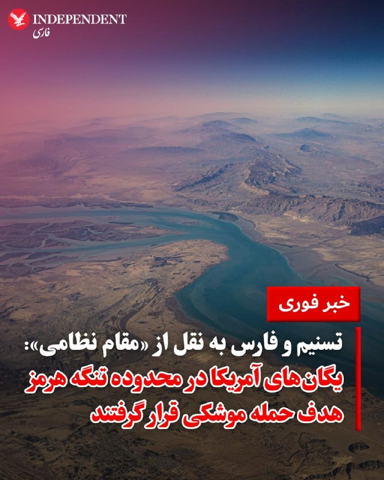
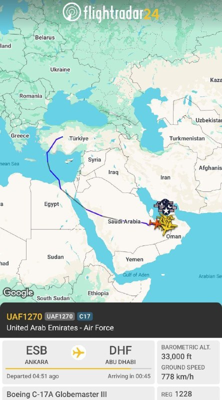
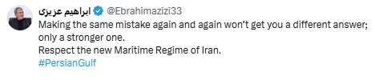
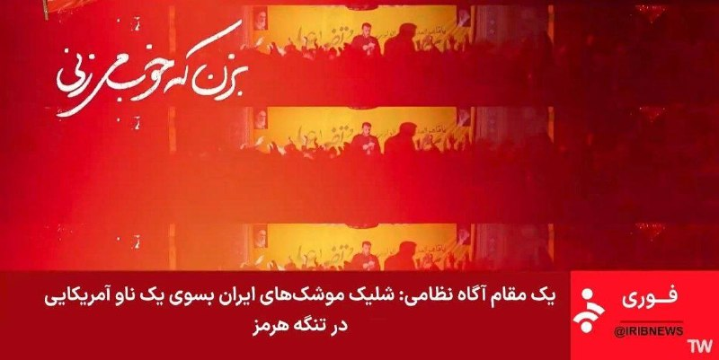
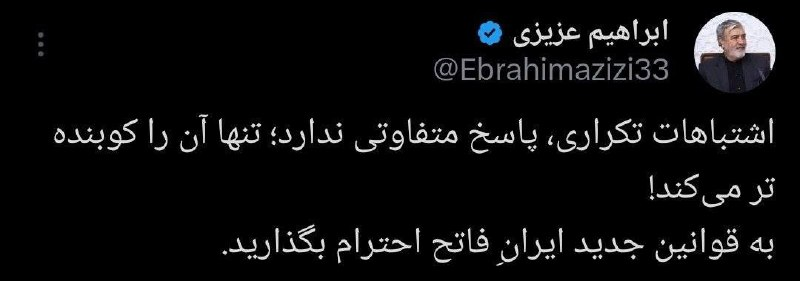
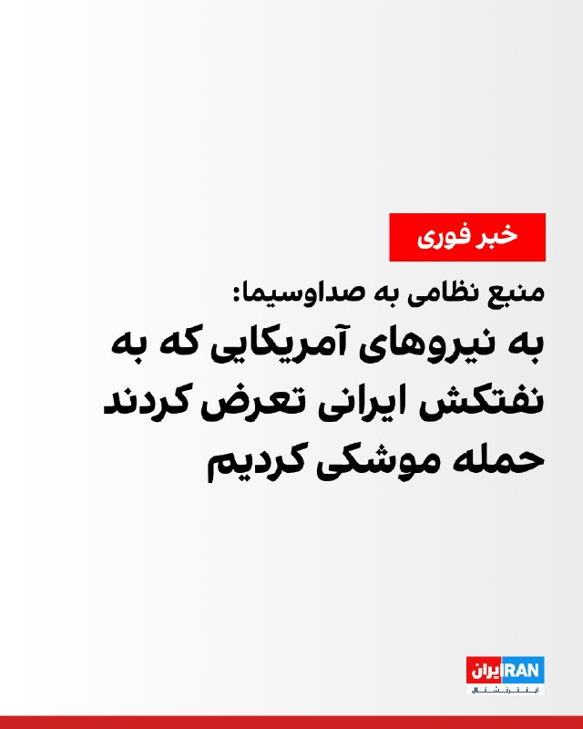
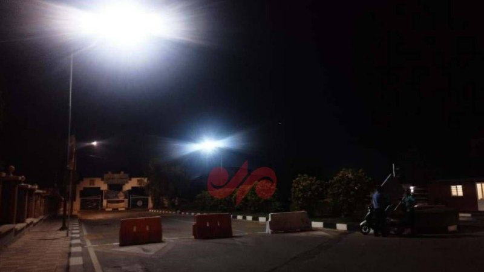
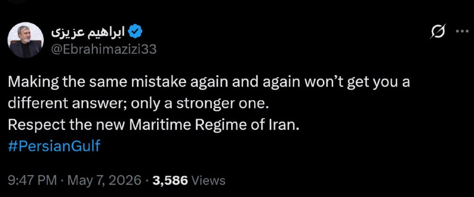

# خواننده تلگرام

<!-- MSG START -->

---
📅 بروزرسانی: 1405/02/17 23:42
---

## VahidOOnLine — post 238736

🗣روایت شما از زندگی در آتش‌بس- پنجشنبه ۱۷ اردیبهشت ۱۴۰۵

🔹در غرب جزیره قشم، چندین صدای انفجار در فاصله‌های کوتاه، حدود ساعت ۹:۲۵ تا ۱۰:۰۲ شب، شنیده شده و بعضی ساکنان از لرزش شیشه‌ها و احساس موج انفجار گفتن
🔹در بندرعباس، چند مورد صدای انفجار حوالی ساعت ۲۱:۳۰ تا ۲۲:۰۴ گزارش شده
🔹در بندر خمیر هم انفجارهای پیاپی و نسبتاً شدید حدود ساعت ۲۱:۳۰ شنیده شده
🔹در بندر کنگ، بعضی‌ها از شنیدن صداهای متعدد و احتمال پرتاب یا لانچ شیء ناشناس حوالی ساعت ۲۱:۵۰ گفتن
🔹در محدوده‌های ساحلی قشم، از جمله حوالی اسکله‌ها، چند صدای انفجار و نور در آسمان دیده شده
🔹در مناطق سیریک و میناب هم صداهای انفجار و مشاهده نور یا حرکت جسم نورانی در آسمان گزارش شده
‌🏁 🇬🇧 IranintlTV

🤖 @VahidOOnLine

## VahidOOnLine — post 238735

  

خبرگزاری صداوسیما به نقل از یک مقام آگاه نظامی گزارش داد «به دنبال تعرض ارتش آمریکا به یک نفت‌کش ایرانی، یگان‌های متعرض دشمن در محدوده تنگه هرمز زیر آتش موشکی جمهوری اسلامی قرار گرفتند که پس از تحمل خسارت مجبور به فرار شدند.»
‌🏁 🇬🇧 IranintlTV

🤖 @VahidOOnLine

## VahidOOnLine — post 238734

  

♦️دو خبرگزاری تسنیم و فارس که هر دو به سپاه پاسداران وابسته‌اند، پنجشنبه‌شب، ۱۷ اردیبهشت و همزمان با گزارش‌ها از شنیده شدن صدای انفجار در جزیره قشم و بندرعباس، به نقل از یک «مقام آگاه نظامی» اعلام کردند که نیروهای نظامی جمهوری اسلامی، یگان‌های آمریکایی در محدوده تنگه هرمز را هدف حمله موشکی قرار دادند. این مقام مدعی شد که این نیروها به یک نفتکش ایرانی «تجاوز» کرده بودند و پس از این حمله موشکی «متحمل خسارت شده» و عقب‌نشینی کرده‌اند.

ستاد فرماندهی مرکزی ارتش آمریکا، سنتکام واکنشی به این ادعا نشان نداده است.
‌🇸🇦 Indypersian

🤖 @VahidOOnLine

## mwarmonitor — post 8655

  

✈️🇦🇪نیروی هوایی امارات (UAE) یک فروند C-17A از آنکارا بازگشته که در آنجا تجهیزات نظامی (احتمالاً پهپاد) را تحویل گرفته است.

✈️در همین حال، ۶ فروند تانکر سوخت‌رسان نیروی هوایی آمریکا (USAF) در آسمان امارات فعال هستند و در حال سوخت‌رسانی به جنگنده‌ها می‌باشند.

@mwarmonitor

## pm_afshaa — post 90324

صداوسیما : ناوگان آمریکایی به یک نفتکش ما تعرض کرد و ما هم در پاسخ بهش حمله ی موشکی کردیم

💧 Rainbet.com the #1 Non-KYC Crypto Casino & Sportsbook @rainbetcom

😁 @Pm_Afshaa

## pm_afshaa — post 90323

🔴یک نفتکش سپاه در تنگه هرمز هدف گرفت

💧 Rainbet.com the #1 Non-KYC Crypto Casino & Sportsbook @rainbetcom

😁 @Pm_Afshaa

## pm_afshaa — post 90322

  

ابراهیم عزیزی : مرتکب شدن دوباره و دوباره همان اشتباه، پاسخ متفاوتی به شما نخواهد داد.

به رژیم جدید دریایی ایران احترام بگذارید

💧 Rainbet.com the #1 Non-KYC Crypto Casino & Sportsbook @rainbetcom

😁 @Pm_Afshaa

## iaghapour — post 2589

🔻اطلاعیه مهم: معرفی فروشندگان کانفیگ

طبق نتایج نظرسنجی اخیر، قصد داریم فروشندگان قدیمی و معتبری که از قبل می‌شناسیم را یکی‌یکی برای خرید به شما معرفی کنیم.

📌 قوانین و شرایط مربوط به فروشندگان:

— عدم پذیرش فروشنده جدید: در حال حاضر شخص جدیدی معرفی نمی‌شود؛ بنابراین لطفاً در قسمت «تماس با ما» برای معرفی خود پیام ندهید. افرادی که معرفی می‌شوند، همگی پیش‌تر در کانال ما سابقه تبلیغ داشته‌اند.

— تضمین خرید شما: مبلغی از پول این افراد نزد ما به عنوان امانت می‌ماند تا در صورت بروز هرگونه مشکل، بتوانیم مطالبات شما کاربران عزیز را پیگیری کنیم.

— ضمانت بازگشت وجه: این فروشندگان موظف‌اند در صورت لزوم (بسته به شرایطی که خودشان به شما اعلام می‌کنند)، بین ۴۸ تا ۷۲ ساعت امکان عودت وجه را فراهم کنند.

— قیمت منصفانه: تمامی این افراد تعهد داده‌اند که نسبت به شرایط بازار، قیمت‌های منصفانه‌تری برای کاربران کانال ما در نظر بگیرند.

⚠️ نکات مهم برای کاربران عزیز:

— انتظارات از کیفیت: کانفیگ‌ها باید بتوانند تلگرام، اینستاگرام و یوتیوب را به راحتی باز کنند. با توجه به شرایط فعلی اینترنت، داشتن سرعت‌های بسیار بالایِ گذشته کمی دور از انتظار است (هرچند ممکن است کیفیت سرویس‌ها عالی باشد)، پس لطفاً واقع‌بین باشید.

— اختلال و پشتیبانی: ممکن است در طول هفته، گاهی با اختلال مواجه شوید. پشتیبان‌ها موظف‌اند در سریع‌ترین زمان ممکن مشکل را حل کنند؛ اما لطفاً صبور باشید، حداقل یک ساعت به آن‌ها فرصت دهید و از ایجاد فشار زودهنگام به پشتیبانی کانال‌ها خودداری کنید.

— در ضمن، توجه داشته باشید که ما ذی‌نفع این کانال‌ها نیستیم و فقط به دلیل درخواست‌های زیاد شما این دوستان را معرفی می‌کنیم.

## VahidOnline — post 75306

  <a href="telegram/content/VahidOnline_75306_1778184725.mp4">🎬 Download video</a>

صداوسیما به نقل از یک مقام آگاه نظامی گزارش داد «به دنبال تعرض ارتش آمریکا به یک نفت‌کش ایرانی، یگان‌های متعرض دشمن در محدوده تنگه هرمز زیر آتش موشکی جمهوری اسلامی قرار گرفتند که پس از تحمل خسارت مجبور به فرار شدند.»
@VahidOOnLine

📡 @VahidOnline

## kianmeli1 — post 87236

  

🔴فوری-زیرنویس شبکه خبر

به ناو امریکایی موشک زده ایم
https://t.me/kianmeli1

## kianmeli1 — post 87235

  

🔴فوری-رئیس کمیسیون امنیت ملی در پاسخ به حملات امشب

حمله کوبنده میکنیم
https://t.me/kianmeli1

## kianmeli1 — post 87234

  <a href="telegram/content/kianmeli1_87234_1778184726.mp4">🎬 Download video</a>

🔴فوری-صدا و سیما جمهوری اسلامی

ناو امریکایی را هدف قرار دادیم و فرار کرد
https://t.me/kianmeli1

## IranIntlTV — post 336032

🗣روایت شما از زندگی در آتش‌بس- پنجشنبه ۱۷ اردیبهشت ۱۴۰۵

🔹در غرب جزیره قشم، چندین صدای انفجار در فاصله‌های کوتاه، حدود ساعت ۹:۲۵ تا ۱۰:۰۲ شب، شنیده شده و بعضی ساکنان از لرزش شیشه‌ها و احساس موج انفجار گفتن
🔹در بندرعباس، چند مورد صدای انفجار حوالی ساعت ۲۱:۳۰ تا ۲۲:۰۴ گزارش شده
🔹در بندر خمیر هم انفجارهای پیاپی و نسبتاً شدید حدود ساعت ۲۱:۳۰ شنیده شده
🔹در بندر کنگ، بعضی‌ها از شنیدن صداهای متعدد و احتمال پرتاب یا لانچ شیء ناشناس حوالی ساعت ۲۱:۵۰ گفتن
🔹در محدوده‌های ساحلی قشم، از جمله حوالی اسکله‌ها، چند صدای انفجار و نور در آسمان دیده شده
🔹در مناطق سیریک و میناب هم صداهای انفجار و مشاهده نور یا حرکت جسم نورانی در آسمان گزارش شده

## IranIntlTV — post 336031

  

خبرگزاری صداوسیما به نقل از یک مقام آگاه نظامی گزارش داد «به دنبال تعرض ارتش آمریکا به یک نفت‌کش ایرانی، یگان‌های متعرض دشمن در محدوده تنگه هرمز زیر آتش موشکی جمهوری اسلامی قرار گرفتند که پس از تحمل خسارت مجبور به فرار شدند.»
https://iranintl.com/202605074827

## IranIntlTV — post 336030

  <a href="telegram/content/IranIntlTV_336030_1778184728.mp4">🎬 Download video</a>

بر اساس اطلاعات رسیده به ایران‌اینترنشنال، خبر دیدار مسعود پزشکیان با مجتبی خامنه‌ای جعلی بوده و چنین ملاقاتی انجام نشده است.

منابع ایران‌اینترنشنال می‌گویند درخواست ملاقات پزشکیان پنج بار از سوی دفتر خامنه‌ای رد شده است. پزشکیان ساعاتی پیش گفته بود این نشست در فضایی «صمیمی» برگزار شده و حدود دو ساعت و نیم طول کشیده است.
@iranintltv

## ManotoTV — post 105105

  <a href="telegram/content/ManotoTV_105105_1778184730.mp4">🎬 Download video</a>

دونالد ترامپ، رئیس‌جمهور آمریکا، اعلام کرد در گفت‌وگوی تلفنی با اورزولا فون‌درلاین، رئیس کمیسیون اروپا، دو طرف بر جلوگیری از دستیابی جمهوری اسلامی به سلاح هسته‌ای تأکید کرده‌اند.

او در تروث‌سوشال نوشت: «کاملاً متحد هستیم که ایران هرگز نباید به سلاح هسته‌ای دست پیدا کند.»

ترامپ در ادامه افزود: «ما توافق داریم رژیمی که مردم خود را می‌کشد، نمی‌تواند بمبی را در اختیار داشته باشد که قادر است میلیون‌ها نفر را از بین ببرد.»

## FarsiVOA — post 217140

  <a href="telegram/content/FarsiVOA_217140_1778184730.mp4">🎬 Download video</a>

⚡️شکریا برادوست در برنامه تفسیر خبر: پرزیدنت ترامپ توپ را در داخل زمین جمهوری اسلامی انداخته است
@FarsiVOA

## Persian_Trend_Official — post 13629

  <a href="telegram/content/Persian_Trend_Official_13629_1778184731.jpg">🎬 Download video</a>

🔴شبکه خبر

💢اخبار مربوط به حمله هوایی به اسکله‌ای در قشم هنوز تایید نشده است.

🫆:Tony

📌 @persian_trend_official
پرشین ترند | متفاوت‌ترین کانال نظامی

## Persian_Trend_Official — post 13628

🔴تسنیم

تکذیب انفجار در سیریک/ صدای شنیده شده در سیریک مربوط به هشدار نیروی دریایی سپاه به برخی کشتی‌ها برای تردد غیرمجاز است

💢 براساس پیگیری خبرنگار تسنیم، تاکنون هیچ انفجار و برخوردی در سیریک گزارش نشده و شهر در امنیت کامل قرار دارد.

💢 طبق اعلام منابع مطلع صداهای انفجار در این شهر مربوط به هشدارهای نیروی دریایی سپاه به برخی کشتی‌ها برای تردد غیرمجاز است.

🫆:Tony

📌 @persian_trend_official
پرشین ترند | متفاوت‌ترین کانال نظامی

## IranianMinds — post 19731

🔴 صداوسیما : ناوگان آمریکایی به یک نفتکش ما تعرض کرد و ما هم در پاسخ بهش حمله ی موشکی کردیم. @IranianMinds

## Dirty_Kids — post 389062

امارات واستاد پدافند لیزری و گنبد آهنین از اسرائیل بگیره بعد حمله کنه

همه‌جا اول دفاع مهمه بعد حمله الا جمهوری اسلامی چون ما مردم بتخمشونیم

@Dirty_Kids 👻

## manototv — post 105105

  <a href="telegram/content/manototv_105105_1778184731.mp4">🎬 Download video</a>

دونالد ترامپ، رئیس‌جمهور آمریکا، اعلام کرد در گفت‌وگوی تلفنی با اورزولا فون‌درلاین، رئیس کمیسیون اروپا، دو طرف بر جلوگیری از دستیابی جمهوری اسلامی به سلاح هسته‌ای تأکید کرده‌اند.

او در تروث‌سوشال نوشت: «کاملاً متحد هستیم که ایران هرگز نباید به سلاح هسته‌ای دست پیدا کند.»

ترامپ در ادامه افزود: «ما توافق داریم رژیمی که مردم خود را می‌کشد، نمی‌تواند بمبی را در اختیار داشته باشد که قادر است میلیون‌ها نفر را از بین ببرد.»

## alonews — post 118487

  

👈هم اکنون اسکله بهمن قشم

✅ @AloNews خبر جنگ

## alonews — post 118486

  

👈رئیس کمیسیون امنیت ملی مجلس، ابراهیم عزیزی: تکرار همان اشتباه بارها و بارها پاسخ متفاوتی به شما نخواهد داد؛ فقط پاسخی قوی‌تر خواهد بود.

🔴به رژیم جدید دریایی ایران احترام بگذارید.

✅ @AloNews خبر جنگ

## alonews — post 118485

  <a href="telegram/content/alonews_118485_1778184732.jpg">🎬 Download video</a>

👈گویا ۷-۸ موشک از استان هرمزگان در جنوب ایران به سمت منطقه تنگه هرمز شلیک شد. 
✅ @AloNews خبر جنگ

---
📅 بروزرسانی: 1405/02/17 23:32
---

## VahidOOnLine — post 238733

  

♦️خبرگزاری تسنیم، وابسته به سپاه پاسداران شامگاه پنجشنبه ۱۷ اردیبهشت با متهم کردن امارات متحده عربی درباره انفجارهای قشم اعلام کرد: «نشانه‌هایی از اقدام خصمانه امارات در اسکله بهمن قشم وجود دارد.»

این رسانه با تاکید بر اینکه «صدای چند انفجار در بندرعباس مربوط به مقابله پدافند با دو ریزپرنده بوده است» نوشت: «برخی منابع از اقدام خصمانه دولت امارات، به عنوان آلت دست اسرائیل، در اسکله بهمن قشم خبر می‌دهند.»

رسانه نزدیک به سپاه پاسداران امارات را تهدید و نوشته است «در صورتی که این مساله تایید شود امارات هزینه اقدام خصمانه خود را خواهد پرداخت.»
هنوز هیچ منبع رسمی این موضوع را تایید نکرده است.

پیشتر علی خضریان نماینده مجلس شورای اسلامی در یک برنامه تلویزیونی گفته بود: «نگاه ایران به امارات تغییر کرده و این کشور را دیگر همسایه نمی‌داند بلکه پایگاه متخاصم دشمن می‌داند.»
‌🇸🇦 Indypersian

🤖 @VahidOOnLine

## VahidOOnLine — post 238732

  

♦️ شبکه خبری آی۲۴ نیوز به نقل از منابع اسرائیلی اعلام کرد که این کشور در حوادث پنجشنبه‌شب، ۱۷ اردیبهشت در جنوب ایران نقشی نداشته است. خبرگزاری فارس، وابسته به سپاه پاسداران اعلام کرد که صداهای انفجار در حوالی بندرعباس شنیده شده که مربوط به تبادل آتش «با دشمن» بوده است. به گفته فارس، در این تبادل آتش، اسکله بهمن در جزیره قشم که فاصله زیادی با بندرعباس ندارد، هدف قرار گرفته است.
‌🇸🇦 Indypersian

🤖 @VahidOOnLine

## mwarmonitor — post 8654

  

🇺🇸یک ملوان نیروی دریایی آمریکا علامت می‌دهد در حالی که یک هواپیمای EA-18G Growler از عرشه پرواز ناو USS George H.W. Bush (CVN 77) برخاسته است. این ناو در حال فعالیت در کنار بیش از ۲۰ کشتی جنگی آمریکا است که برای اجرای محاصره علیه ایران به‌کار گرفته شده‌اند.

@mwarmonitor

## pm_afshaa — post 90321

🔴حمله موشکی جمهوری اسلامی به ناو های آمریکا

💧 Rainbet.com the #1 Non-KYC Crypto Casino & Sportsbook @rainbetcom

😁 @Pm_Afshaa

## pm_afshaa — post 90320

پرتاب چندین موشک از هرمزگان

💧 Rainbet.com the #1 Non-KYC Crypto Casino & Sportsbook @rainbetcom

😁 @Pm_Afshaa

## pm_afshaa — post 90319

خار عرب و عرب پرستو گاییدم بزنین ننه همو بگایین کیرم تو جفتتون بره

## pm_afshaa — post 90318

🔴میدل ایست: امارات متحده عربی به ایران حمله کرده

💧 Rainbet.com the #1 Non-KYC Crypto Casino & Sportsbook @rainbetcom

😁 @Pm_Afshaa

## DEJradio — post 4488

  <a href="telegram/content/DEJradio_4488_1778184148.mp4">🎬 Download video</a>

🎥
🚨 تصاویری از حضور پهپادهای شناسایی در آسمان بندرعباس در شامگاه پنجشنبه ۱۷ اردیبهشت.

#بندرعباس #پهپاد
@DEJradio

## DEJradio — post 4487

🔸
⭕️ نشریه میدل ایست مدعی شد که حملات اخیر به قشم توسط امارات صورت گرفته است. #انفجار #قشم #امارات @DEJradio

## kianmeli1 — post 87233

🔴فوری-برخورد موشک سپاه به ناو امریکا در تنگه هرمز
https://t.me/kianmeli1

## kianmeli1 — post 87232

🔴فوری-حمله موشکی سپاه به ناو امریکایی
https://t.me/kianmeli1

## kianmeli1 — post 87231

🔴فوری-نفتکش سپاه در تنگه هرمز هدف گرفته شد
https://t.me/kianmeli1

## kianmeli1 — post 87230

‏🔴فوری-خبرگزاری تسنیم، وابسته به سپاه، گزارش داد که برخی منابع از «اقدام خصمانه» امارات متحده عربی در اسکله بهمن در جزیره قشم خبر می‌دهند
https://t.me/kianmeli1

## IranIntlTV — post 336029

  <a href="telegram/content/IranIntlTV_336029_1778184149.mp4">🎬 Download video</a>

سازمان همبستگی ملی برای ایران از برگزاری تجمعی اعتراضی در حمایت از مردم ایران در روز شنبه ۹ مه ساعت ۲ بعدازظهر مقابل کاخ سفید خبر داد. محورهای این تجمع آزادی زندانیان سیاسی، اینترنت آزاد و مخالفت با اعدام اعلام شده است.

گفت‌وگو با سیامک آرام، تحلیل‌گر سیاسی و مدرس دانشگاه
@iranintltv

## IranIntlTV — post 336028

  <a href="telegram/content/IranIntlTV_336028_1778184151.mp4">🎬 Download video</a>

نماینده آمریکا در سازمان ملل در نشست خبری مشترک با مقام‌های کشورهای عربی گفت ایران باید مین‌های تنگه هرمز را جمع‌آوری و دریافت عوارض از کشتی‌ها را متوقف کند. او تاکید کرد اقدام‌های تهران زمینه‌ساز نابودی تجارت جهانی است.

گفت‌وگو با علیرضا نامور حقیقی، تحلیل‌گر سیاسی
@iranintltv

## IranIntlTV — post 336027

  <a href="https://t.me/IranintlTV/336027">📎 Download file</a>

🎧نسخه صوتی ‌‌‏۲۴ با فرداد فرحزاد: خبر فوری: احتمال ازسرگیری پروژه آزادی تنگه هرمز با چراغ سبز ریاض
@iranintlTV

## FarsiVOA — post 217139

⚡️در گفت‌وگو با ابراهیم روشندل، دیپلمات پیشین ساکن مریلند، به توافق «بسیار محتمل» میان ایران و آمریکا پرداختیم؛ به گفته ابراهیم روشندل، تأخیر جمهوری اسلامی در پاسخ رسمی به آمریکا، بیش از هر چیز ناشی از اختلافات داخلی و تلاش برای مدیریت بحران است.
@FarsiVOA

## Persian_Trend_Official — post 13627

  <a href="telegram/content/Persian_Trend_Official_13627_1778184155.jpg">🎬 Download video</a>

🔴صدا و سیما جمهوری اسلامی مدعی است سپاه پاسداران به سمت ناوگان نیروی دریایی امریکا که در تلاش برای حمله به یک نفتکش ایرانی بوده اند شلیک کرده است

🫆:Tony

📌 @persian_trend_official
پرشین ترند | متفاوت‌ترین کانال نظامی

## Persian_Trend_Official — post 13626

یک شب معمولی در خاورمیانه:

📝 Nick

📌 @persian_trend_official
پرشین ترند | متفاوت‌ترین کانال نظامی

## RadioFarda — post 156947

  

🔸دونالد ترامپ، رئیس‌جمهور آمریکا، روز پنجشنبه گفت که با اورسولا فون در لاین، رئیس کمیسیون اروپا، دربارهٔ ایران و مذاکرات تجاری جاری با اتحادیه اروپا گفت‌وگو کرده است.

🔸او در پستی در شبکه اجتماعی تروث سوشال نوشت: «ما دربارهٔ موضوعات بسیاری گفت‌وگو کردیم، از جمله این‌که کاملاً متحد هستیم که ایران هرگز نباید به سلاح هسته‌ای دست پیدا کند.»

🔸او افزود: «ما توافق داریم که رژیمی که مردم خودش را می‌کشد، نمی‌تواند بمبی را در اختیار داشته باشد که قادر است میلیون‌ها نفر را بکشد.»

🔸این در حالی است که ایران همچنان در حال بررسی طرح آمریکا است که از طریق میانجی‌گران پاکستانی دریافت کرده و هنوز پاسخ خود به پیشنهاد آمریکا برای پایان دادن به جنگ را نهایی نکرده است.

🔸ساعتی پیش عباس عراقچی، در نامه‌ای به دبیرکل سازمان ملل و و رئیس شورای امنیت این نهاد اعلام کرد «تردد عادی دریایی» در تنگه هرمز مشروط به «توقف دائمی جنگ و رفع محاصره و تحریم‌های غیرقانونی علیه ایران» است.

🔸او در این نامه از قطعنامه پیشنهادی آمریکا و بحرین به شورای امنیت سازمان ملل انتقاد کرد.

@RadioFarda

## IranianMinds — post 19730

🔴 حرومزاده های دروغگو سه ساعت سرکارمون گذاشتن

خبرگزاری تسنیم :

صدای انفجارهای شنیده شده در شهرستان سیریک، جنوب ایران، ناشی از عملیات کشتی‌های هشدار نیروی دریایی سپاه پاسداران بود که هشدار دادند بدون مجوز از تنگه هرمز عبور نکنند !

@IranianMinds

## IranianMinds — post 19729

  

🔴 ابراهیم عزیزی :

مرتکب شدن دوباره و دوباره همان اشتباه، پاسخ متفاوتی به شما نخواهد داد.

به رژیم جدید دریایی ایران احترام بگذارید.

@IranianMinds

## IranianMinds — post 19728

🔴 صداوسیما :

ناوگان آمریکایی به یک نفتکش ما تعرض کرد و ما هم در پاسخ بهش حمله ی موشکی کردیم.

@IranianMinds

## IranianMinds — post 19727

🔴 صداوسیما :

به ناوهای آمریکایی حمله کردیم.

@IranianMinds

## IranianMinds — post 19726

جمهوری اسلامی حدود 7 - 8 موشک به سمت خلیج فارس شلیک کرد !

@IranianMinds

## BBCPersian — post 280435

🔻واشنگتن‌پست: منابع اطلاعاتی آمریکا می‌گویند ایران ماه‌ها می‌تواند در برابر محاصره بنادرش مقاومت کند

روزنامه واشنگتن‌پست طی گزارشی اختصاصی از مفاد یک تحلیل سازمان اطلاعات مرکزی آمریکا، سیا، گزارش کرده منابع اطلاعاتی آمریکا بر این باورند که ایران می‌تواند تا ۹۰ روز یا بیشتر در برابر محاصره دریایی بنادرش مقاومت کند.

گزارش واشنگتن پست بر اساس چهار منبع آگاه از محتوای یک سند محرمانه سیا تهیه شده است که این هفته در اختیار تصمیم‌گیرندگان در واشنگتن قرار گرفته است. به گفته این روزنامه، این ارزیابی، خوش‌بینی‌های دونالد ترامپ، رئیس‌جمهور آمریکا، درباره توانایی محاصره دریایی برای وادار کردن ایران به سازش را زیر سوال می‌برد.

به گزارش واشنگتن پست، سند سیا همچنین حاکی از آن است که ایران هنوز حدود ۷۵ درصد از پرتابگرهای موشکی خود را که پیش از جنگ داشت و همچنین حدود ۷۰ درصد از موشک‌های خود را در اختیار دارد.

این منبع افزود که شواهدی وجود دارد مبنی بر اینکه حکومت ایران موفق شده «تقریباً تمام» تأسیسات زیرزمینی‌ای را که اسرائیل و آمریکا ورودی آنها را بمباران کرده بودند دوباره بازگشایی کند و برخی از موشک‌های آسیب‌دیده در حملات را تعمیر کند.

https://bbc.in/4u0pRd3
@BBCPersian

## Dirty_Kids — post 389061

فارس: حملهٔ موشکی به ناوگان آمریکایی پس از تعرض به نفتکش ایرانی

@Dirty_Kids 👻

## alonews — post 118484

  <a href="telegram/content/alonews_118484_1778184157.jpg">🎬 Download video</a>

👈صدا سیما: اخبار مربوط به حمله هوایی به اسکله‌ای در قشم هنوز تایید نشده است

✅ @AloNews خبر جنگ

## alonews — post 118483

  <a href="telegram/content/alonews_118483_1778184157.jpg">🎬 Download video</a>

👈تسنیم تکذیب کرد: صدای انفجارهای شنیده شده در شهرستان سیریک، جنوب ایران، ناشی از عملیات کشتی‌های هشدار نیروی دریایی سپاه پاسداران بود که هشدار دادند بدون مجوز از تنگه هرمز عبور نکنند

✅ @AloNews خبر جنگ

## alonews — post 118482

  <a href="telegram/content/alonews_118482_1778184157.jpg">🎬 Download video</a>

🔴فوری / به گفته برخی منابع، چندین موشک از جنوب ایران به سمت تنگه هرمز شلیک شده است. 
✅ @AloNews خبر جنگ

## alonews — post 118481

  <a href="telegram/content/alonews_118481_1778184158.jpg">🎬 Download video</a>

👈رئیس کمیسیون امنیت ملی مجلس در پاسخ به حملات امشب: منتظر پاسخ کوبنده‌تر باشید!

✅ @AloNews خبر جنگ

## alonews — post 118480

  <a href="telegram/content/alonews_118480_1778184158.jpg">🎬 Download video</a>

🔴فوری / به گفته برخی منابع، چندین موشک از جنوب ایران به سمت تنگه هرمز شلیک شده است.

✅ @AloNews خبر جنگ

---
📅 بروزرسانی: 1405/02/17 23:22
---

## VahidOOnLine — post 238731

  

♦️دونالد ترامپ، رئیس‌جمهوری آمریکا، روز پنجشنبه ۱۷ اردیبهشت در پیامی در شبکه اجتماعی تروث سوشال از گفتگوی تلفنی با اورزولا فون در لاین، رئیس کمیسیون اروپا، خبر داد. ترامپ اعلام کرد که دو طرف بر سر جلوگیری قاطع از دستیابی جمهوری اسلامی به سلاح هسته‌ای توافق نظر کامل دارند و تاکید کردند رژیمی که مردم خود را می‌کشد، نباید به بمبی دست یابد که می‌تواند میلیون‌ها نفر را به کام مرگ بکشد.

ترامپ در بخش دیگری از پیام خود، با اشاره به توافق تجاری تاریخی «ترنبری»، به اتحادیه اروپا هشدار داد که باید به وعده خود مبنی بر صفر کردن تعرفه‌های گمرکی عمل کند. او تصریح کرد که تا سالگرد ۲۵۰ سالگی استقلال آمریکا (۴ ژوئیه ۲۰۲۶) به اروپا فرصت می‌دهد تا این تعهد را اجرایی کند؛ در غیر این صورت، تعرفه‌های واردات از اتحادیه اروپا بلافاصله به سطوح بسیار بالاتری افزایش خواهد یافت.
‌🇸🇦 Indypersian

🤖 @VahidOOnLine

## mwarmonitor — post 8653

جمهوری اسلامی اعلام کرده امارات به بندرعباس و قشم حمله کرده

## pm_afshaa — post 90317

صدا سیما : امارات جرات نداره بهمون حمله کنه

💧 Rainbet.com the #1 Non-KYC Crypto Casino & Sportsbook @rainbetcom

😁 @Pm_Afshaa

## pm_afshaa — post 90315

فعالیت شدید سوخت رسان ها در خاورمیانه

💧 Rainbet.com the #1 Non-KYC Crypto Casino & Sportsbook @rainbetcom

😁 @Pm_Afshaa

## pm_afshaa — post 90314

صداوسیما: اسکله مسافربری بهمن در جزیره قشم هدف حمله دشمن قرار گرفت

ساختمان اداری این اسکله هدف حمله بود

💧 Rainbet.com the #1 Non-KYC Crypto Casino & Sportsbook @rainbetcom

😁 @Pm_Afshaa

## DEJradio — post 4486

  

🚨
⭕️ آخرین شرایط ترافیک هوایی در منطقه
#خاورمیانه
@DEJradio

## kianmeli1 — post 87229

🔴فوری-میدل ایست: امارات متحده عربی به ایران حمله کرده
https://t.me/kianmeli1

## kianmeli1 — post 87228

🔴ساعت حدود ۲۳:۱۵ پنجشنبه؛ تعداد ۷ یا ۸ موشک از جنوب هرمزگان به سمت محدوده‌ی تنگه هرمز شلیک شد.
https://t.me/kianmeli1

## Shin_Persian — post 5867

Shin ✓ @hey_itsmyturn
Thu, 07 May 2026 19:50:09 UTC

Earlier: AA activity in Bidganeh (Bidkaneh), West of Tehran
Regime confirms, adds that it was "due to testing the air defense systems"

فارسی

پیش‌تر: فعالیت پدافند هوایی در بیدگنه، غرب تهران
رژیم تایید کرد و افزود که این موضوع «به دلیل آزمایش سامانه‌های پدافند هوایی» بوده است.

𝕏 · @shin_persian

## Shin_Persian — post 5866

↩️ Quoted tweet: Josh Young ✓ @JoshYoung Thu, 07 May 2026 19:43:33 UTC "Peace" in the Middle East sure is different! https://x.com/i/status/2052467946404950427 ↩️ توییت نقل‌قول شده — برای پاسخ، پست زیر را ببینید. فارسی «صلح» در خاورمیانه واقعاً متفاوت…

## Shin_Persian — post 5865

↩️ Quoted tweet:
Josh Young ✓ @JoshYoung
Thu, 07 May 2026 19:43:33 UTC

"Peace" in the Middle East sure is different!
https://x.com/i/status/2052467946404950427

↩️ توییت نقل‌قول شده — برای پاسخ، پست زیر را ببینید.

فارسی

«صلح» در خاورمیانه واقعاً متفاوت است!
https://x.com/i/status/2052467946404950427

𝕏 · @shin_persian

## Iliaen — post 4427

ساعت حدود ۲۳:۱۵ پنجشنبه؛ تعداد ۷ یا ۸ موشک از جنوب هرمزگان به سمت محدوده‌ی تنگه هرمز شلیک شد.

@iliaen

## FarsiVOA — post 217138

🔺دونالد ترامپ: جمهوری اسلامی «که مردم خودش را می‌کشد نباید کنترل بمبی را داشته باشد که می‌تواند میلیون‌ها نفر را بکشد»

▪️دونالد ترامپ، رئیس جمهوری آمریکا روز پنجشنبه در تروت‌سوشال اعلام کرد که با اورزولا فون در لاین، رئیس کمیسیون اروپا «تماس بسیار خوبی» داشت و در این تماس در مورد ایران گفت‌وگو کرد.

⬇️ بیشتر بخوانید:
https://ir.voanews.com/a/8147693.html
@FarsiVOA

## FarsiVOA — post 217137

  <a href="telegram/content/FarsiVOA_217137_1778183540.mp4">🎬 Download video</a>

⚡️بن‌بست تجاری اروپا و آمریکا در کنار نشست بروکسل‌؛ چالش‌های جدید اقتصاد و رقابت جهانی
@FarsiVOA

## Persian_Trend_Official — post 13625

همراهان پرشین ترند که فیلم یا عکسی از حملات امشب دارند به پی وی من ارسال کنند 🫶🙏

@Tony_Soprano007

## BBCPersian — post 280434

  <a href="telegram/content/BBCPersian_280434_1778183541.mp4">🎬 Download video</a>

🔴 از آن که گزارش‌هایی در مورد شنیده شدن صدای انفجارهایی در حوالی بندرعباس و جزیره قشم در رسانه‌های ایران منتشر شد، خبرگزاری فارس اکنون می‌گوید که بررسی‌هایش نشان می‌دهد «در جریان تبادل آتش میان نیروهای مسلح ایران و دشمن بخش‌هایی تجاری اسکله بهمن قشم هدف قرار گرفته است.»
خبرگزاری صدا و سیما هم گزارش کرده «انفجار در اسکله بهمن قشم در جریان تبادل آتش میان نیروهای مسلح ایران و دشمن رخ داده است.»
به گزارش صدا و سیما، ساختمان اداری این اسکله هدف حمله بود.

https://bbc.in/4etLM7w
@BBCPersian

## Dirty_Kids — post 389060

ساعت حدود ۲۳:۱۵ پنجشنبه؛ تعداد ۷ یا ۸ موشک از جنوب هرمزگان به سمت محدوده‌ی تنگه هرمز شلیک شد.

@Dirty_Kids 👻

## alonews — post 118479

  <a href="telegram/content/alonews_118479_1778183543.jpg">🎬 Download video</a>

👈یک مقام آگاه نظامی: به دنبال تعرض ارتش متجاوز آمریکا به یک نفت کش ایرانی یگان های متعرض دشمن در محدوده تنگه هرمز زیر آتش موشکی ایران قرار گرفتند که پس از تحمل خسارت مجبور به فرار شدند

✅ @AloNews خبر جنگ

## alonews — post 118478

  <a href="telegram/content/alonews_118478_1778183543.mp4">🎬 Download video</a>

👈دقایقی پیش، آسمان بندرعباس

✅ @AloNews خبر جنگ

## alonews — post 118477

  <a href="telegram/content/alonews_118477_1778183544.jpg">🎬 Download video</a>

👈علت شلیک پدافند هوایی در غرب کشور، ورود ریز پرنده های شناسایی بوده است

✅ @AloNews خبر جنگ

## alonews — post 118475

  <a href="telegram/content/alonews_118475_1778183544.jpg">🎬 Download video</a>

👈آسمان خاورمیانه هم اکنون !

✅ @AloNews خبر جنگ

---
📅 بروزرسانی: 1405/02/17 23:12
---

## VahidOOnLine — post 238730

  

نماینده کویت در سازمان ملل در نشست شورای امنیت گفت حمایت گسترده از پیش‌نویس قطعنامه تنگه هرمز بیانگر تعهد مشترک کشورها به آزادی ناوبری، امنیت مسیرهای دریایی و احترام به حقوق بین‌الملل است. او تاکید کرد این اصول مسئولیت‌هایی جمعی هستند که مستقیما با حفظ صلح و امنیت بین‌المللی ارتباط دارند.

نماینده کویت افزود اهمیت این پیش‌نویس در تاکید دوباره بر اصل بنیادین نظم بین‌المللی است؛ اینکه آبراه‌های بین‌المللی باید باز و امن باقی بمانند و نباید تحت تهدید یا محدودیت‌های غیرقانونی قرار گیرند.

او گفت هرگونه تلاش برای جلوگیری از عبور قانونی از تنگه هرمز پیامدهایی فراتر از منطقه دارد و بر چارچوب قواعد حاکم بر ناوبری بین‌المللی تاثیر می‌گذارد. به گفته او، این پیش‌نویس با هدف تشدید تنش‌ها ارائه نشده، بلکه بر توازن میان حقوق کشورهای ساحلی و حقوق جامعه بین‌المللی برای ناوبری ایمن تاکید می‌کند و هر اقدام تهدیدکننده کشتیرانی را رد می‌کند.
‌🏁 🇬🇧 IranintlTV

🤖 @VahidOOnLine

## VahidOOnLine — post 238729

  

خبرگزاری فارس، وابسته به سپاه پاسداران، گزارش داد بررسی‌ها در بندرعباس نشان می‌دهد در جریان تبادل آتش میان نیروهای مسلح جمهوری اسلامی و دشمن، بخش‌های تجاری اسکله بهمن هدف قرار گرفته است.

همزمان گزارش‌های رسیده به ایران اینترنشنال حاکی است ساعت ۲۲:۱۵ در قشم و بندرعباس صدای چندین انفجار شنیده شده و پدافندها فعال بوده‌اند.

براساس گزارش‌های رسیده به ایران اینترنشنال، در ساعت ۲۲:۲۷ نیز در شهرستان سیریک شلیک موشک گزارش شده است.
‌🏁 🇬🇧 IranintlTV

🤖 @VahidOOnLine

## VahidOOnLine — post 238728

  

نماینده کویت در سازمان ملل در نشست شورای امنیت گفت حمایت گسترده از پیش‌نویس قطعنامه تنگه هرمز بیانگر تعهد مشترک کشورها به آزادی ناوبری، امنیت مسیرهای دریایی و احترام به حقوق بین‌الملل است. او تاکید کرد این اصول مسئولیت‌هایی جمعی هستند که مستقیما با حفظ صلح و امنیت بین‌المللی ارتباط دارند.

نماینده کویت افزود اهمیت این پیش‌نویس در تاکید دوباره بر اصل بنیادین نظم بین‌المللی است؛ اینکه آبراه‌های بین‌المللی باید باز و امن باقی بمانند و نباید تحت تهدید یا محدودیت‌های غیرقانونی قرار گیرند.

او گفت هرگونه تلاش برای جلوگیری از عبور قانونی از تنگه هرمز پیامدهایی فراتر از منطقه دارد و بر چارچوب قواعد حاکم بر ناوبری بین‌المللی تاثیر می‌گذارد. به گفته او، این پیش‌نویس با هدف تشدید تنش‌ها ارائه نشده، بلکه بر توازن میان حقوق کشورهای ساحلی و حقوق جامعه بین‌المللی برای ناوبری ایمن تاکید می‌کند و هر اقدام تهدیدکننده کشتیرانی را رد می‌کند.
‌🏁 🇬🇧 IranintlTV

🤖 @VahidOOnLine

## VahidOOnLine — post 238727

  

نماینده کویت در سازمان ملل در نشست شورای امنیت گفت حمایت گسترده از پیش‌نویس قطعنامه تنگه هرمز بیانگر تعهد مشترک کشورها به آزادی ناوبری، امنیت مسیرهای دریایی و احترام به حقوق بین‌الملل است. او تاکید کرد این اصول مسئولیت‌هایی جمعی هستند که مستقیما با حفظ صلح و امنیت بین‌المللی ارتباط دارند.

نماینده کویت افزود اهمیت این پیش‌نویس در تاکید دوباره بر اصل بنیادین نظم بین‌المللی است؛ اینکه آبراه‌های بین‌المللی باید باز و امن باقی بمانند و نباید تحت تهدید یا محدودیت‌های غیرقانونی قرار گیرند.

او گفت هرگونه تلاش برای جلوگیری از عبور قانونی از تنگه هرمز پیامدهایی فراتر از منطقه دارد و بر چارچوب قواعد حاکم بر ناوبری بین‌المللی تاثیر می‌گذارد. به گفته او، این پیش‌نویس با هدف تشدید تنش‌ها ارائه نشده، بلکه بر توازن میان حقوق کشورهای ساحلی و حقوق جامعه بین‌المللی برای ناوبری ایمن تاکید می‌کند و هر اقدام تهدیدکننده کشتیرانی را رد می‌کند.
‌🏁 🇬🇧 IranintlTV

🤖 @VahidOOnLine

## VahidOOnLine — post 238726

♦️علی خضریان نماینده مجلس شورای اسلامی در یک برنامه تلویزیونی گفت: «نگاه ایران به امارات تغییر کرده و این کشور را دیگر همسایه نمی‌داند بلکه پایگاه متخاصم دشمن می‌داند.»

خضریان در برنامه «جان فدا» از شبکه سوم صداوسیما با اشاره به جنگ ۴۰ روزه تاکید کرد که «دکترین جدید نظامی و دفاعی ایران در خصوص امارات به مانند اقلیم کردستان عراق است و امارات را پایگاه متخاصم دشمن می داند.»

او اضافه کرد: «تنها در شرایطی که تصمیم بگیرد دیگر با کشورهای دشمن ایران همکاری نکند این شرایط می‌تواند تغییر کند.»

این اظهارات در حالی مطرح شده است که جاسم محمد البدیوی، دبیرکل شورای همکاری خلیج فارس، پنجشنبه‌شب ۱۷ اردیبهشت‌ماه، اظهارات مطرح‌شده در بیانیه وزارت خارجه جمهوری اسلامی علیه امارات متحده عربی را به‌شدت محکوم کرد و گفت شورای همکاری در برابر این «ادعاهای باطل و تجاوزها» کاملا در کنار ابوظبی ایستاده است.

روز سه‌شنبه ۱۵ اردیبهشت، قرارگاه خاتم‌الانبیا ادعاهای امارات درباره حملات موشکی و پهپادی از مبدا ایران را تکذیب کرد و گفت جمهوری اسلامی در روزهای اخیر حمله‌ای علیه خاک امارات انجام نداده است.
‌🇸🇦 Indypersian

🤖 @VahidOOnLine

## VahidOOnLine — post 238725

  <a href="telegram/content/VahidOOnLine_238725_1778182942.mp4">🎬 Download video</a>

تماسی از تهران:
«با همه سختی‌ها، هنوز باید پشت هم باشیم؛
هیچ‌کس از بیرون قرار نیست نجاتمون بده، خودمون باید به هم کمک کنیم و بایستیم.»
‌🏁 🇬🇧 ManotoTV

🤖 @VahidOOnLine

## mwarmonitor — post 8652

  

✈️فقط تانکرهای سوخت‌رسان نیروی هوایی آمریکا (USAF) قابل مشاهده هستند که از پایگاه هوایی الظفره و تل‌آویو برخاسته‌اند.

@mwarmonitor

## mwarmonitor — post 8651

🇺🇸آمریکا شروع به لغو گذرنامه والدینی خواهد کرد که بیش از ۱۰۰٬۰۰۰ دلار بدهی پرداخت‌نشده نفقه فرزند دارند و به‌زودی این سقف را به ۲٬۵۰۰ دلار نیز گسترش خواهد داد — آسوشیتدپرس

@mwarmonitor

## pm_afshaa — post 90313

  

فیلترشکن v2rayپرسرعت ‼️
                                                    

✅ مناسب برای تمام اینترنت‌ها (همراه اول ایرانسل رایتل اینترنت خانگی و ..)

✅ قابل استفاده برای تمام سیستم عامل ها 

😎 ضمانت بازگشت وجه در صورت عدم اتصال

✅ پشتیبانی ۲۴ ساعته تا آخرین مدت اعتبار اشتراک   
  

😎 اشتراک 10 گیگ 😎

✅ فقط و فقط 1/500/000 ✅

👩‍💻 آیدی ثبت سفارش✨پشتیبانی #خریدوفروش : 👇
@SuportSevenStarsVpn

لینک ورود به کانال اصلی:
            
 https://t.me/sevenstars_VPN

## pm_afshaa — post 90312

🔴مصر از استقرار یک اسکادران جنگنده رافائل در امارات خبر داد.

+این جنگنده‌ها به رهگیری پهپادهای سپاه و دفاع از امارات کمک خواهند کرد

💧 Rainbet.com the #1 Non-KYC Crypto Casino & Sportsbook @rainbetcom

😁 @Pm_Afshaa

## pm_afshaa — post 90311

تسنیم: اگه امارات زده باشه ماهم میزنیمش

💧 Rainbet.com the #1 Non-KYC Crypto Casino & Sportsbook @rainbetcom

😁 @Pm_Afshaa

## pm_afshaa — post 90310

🔴کانال 12 اسرائیل : اسرائیل هیچ نقشی در اتفاقات امشب ایران نداره

💧 Rainbet.com the #1 Non-KYC Crypto Casino & Sportsbook @rainbetcom

😁 @Pm_Afshaa

## DEJradio — post 4485

  <a href="telegram/content/DEJradio_4485_1778182947.jpg">🎬 Download video</a>

🚨
⭕️ صدای انفجارها در مناطق بندرعباس و قشم ادامه دارد. #انفجار @DEJradio

## mamlekate — post 103470

📝 آیا ترامپ پیروزی در جنگ ایران را با شکست عوض می‌کند؟

مارک ای. تیسن، ستون‌نویس روزنامه واشینگتن‌پست در تحلیلی به تصمیمات و اقدامات اخیر دونالد ترامپ، رییس‌جمهوری آمریکا، پرداخته و هشدار داده که او در آستانه آن است که پیروزی در جنگ ایران را با شکست معاوضه کند زیرا نحوه پایان دادن به جنگ، به اندازه نحوه آغاز آن اهمیت دارد.

@mamlekate

## kianmeli1 — post 87227

🔴فوری-صداسیما: امیدواریم امارات به ایران حمله کند اما جرات ندارد
https://t.me/kianmeli1

## IranIntlTV — post 336026

  <a href="https://t.me/IranintlTV/336026">📎 Download file</a>

🎧نسخه صوتی دومینو: یک ملت در گروگان
@iranintlTV

## IranIntlTV — post 336025

  

نماینده کویت در سازمان ملل در نشست شورای امنیت گفت حمایت گسترده از پیش‌نویس قطعنامه تنگه هرمز بیانگر تعهد مشترک کشورها به آزادی ناوبری، امنیت مسیرهای دریایی و احترام به حقوق بین‌الملل است. او تاکید کرد این اصول مسئولیت‌هایی جمعی هستند که مستقیما با حفظ صلح و امنیت بین‌المللی ارتباط دارند.

نماینده کویت افزود اهمیت این پیش‌نویس در تاکید دوباره بر اصل بنیادین نظم بین‌المللی است؛ اینکه آبراه‌های بین‌المللی باید باز و امن باقی بمانند و نباید تحت تهدید یا محدودیت‌های غیرقانونی قرار گیرند.

او گفت هرگونه تلاش برای جلوگیری از عبور قانونی از تنگه هرمز پیامدهایی فراتر از منطقه دارد و بر چارچوب قواعد حاکم بر ناوبری بین‌المللی تاثیر می‌گذارد. به گفته او، این پیش‌نویس با هدف تشدید تنش‌ها ارائه نشده، بلکه بر توازن میان حقوق کشورهای ساحلی و حقوق جامعه بین‌المللی برای ناوبری ایمن تاکید می‌کند و هر اقدام تهدیدکننده کشتیرانی را رد می‌کند.
https://iranintl.com/202605073148

## IranIntlTV — post 336024

  

خبرگزاری فارس، وابسته به سپاه پاسداران، گزارش داد بررسی‌ها در بندرعباس نشان می‌دهد در جریان تبادل آتش میان نیروهای مسلح جمهوری اسلامی و دشمن، بخش‌های تجاری اسکله بهمن هدف قرار گرفته است.

همزمان گزارش‌های رسیده به ایران اینترنشنال حاکی است ساعت ۲۲:۱۵ در قشم و بندرعباس صدای چندین انفجار شنیده شده و پدافندها فعال بوده‌اند.

براساس گزارش‌های رسیده به ایران اینترنشنال، در ساعت ۲۲:۲۷ نیز در شهرستان سیریک شلیک موشک گزارش شده است.
https://iranintl.com/202605076548

## Shin_Persian — post 5863

Shin ✓ @hey_itsmyturn
Thu, 07 May 2026 19:38:37 UTC

It's raining tankers in the Middle East.

فارسی

باران تانکرها در خاورمیانه در حال باریدن است.

𝕏 · @shin_persian

## Shin_Persian — post 5861

Shin ✓ @hey_itsmyturn Thu, 07 May 2026 19:35:08 UTC IRGC-owned Tasnim News cites "sources" regarding the explosions in Qeshm: "Some sources report that the sounds of several explosions in Bandar Abbas were related to air defense engaging two micro-drones…

## Shin_Persian — post 5860

Shin ✓ @hey_itsmyturn
Thu, 07 May 2026 19:35:08 UTC

IRGC-owned Tasnim News cites "sources" regarding the explosions in Qeshm:

"Some sources report that the sounds of several explosions in Bandar Abbas were related to air defense engaging two micro-drones (quadcopters).

Additionally, some sources report hostile action by the UAE government acting as a tool of the Zionist regime at Bahman Pier in Qeshm.

This matter has not yet been officially confirmed or announced.

Should this issue be confirmed, the UAE will pay the price for its hostile action."

فارسی

خبرگزاری تسنیم متعلق به سپاه پاسداران انقلاب اسلامی (IRGC) با استناد به «منابع آگاه» درباره انفجارهای قشم گزارش داد:

«برخی منابع گزارش می‌دهند که صدای چندین انفجار در بندرعباس مربوط به درگیری پدافند هوایی با دو ریزپرنده (کواڈکوپتر) بوده است.

علاوه بر این، برخی منابع از اقدام خصمانه دولت امارات متحده عربی به عنوان ابزار رژیم صهیونیستی در اسکله بهمن قشم خبر می‌دهند.

این موضوع هنوز به طور رسمی تایید یا اعلام نشده است.

در صورت تایید این موضوع، امارات هزینه اقدام خصمانه خود را پرداخت خواهد کرد.»

𝕏 · @shin_persian

## ManotoTV — post 105104

  <a href="telegram/content/ManotoTV_105104_1778182950.mp4">🎬 Download video</a>

تماسی از تهران:
«با همه سختی‌ها، هنوز باید پشت هم باشیم؛
هیچ‌کس از بیرون قرار نیست نجاتمون بده، خودمون باید به هم کمک کنیم و بایستیم.»

## FarsiVOA — post 217136

⚡️بحران مسکن و اجاره بها، یکی از نگرانی‌های بی‌پایان مردم ایران؛ نگاه کاربران شبکه‌های اجتماعی
@FarsiVOA

## Persian_Trend_Official — post 13624

🔴میدل ایست

هم اکنون امارات متحده عربی به ایران حمله کرده است/مهر

## Persian_Trend_Official — post 13623

Live stream started

## Persian_Trend_Official — post 13622

کانال رسمی پرشین ترند pinned «https://youtube.com/live/f_XbdlsXjOY?feature=share تا 10 دقیقه دیگه لایو آغاز میشه»

## Persian_Trend_Official — post 13621

گزارشات غیر رسمی از شلیک موشک به سمت امارات خبر میدهند......

## IranianMinds — post 19725

🔴 صداوسیما : امارات جرات نداره بهمون حمله کنه @IranianMinds

## IranianMinds — post 19724

🔴 صداوسیما : امارات جرات نداره بهمون حمله کنه

@IranianMinds

## IranianMinds — post 19723

زدن هم زدنای قدیم ...

## BBCPersian — post 280433

  <a href="telegram/content/BBCPersian_280433_1778182953.mp4">🎬 Download video</a>

🔻آخرین خبرهای مهم روز پنج‌شنبه ۱۷ اردیبهشت ۱۴۰۵

@BBCPersian

## Dirty_Kids — post 389059

تسنیم گفته احتمالا انفجارا تو بندر بهمن کار امارات بود

@Dirty_Kids 👻

## Dirty_Kids — post 389058

‏کرونا رو هم اولش گفتیم کسشره بابا، یهو دیدیم داریم چیپس میشوریم

@Dirty_Kids 👻

## alonews — post 118473

  <a href="telegram/content/alonews_118473_1778182955.jpg">🎬 Download video</a>

👈صداوسیما: انفجار در اسکله بهمن قشم در جریان تبادل آتش میان نیروهای مسلح ایران و دشمن رخ داده است

✅ @AloNews خبر جنگ

## alonews — post 118472

  <a href="telegram/content/alonews_118472_1778182956.jpg">🎬 Download video</a>

👈تسنیم: اگه امارات زده باشه ماهم میزنیمش

✅ @AloNews خبر جنگ

## alonews — post 118471

  <a href="telegram/content/alonews_118471_1778182956.jpg">🎬 Download video</a>

👈صدای چند انفجار در بندرعباس، جنوب ایران، مربوط به مقابله پدافند هوایی با دو پهپاد بود، به گزارش تسنیم و به نقل از منابع.

✅ @AloNews خبر جنگ

## alonews — post 118470

  <a href="telegram/content/alonews_118470_1778182956.jpg">🎬 Download video</a>

👈مهر : سپاه داره بررسی میکنه ببینه کار اماراته یا نه

✅ @AloNews خبر جنگ

## alonews — post 118469

  

👈ارسالی از سیریک و گزارش شلیک و صدای جنگنده

✅ @AloNews خبر جنگ

---
📅 بروزرسانی: 1405/02/17 23:02
---

## VahidOOnLine — post 238724

  <a href="telegram/content/VahidOOnLine_238724_1778182334.mp4">🎬 Download video</a>

‌
رسانه‌های داخلی ایران از شنیده شدن چندین صدای انفجار در مناطق جنوبی کشور از جمله بندرعباس، قشم و سیرک خبر داده‌اند.

بر اساس گزارش‌ها، شهروندان بندرعباس دقایقی پیش چند صدای «شبیه به انفجار» در اطراف این شهر شنیده‌اند. به نوشته رسانه‌ها، هنوز منشا و محل دقیق این صداها مشخص نیست و بررسی‌ها برای روشن شدن ابعاد ماجرا ادامه دارد.

همزمان برخی گزارش‌ها حاکی از شنیده شدن صدای انفجار در جزیره قشم، از جمله در محدوده اسکله مسافربری بهمن، و همچنین در شهرستان سیرک است.

خبرگزاری حکومتی تسنیم به نقل از منابعی اعلام کرده برخی از این صداها «مرتبط با عملیات نیروی دریایی سپاه پاسداران» بوده و با هدف هشدار به کشتی‌ها درباره عبور از تنگه هرمز انجام شده است.

با این حال، جزئیات بیشتری درباره ماهیت دقیق این انفجارها منتشر نشده و مقام‌های رسمی تاکنون توضیح شفافی در این‌باره ارائه نکرده‌اند.
‌🏁 🇬🇧 ManotoTV

🤖 @VahidOOnLine

## VahidOOnLine — post 238723

  <a href="telegram/content/VahidOOnLine_238723_1778182335.mp4">🎬 Download video</a>

تماس یک دختر ۹ ساله از رفسنجان
‌🏁 🇬🇧 ManotoTV

🤖 @VahidOOnLine

## VahidOOnLine — post 238722

  

♦️ خبرگزاری فارس، وابسته به سپاه پاسداران، در خبری اختصاصی اعلام کرد که صداهای انفجار که پنجشنبه‌شب، ۱۷ اردیبهشت در حوالی بندرعباس شنیده شد، مربوط به «تبادل آتش» میان نیروهای مسلح جمهوری اسلامی و ایالات متحده بوده است. به گفته فارس، در جریان این تبادل آتش، بخش‌هایی از اسکله بهمن در جزیره قشم هدف قرار گرفته است.
‌🇸🇦 Indypersian

🤖 @VahidOOnLine

## pm_afshaa — post 90309

🔴العربیه:حملات از طرف اسرائیل و امریکا نبوده

💧 Rainbet.com the #1 Non-KYC Crypto Casino & Sportsbook @rainbetcom

😁 @Pm_Afshaa

## pm_afshaa — post 90308

فارس:بررسی‌ها در بندرعباس نشان می‌دهد در جریان تبادل آتش میان نیروهای مسلح جمهوری اسلامی و دشمن بخش‌های تجاری اسکله بهمن هدف قرار گرفته

💧 Rainbet.com the #1 Non-KYC Crypto Casino & Sportsbook @rainbetcom

😁 @Pm_Afshaa

## pm_afshaa — post 90307

🔴خبرگزاری مهر حمله جنگنده های امارات عربی متحده به بنادر جنوبی ایران را تایید کرد

💧 Rainbet.com the #1 Non-KYC Crypto Casino & Sportsbook @rainbetcom

😁 @Pm_Afshaa

## pm_afshaa — post 90306

🔴صدای انفجار در قشم و بندر عباس 
💧 Rainbet.com the #1 Non-KYC Crypto Casino & Sportsbook @rainbetcom 
😁 @Pm_Afshaa

## pm_afshaa — post 90305

🔴صدای انفجار در قشم و بندر عباس

💧 Rainbet.com the #1 Non-KYC Crypto Casino & Sportsbook @rainbetcom

😁 @Pm_Afshaa

## pm_afshaa — post 90304

  

چندین هواپیمای سوخت‌رسان KC-135 نیروی هوایی ایالات متحده از امارات متحده عربی برخاستن

💧 Rainbet.com the #1 Non-KYC Crypto Casino & Sportsbook @rainbetcom

😁 @Pm_Afshaa

## DEJradio — post 4484

  <a href="telegram/content/DEJradio_4484_1778182337.jpg">🎬 Download video</a>

🚨
⭕️ صدای انفجارها در مناطق بندرعباس و قشم ادامه دارد.

#انفجار
@DEJradio

## DEJradio — post 4483

  <a href="telegram/content/DEJradio_4483_1778182338.mp4">🎬 Download video</a>

🎥
🔸 علی رضوانی؛ بازجو-خبرنگار و قطعه‌ای از پازل سپاه و وزارت اطلاعات

#اطلاعات #IRGCterrorists
@DEJradio

## VahidOnline — post 75305

  

خبرگزاری فارس، وابسته به سپاه پاسداران، در خبری اختصاصی اعلام کرد که صداهای انفجار که پنجشنبه‌شب، ۱۷ اردیبهشت در حوالی بندرعباس شنیده شد، مربوط به «تبادل آتش» میان نیروهای مسلح جمهوری اسلامی و ایالات متحده بوده است.
به گفته فارس، در جریان این تبادل آتش، بخش‌هایی از اسکله بهمن در جزیره قشم هدف قرار گرفته است.
@VahidOOnLine

📡 @VahidOnline

## Shin_Persian — post 5859

  

Rapid Response 47 ✓ @RapidResponse47
Thu, 07 May 2026 19:09:01 UTC

𝕏 · @shin_persian

## ManotoTV — post 105103

  <a href="telegram/content/ManotoTV_105103_1778182341.mp4">🎬 Download video</a>

‌
رسانه‌های داخلی ایران از شنیده شدن چندین صدای انفجار در مناطق جنوبی کشور از جمله بندرعباس، قشم و سیرک خبر داده‌اند.

بر اساس گزارش‌ها، شهروندان بندرعباس دقایقی پیش چند صدای «شبیه به انفجار» در اطراف این شهر شنیده‌اند. به نوشته رسانه‌ها، هنوز منشا و محل دقیق این صداها مشخص نیست و بررسی‌ها برای روشن شدن ابعاد ماجرا ادامه دارد.

همزمان برخی گزارش‌ها حاکی از شنیده شدن صدای انفجار در جزیره قشم، از جمله در محدوده اسکله مسافربری بهمن، و همچنین در شهرستان سیرک است.

خبرگزاری حکومتی تسنیم به نقل از منابعی اعلام کرده برخی از این صداها «مرتبط با عملیات نیروی دریایی سپاه پاسداران» بوده و با هدف هشدار به کشتی‌ها درباره عبور از تنگه هرمز انجام شده است.

با این حال، جزئیات بیشتری درباره ماهیت دقیق این انفجارها منتشر نشده و مقام‌های رسمی تاکنون توضیح شفافی در این‌باره ارائه نکرده‌اند.

## ManotoTV — post 105102

  <a href="telegram/content/ManotoTV_105102_1778182342.mp4">🎬 Download video</a>

تماس یک دختر ۹ ساله از رفسنجان

## FarsiVOA — post 217135

⚡️ماهیت ارائه اینترنت به گروههای خاص و برنامه‌های حکومت برای بسته نگه‌داشتن ارتباط دیجیتال عموم مردم؛ گفت‌وگو با امیر رشیدی
@FarsiVOA

## Persian_Trend_Official — post 13620

https://youtube.com/live/f_XbdlsXjOY?feature=share

تا 10 دقیقه دیگه لایو آغاز میشه

## Persian_Trend_Official — post 13619

  

آخرین بروز رسانی فلایت رادار ....
پرواز سوخت رسان های آمریکایی از فرودگاه های اسرائیلی به سوی خلیج فارس

## IranianMinds — post 19722

🔴 کانال 12 اسرائیل :

اسرائیل هیچ نقشی در اتفاقات امشب ایران نداره

@IranianMinds

## IranianMinds — post 19721

🔴 خبرگزاری مهر :

داریم تحقیق میکنیم ببینیم امارات زده یا نه

@IranianMinds

## IranianMinds — post 19720

🔴 صدای انفجار مجدد در قشم

@IranianMinds

## IranianMinds — post 19719

🔴العربیه:

حملات از طرف اسرائیل و امریکا نبوده است.

@IranianMinds

## IranianMinds — post 19718

🔴 خبرگزاری فارس :

اسرائیل میگه ما نزدیم احتمالا کار امارات بوده داریم تحقیق میکنیم ببینیم کی زده

@IranianMinds

## IranianMinds — post 19717

🔴 5 تا هواپیمای سوخت رسان از امارات بلند شدن @IranianMinds

## Dirty_Kids — post 389057

  <a href="telegram/content/Dirty_Kids_389057_1778182344.jpg">🎬 Download video</a>

🔴خبرگزاری فارس نوشت:
بررسی‌ها در بندرعباس نشان می‌دهد در جریان تبادل آتش میان نیروهای مسلح جمهوری اسلامی ایران و دشمن بخش‌های تجاری اسکله بهمن هدف قرار گرفته است.

🔴العربیه به نقل از یک مقام اسرائیلی:
اسرائیل هیچ نقشی در انفجارهای اخیر ایران نداشته است.

@Dirty_Kids 👻

## manototv — post 105104

  <a href="telegram/content/manototv_105104_1778182345.mp4">🎬 Download video</a>

تماسی از تهران:
«با همه سختی‌ها، هنوز باید پشت هم باشیم؛
هیچ‌کس از بیرون قرار نیست نجاتمون بده، خودمون باید به هم کمک کنیم و بایستیم.»

## manototv — post 105103

  <a href="telegram/content/manototv_105103_1778182346.mp4">🎬 Download video</a>

‌
رسانه‌های داخلی ایران از شنیده شدن چندین صدای انفجار در مناطق جنوبی کشور از جمله بندرعباس، قشم و سیرک خبر داده‌اند.

بر اساس گزارش‌ها، شهروندان بندرعباس دقایقی پیش چند صدای «شبیه به انفجار» در اطراف این شهر شنیده‌اند. به نوشته رسانه‌ها، هنوز منشا و محل دقیق این صداها مشخص نیست و بررسی‌ها برای روشن شدن ابعاد ماجرا ادامه دارد.

همزمان برخی گزارش‌ها حاکی از شنیده شدن صدای انفجار در جزیره قشم، از جمله در محدوده اسکله مسافربری بهمن، و همچنین در شهرستان سیرک است.

خبرگزاری حکومتی تسنیم به نقل از منابعی اعلام کرده برخی از این صداها «مرتبط با عملیات نیروی دریایی سپاه پاسداران» بوده و با هدف هشدار به کشتی‌ها درباره عبور از تنگه هرمز انجام شده است.

با این حال، جزئیات بیشتری درباره ماهیت دقیق این انفجارها منتشر نشده و مقام‌های رسمی تاکنون توضیح شفافی در این‌باره ارائه نکرده‌اند.

## manototv — post 105102

  <a href="telegram/content/manototv_105102_1778182347.mp4">🎬 Download video</a>

تماس یک دختر ۹ ساله از رفسنجان

## alonews — post 118468

  <a href="telegram/content/alonews_118468_1778182348.jpg">🎬 Download video</a>

👈منابع محلی: در اسکله مسافربری بهمن در قشم دود سیاه دیده می‌شود

✅ @AloNews خبر جنگ

## alonews — post 118467

  <a href="telegram/content/alonews_118467_1778182348.jpg">🎬 Download video</a>

🔴فوووووووووووووووووووری

## alonews — post 118466

🔴فوووووووووووووووووووری

## alonews — post 118465

  <a href="telegram/content/alonews_118465_1778182349.jpg">🎬 Download video</a>

👈میدل ایست : امارات متحده عربی به ایران حمله کرده

✅ @AloNews خبر جنگ

## alonews — post 118464

  <a href="telegram/content/alonews_118464_1778182349.jpg">🎬 Download video</a>

👈دوباره شنیده شدن صدای انفجار در بندر عباس و قشم

✅ @AloNews خبر جنگ

## alonews — post 118463

  <a href="telegram/content/alonews_118463_1778182349.jpg">🎬 Download video</a>

👈فارس نیز به خبر برخی منابع اسراییلی اشاره کرده و از احتمال نقش داشتن امارات در حوادث امشب را مطرح کرده

✅ @AloNews خبر جنگ

## alonews — post 118462

  <a href="telegram/content/alonews_118462_1778182349.jpg">🎬 Download video</a>

👈العربیه: اسرائیل و آمریکا حمله نکردن

✅ @AloNews خبر جنگ

---
📅 بروزرسانی: 1405/02/17 22:52
---

## VahidOOnLine — post 238721

  

دونالد ترامپ، رییس جمهوری آمریکا در تروث سوشال نوشت که گفت‌وگوی «بسیار خوبی» با اورزولا فون‌درلاین، رییس کمیسیون اروپا، داشته است. او افزود در این تماس درباره موضوعات مختلفی گفت‌وگو شده و دو طرف کاملا هم‌نظر هستند که تهران هرگز نباید به سلاح هسته‌ای دست پیدا کند.
‌🏁 🇬🇧 IranintlTV

🤖 @VahidOOnLine

## VahidOOnLine — post 238720

  

علی خضریان، عضو کمیسیون امنیت ملی مجلس، گفت اگر تنگه هرمز از دست برود، حاکمیت تحریم‌ها علیه کشور دوباره برقرار می‌شود.

او افزود امارات متحده عربی حکم پایگاه متخاصم را دارد و باید هر لحظه منتظر اقدامات پیش‌گیرانه جمهوری اسلامی باشد.

خضریان همچنین گفت به نظر او معادله امنیتی جمهوری اسلامی درباره اقلیم کردستان عراق، شامل امارات متحده عربی نیز خواهد شد.
‌🏁 🇬🇧 IranintlTV

🤖 @VahidOOnLine

## mwarmonitor — post 8650

🇮🇱یک مقام اسرائیلی: اسرائیل هیچ ارتباطی با صدای انفجارها در ایران ندارد — العربیه

@mwarmonitor

## pm_afshaa — post 90303

🔴صداوسیما : صدای انفجار از اسکله ی بهمن در جزیره ی قشم اومده

💧 Rainbet.com the #1 Non-KYC Crypto Casino & Sportsbook @rainbetcom

😁 @Pm_Afshaa

## DEJradio — post 4482

  <a href="telegram/content/DEJradio_4482_1778181757.jpg">🎬 Download video</a>

🟥
🚨 خبرگزاری‌های داخلی گزارش دادند که انفجارها از اسکله بهمن قشم به گوش رسیده است. همچنان منبع این صداها نا مشخص است. #انفجار #قشم @DEJradio

## DEJradio — post 4481

  <a href="telegram/content/DEJradio_4481_1778181758.jpg">🎬 Download video</a>

🧨
🟥
🚨 گزارش‌ها همچنین از شنیده شدن چند صدای انفجار در جزیرۀ قشم حکایت دارد. منابع محلی می‌گویند شدت صداها در بخش‌هایی از جزیره احساس شده، اما هنوز جزئیات دقیقی از محل و علت حادثه منتشر نشده است. مقام‌های رژیم تاکنون توضیحی درباره ماهیت این رویداد ارائه نکرده‌اند…

## VahidOnline — post 75304

  

پست ترامپ ترجمه ماشین:
تماس بسیار خوبی با رئیس کمیسیون اروپا، اورزولا فون در لاین، داشتم. درباره موضوعات زیادی گفت‌وگو کردیم؛ از جمله اینکه
کاملاً در این موضوع متحد هستیم که ایران هرگز نباید سلاح هسته‌ای داشته باشد.
توافق داشتیم که رژیمی که مردم خودش را می‌کشد، نمی‌تواند کنترل بمبی را در دست داشته باشد که قادر است میلیون‌ها نفر را بکشد.
من با صبر و حوصله منتظر بوده‌ام که اتحادیه اروپا به سهم خود از توافق تاریخی تجاری‌ای که در ترنبریِ اسکاتلند بر سر آن توافق کردیم، عمل کند؛ بزرگ‌ترین توافق تجاری تاریخ! وعده داده شد که اتحادیه اروپا سهم خود از این توافق را اجرا کند و طبق توافق، تعرفه‌های خود را به صفر برساند!

من موافقت کردم که تا دویست‌وپنجاهمین سالروز تولد کشورمان به او فرصت بدهم؛ وگرنه، متأسفانه، تعرفه‌های آن‌ها فوراً به سطوح بسیار بالاتری افزایش خواهد یافت.

از توجه شما به این موضوع سپاسگزارم.
رئیس‌جمهور دونالد جی. ترامپ
realDonaldTrump

📡 @VahidOnline

## kianmeli1 — post 87226

‏خبرگزاری فارس وابسته به سپاه پاسداران: بررسی‌ها در بندرعباس نشان می‌دهد در جریان تبادل آتش میان نیروهای مسلح جمهوری اسلامی و دشمن بخش‌های تجاری اسکله بهمن هدف قرار گرفته است
https://t.me/kianmeli1

## IranIntlTV — post 336021

  

دونالد ترامپ، رییس جمهوری آمریکا در تروث سوشال نوشت که گفت‌وگوی «بسیار خوبی» با اورزولا فون‌درلاین، رییس کمیسیون اروپا، داشته است. او افزود در این تماس درباره موضوعات مختلفی گفت‌وگو شده و دو طرف کاملا هم‌نظر هستند که تهران هرگز نباید به سلاح هسته‌ای دست پیدا کند.
https://iranintl.com/202605072808

## IranIntlTV — post 336020

  

علی خضریان، عضو کمیسیون امنیت ملی مجلس، گفت اگر تنگه هرمز از دست برود، حاکمیت تحریم‌ها علیه کشور دوباره برقرار می‌شود.

او افزود امارات متحده عربی حکم پایگاه متخاصم را دارد و باید هر لحظه منتظر اقدامات پیش‌گیرانه جمهوری اسلامی باشد.

خضریان همچنین گفت به نظر او معادله امنیتی جمهوری اسلامی درباره اقلیم کردستان عراق، شامل امارات متحده عربی نیز خواهد شد.
https://iranintl.com/202605070828

## Shin_Persian — post 5858

  

Shin ✓ @hey_itsmyturn
Thu, 07 May 2026 19:17:46 UTC

IRGC-owned Fars News reports - Fire exchange between the Islamic Regime forces and unknown sources (Fars mentions "Enemy") at Bahman Commercial Dock in Bandar Abbas. Commercial sections targeted.

Hormozgan Province, #Iran

فارسی

خبرگزاری فارس متعلق به سپاه پاسداران (IRGC) گزارش می‌دهد - تبادل آتش میان نیروهای رژیم اسلامی و منابع ناشناس (فارس از واژه «دشمن» استفاده کرده است) در اسکله تجاری بهمن در بندرعباس. بخش‌های تجاری هدف قرار گرفته‌اند.

استان هرمزگان، #Iran_

𝕏 · @shin_persian

## Shin_Persian — post 5856

Shin ✓ @hey_itsmyturn
Thu, 07 May 2026 19:14:20 UTC

IRGC-owned Tasnim News confirms the blast[s] in Qeshm.
Hormozgan Province, #Iran

فارسی

خبرگزاری تسنیم وابسته به سپاه پاسداران انقلاب اسلامی (IRGC)، وقوع انفجار(ها) در قشم را تایید کرد.
استان هرمزگان، #Iran_

𝕏 · @shin_persian

## FarsiVOA — post 217134

⚡️در برنامه تفسیر خبر امروز، مهدی آقازمانی با کارشناسان مهمان، درباره روند دیپلماتیک در جریان بین جمهوری اسلامی و آمریکا و منافع و خواسته های همه طرف‌های درگیر در بحران خاورمیانه از جمله کشورهای عربی، اسرائیل و و اروپایی‌ها از هر توافق احتمالی، گفتگو میکند ؟
@FarsiVOA

## FarsiVOA — post 217133

🔺تغییر قانون اسکار فیلم بین‌المللی؛ پایان انحصار وزارت ارشاد

▪️با خبر تغییر قوانین آکادمی اسکار می‌شود گفت که یکی دیگر از اهرم‌های سانسور از چنگال جمهوری اسلامی به در آمد. حالا کابوس تازه‌تر وزارت ارشاد جمهوری اسلامی، معرفی فیلم‌های مستقل به نمایندگی از سرزمینی است که به آن تعلق و در قبال حق و زیست و احوال مردمانش، دغدغه دارند: ایران.

⬇️ بیشتر بخوانید:
https://ir.voanews.com/a/iran-ministry-of-cultural-heritage-exclusive-cinema-oscar/8147583.html
@FarsiVOA

## FarsiVOA — post 217132

  

حساب فارسی فرماندهی مرکزی ایالات متحده، سنتکام در شبکه اجتماعی ایکس تصویری از فرود یک جنگنده اف/ای-‌۱۸ روی ناو هواپیمابر آبراهام لینکلن منتشر کرد. سنتکام در توضیح این تصویر نوشت جنگنده‌ها هنگام فرود روی ناو، با استفاده از کابل‌های مخصوص روی عرشه متوقف می‌شوند.

## Persian_Trend_Official — post 13618

یک اسکادران رافال مصری در حال اعزام به امارات هستند...

## Persian_Trend_Official — post 13617

جنگنده های اماراتی بندر عباس و قشم را هدف قرار داده اند......

## Persian_Trend_Official — post 13616

🔴گزارش از صدای انفجار هایی دیگر در بندر عباس/تسنیم

🫆:Tony

📌 @persian_trend_official
پرشین ترند | متفاوت‌ترین کانال نظامی

## Persian_Trend_Official — post 13615

🔴خبرگزاری فارس

بررسی‌های فارس در بندرعباس نشان می‌دهد در جریان تبادل آتش میان نیروهای مسلح ایران و دشمن بخش‌هایی تجاری اسکله بهمن هدف قرار گرفته است.

🫆:Tony

📌 @persian_trend_official
پرشین ترند | متفاوت‌ترین کانال نظامی

## RadioFarda — post 156946

  

🔸گزارش‌های رسانه‌ها و برخی کاربران شبکه‌های اجتماعی در ایران از شنیده شدن صدای چند انفجار در بندرعباس و جزیره قشم در شامگاه پنجشنبه ۱۷ اردیبهشت حکایت دارند.

🔸خبرگزاری فارس، نزدیک به سپاه پاسداران، نوشته که هنوز منشا و محل دقیق این انفجارها مشخص نیست. تسنیم، دیگر خبرگزاری نزدیک به سپاه، اعلام کرده صدای چند انفجار در بندرعباس و جزیره قشم شنیده شده است.

🔸خبرگزاری نیمه‌رسمی مهر نیز با اشاره به شنیده شدن صدای انفجارها در سیریک، نزدیک به بندرعباس، نوشته است: «به نظر می‌رسد صداها مربوط به درگیری‌هایی در پهنه آبی شهرستان سیریک باشد.»

🔸خبرگزاری صداوسیما نیز از شنیده شدن صدای انفجار در «اسکله مسافربری بهمن در جزیره قشم» خبر داده است.

🔸گزارش‌های شهروندان در شبکه‌های اجتماعی هم از شنیده شدن چند صدای انفجار «از دریا» حکایت دارند. بر اساس این گزارش‌ها صداهای انفجار در قشم، بندرعباس و سیریک شنیده شده است.

@RadioFarda

## IranianMinds — post 19716

🔴 فوری خبرگزاری فارس :

بخش های تجاری اسکله قشم هدف دشمن قرار گرفته است !

@IranianMinds

## IranianMinds — post 19715

  

🔴 ترامپ در تروث سوشیال در مورد تماس اخیرش با اورزولا فون در لاین، رئیس کمیسیون اروپا حرف زد. نکات اصلیش اینا هستن:

- اتحاد در مورد ایران: هر دو رهبر توافق کردن که ایران هیچ‌وقت نباید به سلاح هسته‌ای دست پیدا کنه، و گفتن رژیمی که به مردم خودش آسیب می‌زنه، نمی‌تونه با بمبی که میلیون‌ها نفر رو بکشه، درست برخورد کنه.

- فشار روی توافق تجاری: ترامپ به یه توافق تجاری "تاریخی" بین آمریکا و اتحادیه اروپا در تُرنبری، اسکاتلند اشاره کرد و اتحادیه اروپا رو ترغیب کرد که طبق قولشون تعرفه‌ها رو صفر کنن. بهشون تا دویست و پنجاهمین سالگرد استقلال آمریکا (۴ ژوئیه ۲۰۲۶) مهلت داد، وگرنه تعرفه‌های آمریکا رو خیلی بالاتر میبره.

@IranianMinds

## IranianMinds — post 19714

🔴 اسرائیل : ما امشب هیچ حمله به ایران نکردیم

@IranianMinds

## BBCPersian — post 280431

🔻گزارش رسانه‌های ایران از شنیده شدن صدای انفجار در بندرعباس و قشم

خبرگزاری‌های فارس و تسنیم از شنیده شدن صدای انفجارهایی در حوالی قشم و بندرعباس در استان هرمزگان خبر داده‌اند.

صدا و سیما هم شنیده شدن صدای انفجار در اسکله مسافربری بهمن در جزیره قشم را گزارش کرده است.

خبرگزاری مهر نوشته «ابعاد و ماهیت این حادثه هنوز مشخص نیست و مسئولان در حال بررسی موضوع هستند.»

خبرگزاری تسنیم هم نوشته «بعضی منابع می‌گویند که برخی از این صداها در حوالی بندرعباس مربوط به عملیات‌های نیروی دریایی سپاه برای اخطار به بعضی کشتی‌ها درباره عبور غیرمجاز از تنگه هرمز است.»

هنوز اطلاعات بیشتری در مورد ماهیت و منشا این انفجارها منتشر نشده است.

https://bbc.in/48Pa2gK
@BBCPersian

## Dirty_Kids — post 389056

  

وقتی عرض می‌کنم تا جای ممکن باید از اخبار کسشر فاصله گرفت به این دلیله،

از صبح کلی رسانه این خبر رو کار کردن که عربستان و کویت آسمان و پایگاه‌هاشون رو به روی آمریکا بستن،

بعد الان خبر وال‌استریت‌ژورنال در خبری اختصاصی نوشته که به گفته‌ی مقامات آمریکایی و سعودی، عربستان و کویت محدودیت‌های استفاده ارتش آمریکا از پایگاه‌ها و حریم هوایی خودشون رو لغو کردند و این اقدام مانع بزرگی رو که بر سر راه تلاش‌های ترامپ شیر خدا برای عبور کشتی‌ها از تنگه‌ی هرمز قرار داشت رو از میان برداشت.

@Dirty_Kids 👻

## Dirty_Kids — post 389055

در زمانی که نمیشه توی ایتا ثبت نام جدید انجام داد و توی روبیکا نمیتونی کانال رسمی روبیکا رو ترک کنی تلگرام آپدیت خفن داده

تلگرام آپدیت جدید داد؛با ۱۱ قابلیت تازه
تلگرام در آپدیت جدید خودش، تمرکز ویژه‌ای روی هوش مصنوعی و ربات‌ها گذاشته؛

• صدا زدن ربات‌های هوش مصنوعی داخل هر چت
• گفتگو و همکاری ربات‌ها با همدیگر
• نمایش زنده جواب ربات هنگام تایپ‌شدن
• اتصال ربات به پروفایل برای پاسخ‌گویی خودکار
• ساخت سبک اختصاصی برای ویرایش متن با هوش مصنوعی
• جست‌وجو بین بیش از ۱۰۰ میلیون استیکر و ایموجی
• پشتیبانی جست‌وجوی استیکر در ۳۶ زبان
• محدود کردن رأی‌گیری بر اساس کشور یا عضویت در کانال
• آمار پیشرفته نظرسنجی‌ها برای مدیران
• ارسال پیام زمان‌بندی‌شده به‌صورت بی‌صدا
• حذف ری‌اکشن کاربران توسط مدیران گروه
• بیش از ۲۰۰ بهبود و رفع باگ

@Dirty_Kids 👻

## Hranews — post 112826

  

اعتراضات دی‌ماه ۱۴۰۴؛ بلاتکلیفی ایمان صادقی به بیش از ۳ ماه رسید

❗️
❗️
❗️
❗️
❗️– ایمان صادقی از بازداشت‌شدگان اعتراضات سراسری ۱۴۰۴ در کاشان، بیش از سه ماه است که به‌ صورت بلاتکلیف در زندان این شهر نگهداری می‌شود.

به گزارش خبرگزاری هرانا، ارگان خبری مجموعه فعالان حقوق بشر در ایران، ایمان صادقی کماکان در بازداشت به سر می برد.

براساس اطلاعات دریافتی هرانا؛ ایمان صادقی مورخ ۱۱ بهمن ماه سال گذشته در جریان اعتراضات سراسری دی ماه ۱۴۰۴ در منزل خانوادگی خود در کاشان بازداشت شد. وی پس از بازداشت به زندان کاشان منتقل شده و علیرغم گذشت بیش از سه ماه از زمان دستگیری کماکان در این زندان به صورت بلاتکلیف نگهداری می شود.

ادامه مطلب

#ایمان_صادقی

↘️
@hranews_bot تماس ✉️ -  @Hranews  کانال هرانا 🆑

## alonews — post 118461

  <a href="telegram/content/alonews_118461_1778181764.jpg">🎬 Download video</a>

👈گویا حمله توسط امارات بوده

✅ @AloNews خبر جنگ

## alonews — post 118460

  

👈ترامپ از طریق Truth Social:
من یک تماس عالی با رئیس کمیسیون اروپا، اورسولا فون در لاین داشتم.

🔴ما درباره موضوعات زیادی بحث کردیم، از جمله اینکه کاملاً متحد هستیم که ایران هرگز نمی‌تواند سلاح هسته‌ای داشته باشد. ما توافق کردیم که رژیمی که مردم خود را می‌کشد نمی‌تواند بمبی را کنترل کند که می‌تواند میلیون‌ها نفر را بکشد.

🔴من صبورانه منتظر بودم که اتحادیه اروپا بخش خود از توافق تجاری تاریخی که در ترن‌بری، اسکاتلند، بزرگ‌ترین توافق تجاری تا به حال، را انجام دهد! وعده داده شده بود که اتحادیه اروپا بخش خود از توافق را اجرا کند و طبق توافق، تعرفه‌های خود را به صفر برساند!

🔴من موافقت کردم که به او تا ۲۵۰مین سالگرد کشورمان فرصت بدهم وگرنه متأسفانه تعرفه‌های آنها فوراً به سطوح بسیار بالاتری افزایش خواهد یافت.

✅ @AloNews خبر جنگ

## alonews — post 118459

  <a href="telegram/content/alonews_118459_1778181766.jpg">🎬 Download video</a>

👈یک منبع اسرائیلی به i24NEWS: اسرائیل هیچ ارتباطی با رویدادهای امشب در ایران ندارد

✅ @AloNews خبر جنگ

## alonews — post 118458

  <a href="telegram/content/alonews_118458_1778181766.jpg">🎬 Download video</a>

👈گزارش‌ها از شنیده شدن صدای ۶ انفجار با فاصله ۴۰ ثانیه از یکدیگر در سیریک (هرمزگان) خبر می‌دهند

✅ @AloNews خبر جنگ

---
📅 بروزرسانی: 1405/02/17 22:42
---

## VahidOOnLine — post 238719

  

♦️خبرگزاری فارس، وابسته به سپاه پاسداران، پنجشنبه‌شب ۱۷ اردیبهشت از شنیده شدن صدای چند انفجار از حوالی بندرعباس خبر داد. منشا و محل دقیق این انفجارها هنوز مشخص نشده است.

فارس مدعی شد که در دو شب گذشته، «دو قایق صیادی» ایرانی از سوی نیروهای آمریکا در محدوده تنگه هرمز هدف قرار گرفته‌اند اما انفجارهای پنجشنبه‌شب را مستقیما به این نیروها نسبت نداد.
‌🇸🇦 Indypersian

🤖 @VahidOOnLine

## VahidOOnLine — post 238718

  

♦️عباس عراقچی، وزیر امور خارجه جمهوری اسلامی، در نامه‌ای به اعضای شورای امنیت سازمان ملل، پیش‌نویس قطعنامه پیشنهادی آمریکا و بحرین درباره امنیت دریانوردی را «یک‌سویه و ناقص» خواند. او تاکید کرد که وضعیت کنونی در تنگه هرمز نتیجه مستقیم حمله نظامی و «استفاده غیرقانونی از زور توسط آمریکا و اسرائیل علیه ایران» است.

عراقچی در این نامه هشدار داد که هدف واقعی این پیش‌نویس، «تحریف واقعیت‌ها و مشروعیت‌بخشی به اقدامات غیرقانونی آمریکا از جمله محاصره دریایی ایران» است. او استناد به فصل هفتم منشور سازمان ملل در این قطعنامه را غیرموجه دانست و نوشت در صورت تصویب، اعتبار شورای امنیت را به‌شدت تضعیف خواهد کرد.

وزیر امور خارجه جمهوری اسلامی، درباره عادی‌سازی تردد در تنگه هرمز نوشت: «تنها در صورت توقف دائمی جنگ و رفع کامل محاصره و تحریم‌های غیرقانونی، تردد عادی دریایی به تنگه هرمز بازخواهد گشت.» عراقچی از کشورهای عضو خواست تا اجازه ندهند شورای امنیت به ابزاری برای توجیه «اقدامات قهری یک‌جانبه آمریکا» تبدیل شود.
‌🇸🇦 Indypersian

🤖 @VahidOOnLine

## VahidOOnLine — post 238717

  

همزمان با تلاش‌های ایالات متحده و بحرین برای پیشبرد قطعنامه‌ای در شورای امنیت درباره بازگشایی تنگه هرمز و آزادی کشتیرانی، عباس عراقچی، وزیر امور خارجه جمهوری اسلامی، این قطعنامه را «یک‌سویه و تحریک‌آمیز» و روایت‌های مندرج در آن را «گزینشی و جانبدارانه» خواند.

عراقچی در نامه‌ای به دبیرکل سازمان ملل و رهبران کشورهای عضو، محدودیت‌های کنونی در تنگه هرمز را ناشی از «جنگ تجاوزکارانه، غیرموجه و غیرقانونی» آمریکا و اسرائیل علیه جمهوری اسلامی خواند و به جامعه جهانی هشدار داد که نباید اجازه دهند شورای امنیت به گفته او مورد «سوءاستفاده متجاوزان» قرار گیرد.

او در این نامه تاکید می‌کند که تردد در تنگه هرمز تنها در صورت «توقف دائمی جنگ و رفع محاصره و تحریم‌های غیرقانونی» علیه جمهوری اسلامی به حالت «عادی» بازخواهد گشت.
‌🏁 🇬🇧 IranintlTV

🤖 @VahidOOnLine

## mwarmonitor — post 8649

  

من تماس بسیار خوبی با رئیس کمیسیون اروپا، اورسولا فون در لاین داشتم. ما درباره موضوعات متعددی گفتگو کردیم، از جمله اینکه ما کاملاً با هم متحد هستیم که ایران هرگز نباید به سلاح هسته‌ای دست یابد.
ما توافق داشتیم رژیمی که مردم خودش را می‌کشد، نمی‌تواند کنترلی بر بمبی داشته باشد که می‌تواند میلیون‌ها نفر را بکشد.
من صبورانه منتظر بوده‌ام تا اتحادیه اروپا سهم خود را از توافق تجاری تاریخی که در ترنبریِ اسکاتلند بر سر آن توافق کردیم (بزرگترین توافق تجاری تاریخ!) اجرا کند. وعده داده شده بود که اتحادیه اروپا سهم خود از این معامله را ایفا کرده و طبق توافق، تعرفه‌های خود را به صفر برساند!
من موافقت کردم که تا دویست و پنجاهمین سالگرد تولد کشورمان به او مهلت بدهم، در غیر این صورت متأسفانه تعرفه‌های آن‌ها بلافاصله به سطوح بسیار بالاتری جهش خواهد کرد. از توجه شما به این موضوع سپاسگزارم.

رئیس‌جمهور دونالد جی. ترامپ

@mwarmonitor

## mwarmonitor — post 8648

  

✈️حداقل ۴ هواپیمای سوخت‌رسان اکنون بر فراز اسرائیل/اردن هستند (یکی از آن‌ها ترانسپوندر خود را خاموش کرده است).

@mwarmonitor

## DEJradio — post 4480

  <a href="telegram/content/DEJradio_4480_1778181138.mp4">🎬 Download video</a>

🔺🎥 پرواز ریزپرنده‌های ناشناس در آسمان تهران
پنجشنبه ۱۷ اردیبهشت

#ریزپرنده #تهران
@DEJradio

## mamlekate — post 103469

📝 عربستان و کویت محدودیت‌های دسترسی نظامی آمریکا به پایگاه‌ها و حریم هوایی خود را لغو کردند

روزنامه وال‌استریت ژورنال گزارش داد که عربستان سعودی و کویت محدودیت‌های دسترسی نظامی آمریکا به پایگاه‌ها و حریم هوایی خود را لغو کردند. این اقدام راه را برای ازسرگیری «پروژه آزادی» آمریکا برای باز کردن تنگه هرمز را هموار می‌کند.

@mamlekate

## mamlekate — post 103468

❓ الو پنج‌شنبه ۱۷ اردیبهشت ۱۴۰۵ ساعت ۲۲:۳۴ پنج تا صدای انفجار شنیدم. بندرعباس.

@mamlekate

## VahidOnline — post 75303

  

همزمان با تلاش‌های ایالات متحده و بحرین برای پیشبرد قطعنامه‌ای در شورای امنیت درباره بازگشایی تنگه هرمز و آزادی کشتیرانی، عباس عراقچی، وزیر امور خارجه جمهوری اسلامی، این قطعنامه را «یک‌سویه و تحریک‌آمیز» و روایت‌های مندرج در آن را «گزینشی و جانبدارانه» خواند.

عراقچی در نامه‌ای به دبیرکل سازمان ملل و رهبران کشورهای عضو، محدودیت‌های کنونی در تنگه هرمز را ناشی از «جنگ تجاوزکارانه، غیرموجه و غیرقانونی» آمریکا و اسرائیل علیه جمهوری اسلامی خواند و به جامعه جهانی هشدار داد که نباید اجازه دهند شورای امنیت به گفته او مورد «سوءاستفاده متجاوزان» قرار گیرد.

او در این نامه تاکید می‌کند که تردد در تنگه هرمز تنها در صورت «توقف دائمی جنگ و رفع محاصره و تحریم‌های غیرقانونی» علیه جمهوری اسلامی به حالت «عادی» بازخواهد گشت.
@VahidOOnLine

📡 @VahidOnline

## kianmeli1 — post 87225

🔴فوری-منابع محلی: در اسکله مسافربری بهمن در قشم دود سیاه دیده میشود
https://t.me/kianmeli1

## kianmeli1 — post 87224

🔴فوری-سپاه: امارات جرات حمله ندارد ، شنیده شدن انفجارها در دست بررسی است
https://t.me/kianmeli1

## IranIntlTV — post 336019

  

🔻رسانه‌ اکیپ فرانسه گزارش داد در آستانه دیدار حساس رئال مادرید و بارسلونا در ال‌کلاسیکو، تنش‌ها در رختکن رئال مادرید افزایش یافته و در تمرین روز چهارشنبه درگیری فیزیکی میان اورلین شوامنی و فدریکو والورده رخ داده است.

🔹بر اساس این گزارش، ماجرا از برخورد شدید والورده با شوامنی در تمرین روز سه‌شنبه آغاز شد. پس از رد و بدل شدن توهین میان دو بازیکن، تنش‌ها در تمرین پنج‌شنبه شدت گرفت؛ جایی که والورده از دست دادن با شوامنی خودداری کرد و مشاجره میان دو بازیکن بالا گرفت.

🔹گزارش‌ها حاکی است پس از بالا گرفتن درگیری لفظی، شوامنی به والورده سیلی زد و او را هل داد. والورده پس از برخورد با یک میز تعادل خود را از دست داد و برای لحظاتی بیهوش شد.

🔹این اتفاق در شرایطی رخ داده که رئال مادرید شامگاه یکشنبه، مهمان بارسلونا خواهد بود.

🔹همچنین برخی از هواداران رئال مادرید یک صفحه‌ آنلاین راه‌اندازی کرده‌اند که در آن خواستار فروش کیلیان امباپه هستند و کاربران می‌توانند این درخواست را امضا کنند. جالب‌تر اینکه این درخواست تا الان توسط ۳۰ میلیون نفر امضا شده است.

🔹جزییات بیشتر را در سایت بخوانید

@iranintltvsport

## IranIntlTV — post 336018

  

همزمان با تلاش‌های ایالات متحده و بحرین برای پیشبرد قطعنامه‌ای در شورای امنیت درباره بازگشایی تنگه هرمز و آزادی کشتیرانی، عباس عراقچی، وزیر امور خارجه جمهوری اسلامی، این قطعنامه را «یک‌سویه و تحریک‌آمیز» و روایت‌های مندرج در آن را «گزینشی و جانبدارانه» خواند.

عراقچی در نامه‌ای به دبیرکل سازمان ملل و رهبران کشورهای عضو، محدودیت‌های کنونی در تنگه هرمز را ناشی از «جنگ تجاوزکارانه، غیرموجه و غیرقانونی» آمریکا و اسرائیل علیه جمهوری اسلامی خواند و به جامعه جهانی هشدار داد که نباید اجازه دهند شورای امنیت به گفته او مورد «سوءاستفاده متجاوزان» قرار گیرد.

او در این نامه تاکید می‌کند که تردد در تنگه هرمز تنها در صورت «توقف دائمی جنگ و رفع محاصره و تحریم‌های غیرقانونی» علیه جمهوری اسلامی به حالت «عادی» بازخواهد گشت.
https://iranintl.com/202605072728

## Shin_Persian — post 5855

Shin ✓ @hey_itsmyturn
Thu, 07 May 2026 19:11:11 UTC

Several airstrikes on Nabatieh Governorate, southern #Lebanon.

فارسی

چندین حمله هوایی به استان نبطیه در جنوب #Lebanon صورت گرفت.

𝕏 · @shin_persian

## Shin_Persian — post 5854

Shin ✓ @hey_itsmyturn
Thu, 07 May 2026 19:09:11 UTC

Intense jet activity over Baghdad, #Iraq 🇮🇶

فارسی

فعالیت شدید جنگنده‌ها برفراز بغداد، #Iraq 🇮🇶

𝕏 · @shin_persian

## Shin_Persian — post 5853

  

این کونکش قبلا سایت آهنگ رپ داشت الان جنگ گزارش می کنه :)) درد من یکی دو تا نیست که آخه :))

## Shin_Persian — post 5851

Shin ✓ @hey_itsmyturn
Thu, 07 May 2026 19:02:56 UTC

IRGC-owned Fars News confirms:

فارسی

خبرگزاری فارس متعلق به سپاه پاسداران تایید کرد:

𝕏 · @shin_persian

## DW_Farsi — post 124414

🔶 آمریکا معاون وزیر نفت عراق را به دلیل کمک به دور زدن تحریم‌های ایران تحریم کرد

وزارت خزانه‌داری آمریکا علی معارج البهادلی، معاون وزیر نفت عراق و چند تن از اعضای ارشد گروه‌های شبه‌نظامی این کشور را به دلیل حمایت از حکومت ایران تحریم کرد.

به گزارش رویترز، آمریکا البهادلی را متهم کرده که از موقعیت خود برای تسهیل انتقال و فروش نفت به نفع جمهوری اسلامی و گروه‌های عراقی همسو با آن سوءاستفاده کرده است.

حیان عبدالغنی، وزیر نفت عراق دو ماه پیش گفته بود که نفتکش‌های ایرانی که توسط نیروهای آمریکایی در خلیج فارس متوقف شده‌اند برای دور زدن تحریم‌ها از "اسناد جعلی عراقی" استفاده می‌کردند. تهران استفاده از چنین اسنادی را تکذیب کرده است.

وزارت خزانه‌داری آمریکا همچنین اعلام کرده که سه تن از اعضای ارشد گروه‌های شبه‌نظامی "عصائب اهل الحق" و "کتائب سیدالشهدا" عراق را نیز به دلیل ارتباط با جمهوری اسلامی تحریم کرده است.

رویترز می‌نویسد که تا کنون وزارت نفت عراق و همچنین البهادلی به درخواست‌ها برای ابراز نظر پاسخی نداده‌اند.

این تحریم‌ها دارایی این افراد در ایالات متحده را مسدود و به طور کلی آمریکایی‌ها را از معامله با آن‌ها منع می‌کند.
@dw_farsi

## Persian_Trend_Official — post 13614

💢 ۵ عدد سوخت رسان های آمریکایی در امارات بلنده شده اند و مشغول عملیات هستند

## IranianMinds — post 19713

🔴 فوری

شاخص کتلت در اطراف بیت رهبری به شدت صعودی شده

@IranianMinds

## IranianMinds — post 19712

🔴 صداوسیما : صدای انفجار از اسکله ی بهمن در جزیره ی قشم اومده

@IranianMinds

## IranianMinds — post 19711

سلام از نیویورک صدا انفجار میاد
زدن فک کنم

## Dirty_Kids — post 389054

  <a href="telegram/content/Dirty_Kids_389054_1778181141.mp4">🎬 Download video</a>

تهرانپارس؛ یک شی نورانی مانند پهپاد در فاصله‌ی چند صدمتری از سطح زمین پرواز می‌کند.

@Dirty_Kids 👻

## Dirty_Kids — post 389053

  <a href="telegram/content/Dirty_Kids_389053_1778181142.jpg">🎬 Download video</a>

🔴ساعت ۲۲:۰۵ پنجشنبه؛ ساکنان نزدیک به اسکله‌ی بندرعباس از شنیده شدن صدای انفجار در دریا خبر می‌دهند.

🔴ساعت ۲۲:۰۷ پنجشنبه؛ تعداد ۶ انفجار با فاصله ۴۰ ثانیه از یکدیگر در سیریک (هرمزگان) شنیده شد.

🔴ساعت ۲۲:۱۴ پنجشنبه؛ انفجار بسیار مهیب در سیریک هرمزگان گزارش می‌شود.

@Dirty_Kids 👻

## Dirty_Kids — post 389052

  

خبر اینکه، یک نفتکش بزرگ حامل فرآورده‌های پالایش‌شده متعلق به یک شرکت چینی در نزدیکی بندر القیر امارات و در ورودی تنگه‌ی هرمز، هدف حمله قرار گرفته و عرشه‌ش آتیش گرفته. @Dirty_Kids 👻

## Hranews — post 112825

معوقات مزدی معدنکاران کرمان/ بحران تعدیل کارگران در اصفهان و آذربایجان شرقی

❗️
❗️
❗️
❗️
❗️– کارگران معادن زغال‌سنگ کرمان نیمی از حقوق‌‌های اسفند سال گذشته و فروردین امسال را دریافت نکرده‌اند. از سوی دیگر، حملات موشکی به مجتمع فولاد مبارکه اصفهان در جنگ اخیر، فعالیت بزرگ‌ترین کارخانه فولاد ایران را با بحران جدی مواجه کرده است. از میان بیش از ۲۷ هزار نیروی شاغل این مجموعه، تنها حدود دو هزار نفر به محل کار بازگشته‌اند. استاندار آذربایجان شرقی نیز اعلام کرد که حدود دو هزار نفر در واحد‌های تولیدی استان به دلیل خسارت‌های ناشی از جنگ، شغل خود را از دست داده یا با تهدید شغلی مواجه شده‌اند.

ادامه مطلب

↘️
@hranews_bot تماس ✉️ -  @Hranews  کانال هرانا 🆑

## alonews — post 118457

  <a href="telegram/content/alonews_118457_1778181143.jpg">🎬 Download video</a>

👈فعالیت پهپادهای اسرائیلی در بکاء غربی

✅ @AloNews خبر جنگ

## alonews — post 118456

  <a href="telegram/content/alonews_118456_1778181143.jpg">🎬 Download video</a>

👈مهر: شنیده شدن صدای چند انفجار در محدوده شهرستان سیریک بندرعباس

✅ @AloNews خبر جنگ

## alonews — post 118455

  <a href="telegram/content/alonews_118455_1778181143.jpg">🎬 Download video</a>

👈صداوسیما: شنیده شدن صدای انفجار در اسکله مسافربری بهمن در جزیره قشم

✅ @AloNews خبر جنگ

---
📅 بروزرسانی: 1405/02/17 22:33
---

## VahidOOnLine — post 238716

🗣روایت شما از شنیدن صدای انفجار- پنجشنبه ۱۷ اردیبهشت ۱۴۰۵

🔹در جزیره قشم صدای انفجار به گوش می‌رسه

🔹من از بندرعباس گزارش می‌دم. همین نیم ساعت پیش، شامگاه پنجشنبه، صدای انفجاری مهیب شنیدیم اما مشخص نیست از کجا بود

🔹در ساعت ۱۰:۰۶ شب، در قشم اسکله ۲۲ بهمن، صدای انفجار اومد و هوا کامل روشن شد

🔹الان، شامگاه پنجشنبه حدود ساعت ۱۰ شب، صدای سه انفجار در جزیره قشم شنیده شد. کل خونه‌ها دارن می‌لرزن
‌🏁 🇬🇧 IranintlTV

🤖 @VahidOOnLine

## VahidOOnLine — post 238715

  

خبرگزاری فارس، وابسته به سپاه پاسداران، از شنیده شدن صدای چند انفجار در بندرعباس در شامگاه پنجشنبه خبر داد و اعلام کرد که هنوز منشا و محل دقیق این صداها مشخص نیست.
همزمان اسکان‌نیوز نوشت گزارش‌ها از شنیده‌شدن صدای ۶ انفجار با فاصله ۴۰ ثانیه از یکدیگر در سیریک در استان هرمزگان خبر می‌دهند.
وحید آنلاین نیز از شنیده شدن صداهای انفجار در قشم، میناب، بندرعباس، بندر خمیر، چابهار و سیریک در شامگاه پنجشنبه خبر داد.
‌🏁 🇬🇧 IranintlTV

🤖 @VahidOOnLine

## VahidOOnLine — post 238714

  

عبدالعزیز بن محمد الواصل، نماینده عربستان سعودی در سازمان ملل در نشست شورای امنیت گفت تنگه هرمز همچنان شریان حیاتی تجارت جهانی است و هرگونه اختلال در امنیت آن موجب نگرانی جدی بین‌المللی می‌شود. او افزود تحولات اخیر در این تنگه تنش‌ها را افزایش داده و خطر پیامدهای انسانی، اقتصادی و امنیتی قابل توجهی را به همراه داشته است.

نماینده عربستان سعودی گفت اختلال در عبور و مرور دریایی بازارهای جهانی انرژی را تحت تاثیر قرار داده و روند تحویل کالاهای اساسی از جمله مواد غذایی، تجهیزات پزشکی و کمک‌های بشردوستانه را با مشکل مواجه کرده است. به گفته او، این وضعیت پیامدهای سنگینی برای کشورهای آسیب‌پذیر و وابسته به واردات دارد.

او تاکید کرد این تحولات ضرورت فوری جلوگیری از تشدید تنش‌ها و حفاظت از ثبات و امنیت این آبراه راهبردی را نشان می‌دهد. به گفته نماینده عربستان، پیش‌نویس قطعنامه خواستار اقدام فوری و هماهنگ بین‌المللی برای تضمین جریان آزاد و ایمن تجارت دریایی، انتقال کمک‌های بشردوستانه و بازگرداندن ثبات به بازارهای جهانی است.
‌🏁 🇬🇧 IranintlTV

🤖 @VahidOOnLine

## mwarmonitor — post 8647

  

✈️برخاست سریع تانکرها؟

🔰با گزارش‌هایی که از شنیده شدن انفجار در بندرعباس ایران منتشر شده، ناوگان هواپیماهای سوخت‌رسان مستقر در امارات متحده عربی به‌صورت گروهی به پرواز درآمده‌اند؛ این اقدام ممکن است به دلیل نگرانی امارات از حملات بیشتر ایران باشد، یا احتمالاً در راستای حمایت از یک پاسخ تلافی‌جویانه امارات (در حال حاضر هیچ تأیید رسمی در این مورد وجود ندارد، اما امارات اعلام کرده که حق پاسخ به حملات اخیر ایران را برای خود محفوظ می‌داند).

@mwarmonitor

## mwarmonitor — post 8646

ظاهراً اتفاقاتی در حال رخ دادن

## DEJradio — post 4479

  <a href="telegram/content/DEJradio_4479_1778180595.jpg">🎬 Download video</a>

⭕️
🧨
🚨 منابع محلی و گزارش‌های داخلی از وقوع چندین انفجار در منطقه بندرعباس حکایت دارند. #انفجار #بندرعباس @DEJradio

## kianmeli1 — post 87223

  <a href="telegram/content/kianmeli1_87223_1778180596.mp4">🎬 Download video</a>

🔴 فوری-تهرانپارس؛ یک شی نورانی مانند پهپاد در فاصله‌ی چند صدمتری از سطح زمین پرواز می‌کند.
https://t.me/kianmeli1

## kianmeli1 — post 87222

🔴فوری-سپاه در حالت آماده باش جنگی قرار گرفت
https://t.me/kianmeli1

## kianmeli1 — post 87221

  

🔴فوری-برخاستن تانکرهای سوخت‌رسان از امارات
https://t.me/kianmeli1

## kianmeli1 — post 87220

🔴فوری-یک منبع اسراییلی نوشت

جنگنده های امارات ٫ اسکله بهمن قشم را بمباران کرد
https://t.me/kianmeli1

## IranIntlTV — post 336017

🗣روایت شما از شنیدن صدای انفجار- پنجشنبه ۱۷ اردیبهشت ۱۴۰۵

🔹در جزیره قشم صدای انفجار به گوش می‌رسه

🔹من از بندرعباس گزارش می‌دم. همین نیم ساعت پیش، شامگاه پنجشنبه، صدای انفجاری مهیب شنیدیم اما مشخص نیست از کجا بود

🔹در ساعت ۱۰:۰۶ شب، در قشم اسکله ۲۲ بهمن، صدای انفجار اومد و هوا کامل روشن شد

🔹الان، شامگاه پنجشنبه حدود ساعت ۱۰ شب، صدای سه انفجار در جزیره قشم شنیده شد. کل خونه‌ها دارن می‌لرزن

## IranIntlTV — post 336016

  

خبرگزاری فارس، وابسته به سپاه پاسداران، از شنیده شدن صدای چند انفجار در بندرعباس در شامگاه پنجشنبه خبر داد و اعلام کرد که هنوز منشا و محل دقیق این صداها مشخص نیست.
همزمان اسکان‌نیوز نوشت گزارش‌ها از شنیده‌شدن صدای ۶ انفجار با فاصله ۴۰ ثانیه از یکدیگر در سیریک در استان هرمزگان خبر می‌دهند.
وحید آنلاین نیز از شنیده شدن صداهای انفجار در قشم، میناب، بندرعباس، بندر خمیر، و سیریک در شامگاه پنجشنبه خبر داد.
https://iranintl.com/202605074248

## Shin_Persian — post 5850

  

DefenceGeek 🇬🇧 ✓ @DefenceGeek Thu, 07 May 2026 18:56:55 UTC Tankers Scramble? #FreeIran‌ --- Operation EPIC FURY / Project FREEDOM --- With reports coming in of explosions heard in Bandar Abbas in Iran, the fleet of tankers stationed in the UAE have gotten…

## Shin_Persian — post 5849

DefenceGeek 🇬🇧 ✓ @DefenceGeek
Thu, 07 May 2026 18:56:55 UTC

Tankers Scramble? #FreeIran‌
--- Operation EPIC FURY / Project FREEDOM ---

With reports coming in of explosions heard in Bandar Abbas in Iran, the fleet of tankers stationed in the UAE have gotten airborne as a group, potentially with the UAE either fearing further Iranian attacks, or supporting a potential UAE retaliation (there is no confirmation of this presently, but the UAE have said they reserve the right to respond for recent Iranian attacks)

@MATA_osint

فارسی

تکاپوی تانکرها؟ #FreeIran
--- عملیات خشم حماسی / پروژه آزادی ---

با انتشار گزارش‌هایی از شنیده شدن صدای انفجار در بندرعباس ایران، ناوگان تانکرهای مستقر در امارات متحده عربی به‌صورت گروهی به پرواز درآمده‌اند؛ این اقدام احتمالاً ناشی از ترس امارات از حملات بیشتر ایران، یا در راستای حمایت از پاسخ احتمالی امارات است (در حال حاضر تأییدی در این باره وجود ندارد، اما امارات پیش‌تر اعلام کرده است که حق پاسخگویی به حملات اخیر ایران را برای خود محفوظ می‌دارد).

@MATA_osint

𝕏 · @shin_persian

## Shin_Persian — post 5845

Shin ✓ @hey_itsmyturn
Thu, 07 May 2026 18:52:12 UTC

State-owned MehrNews confirms the explosion sounds in Qeshm and Bandar Abbas, Hormozgan Province, #Iran

فارسی

خبرگزاری دولتی مهر صدای انفجار در قشم و بندرعباس در استان هرمزگان، #Iran را تأیید کرد.

𝕏 · @shin_persian

## FarsiVOA — post 217131

تصمیم عجیب «چین» برای عدم ارائه تسهیلات بانکی به پتروشیمی‌هایی که با «جمهوری اسلامی» مراوده اقتصادی دارند؛ گفت گو با مهدی مصلحی

## IranianMinds — post 19710

🔴در اسکله‌های قشم هم چندین انفجار شنیده شد.

@IranianMinds

## IranianMinds — post 19709

  

🔴 5 تا هواپیمای سوخت رسان از امارات بلند شدن

@IranianMinds

## IranianMinds — post 19708

به نظر من تنها حالتی که بخواد باشه ، ( تازه اگر باشه ) اینه که امارات برای انتقام یک حمله کوچیک به یک اسلکه ایران کرده باشه

وگرنه اگر کار اسرائیل و آمریکا بود اعلام میشد و عکس و فیلم هاش همون لحظه میومد

تجربه اینو ثابت کرده

## IranianMinds — post 19707

یه صدا اومده باز همه شروع کردن جو دادن
تو بعضی چنلا آمریکا نیروی زمینیشم از مرز وارد کرده دارن میجنگن

## IranianMinds — post 19706

🔴 خبرگزاری فارس : دقایقی پیش مردم بندرعباس چند صدای شبیه به انفجار از حوالی این شهر شنیدند. @IranianMinds

## officialrezapahlavi — post 1828

در روز جهانی کارگر، به همه‌ی شما کارگران زحمتکش و شجاع ایران درود می‌فرستم.

در این روزهای سخت و طاقت‌فرسا -حاصل عملکرد ویرانگر چهل‌وهفت‌ساله‌ی جمهوری اسلامی- در کنار شما ایستاده‌ام. می‌دانم که شما کارگران و زحمت‌کشان، همچون اکثر هم‌میهنان، زیر فشار سنگین اقتصادی و تنگنای معیشتی هستید؛ سفره‌های‌تان هر روز کوچک‌تر و خالی‌تر می‌شود، در حالی که جمهوری اسلامی ثروت ملی ما را صرف جنگ‌افروزی و حمایت از گروه‌های تروریستی می‌کند.

این وضعیت شایسته‌ی کارگر و شهروند ایرانی نیست؛ و با سرنگونی این رژیم و به ثمر نشستن جان‌فشانی‌ها و خون پاک ده‌ها هزار جان‌فدای راه آزادی ایران، پایان خواهد یافت.

رسیدن به این هدف، به مشارکت تک‌تک ما نیاز دارد. در هر لحظه و هر قدم، از خود بپرسیم: آیا این اقدام بر عمر رژیم می‌افزاید یا اینکه به پیروزی انقلاب شیروخورشید کمک می‌کند؟ هر اقدام، هرچند کوچک، در از کار انداختن دستگاه سرکوب رژیم، در تعیین سرنوشت یک ملت بزرگ و تاریخی موثر است.

از آموزه‌های زرتشت تا دوران پرافتخار هخامنشیان، جایگاه کار و کارگر، به عنوان یکی از اصلی‌ترین بازوان توسعه، آبادانی و رفاه، همواره در تاریخ و فرهنگ ایرانی گرامی و ارجمند بوده است. داریوش بزرگ بیش از ۲۵۰۰ سال پیش شخصا به امور کارگران و کارمندان زن و مرد شاغل در تخت‌جمشید رسیدگی می‌کرد و دستور پرداخت مستقیم حق و حقوق‌شان را می‌داد. در دوران معاصر نیز شاهد بازیابی این فرهنگ کهن بودیم. پدربزرگ و پدرم همواره توجه ویژه‌ای به کار و کارگران داشتند. در زمان پدرم با انقلاب سفید شاه و ملت، رفاه و معیشت کارگران در کانون توجه قرار گرفت: از سهیم کردن کارگران در سود کارخانه‌ها، تا تسهیل خرید مسکن، و ایجاد امکانات آموزشی، رفاهی و ورزشی برای کارگران و خانواده‌هایشان.

موضوع توسعه‌ی اقتصادی و صنعتی، کار و کارآفرینی با محوریت رفاه، آسایش و زندگی شرافتمندانه‌ی کارگران، برای من نیز اهمیتی ویژه و اساسی دارد. از این‌رو، تیم من در پروژه‌ی شکوفایی ایران، به‌طور کامل و هدفمند بر این موضوع متمرکز شده و ایده‌ها و راهکارهای متناسب با شرایط ایران را به‌صورت دقیق مطالعه، بررسی و ارائه کرده است.

باور دارم که با قرار گرفتن دوباره ایران بر ریل ترقی و‌ توسعه، و بازگشت رونق و آبادانی، کارگران کشور و خانواده‌های شریف آنان بار دیگر از احترام، رفاه، و کرامتی که شایسته همه ایرانیان است برخوردار خواهند شد.

پاینده ایران،
رضا پهلوی

@OfficialRezaPahlavi

## officialrezapahlavi — post 1827

  <a href="telegram/content/officialrezapahlavi_1827_1778180599.mp4">🎬 Download video</a>

ساختار رژیم را هدف بگیرید و فشار بر آن را ادامه دهید تا مردم فرصت بازگشت به خیابان‌ها را به دست آورند.

مصاحبه با شان هنیتی در فاکس‌نیوز، با زیرنویس فارسی

۲۸ آوریل ۲۰۲۶ (۸ اردیبهشت ۱۴۰۵/۲۵۸۵)

@OfficialRezaPahlavi

## officialrezapahlavi — post 1826

سخنرانی در کنفرانس مطبوعاتی فدرال آلمان

برلین - ۳ اردیبهشت ۱۴۰۵/۲۵۸۵

Remarks at the Federal Press Conference (Bundespressekonferenz)
Berlin – April 23, 2026

@OfficialRezaPahlavi

## officialrezapahlavi — post 1825

  <a href="telegram/content/officialrezapahlavi_1825_1778180600.mp4">🎬 Download video</a>

در چند هفته اخیر در سفر به دور اروپا با اعضای پارلمان‌ها، دولت‌ها و رسانه‌ها گفت‌وگو کرده‌ام.

سفر من یک هدف داشت: این که صدای میلیون‌ها ایرانی باشم که تحت سلطه جمهوری اسلامی، ترورهای آن و قطع اینترنت، گروگان گرفته شده‌اند؛ میلیون‌ها ایرانی که صدایشان خاموش شده است.

اما اکنون با اطمینان می‌توانم بگویم این سکوت، این سانسور، نه‌تنها توسط رژیم در ایران، بلکه توسط رسانه‌های بین‌المللی و به‌ویژه اروپایی انجام می‌شود.

بنابراین، می‌خواهم به طور مستقیم با مردم اروپا صحبت کنم.

I have spent the past several weeks traveling across Europe, speaking to members of parliaments, governments, and the press.

My visit had one objective: to give a voice to the millions of Iranians held hostage by the Islamic Republic, its terror, and its Internet blackout. The millions of Iranians who have been silenced.

But I can now say with confidence that that silencing, that censorship, is not just happening at the hands of the regime in Iran, but by the international, and particularly the European, media.

So I want to speak directly to the people of Europe.

@OfficialRezaPahlavi

## officialrezapahlavi — post 1824

گفتگو با برنامه پورتا پورتا، شبکه رای-۱ ایتالیا

با زیرنویس فارسی
آوریل ۲۰۲۶ (فروردین ۱۴۰۵/۲۵۸۵)

@OfficialRezaPahlavi
https://youtu.be/DYnFKU782n8

## officialrezapahlavi — post 1816

در جریان سفر به ایتالیا با شماری از سناتورها و نمایندگان مجلس این کشور از احزاب مختلف دیدار و درباره جنگ جمهوری اسلامی علیه ملت ایران، و مسئولیت اخلاقی ایتالیا و اروپا بر پشتیبانی از انقلاب ملی ایرانیان با هدف پایان دادن به جمهوری اسلامی و رسیدن به آزادی و دموکراسی گفتگو کردیم.

من در این دیدارها بر لزوم فشار دیپلماتیک بر جمهوری اسلامی برای برقراری اینترنت، آزادی زندانیان سیاسی، و توقف فوری اعدام‌ها تاکید کردم.

ازجمله این دیدارها، دیدار با سناتور مائوریتزیو گاسپاری، رئیس کمیته امور خارجی و دفاع سنای ایتالیا بود.

@OfficialRezaPahlavi

## officialrezapahlavi — post 1815

نسخه کامل سخنرانی در پارلمان سوئد (با زیرنویس فارسی)

دوشنبه ١٣ آوریل ٢٠٢۶
٢۴ فروردین ١۴٠۵/٢۵٨۵

نسخه با کیفیت بهتر در یوتیوب

@OfficialRezaPahlavi

## officialrezapahlavi — post 1811

از کشور سوئد به خاطر استقبال گرم در جریان سفرم به استکهلم و پارلمان این کشور صمیمانه سپاسگزارم.

I would like to extend my sincere thanks to Sweden for the warm welcome during my visit to Stockholm and the Parliament.

@OfficialRezaPahlavi

## configx2ray — post 38607

🚨خبرگزاری فارس :
چند صدای انفجار حوالی بندرعباس شنیده شده؛
مردم بندرعباس دقایقی پیش چند صدای شبیه انفجار از اطراف شهر شنیدن.
هنوز معلوم نیست دقیقاً صداها از کجا بوده و ماجرا چی بوده، ولی پیگیری‌ها ادامه داره.

## configx2ray — post 38606

دوستان اینجا کسی کانال تلگرامی با ممبر های واقعی برا فروش داره بیاد پیوی

ترجیحا چنل بالای ده کا باشه ممنون

@Mehrabhabo

## configx2ray — post 38605

  <a href="https://t.me/ConfigX2ray/38605">📎 Download file</a>

کانفیگ برای Npv tunnel ⭕️

به هیچ وج دانلود نزنید باهاش
❤️

رمز فایل : @ConfigX2ray

Channel : https://t.me/ConfigX2ray

## configx2ray — post 38604

https://t.me/socks?server=api.nirvana-smoke.com&port=443&user=Azir_0a7948188115c46e86&pass=Azir_0a7948188115c46e86 https://t.me/socks?server=api.nirvana-smoke.com&port=443&user=Azir_0a7948188115c46e86&pass=Azir_0a7948188115c46e86 https://t.me/socks?server=api.nirvana…

## configx2ray — post 38603

https://t.me/socks?server=api.nirvana-smoke.com&port=443&user=Azir_0a7948188115c46e86&pass=Azir_0a7948188115c46e86

https://t.me/socks?server=api.nirvana-smoke.com&port=443&user=Azir_0a7948188115c46e86&pass=Azir_0a7948188115c46e86

https://t.me/socks?server=api.nirvana-smoke.com&port=443&user=Azir_0a7948188115c46e86&pass=Azir_0a7948188115c46e86

هرسه پروکسی بالا وصله بدونه ویپین وصل بشید یک دقیقه‌ زمان بدید راحت وصله 
❤️
Channel : https://t.me/ConfigX2ray

## configx2ray — post 38602

  <a href="https://t.me/ConfigX2ray/38602">📎 Download file</a>

کانفیگ برای Npv tunnel ⭕️

به هیچ وج دانلود نزنید باهاش
❤️

رمز فایل : @ConfigX2ray

Channel : https://t.me/ConfigX2ray

## configx2ray — post 38599

  <a href="telegram/content/configx2ray_38599_1778180602.jpg">🎬 Download video</a>

socks://Og@5.190.247.76:1080#https://t.me/ConfigX2ray

ترکیبی با سایفون وصله 
✅

آموزش استفادع : 
👇
https://t.me/ConfigX2ray0/1665

Channel : https://t.me/ConfigX2ray

## configx2ray — post 38598

  <a href="https://t.me/ConfigX2ray/38598">📎 Download file</a>

کانفیگ برای Npv tunnel ⭕️

به هیچ وج دانلود نزنید باهاش
❤️

رمز فایل : @ConfigX2ray

Channel : https://t.me/ConfigX2ray

## configx2ray — post 38596

  <a href="telegram/content/configx2ray_38596_1778180603.jpg">🎬 Download video</a>

socks://Og@45.94.213.213:443#https://t.me/ConfigX2ray

ترکیبی با سایفون وصله 
✅

آموزش استفادع : 
👇
https://t.me/ConfigX2ray0/1665

Channel : https://t.me/ConfigX2ray

## configx2ray — post 38593

  <a href="https://t.me/ConfigX2ray/38593">📎 Download file</a>

کانفیگ برای Npv tunnel ⭕️

به هیچ وج دانلود نزنید باهاش
❤️

رمز فایل : @ConfigX2ray

Channel : https://t.me/ConfigX2ray

## configx2ray — post 38592

  <a href="https://t.me/ConfigX2ray/38592">📎 Download file</a>

کانفیگ برای Npv tunnel ⭕️

به هیچ وج دانلود نزنید باهاش
❤️

رمز فایل : @ConfigX2ray

Channel : https://t.me/ConfigX2ray

## configx2ray — post 38591

  <a href="https://t.me/ConfigX2ray/38591">📎 Download file</a>

کانفیگ برای Npv tunnel ⭕️

به هیچ وج دانلود نزنید باهاش
❤️

رمز فایل : @ConfigX2ray

Channel : https://t.me/ConfigX2ray

## configx2ray — post 38590

  <a href="https://t.me/ConfigX2ray/38590">📎 Download file</a>

کانفیگ برای Npv tunnel ⭕️

به هیچ وج دانلود نزنید باهاش
❤️

رمز فایل : @ConfigX2ray

Channel : https://t.me/ConfigX2ray

## configx2ray — post 38589

🛜 پروکسی مخصوص اینترنت ملی؛ متصل بر روی وایفای(مخابرات)

پروکسی - پروکسی

Channel : https://t.me/ConfigX2ray

## configx2ray — post 38585

  <a href="https://t.me/ConfigX2ray/38585">📎 Download file</a>

کانفیگ برای Npv tunnel ⭕️

به هیچ وج دانلود نزنید باهاش
❤️

رمز فایل : @ConfigX2ray

Channel : https://t.me/ConfigX2ray

## configx2ray — post 38584

  <a href="telegram/content/configx2ray_38584_1778180605.jpg">🎬 Download video</a>

ss://Y2hhY2hhMjAtaWV0Zi1wb2x5MTMwNTpsWE16VFlyUmw4TGU1Mnk2aDZmcU5pakJNdkhXQVR0NQ%3D%3D@vip3.myspacex.shop:80#https://t.me/ConfigX2ray

ترکیبی با سایفون وصله 
✅

آموزش استفادع : 
👇
https://t.me/ConfigX2ray0/1665

Channel : https://t.me/ConfigX2ray

## configx2ray — post 38583

  <a href="telegram/content/configx2ray_38583_1778180605.jpg">🎬 Download video</a>

socks://Og@45.94.213.213:443#https://t.me/ConfigX2ray

ترکیبی با سایفون وصله 
✅

آموزش استفادع : 
👇
https://t.me/ConfigX2ray0/1665

Channel : https://t.me/ConfigX2ray

## configx2ray — post 38580

  <a href="telegram/content/configx2ray_38580_1778180606.jpg">🎬 Download video</a>

vless://4ea381a1-6af5-4d2f-af08-4ba432fd7210@79.143.85.9:4430?mode=auto&path=%2F&security=none&encryption=none&host=varzesh3.com&type=xhttp#https://t.me/ConfigX2ray

ترکیبی با سایفون وصله 
✅

آموزش استفادع : 
👇
https://t.me/ConfigX2ray0/1665

Channel : https://t.me/ConfigX2ray

## configx2ray — post 38576

  <a href="https://t.me/ConfigX2ray/38576">📎 Download file</a>

کانفیگ برای Npv tunnel ⭕️

به هیچ وج دانلود نزنید باهاش
❤️

رمز فایل : @ConfigX2ray

Channel : https://t.me/ConfigX2ray

## configx2ray — post 38575

  <a href="telegram/content/configx2ray_38575_1778180607.jpg">🎬 Download video</a>

vless://9692c29e-f714-44a5-abef-430d1169635a@45.90.75.168:2015?security=none&encryption=none&headerType=none&type=tcp#https://t.me/ConfigX2ray

vmess://eyJhZGQiOiIxODUuMjM2LjM4LjQ0IiwiYWlkIjoiMCIsImFscG4iOiIiLCJmcCI6IiIsImhvc3QiOiIiLCJpZCI6ImM5ZTQyNTM3LTg2NTItNGE0Yy04NWQzLTBkMzZhYmYzOGY4OCIsIm5ldCI6InRjcCIsInBhdGgiOiIiLCJwb3J0IjoiMTk5NDYiLCJwcyI6IkBDb25maWdYMnJheSDwn5GI8J+PliDaqdin2YbYp9mEINiq2YTar9ix2KfZhduMINmF2KciLCJzY3kiOiJhdXRvIiwic25pIjoiIiwidGxzIjoiIiwidHlwZSI6Im5vbmUiLCJ2IjoiMiJ9

ترکیبی با سایفون وصله 
✅

آموزش استفادع : 
👇
https://t.me/ConfigX2ray0/1665

Channel : https://t.me/ConfigX2ray

## manototv — post 105101

  <a href="telegram/content/manototv_105101_1778180607.mp4">🎬 Download video</a>

در تجمعات شرکت کنید و نمره ۲۰ بگیرید٬ تماس یک معلم از درون وطن

## manototv — post 105100

  <a href="telegram/content/manototv_105100_1778180609.mp4">🎬 Download video</a>

فایننشال‌تایمز گزارش داد دونالد ترامپ، رئیس‌جمهور آمریکا، پس از مخالفت عربستان سعودی با همکاری در طرح نظامی برای هدایت و اسکورت کشتی‌های تجاری در تنگه هرمز ، تنها یک روز پس از آغاز عملیات آن را متوقف کرد.

بر اساس این گزارش، ریاض به واشینگتن اعلام کرده اجازه استفاده از پایگاه‌ها و حریم هوایی خود را برای اجرای این طرح — موسوم به «پروژه آزادی» — نخواهد داد و آن را «تنش‌زا و فاقد برنامه‌ریزی دقیق» ارزیابی کرده است. کاخ سفید در این‌باره اظهار نظری نکرده است.

این تصمیم، نشانه‌ای از افزایش نارضایتی برخی متحدان عرب آمریکا از نحوه مدیریت جنگ از سوی ترامپ تلقی می‌شود.

مخالفت ریاض با این طرح، که نخستین‌بار توسط رسانه‌های آمریکایی گزارش شد، نشان‌دهنده افزایش نگرانی عربستان از رویکرد غیرقابل پیش‌بینی ترامپ در مدیریت جنگ است؛ به‌ویژه در شرایطی که کشورهای حاشیه خلیج فارس هدف حملات تلافی‌جویانه ایران قرار گرفته‌اند.

عربستان پیش‌تر با برخی کشورهای عربی دیگر نسبت به آغاز جنگ هشدار داده و بر لزوم پیگیری راه‌حل دیپلماتیک تأکید کرده بود. با وجود آن‌که ریاض در ابتدا از تضعیف توان موشکی و پهپادی جمهوری اسلامی استقبال کرده بود، اکنون نسبت به نبود یک راهبرد مشخص و تهدیدهای ترامپ برای حمله به زیرساخت‌های غیرنظامی، از جمله نیروگاه‌های برق، ابراز نگرانی کرده است.

این کشور در حال حاضر از تلاش‌های میانجی‌گرانه پاکستان برای پایان دادن به جنگ و بازگشایی تنگه هرمز حمایت می‌کند.

## manototv — post 105099

  <a href="telegram/content/manototv_105099_1778180610.mp4">🎬 Download video</a>

‌
مایک والتز، نماینده آمریکا در سازمان ملل، گفت اقدام جمهوری اسلامی در بستن تنگه هرمز نقض اصول پایه حقوق دریاها و قوانین بین‌المللی است.

او همچنین گزارش‌ها درباره ایجاد نهادی با عنوان «مرجع تنگه خلیج فارس» برای دریافت عوارض از کشتی‌ها را محکوم کرد و آن را «تلاشی فرصت‌طلبانه برای کسب اهرم فشار» خواند.

والتز گفت: «مجازات جمعی کل جهان برای حل یک اختلاف، غیرقابل قبول، غیراخلاقی و برخلاف حقوق بین‌الملل است.»

او افزود: «این باید یک خواسته ساده باشد؛ پاک‌سازی مین‌ها از یک آبراه بین‌المللی و عدم تحمیل عوارض غیرقانونی.»

نماینده آمریکا در سازمان ملل تأکید کرد این موارد باید در شورای امنیت بررسی شود و افزود: «اگر کشوری با چنین خواسته ساده‌ای مخالفت کند، باید پرسید آیا واقعاً به‌دنبال صلح است یا نه.»

## manototv — post 105098

  <a href="telegram/content/manototv_105098_1778180611.mp4">🎬 Download video</a>

تعدادی از جاویدنامان اصفهان (چمگردان)٬ اگر اطلاعات بیشتری از این عزیزان دارید با ما به اشترک بگذارید.

## manototv — post 105097

  <a href="telegram/content/manototv_105097_1778180614.mp4">🎬 Download video</a>

‌
نماینده امارات متحده عربی در سازمان ملل از ارائه پیش‌نویس قطعنامه‌ای خبر داد که بر ضرورت حفاظت از آبراه‌های بین‌المللی در پی افزایش تهدیدها در تنگه هرمز تأکید دارد.
محمد عیسی ابوشهاب گفت این قطعنامه بر اصول تثبیت‌شده حقوق بین‌الملل استوار است و تأکید می‌کند «آبراه‌های بین‌المللی را نمی‌توان از طریق اجبار، حمله یا تهدید علیه کشتیرانی غیرنظامی و تجاری کنترل کرد.»
او افزود جمهوری اسلامی طی ماه‌های گذشته «به حملات و تهدیدها علیه کشتی‌های تجاری ادامه داده، در ناوبری قانونی اختلال ایجاد کرده، در اطراف تنگه هرمز مین‌گذاری کرده و تلاش کرده عوارض غیرقانونی بر کشتیرانی بین‌المللی تحمیل کند.»
نماینده امارات گفت این قطعنامه خواستار افشای محل مین‌های دریایی و پاک‌سازی آن‌ها در تنگه هرمز است و هرگونه تحمیل عوارض غیرقانونی و مداخله در آزادی کشتیرانی را رد می‌کند.
او همچنین تأکید کرد این طرح از ایجاد یک کریدور بشردوستانه برای تسهیل انتقال کمک‌های انسانی، کود شیمیایی و سایر کالاهای اساسی از طریق این آبراه حمایت می‌کند.

## manototv — post 105096

  <a href="telegram/content/manototv_105096_1778180614.mp4">🎬 Download video</a>

آرسنیو دومینگز، دبیرکل سازمان بین‌المللی دریانوردی سازمان ملل، گفته است به‌دلیل اختلال‌ها در تنگه هرمز، حدود ۱۵۰۰ کشتی در خلیج فارس متوقف شده‌اند. او که در کنوانسیون دریایی قاره آمریکا در پاناما سخن می‌گفت، افزود حدود ۲۰ هزار خدمه نیز همراه این کشتی‌ها سرگردان مانده‌اند.

## manototv — post 105095

  <a href="telegram/content/manototv_105095_1778180615.mp4">🎬 Download video</a>

مقام‌های آمریکایی اعلام کرده‌اند اسرائیل و لبنان هفته آینده دور تازه‌ای از مذاکرات را در واشنگتن برگزار خواهند کرد.
به گزارش الجزیره عربی به نقل از یک منبع لبنانی، دو کشور قرار است هیئت‌هایی را برای این گفت‌وگوها به واشنگتن اعزام کنند.
بر اساس این گزارش، مذاکرات بر موضوعاتی از جمله خروج کامل نیروهای اسرائیلی از لبنان، وضعیت آوارگان و روند بازسازی متمرکز خواهد بود.
رویترز و خبرگزاری فرانسه نیز به نقل از یک مقام وزارت خارجه آمریکا گزارش داده‌اند این مذاکرات در روزهای ۱۴ و ۱۵ مه برگزار می‌شود.
این گفت‌وگوها در حالی انجام می‌شود که آتش‌بس میان اسرائیل و حزب‌الله لبنان طی هفته‌های اخیر بارها از سوی دو طرف نقض شده است.

## manototv — post 105094

  <a href="telegram/content/manototv_105094_1778180615.mp4">🎬 Download video</a>

کریس رایت، وزیر انرژی آمریکا، گفته است به نظر می‌رسد ایران تولید نفت خود را روزانه حدود ۴۰۰ هزار بشکه کاهش داده باشد.
او در گفت‌وگو با شبکه «فاکس نیوز» افزود که احتمال می‌رود تولید نفت ایران باز هم کاهش پیدا کند.

## manototv — post 105093

  <a href="telegram/content/manototv_105093_1778180616.mp4">🎬 Download video</a>

‌
سخنگوی وزارت خارجه جمهوری اسلامی اعلام کرد تهران هنوز به جمع‌بندی نرسیده و پاسخی به آمریکا ارائه نکرده است.

خبرگزاری حکومتی تسنیم با انتشار این نقل قول از اسماعیل بقایی نوشت جمهوری اسلامی در حال بررسی پیام‌ها با میانجیگری طرف پاکستانی است.

## manototv — post 105092

  <a href="telegram/content/manototv_105092_1778180616.mp4">🎬 Download video</a>

‌
وزارت خزانه‌داری ایالات متحده آمریکا اعلام کرد در ادامه فشار بر ایران، چند مقام و نهاد مرتبط با شبکه‌های نفتی و شبه‌نظامیان در عراق را تحریم کرده است.

بر اساس این بیانیه، علی معارج البهادلی، معاون وزیر نفت عراق، به‌دلیل کمک به انتقال و فروش نفت به نفع جمهوری اسلامی و گروه‌های همسو با آن، در فهرست تحریم‌ها قرار گرفته است.

هم‌زمان، چند عضو ارشد گروه‌های عصائب اهل الحق و کتائب سیدالشهدا نیز به‌اتهام قاچاق نفت، تامین مالی و همکاری با سپاه پاسداران انقلاب اسلامی و حزب‌الله لبنان تحریم شده‌اند.

به گفته وزارت خزانه‌داری، این شبکه با جعل اسناد و مخلوط کردن نفت ایران با نفت عراق، آن را به بازار جهانی عرضه می‌کرد.

واشینگتن تاکید کرده دارایی‌های افراد تحریم‌شده مسدود می‌شود و هرگونه همکاری با آنها، از جمله برای نهادهای مالی خارجی، می‌تواند منجر به تحریم‌های ثانویه شود.

## manototv — post 105091

  <a href="telegram/content/manototv_105091_1778180617.mp4">🎬 Download video</a>

هم‌زمان با آماده‌سازی برای دور دوم مذاکرات لبنان و اسرائیل در واشنگتن؛ یک مقام لبنانی به الجزیره عربی گفته است آمریکا تلاش کرده تنش‌ها و اقدامات اسرائیل در لبنان را کاهش دهد.
به گفته این مقام، مذاکرات هفته آینده بر مسائل امنیتی و سیاسی، از جمله خروج کامل نیروهای اسرائیلی از لبنان، آزادی زندانیان و بازسازی متمرکز خواهد بود.
او همچنین حمله روز گذشته اسرائیل به ضاحیه جنوبی بیروت، که یکی از فرماندهان نیروی رضوان حزب‌الله را هدف قرار داد، «پیامی برای برهم زدن مذاکرات» توصیف کرد.
این مقام لبنانی تأکید کرد لبنان به دنبال امضای توافق صلح با اسرائیل نیست، بلکه خواهان «بازگرداندن حقوق در برابر توافق عدم تجاوز» است.
او همچنین گفت تلاش‌های جمهوری‌اسلامی برای حمایت از موضع لبنان در صورتی قابل تقدیر است که به برقراری آتش‌بس منجر شود و از طریق نهادهای رسمی لبنان دنبال شود.

## manototv — post 105090

  <a href="telegram/content/manototv_105090_1778180617.mp4">🎬 Download video</a>

«قطع اینترنت خاموش کردن صدای مردم است»

## manototv — post 105089

  <a href="telegram/content/manototv_105089_1778180619.mp4">🎬 Download video</a>

مسعود پزشکیان در نشست اصناف و بازاریان مدعی شد با مجتبی خامنه‌ای دیدار داشته است.

پزشکیان گفت آن‌چه در دیدار با مجتبی خامنه‌ای بیش از هر موضوع دیگری برای او برجسته شد، برخورد «متواضعانه و صمیمی رهبر» بوده است .

## manototv — post 105088

  <a href="telegram/content/manototv_105088_1778180620.mp4">🎬 Download video</a>

رسانه‌های حکومتی گزارش داده‌اند عباس عراقچی، وزیر امور خارجه جمهوری‌اسلامی، و محمد اسحاق دار، وزیر خارجه پاکستان، عصر پنج‌شنبه در تماس تلفنی درباره آخرین تحولات منطقه گفت‌وگو کردند.
در این گزارش‌ها آمده، دو طرف بر اهمیت ادامه مسیر گفت‌وگو و دیپلماسی تأکید کرده و خواستار گسترش همکاری‌های منطقه‌ای برای حفظ ثبات و جلوگیری از تشدید تنش‌ها شدند.

## manototv — post 105087

  <a href="telegram/content/manototv_105087_1778180620.mp4">🎬 Download video</a>

ای۲۴ نیوز اسرائیل از قول منابعی در خلیج فارس گزارش داده عربستان سعودی اعلام کرده تا زمانی که ایالات متحده «حفاظت مناسب» در برابر حملات جمهوری‌اسلامی را تضمین نکند، دسترسی ارتش آمریکا به پایگاه‌ها و حریم هوایی این کشور محدود خواهد شد.
بر اساس این گزارش، ریاض به واشنگتن اطلاع داده که استفاده از پایگاه‌های نظامی و همچنین عبور هواپیماهای آمریکایی از حریم هوایی عربستان برای عملیات‌های مرتبط با جنگ در منطقه، متوقف یا محدود می‌شود.منابع این رسانه اسرائیلی گفته‌اند عربستان خواستار «تضمین امنیتی جدی‌تر» از سوی آمریکا در برابر تهدیدات جمهوری‌اسلامی شده و تا زمان دریافت این تضمین‌ها، همکاری‌های نظامی را کاهش می‌دهد.

## manototv — post 105086

  <a href="telegram/content/manototv_105086_1778180621.mp4">🎬 Download video</a>

رویترز در گزارشی اختصاصی نوشته منابع کشتیرانی می‌گویند امارات همچنان بخشی از نفت خود را از تنگه هرمز عبور می‌دهد؛ آن هم با کشتی‌هایی که برای جلوگیری از هدف قرار گرفتن، سیستم‌های ردیابی‌شان خاموش شده است.
بر اساس داده‌های ردیابی، شرکت ملی نفت ابوظبی در ماه آوریل چندین میلیون بشکه نفت خام را از پایانه‌های داخل خلیج فارس صادر کرده که بخشی از آن از طریق انتقال کشتی‌به‌کشتی یا تخلیه در عمان به مقصد پالایشگاه‌های آسیایی منتقل شده است.
این روش صادراتی در حالی انجام می‌شود که صادرات نفت امارات از آغاز جنگ کاهش یافته و ریسک حمل‌ونقل دریایی در منطقه به‌شدت افزایش پیدا کرده است.

## manototv — post 105085

  <a href="telegram/content/manototv_105085_1778180622.mp4">🎬 Download video</a>

قیمت نفت کاهش یافت و بازارهای جهانی سهام در معاملات روز پنج‌شنبه عملکردی متضاد داشتند؛ در حالی که سرمایه‌گذاران در انتظار به‌روزرسانی درباره طرح آمریکا برای پایان جنگ با ایران و بازگشایی تنگه هرمز هستند.
پس از آنکه قیمت نفت روز چهارشنبه در پی امید به صلح تا بیش از ۱۰ درصد سقوط کرده بود، روز پنج‌شنبه افت آن ملایم‌تر شد و حدود ۲ درصد کاهش ثبت کرد. در بازارهای سهام، بورس‌های اروپایی پس از رشد قابل توجه روز قبل کاهش یافتند، در حالی که بازارهای اصلی آسیا روند صعودی داشتند.
استراتژیست‌ها باور دارند هیجان شدیدی که با امید به کاهش تنش‌ها در بازارها ایجاد شده بود، در حال فروکش کردن است و این واقعیت در حال شکل‌گیری است که برای رسیدن به یک توافق پایدار، موانع بیشتری وجود دارد؛ حتی با وجود اینکه گزارش شده جمهوری‌اسلامی در حال بررسی یک پیشنهاد صلح آمریکا برای پایان رسمی درگیری است.

## manototv — post 105084

  <a href="telegram/content/manototv_105084_1778180622.mp4">🎬 Download video</a>

استاندار تهران اعلام کرد از روز شنبه ۱۹ اردیبهشت ۱۴۰۵، حضور کارکنان همه وزارتخانه‌ها، سازمان‌ها و دستگاه‌های اجرایی مستقر در استان تهران به‌صورت ۱۰۰ درصدی خواهد بود.
محمدصادق معتمدیان همچنین گفت فعالیت مدارس و دانشگاه‌ها نیز طبق تصمیم وزارت آموزش و پرورش و وزارت علوم، به شکل حضوری و طبق روال اعلام‌شده ادامه خواهد داشت.

## manototv — post 105083

  

https://youtube.com/live/cPjJ1JkeQaw?feature=share

## manototv — post 105082

  <a href="telegram/content/manototv_105082_1778180623.mp4">🎬 Download video</a>

پاکستان اعلام کرده است که انتظار دارد توافقی میان آمریکا و جمهوری‌اسلامی در آینده نزدیک حاصل شود؛ در حالی که این کشور در طول جنگ علیه ایران نقش میانجی میان واشنگتن و تهران را ایفا کرده است.
وزارت خارجه پاکستان با انتشار بیانیه‌ای جدید بر خوش‌بینی خود تأکید کرده است. تَحیر اندرابی، سخنگوی وزارت خارجه پاکستان، گفت: «انتظار داریم هرچه زودتر توافقی حاصل شود.»
او افزود: «امیدواریم طرف‌ها به یک راه‌حل مسالمت‌آمیز و پایدار برسند که نه‌تنها به صلح در منطقه ما، بلکه به صلح بین‌المللی نیز کمک کند.»
با این حال، او از ارائه زمان‌بندی خودداری کرد و گفت پاکستان جزئیات تلاش‌های دیپلماتیک در حال انجام را منتشر نخواهد کرد.
او تأکید کرد: «آنچه می‌توانم بگویم این است که ما همچنان امیدوار و خوش‌بین هستیم و امیدواریم این توافق هرچه زودتر حاصل شود.»
این موضع‌گیری در ادامه گزارش‌هایی است که از پیشرفت مذاکرات غیرمستقیم میان آمریکا و جمهوری‌اسلامی حکایت دارد؛ مذاکراتی که گفته می‌شود بر موضوع هسته‌ای و تنگه هرمز متمرکز است.

## alonews — post 118454

  

👈پنج هواپیمای سوخت‌رسان KC-135 استراتوتانکر نیروی هوایی ایالات متحده از امارات متحده عربی برخاستند

✅ @AloNews خبر جنگ

## alonews — post 118453

  <a href="telegram/content/alonews_118453_1778180624.jpg">🎬 Download video</a>

👈الو امارات خودتی... ؟

✅ @AloNews خبر جنگ

## alonews — post 118452

  <a href="telegram/content/alonews_118452_1778180625.jpg">🎬 Download video</a>

👈تسنیم: بعضی منابع می‌گویند که برخی از این صداها مربوط به عملیاتهای نیروی دریایی سپاه برای اخطار به بعضی کشتی‌ها درباره عبور غیرمجاز از تنگه هرمز است.

✅ @AloNews خبر جنگ

## alonews — post 118451

  <a href="telegram/content/alonews_118451_1778180625.jpg">🎬 Download video</a>

👈فعالیت سنگین هواپیماهای نظامی در آسمان عراق گزارش شده است

✅ @AloNews خبر جنگ

## alonews — post 118450

  <a href="telegram/content/alonews_118450_1778180625.jpg">🎬 Download video</a>

👈انفجارهای مجدد در جزیره قشم گزارش شد

✅ @AloNews خبر جنگ

## alonews — post 118449

  <a href="telegram/content/alonews_118449_1778180625.jpg">🎬 Download video</a>

👈خبرهایی از هدف قرار گرفتن اسکله بهمن قشم است!

✅ @AloNews خبر جنگ

## alonews — post 118448

  <a href="telegram/content/alonews_118448_1778180625.mp4">🎬 Download video</a>

👈تصاویر تکمیلی از پرنده ناشناس بر فراز تهران

✅ @AloNews خبر جنگ

## alonews — post 118447

  <a href="telegram/content/alonews_118447_1778180627.jpg">🎬 Download video</a>

👈منابع محلی گزارش می‌دهند که حداقل چند انفجار از بندر بهمن و اسکله‌های مجاور در جزیره قشم شنیده شد. صدای جنگنده‌ها نشنیده است

✅ @AloNews خبر جنگ

## alonews — post 118446

  <a href="telegram/content/alonews_118446_1778180627.jpg">🎬 Download video</a>

👈اهالی استان هرمزگان از شنیده شدن صدای سه انفجار خبر می دهند

✅ @AloNews خبر جنگ

## alonews — post 118445

  <a href="telegram/content/alonews_118445_1778180627.jpg">🎬 Download video</a>

👈فارس: هنوز منشأ و محل دقیق این صداها مشخص نیست

✅ @AloNews خبر جنگ

## alonews — post 118444

  <a href="telegram/content/alonews_118444_1778180627.jpg">🎬 Download video</a>

👈ساعت ۲۲:۰۵ پنجشنبه؛ ساکنان نزدیک به اسکله‌ی بندرعباس از شنیده شدن صدای انفجار در دریا خبر می‌دهند. 
✅ @AloNews خبر جنگ

## alonews — post 118443

  <a href="telegram/content/alonews_118443_1778180628.jpg">🎬 Download video</a>

👈ساعت ۲۲:۰۵ پنجشنبه؛ ساکنان نزدیک به اسکله‌ی بندرعباس از شنیده شدن صدای انفجار در دریا خبر می‌دهند.

✅ @AloNews خبر جنگ

## alonews — post 118442

  

👈بازگشت نبویانِ تندرو به تنظیمات کارخانه!

🔴 عراقچی را از مذاکره بیرون کنید!

✅ @AloNews خبر جنگ

## alonews — post 118441

  

ژاپن: حک قیمت منو غذا روی بتن
ایران: استفاده از تابلوی قیمت لحظه‌ای

[@AloTweet]

## alonews — post 118440

  <a href="telegram/content/alonews_118440_1778180629.jpg">🎬 Download video</a>

تخفیف ویژه هر‌گیگ فقط 200 هزار تومان

🚀اینترنت پرسرعت بدون محدودیت! 
📶

❌بدون فیلتر، قطعی و کندی 
📶
🎮 مناسب بازی | 
🎬 استریم | 
⬇️دانلود سریع

💎مزایا:

✔️سرعت پایدار

✔️بدون ضریب

✔️ پشتیبانی ۲۴ ساعته

✔️تحویل فوری

💵پلن‌ها:
۱ گیگ ➜ 200 هزار
۵ گیگ ➜ 1000
۱۰ گیگ ➜,2000 تومان
💳پرداخت: کارت‌به‌کارت و رمز ارز

⚡سفارش سریع:
👇

👉 https://t.me/+yzgejJG2S8o0OTlk

⏳ظرفیت محدود همین الان اقدام کن
👆
تخفیف 24 ساعت رو هر کانفینگ 20 درصد تخفیف ب مناسبت 100 کای شدنمون

## alonews — post 118439

  

👈 ترامپ در تروث‌سوشال: «همین‌اکنون جلسه‌ام با لوئیز ایناسیو لولا دا سیلوا، رئیس‌جمهور بسیار پویای برزیل را به پایان رساندم. در مورد موضوعات متعددی از جمله تجارت و به‌طور خاص تعرفه‌ها گفت‌وگو کردیم. جلسه بسیار خوب پیش رفت. نمایندگان برنامه‌ریزی کرده‌اند تا برای بحث در مورد برخی عناصر کلیدی گرد هم آیند. جلسات اضافی در ماه‌های آینده، در صورت نیاز، برنامه‌ریزی خواهند شد. دونالد جی. ترامپ»

✅ @AloNews خبر جنگ

## alonews — post 118437

  <a href="telegram/content/alonews_118437_1778180630.jpg">🎬 Download video</a>

👈عراقچی: بخاطر تنگه هرمز کشورهایی بهمون زنگ میزنن که سالی یکبار هم حال مارو نمیپرسیدن

✅ @AloNews خبر جنگ

## alonews — post 118436

  <a href="telegram/content/alonews_118436_1778180630.jpg">🎬 Download video</a>

✅ از ساعاتی پیش گسیل گسترده پروازهای ترابری نظامی ایالات متحده به سمت منطقه برای انتقال نیروها،‌ مهمات و تجهیزات نظامی آغاز شده است. 
✅ @AkhbareFouri

## alonews — post 118435

  <a href="telegram/content/alonews_118435_1778180630.jpg">🎬 Download video</a>

🔴فوری / کنفرانس خبری پرزیدنت ترامپ و رئیس‌جمهور برزیل لغو شد

✅ @AloNews خبر جنگ

## alonews — post 118434

  <a href="telegram/content/alonews_118434_1778180630.jpg">🎬 Download video</a>

👈اسرائیل در حالت آماده‌باش بالا برای احتمال حمله تلافی‌جویانه از حزب‌الله پس از ترور فرمانده نیروی رضوان این گروه در حومه جنوبی بیروت دیشب قرار دارد، طبق گزارش کانال ۱۲ اسرائیل.

🔴 فرماندهی شمالی ارتش اسرائیل برای حملات احتمالی از لبنان در ساعات آینده آماده می‌شود، در حالی که مقامات در شمال اسرائیل به عنوان اقدام احتیاطی رویدادها و تجمعات عمومی را لغو کرده‌اند

✅ @AloNews خبر جنگ

---
📅 بروزرسانی: 1405/02/17 22:22
---

## VahidOOnLine — post 238713

  

♦️دن جارویس، وزیر امنیت بریتانیا، روز پنجشنبه ۱۷ اردیبهشت در بیانیه‌ای اعلام کرد که در پی محکومیت دو مرد به اتهام جاسوسی برای هنگ‌کنگ و در نهایت برای دولت چین، سفیر این کشور به وزارت امور خارجه احضار خواهد شد.

جارویس در این باره گفت: «فعالیت‌های انجام شده توسط این افراد به نیابت از چین، نقض حاکمیت ملی ماست و هرگز تحمل نخواهد شد.»

او افزود: «ما به پاسخگو کردن چین ادامه می‌دهیم و به‌طور مستقیم با اقداماتی که امنیت مردم کشورمان را به خطر می‌اندازد، مقابله خواهیم کرد. به همین دلیل، وزارت امور خارجه سفیر چین را احضار می‌کند تا به روشنی اعلام کند که چنین فعالیت‌هایی در خاک بریتانیا غیرقابل قبول بوده است و همیشه نیز خواهد بود.»

محکومیت این دو مرد هنگ‌کنگی که به نیابت از دولت چین، مخالفان هنگ‌کنگی در بریتانیا را تهدید کرده و اطلاعاتی درباره آن‌ها به پکن می‌دادند، اولین مورد از محکومیت جاسوسان چین در تاریخ بریتانیا است.
‌🇸🇦 Indypersian

🤖 @VahidOOnLine

## VahidOOnLine — post 238712

  

♦️دبیرکل سازمان بین‌المللی دریانوردی (IMO) روز پنجشنبه، ۱۷ اردیبهشت در پاناما اعلام کرد که در پی مسدود شدن تنگه هرمز توسط جمهوری اسلامی، حدود ۱۵۰۰ کشتی و خدمه آن‌ها در خلیج‌فارس گرفتار شده‌اند.

آرسنیو دومینگز در جریان کنفرانس دریانوردی قاره آمریکا گفت: «در حال حاضر تقریبا ۲۰ هزار دریانورد و حدود ۱۵۰۰ کشتی در منطقه گرفتار هستند.»

دومینگز در جمع مدیران صنعت دریانوردی و نمایندگان این سازمان تاکید کرد که خدمه این کشتی‌ها «افراد بی‌گناهی هستند که هر روز برای منافع کشورهای دیگر تلاش می‌کنند، اما اکنون در دام موقعیت‌های ژئوپلیتیکی افتاده‌اند که خارج از کنترل آن‌هاست.»
‌🇸🇦 Indypersian

🤖 @VahidOOnLine

## pm_afshaa — post 90302

🔴شبکه 14 اسرائیل: بعد از اینکه ایران پیشنهاد آمریکا رو رد کنه، ترامپ دوباره پروژه «آزادی» رو راه میندازه

💧 Rainbet.com the #1 Non-KYC Crypto Casino & Sportsbook @rainbetcom

😁 @Pm_Afshaa

## DEJradio — post 4478

  <a href="telegram/content/DEJradio_4478_1778179936.jpg">🎬 Download video</a>

⭕️
🚨 منابع محلی و گزارش‌های داخلی از وقوع چندین انفجار در منطقه بندرعباس حکایت دارند.

#انفجار #بندرعباس
@DEJradio

## VahidOnline — post 75302

هرمزگان
پیام‌های دریافتی با جزئیات تایید نشده از ساعت ۹:۲۵:
درود
ما غرب جزیره قشمیم. از ساعت ۹:۲۵ به فاصله چند دقیقه ۴ بار صدای انفجار اومد و موجش شیشه ها رو لرزوند.
ساعت ۹:۴۸ یه صدای انفجار و ۱۰:۰۲ صدای دو انفجار دیگه. صدای جنگنده نیومده ولی

صدای چندین انفجار پیاپی قشم همین الان

بندرعباس همین الان صدای انفجار اومد مثل صدای برخورد بمب بود

بندرعباس صدای انفجار اومد حدود ساعت ۹ و نیم شب

سلام، ساعت 21:30 بندر خمیر استان هرمزگان انفجارهای پیاپی و شدید

سلام وحید جان قشم صدای پنج انفجار

سلام وحید جان بندر کنگ ساعت 21:50 صدای چندین لانچ موشک شنیده شد

ساعت 22:01 شهر قشم در محدوده [محله‌های] دوحه و چابهار صدای دو انفجار پشت هم شنیده شد
ظاهرا انفجار ها از سمت اسکله بهمن شهر قشم بوده
خودم حاضر بودم و شنیدم
صدا بسیار بلند بود و موج انفجار هم حس شد
امروز ۱۷ اردیبهشت ۱۴۰۵

سلام داداش
قشم دقیقا الان ساعت ۱۰
دوتا موشک زدن اسکله دوحه
خیلی وحشتناک بود کل آسمون قرمز شد

همین الان بندرعباس صدای دوتا انفجار پشت سر هم از سمت دریا اومد نمیدونم لانچ بود یا برخورد ولی هم صدا داشت هم پنجره ها لرزید

درود بر آقا وحید گل
بندرعباس ، الان ساعت ده و دو دقیقه شب صدای دو انفجار پشت سر هم آمد
ساعات پایانی روز پنجشنبه

سلام آقا وحید. قشم همین چند دقیقه پیش ساعت ۱۰ شب دوتا صدای انفجار اومد همراه یا نور روی دریا. چیزی رو توی دریا زدن

همین الان ۲۲:۰۴ دقیقه
صدای سه تا انفجار سمت دریا میاد
سمت سیریک استان هزمزگان
یه موشک هم بلند شد
با فاصله نورش دیده میشد
به سمت دریا رفت

الان سمت میناب دوبار صدای انفجار اومد
با شهر فاصله داره

📡 @VahidOnline

## kianmeli1 — post 87219

🔴خبرهایی از هدف قرار گرفتن اسکله بهمن قشم است!
https://t.me/kianmeli1

## kianmeli1 — post 87218

  <a href="telegram/content/kianmeli1_87218_1778179936.mp4">🎬 Download video</a>

⚠️فوری-بر اساس این گزارش‌ها

در غرب جزیره قشم، چندین صدای انفجار در فاصله‌های کوتاه (حدود ساعت ۹:۲۵ تا ۱۰:۰۲ شب) شنیده شده که برخی ساکنان از لرزش شیشه‌ها و احساس موج انفجار خبر داده‌اند.
در بندرعباس، چند مورد صدای انفجار در حوالی ساعت ۲۱:۳۰ تا ۲۲:۰۴ گزارش شده است.
در بندر خمیر نیز انفجارهای پیاپی و نسبتاً شدید در حدود ساعت ۲۱:۳۰ گزارش شده است.
در بندر کنگ، برخی افراد از شنیدن صداهای متعدد و احتمال پرتاب یا لانچ شئ ناشناس در حوالی ساعت ۲۱:۵۰ خبر داده‌اند.
در محدوده‌های ساحلی قشم (از جمله حوالی اسکله‌ها)، گزارش‌هایی از شنیده شدن چند صدای انفجار و مشاهده نور در آسمان منتشر شده است.
در مناطق سیریک و میناب نیز صداهای انفجار و مشاهده نور یا حرکت جسم نورانی در آسمان گزارش شده است
https://t.me/kianmeli1

## kianmeli1 — post 87217

🔴دقایقی پیش صدای چندین انفجار در بندرعباس شنیده شد

دلیل اصلی مشخص نیست
https://t.me/kianmeli1

## IranIntlTV — post 336015

  

عبدالعزیز بن محمد الواصل، نماینده عربستان سعودی در سازمان ملل در نشست شورای امنیت گفت تنگه هرمز همچنان شریان حیاتی تجارت جهانی است و هرگونه اختلال در امنیت آن موجب نگرانی جدی بین‌المللی می‌شود. او افزود تحولات اخیر در این تنگه تنش‌ها را افزایش داده و خطر پیامدهای انسانی، اقتصادی و امنیتی قابل توجهی را به همراه داشته است.

نماینده عربستان سعودی گفت اختلال در عبور و مرور دریایی بازارهای جهانی انرژی را تحت تاثیر قرار داده و روند تحویل کالاهای اساسی از جمله مواد غذایی، تجهیزات پزشکی و کمک‌های بشردوستانه را با مشکل مواجه کرده است. به گفته او، این وضعیت پیامدهای سنگینی برای کشورهای آسیب‌پذیر و وابسته به واردات دارد.

او تاکید کرد این تحولات ضرورت فوری جلوگیری از تشدید تنش‌ها و حفاظت از ثبات و امنیت این آبراه راهبردی را نشان می‌دهد. به گفته نماینده عربستان، پیش‌نویس قطعنامه خواستار اقدام فوری و هماهنگ بین‌المللی برای تضمین جریان آزاد و ایمن تجارت دریایی، انتقال کمک‌های بشردوستانه و بازگرداندن ثبات به بازارهای جهانی است.
https://iranintl.com/202605079251

## Iliaen — post 4426

ساعت ۲۲:۱۴ پنجشنبه؛ انفجار بسیار مهیب در سیریک هرمزگان گزارش می‌شود.

@iliaen

## Iliaen — post 4425

  <a href="telegram/content/Iliaen_4425_1778179937.mp4">🎬 Download video</a>

تهرانپارس؛ یک شی نورانی مانند پهپاد در فاصله‌ی چند صدمتری از سطح زمین پرواز می‌کند.

@iliaen

## FarsiVOA — post 217130

  <a href="telegram/content/FarsiVOA_217130_1778179939.mp4">🎬 Download video</a>

یکی از مخاطبان صدای آمریکا با ارسال ویدئویی از یک سوپرمارکت در ایران، از گرانی، کمبود کالا و فشار اقتصادی گلایه می‌کند و می‌گوید: مردم به خاطر جنگ و جدال سپاه پاسداران بیکارند. خودشان هر چی پول هست را زدند به جیب‌شان و ما اینجا برای یک تیکه نان خشک می‌میریم.

🔴ویدئوی ارسالی یکی از مخاطبان صدای آمریکا (صدا تغییر داده شده است)

## FarsiVOA — post 217129

انتخابات محلی و شورای شهر در بریتانیا، آزمون سیاسی سخت برای دولت حزب کارگر

## Persian_Trend_Official — post 13613

چندین انفجار با فاصله کم در بندر سیریک استان هرمزگان گزارش شده است.

☆Phantom☆

📌 @persian_trend_official
پرشین ترند | متفاوت‌ترین کانال نظامی

## IranianMinds — post 19705

🔴شبکه ۱۴ اسرائیل:

بعد از اینکه ایران پیشنهاد آمریکا را رد کند، ترامپ مجددأ پروژه آزادی تنگه هرمز را راه می‌اندازد .

@IranianMinds

## Dirty_Kids — post 389051

دوست دخترم چهار روز خونمون بود فهمیدم چرا همه ازدواج میکنن، یبار هم دو هفته با هم زندگی کردیم فهمیدم چرا همه طلاق میگیرن❤️

@Dirty_Kids 👻

## Dirty_Kids — post 389050

  

آیا انقدری پیر هستی که به اینا بگی شلوار دمپا گشاد؟

@Dirty_Kids 👻

<!-- MSG END -->
<!-- NAV START -->
*پایان پیام‌ها*
<!-- NAV END -->
